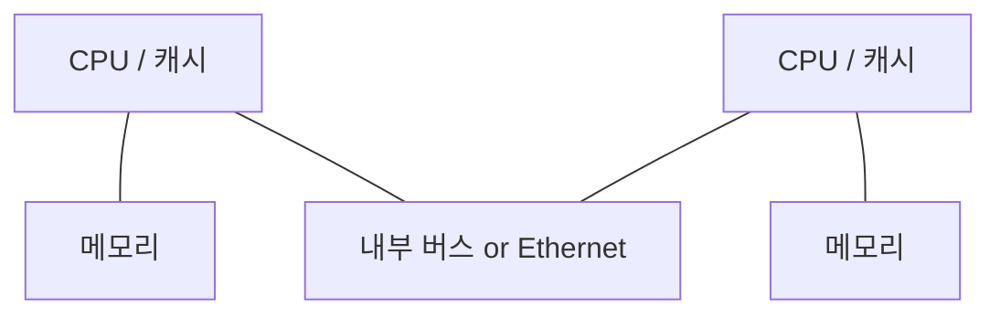
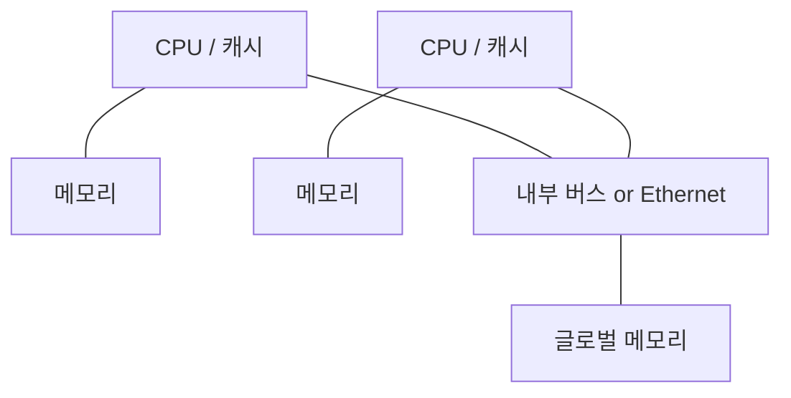

<!-- PDF page: 081 -->

[그림 47] MPP 구조

##### ③ NUMA(Non Uniform Memory Access)

프로그램 개발이 용이한 공유메모리 구조인 SMP와 프로세서의 확장성이 좋은 MPP 구조의 장점을 결합한 구조이다. 각 프로세서는 별도의 로컬 메모리를 가지고 있으며 모든 프로세서들이 접근할 수 있는 공유 메모리의 전역주소 공간(글로벌 메모리)를 가지고 있는 구조이다.

[그림 48] NUMA 구조

#### 라) 병렬 프로세서 기술의 유형

##### ① 명령어 파이프라이닝(Pipelining)

하나의 연산처리 과정을 여러 단계로 구분하고 각 단계들을 처리하기 위한 하드웨어 유닛을 별도로 구성하여 동시에 서로 다른 명령어들을 처리하도록 함으로써 중앙처리장치의 성능을 높여주는 기술이다. 즉, 한 번에 하나의 명령어만 실행하는 것이 아니라 하나의 명령어가 실행되는 도중에 다른 명령어 실행을 시작하여 동시에 여러 개의 명령어를 실행한다. 파이프라인의 유형에는 2단계 명령어 파이프라인, 4단계 명령어 파이프라인, 6단계 명령어 파이프라인이 있으며, 대표적으로 4단계 명령어 파이프라인을 살펴보자.

명령어 집합은 2단계로 되어 있으나 파이프라인 단계들의 처리 시간이 동일하지 않아서 발생하는 효율 저하를 방지하기 위해 4단계로 세분화하여 단계들의 처리 시간을 거의 같아지도록 한 것이다.

4단계 명령어 파이프라인은 명령어 인출(IF, Instruction Fetch), 명령어 해독(ID, Instruction Decode), 데이터 인출(OF, Operand Fetch), 실행(EX, Execute) 단계가 있다.
