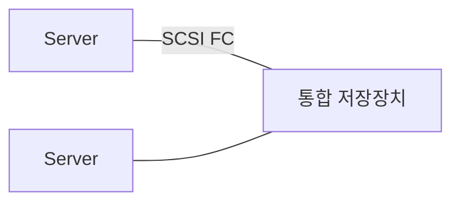
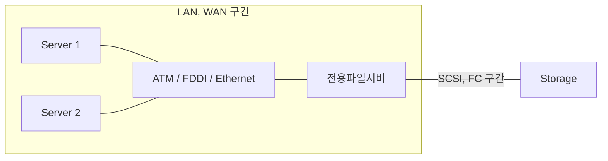

<!-- PDF page: 086 -->

[그림 52] DAS

##### ② NAS(Network Attached Storage)

스토리지 시스템은 별도의 파일시스템 관리 서버(Controller)가 저장매체(HDD, SSD 등)을 관리하는 구조로 되어 있으며, 컴퓨터 시스템은 LAN 또는 WAN과 같은 이더넷 네트워크 인터페이스(Ethernet Network Interface)를 통해 스토리지 시스템과 연결되는 구조이다. 별도의 파일시스템 관리 서버가 있어 데이터 관리의 편의성이 있으며, 다수의 서버가 저장소를 공유하여 사용할 수 있다. 또한 물리적인 위치가 같이 않아도 컴퓨터 시스템과 연결되어 사용이 가능하다. 네트워크를 통해 연결되어 네트워크의 속도에 따라 스토리지의 속도와 용량이 제한된다

[그림 53] NAS

##### ③ SAN(Storage Area Network)

DAS 방식의 단점은 스토리지 수의 제한과 관리의 어려움이 있고 NAS 방식은 네트워크 연결에 따라 속도 지연 현상이 발생되는 문제점을 가지고 있었다. 이러한 단점을 극복하기 위해 만들어진 것이 SAN이다. 별도의 전용 광 채널 스위치 (Fiber Channel Switch)를 이용하여 빠른 속도의 연결이 가능하게 되었으며, 연결되는 서버와 스토리지의 개수의 확장성을 용이하게 했으며 연결되는 네트워크 부하가 낮다. 또한 광 채널을 이용하여 고속(8Gbps~16Gbps) 연결이 가능하다.

하지만 전용 스위치와 고가의 케이블이 필요하여 비용이 상승하고 여러 컴퓨터 시스템이 특정 파일을 공유할 경우 락킹(Locking)되어 일관성의 문제가 발생된다.
