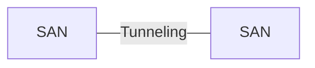

<!-- PDF page: 087 -->

| 원문 위치 | 표기 |
| --- | --- |
| 위쪽 네트워크 | Storage Area Network |
| 가운데 스위치 | SAN Switch (e.g.Fiber Channel) |

<!-- 생략: 그림 54 / 이름이 없는 서버 3대와 저장장치 3대 및 연결선 -->

[그림 54] SAN

#### 다) IP-SAN

##### ① IP-SAN의 개념

Fiber(광) 채널이 아닌 기가비트 이더넷의 인터넷 프로토콜(IP)을 사용하는 SAN이다. SAN의 경우 SAN 스위치와 SAN 전용 스토리지가 필요하지만 기존의 이더넷 네트워크를 이용하여 연결할 수 있어 상호 접속성이 증대 된다. IP를 이용할 수 있어 네트워크 관리의 일원화가 되며 SAN의 거리 제약을 탈피할 수 있다. IP-SAN은 FCIP, iFCP, iSCSI가 있으며 이중 iSCSI가 많이 사용된다.

##### ② FCIP(Fiber Channel Over IP)

원격지의 SAN을 연결할 때 사용되며, 원격지의 프레임 전송할 경우 TCP/IP로 캡슐화 하여 상호 연결한다. 이전에 분리되어 있던 SAN들은 거대한 광 채널 패브릭을 생성한다. 여러 SAN들 중에서 하나의 SAN에서 손상이 발생하게 되면 패브릭에 포함되어 있는 다른 지역의 SAN 영향을 미칠 수 있다.

[그림 55] FCIP

##### ③ iFCP(Internet Fiber Channel Protocol)

iFCP 게이트웨어(Gateway)를 통해 지역 SAN 사이의 고유의 TCP/IP로 연결을 제공한다. FCIP와는 달리 하나의 거대한 패
