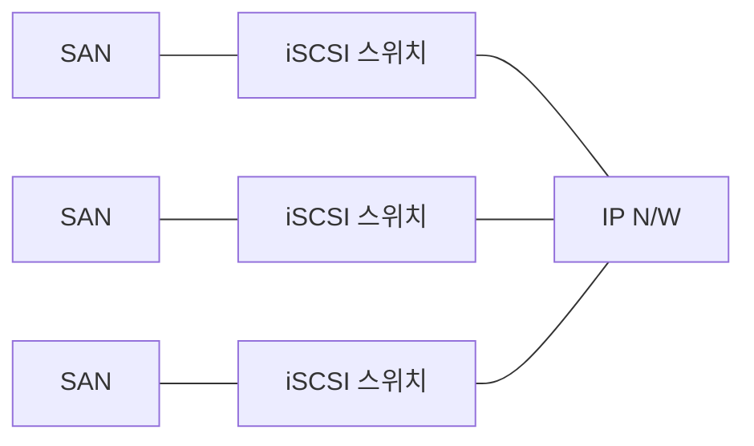

<!-- PDF page: 088 -->

브릭을 형성하지 않기 때문에 한 지역의 손상이 다른 지역으로 영향을 주지 않는다. 게이트웨이 방식으로 게이트웨이를 이용한 프로토콜 변환방식이며, 인프라 변경없이 구축 가능하므로, 소프트웨어, 하드웨어 모두 높은 상호 접속성을 제공한다.

[그림 56] iFCP

##### ④ ISCSI(Internet SCSI)

SCSI 명령을 IP 패킷으로 캡슐화하여 I/O 블록 데이터를 TCP/IP를 통해 전달한다. IPSec 등의 기술을 통한 높은 신뢰성을 제공할 수 있다. 기존 네트워크 환경을 그대로 사용할 수 있어 네트워크 스토리지 구축 비용이 절감된다.

[그림 57] iSCSI

#### 라) 스토리지 용량 관리 기술

##### ① 씬 프로비저닝(Thin Provisioning)

기존 스토리지 기술은 Thick LUN(Logical Unit Number)방식의 고정 할당방식으로 데이터 저장공간을 낭비하였다. 씬 프로비저닝은 실제 데이터의 사용하는 공간을 Thin LUN으로 매핑하여 데이터를 할당하는 스토리지를 가상화한 기술이다. 클라우드컴퓨팅에서 사용자가 요구하는 디스크 공간을 유연하게 확장할 수 있으며 종래의 Thick LUN방식에 비해서 데이터 활용율이 높다.
