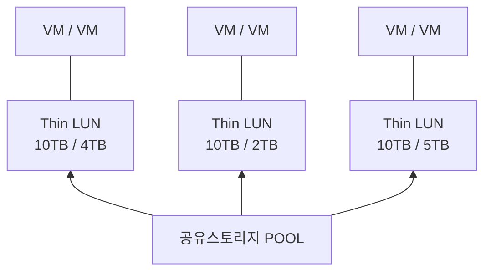

<!-- PDF page: 089 -->

<!-- 생략: 그림 58 / Thin LUN의 점선 가상 영역과 실제 사용량의 면적 표현 -->

[그림 58] 씬 프로비저닝

##### ② 데이터 디 듀플리케이션(Data De-Duplication)

데이터 저장 시 중복 데이터를 제거하여 디스크의 공간 효율화를 제공한다. 제거방식으로는 스토리지 시스템으로 데이터가 들어가는 순간에 중복된 데이터일 경우 바로 제거하는 인라인 방식과 저장을 우선 완료한 뒤에 저장된 중복 데이터를 제거하는 오프라인 방식이 있다.

#### 마) 저장장치 디스크 스케줄링

##### ① 디스크 스케줄링

데이터를 저장하는 디스크 드라이브는 회전되는 자기 디스크를 이용하는 장치이다. 이 디스크 드라이브에 입출력을 요청하게 되면 어느 요청을 먼저 처리하고 데이터를 읽는 헤드를 어떻게 움직이냐에 따라 시스템의 성능이 크게 좌우된다. 따라서 디스크 스케줄링은 다수의 사용자가 서로 다른 작업을 처리하기 위해 디스크 드라이브에 입출력을 요청할 때, 요청을 효율적으로 처리하기 위한 기법이다. 디스크 스케줄링을 하는 목적은 다음과 같다.

- 단위 시간 동안 서비스 할 수 있는 입출력 요구의 최대화
- 단위 시간당 처리량(Throughput) 극대화
- 평균 응답시간(Mean Response Time) 최소화
- 요청 시간(Response Time)최소화
- 응답 시간 편차(Variation of response time)의 최소화

##### ② 디스크 성능 측정 지표

디스크 스케줄링은 디스크의 성능을 측정하는 지표를 기준으로 비교할 수 있다. 디스크 성능 측정 지표는 접근시간(Access Time), 탐색시간(Seek time), 회전 대기(Rotational delay or rotational latency), 데이터 전송시간(Data Transfer Time) 등이 있다.
