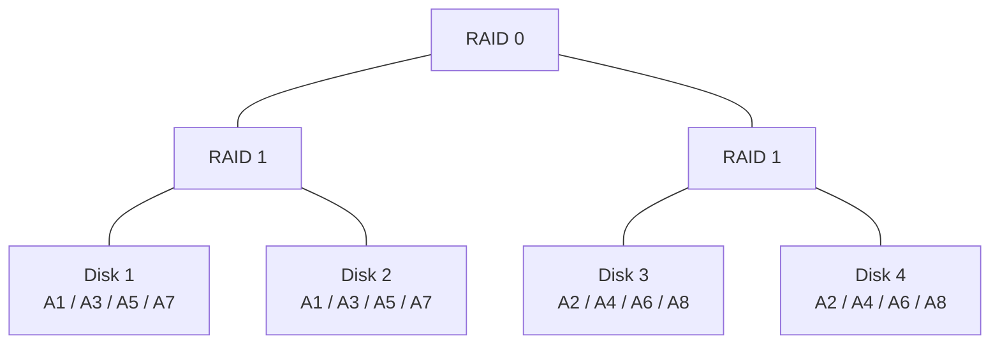
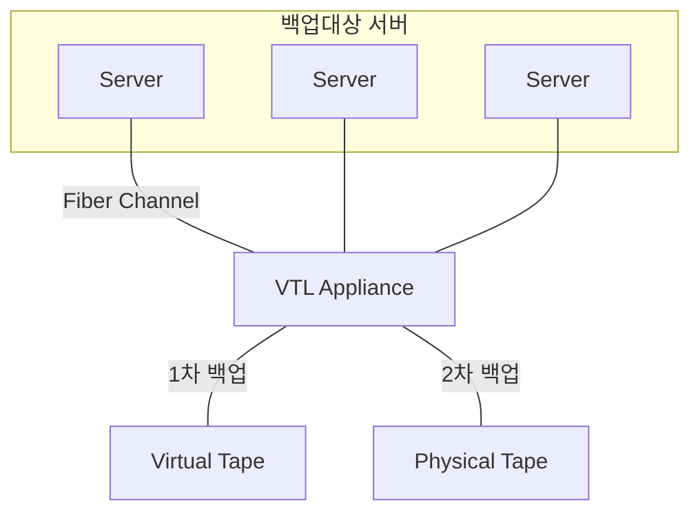

<!-- PDF page: 095 -->

RAID 10

[그림 68] RAID-10

#### 나) 백업 스토리지: LTO, VTL

##### ① LTO(Linear Tape-Open)

고속 데이터 처리 및 대용량을 지원하는 공개 테이프 드라이브 표준 기술이다. LTO는 각각 물리적 장치와 기술을 의미하지만, 같은 말로 통용되기도 한다. 테이프 백업 장비, 테이프 미디어 장비, LTO 장비, LTO 라이브러리, LTO 등등 혼재돼 불리기도 한다. 2000년에 처음으로 발표된 LTO-1은 용량 100GB 무압축 기준 최대속도 20MB/s의 성능을 제공했다. 현재 적용되고 있는 LTO-8은 용량 12.8TB 무압축 기준 최대속도 427MB/s의 성능을 지원한다. LTO-10은 용량 48TB 무압축 기준 최대속도 1100MB/s의 성능을 제공할 예정이다.

##### ② VTL(virtual tape drives)

기존 테이프 백업장치의 제한된 성능, 확장성, 복구시간 등의 문제점 보완을 위해 디스크스토리지를 에뮬레이션하여 가상의 테이프 장비로 만들어 주는 백업 솔루션이다. 테이프 가상화를 통해 백업이 단순화되고 고속의 백업이 가능하다.

| 원문 추가 표기 | 위치 |
| --- | --- |
| Disk Array | Virtual Tape 왼쪽 |
| 복구 ↔ 백업 | 위쪽은 복구, 아래쪽은 백업 |

[그림 69] VTL 개념도
