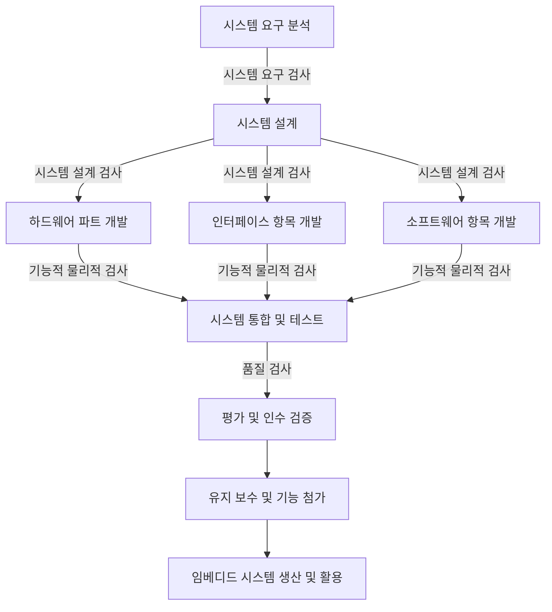

<!-- PDF page: 102 -->

임베디드 시스템은 여러 해에 이르는 오랜 기간 동안 오류 없이 안정적으로 돌아가도록 설계된다. 따라서 펌웨어는 개인용 컴퓨터에서 쓰이는 소프트웨어보다 신중한 개발과 테스트 과정을 거친다. 대부분의 임베디드 시스템은 디스크 드라이브나 스위치, 버튼 등 기계적인 동작으로 손상을 입을 수 있는 부품의 사용을 피하고 대신 플래시 메모리 같은 물리적 손상에서 비교적 자유로운 칩 자재를 사용한다.

##### ⑤ 회복성

임베디드 시스템이 적용되는 분야는 석유 시추공, 우주공간 등 인간이 직접 즉각적인 제어를 하기 어려운 장소일 수 있다. 따라서 임베디드 시스템은 최악의 상황에서도 스스로 다시 기동할 수 있어야 한다. 이러한 응급 복구는 왓치독 타이머5(Watchdog Timer)라고 불리는 전자 부품을 통해 이루어진다.

#### 다) 임베디드 시스템의 개발 과정

임베디드 시스템은 [그림 72]와 같은 절차로 개발되며, 일반적인 정보시스템 개발과 달리 하드웨어 개발과정이 포함되는 것이 특징이다.

하드웨어/소프트웨어 공동 설계 모델

<!-- 생략: 그림 72 / 세 개발 항목을 감싼 점선 영역과 인터페이스·소프트웨어 사이의 줄임표 -->

[그림 72] 임베디드 시스템 개발 절차

위 개발 절차에 대한 상세 수행 내용은 아래 〈표 18〉과 같다.

<small>5 와치독 타이머(WDT, Watch Dog Timer): 컴퓨터의 오작동을 탐지하고 복구하기 위해 쓰이는 전자 타이머. 정상 작동 중의 컴퓨터는 시간이 경과하거나 “타임아웃”이 되는 것을 막기 위해, 정기적으로 워치독 타이머를 재가동 시킴</small>
