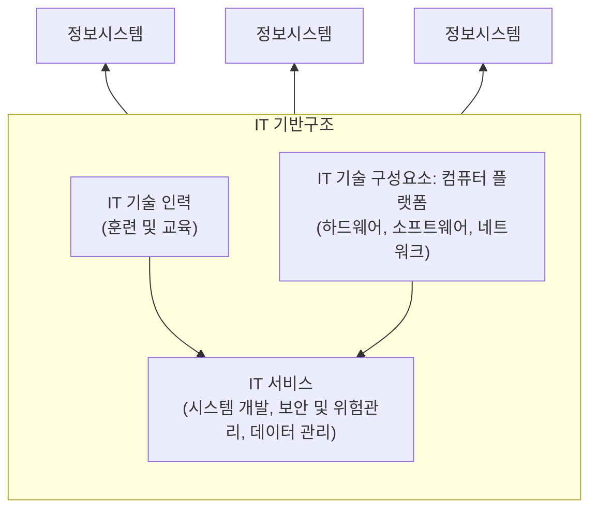

<!-- PDF page: 110 -->

### 실무 미리보기

A 기업은 최근 신규 시스템을 오픈하였으나 서비스를 하는 과정에서 하드웨어 용량이 약 30%정도 부족한 상태로 운영되고 있는 것을 인지하였다. 조사 결과, 일부 서비스에 대한 동시사용자 수 산정이 부정확하여 하드웨어 장비 규모를 제대로 산정하지 못한 것이 드러났다. 이 상태로 시스템 운영을 할 경우에 3~4개월 정도면 인프라가 부족해질 것으로 예상되었고, 결국 A 기업의 기획팀에서 추가 예산을 편성하여 2개월 내 추가 인프라를 확충하기로 하였다. 이처럼 실무적으로는 정보시스템의 구조 설계 및 시스템 구조에 따른 규모산정이 매우 중요하다. 이러한 정보 시스템의 구조와 규모산정에 관해 좀더 자세히 알아보도록 하자.

### 01 정보시스템의 구조

#### 가) 정보시스템의 개념

정보시스템은 기업 같은 조직이 필요한 정보 제공이나 업무처리와 같은 비즈니스 절차들을 수행하도록 정보기술 (IT, InformationTechnology)을 이용한 시스템이다. 정보기술 관련 인력이 하드웨어와 소프트웨어 등의 정보기술 구성요소를 이용하여 정보기술 서비스를 제공할 수 있는 시스템을 만들어 조직의 업무 절차를 수행할 수 있도록 한다. [그림 75]와 같이 정보시스템은 정보기술 기반 구조(IT infrastructure)의 기술 자원을 이용하여 서비스를 제공한다. IT 기반구조는 네트워크, 하드웨어, 소프트웨어와 같은 컴퓨팅 플랫폼과 정보기술 인력, 정보기술 서비스를 포함한다.

[그림 75] 정보 시스템과 IT 기반구조
