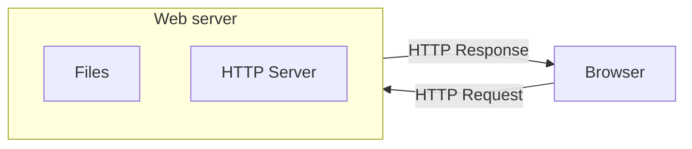
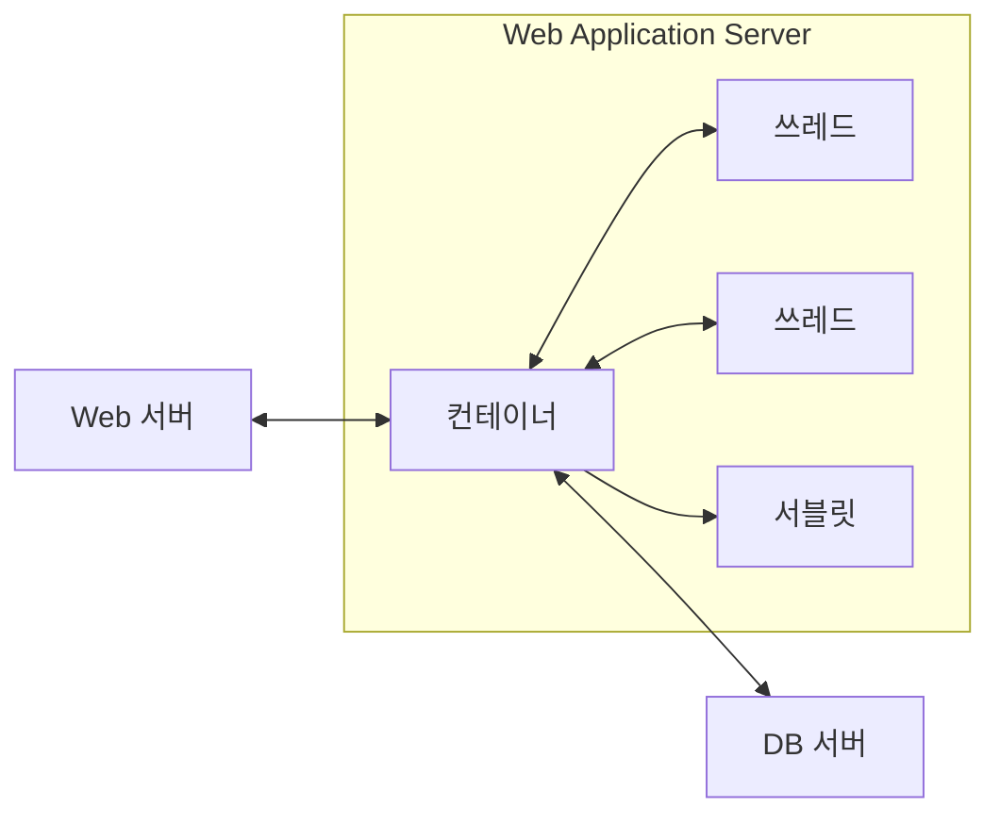

<!-- PDF page: 113 -->

메인프레임을 대체한 게 대부분 유닉스 서버이고, 이게 유닉스 유사(Unix-like) OS인 리눅스로 그대로 이어졌다.

- 웹서버(Web Server): 웹서버는 웹 브라우저와 같은 웹 클라이언트(Web Client)에게 HTML과 같은 텍스트나 이미지, 동영상과 같은 미디어 콘텐츠를 제공하는 서버이다. HTTP 프로토콜을 통해 웹브라우저가 정보를 표현할 수 있도록 데이터를 제공한다. 대표적인 제품으로는 Apache, Nginx, IIS 등이 있다([그림 78] 참조).

[그림 78] 웹 서버(Web Server)

- 웹 응용 서버(WAS, Web Application Server)는 웹 클라이언트 요청에 대해 안정적인 트랜잭션 처리를 가능하게 해주고 분산 시스템 개발을 도와주는 역할을 하는 미들웨어이다. 데이터베이스 조회나 비즈니스 로직에 대한 처리를 위한 엔진으로 컴포넌트 개발과 사용, 애플리케이션개발, 웹, 분산 객체, 보안, IED, 시스템관리, 레거시 시스템과의 연동을 지원한다. 대표적인 제품으로는 Tomcat, Jetty, JEUS, JBoss, WebLogic, WebSphere, Node.js 등이 있다([그림 79]참조).

<!-- 생략: 그림 79 / 쓰레드와 서블릿 사이의 줄임표 -->

[그림 79] 웹 응용서버 (WAS)

- TP-모니터(Transaction Processing Monitor): 분산트랜잭션 처리를 지원하고, 각종 프로토콜에서 동작하는 세션과 시스템과 데이터베이스 사이의 최소 처리단위인 트랜잭션을 감시하여 일관성 있게 보관 유지하는 역할을 하는 트랜잭션 관리 미들웨어이다. 일반적인 TP 모니터제품들은 UNIX 환경표준화 단체인 X/Open이 정한 DTP(Distributed Transaction
