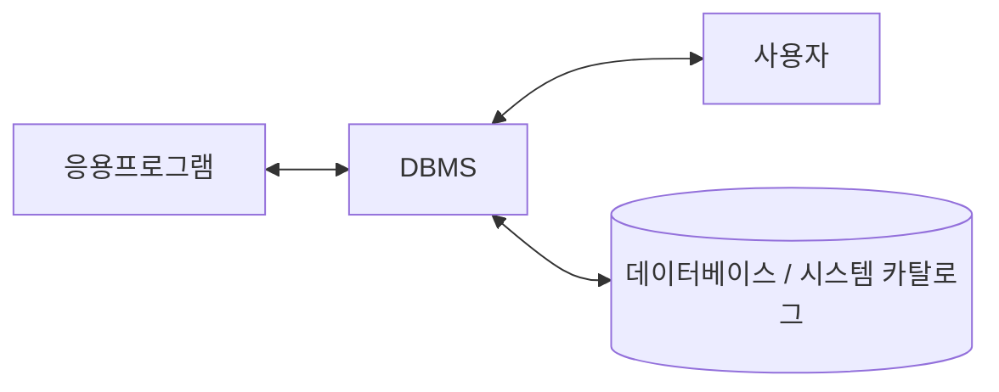

<!-- PDF page: 114 -->

Processing) 모델을 준수한다. 대표적인 제품으로는 Tmax, Tuxedo 등이 있다.

- DB서버(DBMS, Database Management System): 구조적인 데이터의 접근과 수정을 위하여 데이터베이스의 종류와 유형, 데이터베이스 관리기술, 질의 언어를 제공한다. 중복을 최소화하면서 통합된 데이터의 대규모 저장소로 여러 사용자에 의해 동시에 사용된다. 응용프로그램과 데이터 사이의 독립성을 제공하며, 질의를 통해 효율적인 접근 방법을 제공한다. 시스템 카탈로그는 데이터베이스 관리자(DBA)의 도구로서 데이터베이스에 저장되어 있는 모든 데이터 개체들에 대한 정의나 명세에 대한 정보를 수록한 시스템 테이블이다. 데이터베이스의 대표적인 제품으로는 Oracle, MS-SQL, PostgreSQL, Maria DB, Cubrid 등이 있다([그림 80] 참조).

<!-- 생략: 그림 80 / 별도 명칭 없는 컴퓨터와 사용자 아이콘 -->

[그림 80] DB서버

### 02 정보시스템 용량 산정

정보시스템 구축 시 하드웨어는 공급자 혹은 시스템 구축자 등에 따라 규모산정 적용 항목 및 적용 비율을 경험적으로 적용하기 때문에 부정확한 규모가 산정되는 경우가 많이 발생한다.

또한 하드웨어 규모는 업무의 성격, 업무 증가율, 사용자 사용 빈도, 구축 기술 등을 전체적으로 고려하여 산정해야 하므로, 정보시스템 구축사업에서 하드웨어 규모 적정성 여부를 판단하기 어렵다.

때문에 정보시스템 구축사업에서 하드웨어가 차지하는 비중이 전체 프로젝트 비용에서 매우 큼에도 불구하고, 그동안 하드웨어 규모산정은 사업자나 하드웨어 공급자에 의존적이었으며, 소프트웨어 개발에 비하여 상대적으로 관심도가 낮은 분야였다. 이로 인해 실제 요구되는 하드웨어의 각 구성요소가 사업자나 하드웨어 공급자에 의해 과다 또는 과소 산정되는 경우가 발생하여도 개선할 수 있는 방법이 없었다.
