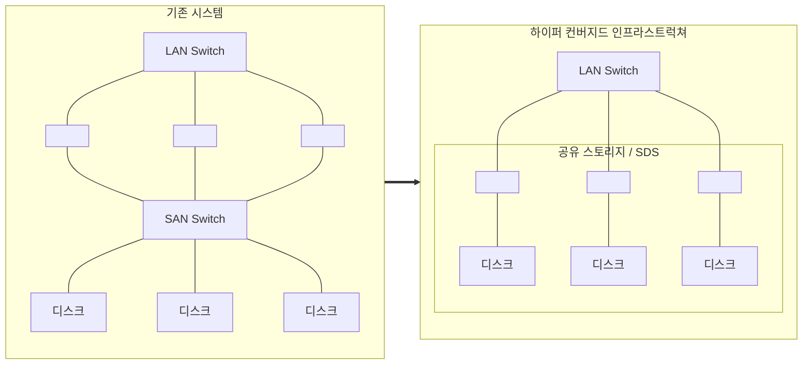

<!-- PDF page: 120 -->

| 기존 시스템 | 하이퍼 컨버지드 인프라스트럭쳐 |
| --- | --- |
| 스토리지 전용 구성 | 서버의 디스크를 공유스토리지로 구성 |

<!-- 생략: 그림 84 / 이름 없는 서버 아이콘은 빈 노드로 대체 -->

[그림 84] 컨버지드 인프라 스트럭처 VS 하이퍼 컨버지드 인프라스트럭처

### 참고 및 추천 자료

[1] 인프라 엔지니어의 교과서, 사노 유타카, 길벗, 2014.

[2] 그림으로 공부하는 IT 인프라 구조 야마자키 야스시 외 3인, 제이펍, 2015.

[3] KPC 교육자료, 금융 IT 인프라 혁신, 조용완, 2014.

[4] 교통영향분석자료 DB구축에 따른 정보화전략계획(ISP) 수립 연구, KSIC, 2000.

[5] 컴퓨터월드 [기획특집] 막 오른 국내 하이퍼 컨버지드 시장 경쟁, 2017.

[6] ITFind 주간기술동향 블레이드서버의 개요, 2008.

[7] TTAK.KO-10.0292_R1 정보시스템 하드웨어 규모산정 지침, 2017.
