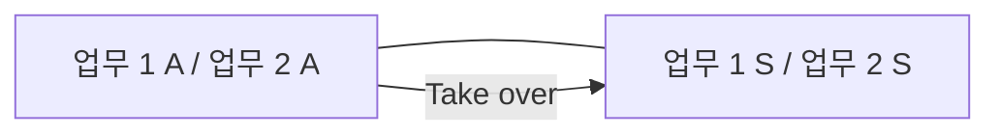

<!-- PDF page: 123 -->

<table><tr><th colspan="2">MTBF</th><th></th></tr><tr><td>고장 (failure)</td><td>장비 정상가동, 운전</td><td>다음 고장 (failure)</td></tr><tr><td>MTTR</td><td>MTTF</td><td></td></tr></table>

[그림 86] 가용성 계산 지표

#### 나) HA(High Availability) 구성 유형

##### ① 핫 스텐바이(Hot Standby, Active-Standby)

HA 클러스터링 구축 방법 중 가장 단순한 구조로 가동되는 활성 서버 한 개와 평상시에는 대기 상태로 운영중인 대기 서버로 구성되어 있다. 대기 서버는 전원이 켜져 있으며, 운영체제까지 동작되는 상태이다. 경우에 따라서는 대기 서버를 개발 시스템으로 활용하기도 한다. 동작 방식은 활성(Active) 서버에 하드웨어, 네트워크, 프로세스 장애 등으로 서비스를 못하게 되면, 상태 확인 네트워크(Heartbeat Network)를 통해 장애를 감지하고 HA 서비스가 자동으로 대기 서버의 모든 서비스를 기동 시키는 페일오버(Fail-over) 동작을 수행한다.

<!-- 생략: 그림 87 / 서버 외형 및 장식 원 -->

[그림 87] Hot Standby 구성도

##### ② 상호 전환(Mutual Takeover, Active-Active)

각 서버가 별개의 2개 이상의 시스템이 동작중인 상태에서 한곳에 장애가 생기면 해당 서비스를 지정된 다른 서버로 전환(Takeover)받아 서비스하는 구조이다. 장애발생 시 페일오버(Fail-over)를 대비해 각 서버는 2개의 업무를 동시에 서비스할 수 있는 시스템 용량(Capacity)을 갖추고 있어야 된다.
