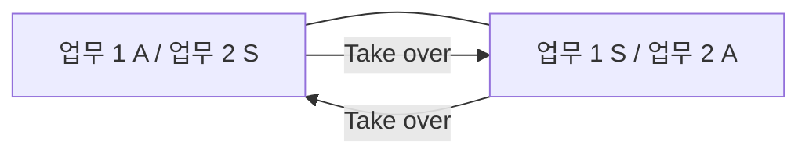
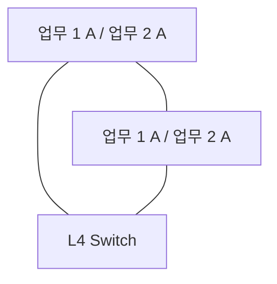

<!-- PDF page: 124 -->

<!-- 생략: 그림 88 / 서버 외형 및 장식 원 -->

[그림 88] Mutual Takeover 구성도

##### ③ 동시 접속(Concurrent Access)

여러 시스템이 동시에 업무를 나누어 병렬 처리하는 방식으로 가용성을 제공하는 시스템 구조로 전체의 서버가 활성 상태로 업무를 수행한다. 한대의 서버에서 장애가 발생하더라도 페일오버(Fail-over)를 하지 않고 서비스 연속성을 보장할 수 있다. 이 구조에서는 두개 이상의 서버가 동일한 업무를 수행하기 위해 L4 스위치를 이용해 부하 분산(Load Balancing)을 한다.

<!-- 생략: 그림 89 / 서버 외형 및 장식 원 -->

[그림 89] Concurrent Access 구성도
