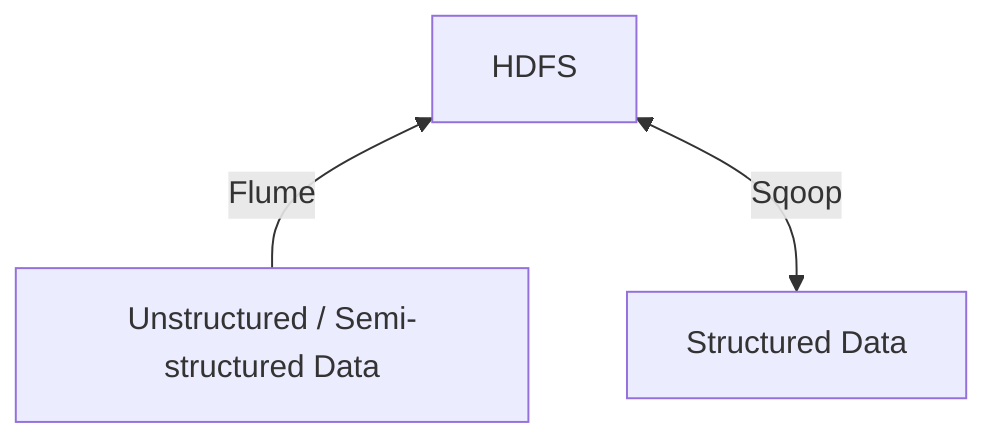

<!-- PDF page: 138 -->

### 실무 미리보기

A 기업은 국내 온라인 유통 회사이다. 최근까지 국내 시장에서 1~2위를 다투었지만 점차 중국 등 해외 업체의 온라인을 통한 국내 진출의 영향으로 매출이 예년에 비해 감소함에 따라 새로운 경쟁력을 확보해야 하는 상황에 이르렀다. 우선 고객 데이터를 수집하여 분석함으로써 새로운 마케팅 전략을 수립하고자 한다. 이를 위해 기존 데이터베이스 기반이 아닌 빅데이터를 수집할 수 있는 인프라를 확충하고 데이터를 분석할 수 있는 분석전문가를 외부에서 채용하고자 한다. 이처럼 최근 다수의 기관, 기업에서 빅데이터를 수집, 저장, 분석, 활용하기 위한 방법을 모색하고 있다. 본 장에서는 빅데이터 시스템에 대해 좀더 자세히 알아보고자 한다.

### 01 빅데이터 시스템의 구조

#### 가) 하둡(Hadoop) 생태계

빅데이터 시스템의 구조에 대한 이해는 결국 하둡(Hadoop) 생태계를 이해하는 것에서 출발한다. 하둡(Hadoop)은 High-Availability Distributed Object-Oriented Platform의 약자로, 대용량의 데이터를 여러 개의 분산 저장소에서 분산 처리하는 방식의 자바기반 프레임워크이다. 하둡은 초기 솔루션으로 하둡 분산파일시스템(HDFS, Hadoop Distributed File System)과 맵리듀스(Map Reduce)로 구성되어 있다. 하지만 위 두 모듈은 오픈소스로서 비전문가들이 빅데이터를 활용하기에는 어려움이 많았으며, 이의 해결을 위해서 [그림 96]과 같이 다양한 주변 모듈들이 구현되어 패키징되었다. 이런 주변 모듈들은 데이터의 통합, 이동, 애플리케이션 매니지먼트, 시스템 매니지먼트 등을 위한 지원 소프트웨어(SW)들이며, 하둡 프로젝트의 일환으로 개발되었다.

<table><tr><td>MAPREDUCE (Processing using different languages)</td><td>HIVE &amp; DRILL (Analytical SQL-on-Hadoop)</td><td rowspan="2">MAHOUT &amp; SPARK MLlib (Machine learning)</td><td>PIG (Scripting)</td><td>HBASE (NoSQL Database)</td><td rowspan="4">ZOOKEEPER &amp; AMBARI (Management &amp; Coordination)</td></tr><tr><td>SPARK (In-Memory, Data Flow Engine)</td><td>KAFKA &amp; STORM (Streaming)</td><td>SOLR &amp; LUCENE (Searching &amp; Indexing)</td><td>OOZIE (Scheduling)</td></tr><tr><td>Resource Management</td><td colspan="4">YARN</td></tr><tr><td>Storage</td><td colspan="4">HDFS</td></tr></table>

<!-- 생략: 그림 96 / 소프트웨어 로고와 장식 아이콘 -->

[그림 96] 하둡 생태계(Hadoop Eco System)
