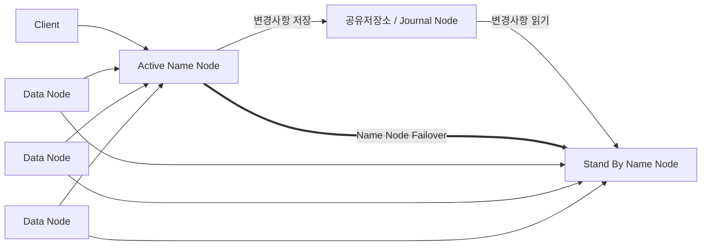

<!-- PDF page: 139 -->

#### 나) 하둡(Hadoop)의 주요기술 요소

##### ① 하둡 분산형 파일 시스템(HDFS)

하둡 분산형 파일시스템(이하 HDFS)은 하둡 네트워크에 연결된 기기에 데이터를 저장하는 분산형 파일시스템이다.

- HDFS는 데이터를 저장하면, 다수의 노드에 복제 데이터도 함께 저장해서 데이터 유실을 방지한다.
- HDFS에 파일을 저장하거나, 저장된 파일을 조회하려면 스트리밍 방식으로 데이터에 접근해야 한다.
- 한번 저장한 데이터는 수정할 수 없고, 읽기만 가능하게 해서 데이터 무결성을 유지한다(2.0 버전부터는 저장된 파일에 append가 가능하게 되었다).
- 데이터 수정은 불가능 하지만 파일이동, 삭제, 복사할 수 있는 인터페이스를 제공한다.

HDFS에는 [그림 97]과 같이 마스터 역할을 하는 네임노드(NameNode) 서버 한 대와, 슬레이브 역할을 하는 데이터노드 서버가 여러 대로 구성된다. 네임 노드는 HDFS의 모든 메타데이터(블록들이 저장되는 디렉토리의 이름, 파일명 등)를 관리하고, 클라이언트가 이를 이용하여 HDFS에 저장된 파일에 접근할 수 있다. 하둡 애플리케이션은 HDFS에 파일을 저장하거나, 저장된 파일을 읽기 위해 HDFS 클라이언트를 사용하며, 클라이언트는 API형태로 사용자에게 제공된다. 데이터 노드는 주기적으로 네임노드에서 블록 리포트(노드에 저장되어 있는 블록의 정보)를 전송하고 이를 통해 네임노드는 데이터 노드가 정상 동작하는지 확인할 수 있으며, 이로써 클라이언트는 네임노드에 접속해서 원하는 파일이 저장된 블록의 위치를 확인하고 해당 블록이 저장된 데이터 노드에서 직접 데이터를 조회할 수 있다.

[그림 97] 하둡 분산파일 시스템(HDFS)의 아키텍처

##### ② 맵리듀스(Map Reduce)

맵리듀스는 대용량의 데이터 처리를 위한 분산 프로그래밍 모델, 소프트웨어 프레임워크로, 맵리듀스 프레임워크를 이용하면 대규모 분산 컴퓨팅 환경에서, 대량의 데이터를 병렬로 분석 가능하다. 맵리듀스는 프로그래머가 직접 작성하는 맵(Map)과 리듀스(Reduce) 라는 두 개의 메소드로 구성된다.

- 맵(Map): 흩어져 있는 데이터를 연관성 있는 데이터들로 분류하는 작업이다(key, value의 형태).
- 리듀스(Reduce): Map에서 출력된 데이터를 중복 데이터를 제거하고 원하는 데이터를 추출하는 작업이다.

아래 [그림 98]과 같이 문자열 단어에 포함된 단어의 빈도수를 출력해주는 사례를 통해 맵리듀스의 처리과정을 알 수 있
