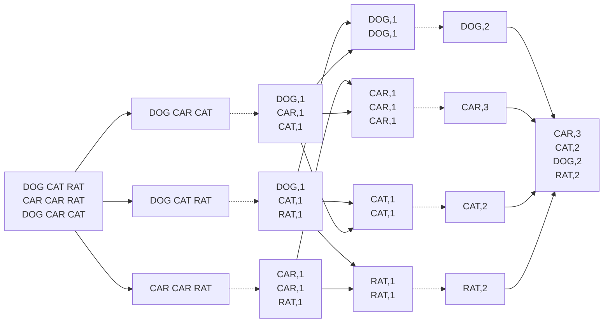

<!-- PDF page: 140 -->

다. 전체 과정은 문자열 데이터를 라인별로 나누고(Splitting)→라인별로 문자열을 입력받아 〈Key, Value〉형태로 출력하고(Mapping)→같은 Key를 가지는 데이터끼리 분류하고(Shuffling)→각 Key별로 빈도수를 합산해서 출력하고(Reducing)→출력데이터를 합쳐서 하둡파일 시스템에 저장(Final Result)한다.

[그림 98] 맵리듀스를 통해 문자열 단어에 포함된 단어의 빈도수를 출력해주는 과정

#### 다) 하둡(Hadoop) 지원 프로그램

하둡 지원 서비스 프로그램은 〈표 35〉와 같이 빅데이터의 수집, 저장·활용, 처리, 관리 등을 데이터 처리와 관련된 모든 영역을 대상으로 개발 진행 중이다.

〈표 35〉 하둡 지원 서비스 프로그램

<table><thead><tr><th>빅데이터 구분</th><th>주요 기술</th><th>기술별 주요 기능</th></tr></thead><tbody>
<tr><th rowspan="3">스트리밍 데이터 수집</th><td>Flume</td><td>비정형 데이터 수집 클라우드데라에서 개발됐으며, 현재 아파치 인큐베이션에 포함됨</td></tr>
<tr><td>Scribe</td><td>비정형 데이터 수집 플랫폼 중앙 집중 서버로 전송하는 방식으로, 페이스북에서 개발</td></tr>
<tr><td>Chuckwa</td><td>비정형 데이터 수집 플랫폼으로 HDFS에 분산데이터를 저장</td></tr>
<tr><th rowspan="2">정형 데이터 수집</th><td>Sqoop</td><td>정형 데이터 수집 관계형 DB로부터 데이터 가져오기 HDFS, NoSQL등 다양한 저장소의 전송 지원</td></tr>
<tr><td>Hiho</td><td>대용량 정형 데이터 수집 및 전송 솔루션</td></tr>
<tr><th rowspan="2">분산 데이터 베이스</th><td>Hbase</td><td>분산 데이터베이스 HDFS기반의 컬럼 기반 NoSQL 데이터베이스, 구글의 BigTable 논문을 기반으로 개발됨 야후, 트위터 등이 사용하며, 국내 NHN도 라인에 적용</td></tr>
<tr><td>Cassandra</td><td>오픈소스 분산 데이터베이스 관리 시스템 컬럼 중심 DB와 행 중심 DB의 복합형 NoSQL의 하나</td></tr>
<tr><th>실시간 SQL 질의</th><td>Impala</td><td>하둡 기반의 실시간 SQL 질의 시스템 클라우드데라에서 개발 맵리듀스로 처리하지 않고, 자체 개발한 엔진 사용</td></tr>
</tbody></table>
