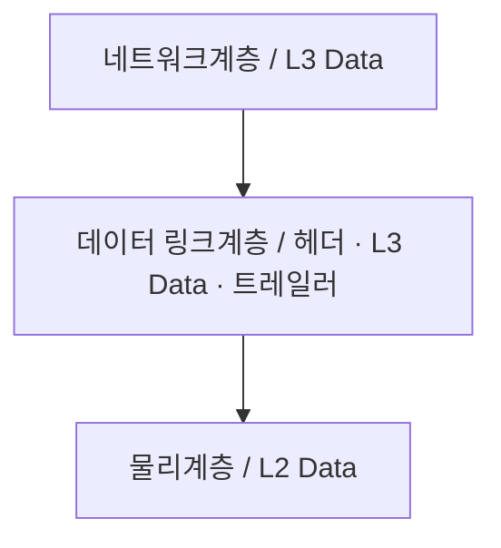

<!-- PDF page: 146 -->

### 01 데이터 링크계층의 개념

데이터 링크계층은 장치 간 신호를 전달하는 물리계층을 이용하여 네트워크상의 주변 장치들 간의 데이터를 전송하는 계층이며, 주소할당과 오류감지 2가지 기능을 담당한다. 주소 할당기능은 물리계층으로부터 받은 신호들이 네트워크상의 장치에 올바르게 안착할 수 있게 하며 오류 감지기능은 신호가 전달되는 동안 오류가 포함되는지 감지한다.

응용 소프트웨어 개발자의 경우는 데이터 링크계층과 물리계층에 대한 이해 없이도 프로그래밍을 하는데 크게 문제가 없다. 하지만 네트워크 제품과 연관된 경우라면, 실제 네트워크에 접속이 되지 않거나 데이터에 오류가 있는 경우에 대해서 디버깅이 필요한 경우가 있을 수 있고, 다양한 물리적 매체 접근 제어(MAC) 계층을 활용하는 경우라면 각각에 대한 표준 프로토콜을 이해해야 하는 경우가 발생한다. 또한 임베디드 소프트웨어를 개발하는 경우는 드라이버까지 직접 개발이 필요할 수 있기에 기본적인 이해를 필요로 한다. 임베디드 소프트웨어가 하드웨어 개발자가 준비한 테스트 환경에 프로그램을 포팅 후에 정상적으로 동작하지 않는다면, 기본적으로 하드웨어의 문제인지 프로그램의 문제인지를 판단하기 위한 디버깅을 수행해야 한다. JTAG등을 이용하여 디버깅을 하거나, 네트워크 환경인 경우에는 실제 물리적으로 전달되는 비트 및 데이터 링크계층에서 에러가 발생하는지도 확인해야 한다. 최근에는 Bluetooth, ZigBee 등 근거리 무선통신 기술이 활성화 되면서 더더욱 데이터 링크계층에 대한 이해를 필요로 한다.

### 02 데이터 링크계층 캡슐화

#### 가) 데이터 링크계층 캡슐화

다음 그림과 같이 데이터 링크계층의 프레임은 네트워크 계층 패킷에 **헤더**(Header)와 **트레일러**(Trailer)가 추가되어 구성된다. 이런 과정을 데이터 링크계층의 **캡슐화**라고 하고, 수신 측에서는 그 과정이 역으로 수행되어 **디캡슐화**라고 한다.

[그림 100] 데이터 링크계층의 캡슐화

#### 나) 프레임 헤더와 트레일러

프레임 헤더에는 호스트 간 비트 동기화를 위한 **프리앰블**(Preamble)과 프레임의 시작을 알리는 필드인 **SFD**(Start of Frame Delimiter)가 있으며 물리적 주소인 Destination address, Source address 등이 있다. 물리적 주소는 48bit 주소체계를 가지며 논리적 주소인 IP 주소와는 달리 각 장비 별로 고유한 값을 가진다. 2계층 이하의 장비 간 위치 확인을 위해서는 3계층에서 사용되는 IP 주소를 사용할 수 없으며 물리적 주소를 사용해야 한다. 트레일러는 전송 시 에러를 체크하기 위한 FCS(Frame Check Sequence)가 있다.
