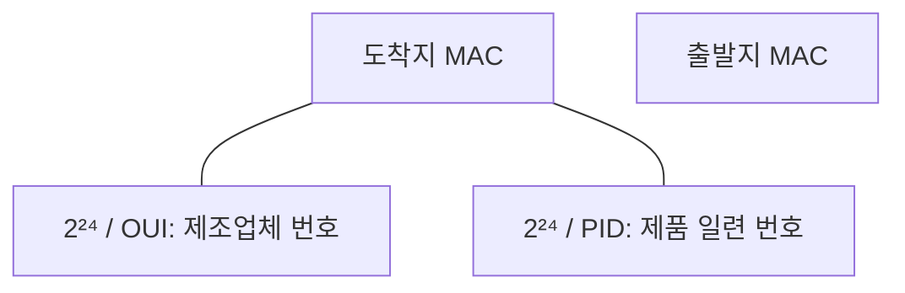

<!-- PDF page: 148 -->

#### 다) 매체 접근 제어(MAC)

매체 접근 제어(MAC)는 물리적 매개체를 통하여 데이터를 어떻게 보낼 것인가를 책임지고 있는 계층이다.

매체 접근 제어(MAC)는 아래 그림과 같이 송수신 시스템에 대한 MAC 주소를 포함하고 있다. MAC 주소는 크게 2개의 주소로 나누어지며, 앞 224는 **OUI**(Organizationally Unique Identifier)라는 제조회사 식별코드, 나머지 224는 제조회사에서 생산한 **NIC**의 일련 번호이다.

[그림 103] MAC 주소 구성

표준화된 주요 매체 접근 제어 프로토콜에는 유선LAN에서 CSMA/CD 방식의 IEEE 802.3, Token Bus 방식의 IEEE 802.4, Token Ring 방식의 802.5 등이 있다. 무선LAN에서 CSMA/CA 방식의 IEEE 802.11 MAC 부계층이 있다.

### 04 MAC 주소 검색

#### 가) IP 주소와 MAC주소 변환 프로토콜

다른 호스트에 패킷을 보내기 위해서는 그 호스트의 MAC 주소를 알아야 하는데, 이것은 **ARP**(Address Resolution Protocol) 프로토콜을 통해 이루어진다. IP 주소와 MAC 주소를 변환하는 프로토콜에는 ARP와 **RARP**(Reverse Address Resolution Protocol)가 있다. 아래 그림과 같은 구조를 가지는 ARP는 IP 주소를 통해 MAC 주소를 확인하는 프로토콜이며, RARP는 MAC 주소를 통해 IP 주소로 확인하는 역주소 변환 프로토콜이다.

<table><tr><th colspan="4">32 bits</th></tr><tr><td>8</td><td>8</td><td>8</td><td>8</td></tr><tr><td colspan="2">Hardware Type</td><td colspan="2">Protocol Type</td></tr><tr><td>Hardware Address Length</td><td>Protocol Address Length</td><td colspan="2">Operation</td></tr><tr><td colspan="4">Sender Hardware Address (OCTETS 0–3)</td></tr><tr><td colspan="2">Sender Hardware Address (OCTETS 4–5)</td><td colspan="2">Sender IP Address (OCTETS 0–1)</td></tr><tr><td colspan="2">Sender IP Address (OCTETS 2–3)</td><td colspan="2">Target Hardware Address (OCTETS 0–1)</td></tr><tr><td colspan="4">Target Hardware Address (OCTETS 2–5)</td></tr><tr><td colspan="4">Target IP Address</td></tr></table>

[그림 104] ARP 패킷 구조
