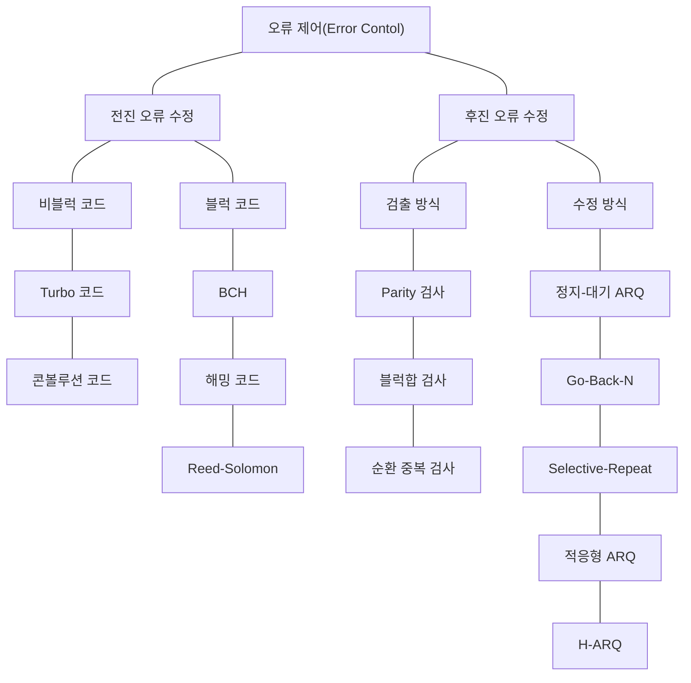

<!-- PDF page: 150 -->

[그림 105] 오류제어 방식 유형

#### 나) 오류검출과 오류정정

##### ① 오류검출

오류검출은 목적지에서 오류를 검출하기 위해서 여분의 비트를 추가하는 중복(잉여) 개념을 이용한 방법을 말한다. 오류검출방법에는 VRC(Vertical Redundancy Check, 수직 중복 검사), LRC(Longitudinal Redundancy Check, 세로 중복 검사), CRC(Cyclic Redundancy Check, 순환 중복 검사), Checksum 등이 있다. 각 검출방법에 대한 상세 내용은 〈표 36〉과 같다.

〈표 36〉 오류검출 방법

| 검출방법 | 내용 |
| --- | --- |
| VRC | Vertical Redundancy Check, 수직 중복 검사 오류검출에 가장 널리 사용되며, 패리티 검사(parity check) |
| LRC | Longitudinal Redundancy Check, 세로 중복 검사 모든 바이트의 짝수 패리티를 모아서 데이터 단위를 만들어서 데이터 블록의 맨 마지막에 추가하는 방식 |
| CRC | Cyclic redundancy check, 순환 중복 검사 2진 나눗셈을 이용하는 검출방식 |
| Checksum | 상위 계층 프로토콜에서 사용되는 방식이며, 중복(VRC, LRC, CRC 등) 개념을 기반으로 하는 방식 |

##### ② 오류정정

오류정정에는 수신자가 송신자에게 전체 데이터 재전송을 요구하거나, 수신자가 오류 교정 코드를 이용하여 자동으로 수
