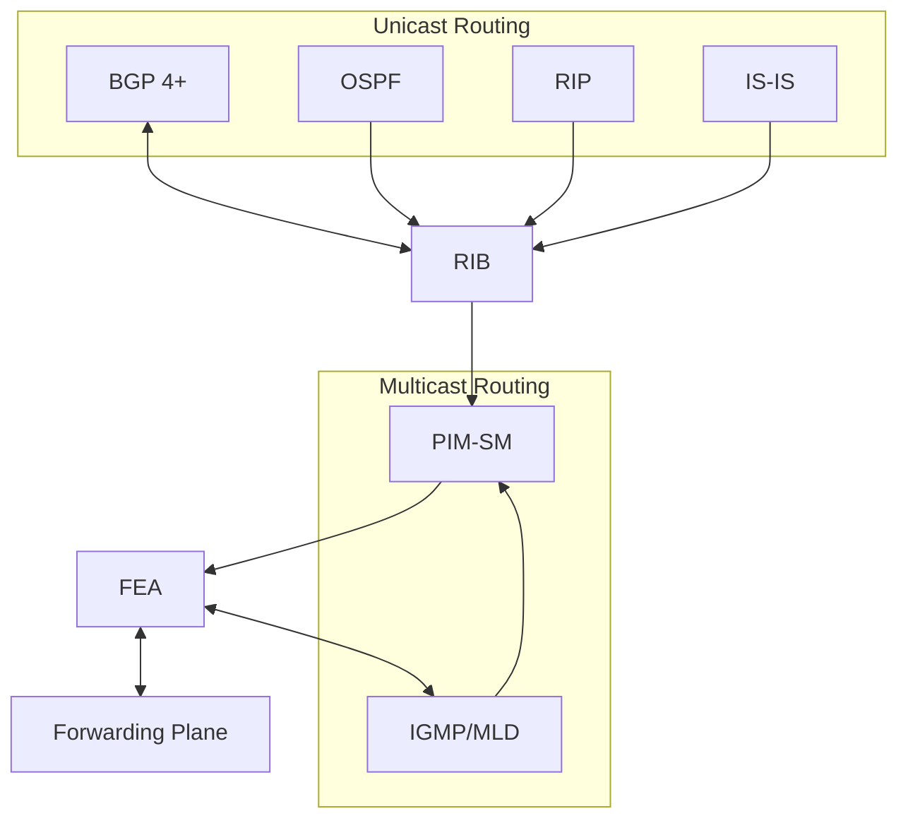

<!-- PDF page: 159 -->

Management Functions: … / router manager / CLI / SNMP

RIB = routing information base　FEA = forwarding engine abstraction

<!-- 생략: 그림 110 / 전달면 내부 미세 블록 그림 및 중복 병렬 화살표 -->

[그림 110] 라우터 개념도 [1]

라우터의 모양은 〈표 44〉와 같다. Cisco 2500은 소규모 네트워크에서 사용되며, Cisco 7300은 중형이상 네트워크에서 사용된다.

〈표 44〉 라우터 형태 [2]

| Cisco 7300 | Cisco 2500 |
| --- | --- |
| <!-- 생략: Cisco 7300 제품 사진 --> | <!-- 생략: Cisco 2500 제품 사진 --> |

##### ② 라우터 메트릭(Metrics)

라우터가 경로를 지날 때 주어진 시간에 수집하는 데이터를 의미하는 것으로 메트릭의 종류는 〈표 45〉와 같다.

〈표 45〉 라우팅 메트릭 [3]

| Metric | 설명 |
| --- | --- |
| 홉(Hop)횟수 | 목적지까지 거쳐 가는 라우터의 수를 말하며, 적을수록 처리 속도 빠름 |
| MTU | Maximum Transmission Unit, 프로토콜이 전송할 수 있는 최대 데이터 |
| 비용(Cost) | 전송 시간, 링크 신뢰성, 밴드의 특성에 따른 비용 결정, 높을수록 효율 낮음 |
| 지연(Latency) | 라우터 사이 전송 과정에서 패킷의 지연 기록 관리, 병목 현상 등을 판단 |
