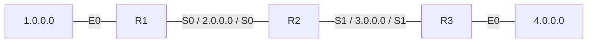

<!-- PDF page: 160 -->

##### ③ 라우팅 테이블(Routing Table)

**라우팅 테이블**은 라우터가 목적지 네트워크별 출력 인터페이스와 다음 홉 IP 주소를 저장해 놓은 데이터베이스를 말한다.

<table><tr><th colspan="3">R1 라우팅 테이블</th><th colspan="3">R2 라우팅 테이블</th><th colspan="3">R3 라우팅 테이블</th></tr><tr><td>1.0.0.0</td><td>E0</td><td>0</td><td>2.0.0.0</td><td>S0</td><td>0</td><td>3.0.0.0</td><td>S0</td><td>0</td></tr><tr><td>2.0.0.0</td><td>S0</td><td>0</td><td>3.0.0.0</td><td>S1</td><td>0</td><td>4.0.0.0</td><td>E0</td><td>0</td></tr><tr><td>3.0.0.0</td><td>S0</td><td>1</td><td>1.0.0.0</td><td>S0</td><td>1</td><td>2.0.0.0</td><td>S1</td><td>1</td></tr><tr><td>4.0.0.0</td><td>S0</td><td>2</td><td>4.0.0.0</td><td>S1</td><td>1</td><td>1.0.0.0</td><td>S1</td><td>2</td></tr></table>

[그림 111] 라우팅 테이블

#### 마) 스위치(Switch)란?

**스위치**는 네트워크 단위들을 연결하는 장비이다. 스위치 장비는 **MAC 주소학습, 필터링, 루프 방지** 등과 같은 중요한 역할을 한다. 그 외 스위치 기능으로는 포트 미러링과 VLAN 기능이 있다. **포트 미러링(Port Mirroring)**은 포트 모니터링이라고도 하며, 특정 포트로 전달되는 데이터의 복사본을 미러링된 포트로 보내는 기능이다. 포트 미러링은 관리자가 미러링된 포트를 통해 네트워크 트래픽을 모니터링하기 위해 사용되는 중요한 기능이다.

〈표 46〉 스위치의 주요 기능

| 기능 | 내용 |
| --- | --- |
| 주소 학습 | 포트에 연결된 모든 시스템에 대한 MAC 주소 학습 |
| 필터링 | MAC 주소를 이용하여 해당 포트 데이터 트래픽 필터 |
| 루프 방지 | 목적지 시스템과 다중 경로 생성 시 네트워크 루프 발생 방지 시스템에서는 네트워크 루프 방지를 위해서 STP(Spanning Tree Protocol) 사용 |

#### 바) VLAN(Virtual Local Area Network)

**VLAN**은 기존 네트워크의 물리적, 지역적 제한을 극복하고 사용자가 원하는 논리적인 네트워크를 구성하는 방식이다. 즉 공간적, 지리적 위치로 네트워크를 구분하는 것이 아니라, IP 단위, 프로토콜 단위, MAC 주소, 접속 포트 등을 이용하여 논리적인 네트워크를 구성하는 방식이다. 스위치의 VLAN 관련 프로토콜에는 **ISL, 802.1Q, VTP** 등이 있다. ISL과 802.1Q는 VLAN 태깅 프로토콜(Tagging Protocol)이며, VTP는 VLAN 관리 프로토콜이다.
