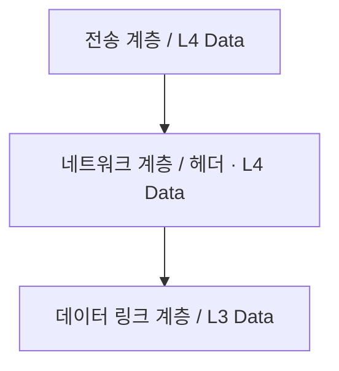

<!-- PDF page: 161 -->

| | Sales VLAN | Marketing VLAN |
| --- | --- | --- |
| Switch 1 | B, C, E | A, D, F |
| Switch 2 | G, H, L | I, J, K |

<!-- 생략: 그림 112 / 컴퓨터와 스위치 포트 아이콘. 각 A–L 장치의 VLAN 소속은 위 표에 전사 -->

[그림 112] VLAN 구성 [4]

〈표 47〉 스위치와 라우터의 비교

| 비교항목 | 스위치 | 라우터 |
| --- | --- | --- |
| 참조 테이블 | MAC 주소 테이블 | 라우팅 테이블 |
| 참조 PDU | 이더넷 프레임 | IP 패킷 |
| 참조 필드 | 목적지 MAC 주소 | 목적지 IP 주소 |
| 사용 프레임 | 이더넷 | 이더넷, 프레임 릴레이, PPP 등 |
| 2계층 헤더 | 변동 없음 | 새로운 헤더로 교체 |

### 02 네트워크 계층 캡슐화

#### 가) 네트워크 계층 캡슐화

[그림 113]에서 보는 것과 같이 네트워크 계층의 패킷은 전송계층의 세그먼트에 헤더(header)를 추가하여 구성된다. 이런 과정을 네트워크 계층의 **캡슐화(Encapsulation)**라고 하며 수신 측에서는 그 과정이 역으로 수행되는데 이는 **디캡슐화(Decapsulation)**라고 한다.

[그림 113] 네트워크 계층의 캡슐화
