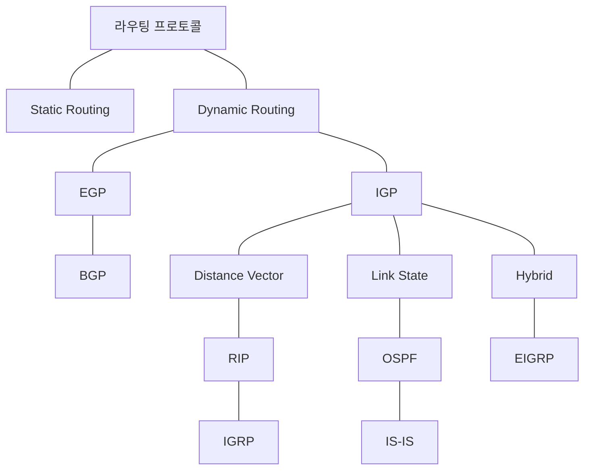

<!-- PDF page: 167 -->

[그림 117]은 벨만포드 알고리즘의 Pseudo-code를 나타낸다.

```text
BELLMAN-FORD (G, w, s)
INIT-SINGLE-SOURCE (G, s)
for i = 1 to |G.V| -1
    for each edge (u,v) ∈ G.E
        Relax (u, v, w)
for each edge (u, v) ∈ G.E
    if v.d > u.d + w(u, v)
        return FALSE
return TRUE
```

[그림 117] 벨만포드 알고리즘의 Pseudo-code

#### 다) 라우팅 프로토콜 유형

라우팅 프로토콜의 유형은 [그림 118]과 같이 라우팅 방식에 따라서 **Static Routing**과 **Dynamic Routing**으로 구분된다. Dynamic Routing 방식은 AS(Autonomous System)의 구분에 따라 **EGP(Exterior Gateway Protocol)** 방식과 **IGP(Interior Gateway Protocol)**방식으로 구분되며, IGP(Interior Gateway Protocol)방식은 다시 라우팅 설정방식에 따라 **Distance Vector 방식, Link State 방식, Hybrid 방식**으로 구분된다.



[그림 118] 라우팅 프로토콜 분류

라우팅 프로토콜의 유형은 AS(Autonomous System, 자치 시스템)를 기준으로 내부 라우터 프로토콜과 외부 라우터 프로토콜로 나눌 수도 있는데, 여기에서 **AS(Autonomous System)**는 독자적인 관리체계와 동일한 운영 정책을 가지는 네트워크의 집합을 말한다.

AS를 기준으로 라우팅 프로토콜을 분류했을 때, AS 내 라우팅 프로토콜을 **IGP(Inter Gateway Protocol)**라고 하며 대표적인 프로토콜로는 거리벡터 라우팅 알고리즘을 사용하는 **RIP(Routing Information Protocol)**, 링크상태 라우팅 알고리즘을 사용하는 **OSPF(Open Shortest Path First)**가 있다. 또한, AS 간 라우팅 프로토콜은 **EGP(Exterior Gateway Protocol)**라
