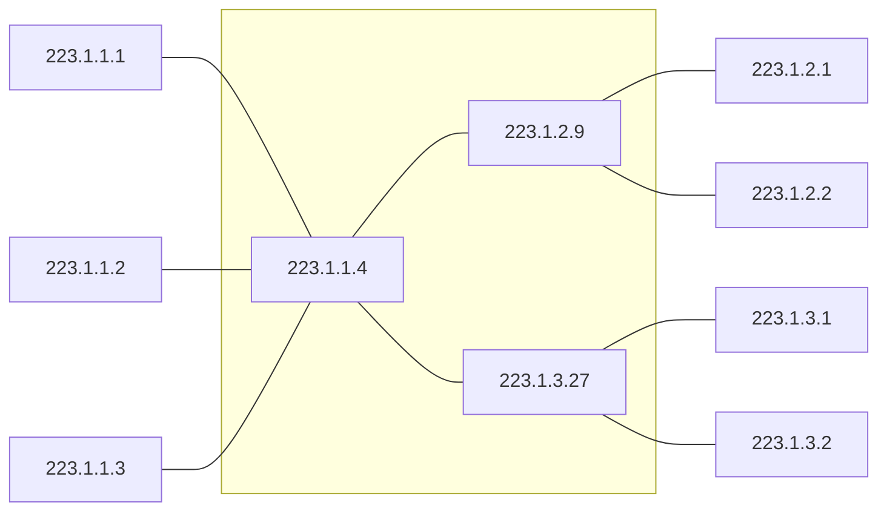

<!-- PDF page: 169 -->

ID를 고정된 8비트 단위로 구분하지 않고, 네트워크에서 요구하는 IP의 수에 따라 유연하게 네트워크 및 호스트 IP를 표현할 수 있는 서브네팅과 슈퍼네팅이 있다. 여기서 **서브네팅(Subnetting)**은 주어진 IP 주소를 네트워크 환경에 맞게 작은 서브넷으로 나누는 것을 말하며, **슈퍼네팅(Supernetting)**은 여러 개의 네트워크 ID를 하나의 네트워크 ID로 합하는 것을 말한다.

#### 나) IPv4 주소를 사용한 네트워크(예)

<!-- 그림 120: 빈 외곽 그룹은 원본의 이름 없는 중앙 라우터 -->

223.1.1.1 = 11011111 00000001 00000001 00000001

| 11011111 | 00000001 | 00000001 | 00000001 |
| --- | --- | --- | --- |
| 223 | 1 | 1 | 1 |

[그림 120] IPv4를 사용한 네트워크

### 07 IPv4 주소지정체계 및 서브네팅

#### 가) IPv4 표현방식

| 10000000 | 00001011 | 00000011 | 00011111 |
| --- | --- | --- | --- |
| 128 | 11 | 3 | 31 |

128.11.3.31

- 2진 표기법: 01110101 10010101 00011101 00000010
- Dotted decimal notation(점-10진 표기법)
