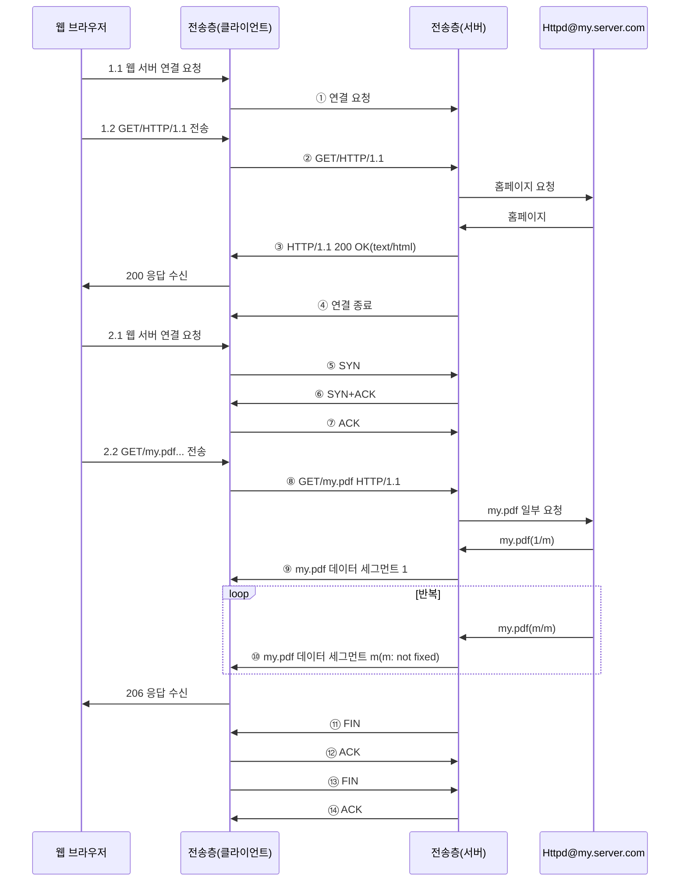

<!-- PDF page: 181 -->

〈표 65〉 잘 알려진 TCP 포트

<table>
<tr><td>서비스</td><td>TCP 포트</td><td>서비스</td><td>TCP 포트</td></tr>
<tr><td>FTP[4]</td><td>21(제어용), 20(데이터용)</td><td>DNS [8]</td><td>53(UDP 53번 포트도 사용)</td></tr>
<tr><td>SSH [5]</td><td>22</td><td>HTTP [9]</td><td>TCP 80</td></tr>
<tr><td>Telnet [6]</td><td>23</td><td>POP3 [10]</td><td>110</td></tr>
<tr><td>SMTP [7]</td><td>25</td><td>IMAP4 [11]</td><td>143</td></tr>
</table>

#### 나) 가상의 TCP 동작 시나리오

아래 그림은 사용자 A가 my.server.com 홈페이지에 들어가서 my.pdf 파일을 다운로드 받을 때 TCP 프로토콜 단에서 송 수신하는 상황을 보여준다. 응용 계층 프로그램인 웹 브라우저와 웹 서버 Httpd에 의해 주고 받는 요청과 응답이 전송계층 프로토콜인 TCP에 의해 전달된다. 여기서는 TCP 프로토콜의 동작을 중점적으로 설명하고자 한다.

[그림 127] 가상의 TCP 동작 시나리오

단계 ①의 연결 요청은 실제로는 단계 ⑤~⑦을 간단하게 그린 것이며, 단계 ④의 연결 종료 역시 단계 ⑪~⑭를 간단하게 그린 것이다. 단계 ②~③, ⑧~⑩은 TCP 헤더 바로 뒤에 붙는 응용 계층 데이터이다. 이 데이터는 HTTP 프로토콜에 따라서 사용자 A의 컴퓨터에 있는 웹 브라우저와 my.server.com 웹 서버 프로그램이 생성하게 된다. 이제 TCP 프로토콜을 좀 더 상세하고 알아보고, 해당되는 단계를 살펴보자.

특히 단계 ⑧~⑩과 같이 PDF 파일과 같이 많은 양의 데이터가 한번에 전송되는 경우에는 여러 네트워크 경로로 IP 패킷
