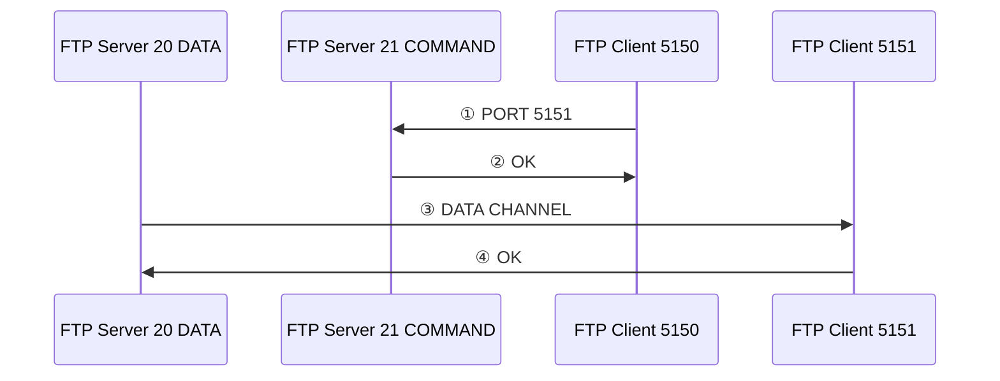

<!-- PDF page: 198 -->

일반 전송 모드와 수동 전송 모드는 아래 그림과 같이 시간 순서에 따라서 동작한다.

**일반 전송 모드 동작**

1) 클라이언트에서 서버의 21번 포트로 접속 후 클라이언트가 사용할 두 번째 포트를 서버에 알려준다.
2) 서버는 이에 대해 ack로 응답한다.
3) 서버의 20번 포트는 클라이언트가 알려준 두 번째 포트로 접속을 시도한다.
4) 클라이언트가 ack로 응답한다.
