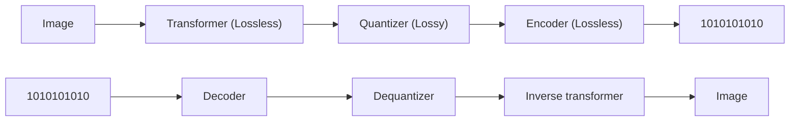

<!-- PDF page: 202 -->

정으로 일부 값들을 0으로 변환하게 된다. 부호화 과정은 양자화 후, 인코더 입력 전 지그재그 순서로 배열하며 반복 길이 부호화나 산술부호화를 이용하여 무손실 압축이 이루어진다[1].

[그림 136] 이미지 데이터 변환 과정

비디오 데이터는 여러 개의 프레임으로 구성되며 각 프레임은 하나의 이미지이며, 비디오 파일은 높은 전송속도를 요구 한다. 비디오를 압축하는 방식에는 공간적 압축과 시간적 압축방식이 있다. 각 프레임의 공간적 압축은 JPEG로 이루어지 고, 각 프레임은 독립적으로 압축된다. 시간적 압축은 중복 프레임을 제거하며, 시간적으로 데이터를 압축하기 위해 각 프 레임을 독립적인 프레임인 I-프레임, 다른 I-프레임을 참조하는 B-프레임, P-프레임으로 구성한다.

아날로그 오디오 신호는 아날로그-디지털 변환기(ADC)를 이용하여 디지털화되며, 아날로그 디지털 변환기는 샘플링과 양자화라는 2가지 과정으로 구성된다.

#### 다) QoS(Quality of Service)

멀티미디어 네트워크에서 QoS를 보장하기 위한 방법으로 RSVP(Resource reservation protocol, 자원예약프로토콜)와 TOS 필드 활용이 있다. RSVP 방식은 [그림 137]과 같이 송신지에서 수신지까지 데이터 전달을 위해 네트워크 대역폭을 고정적으로 할당 받아서 우선적으로 처리하는 방식이며, TOS 필드는 패킷에 포함되어 있는 TOS 필드 등급을 패킷마다

지정하여 처리 우선 순위를 결정하는 방식이다.

<!-- 원본 그림 137의 전화·네트워크 노드 도형 생략. 송신→수신: RSVP PATH Messages. 수신→송신: RSVP RESV Messages. End Points Send Unicast Signaling Messages(RSVP PATH + RESV). RSVP가 지원되지 않으면 Best Effort로 delivery. -->

[그림 137] RSVP를 활용한 QoS

RSVP는 IETF 시그널링 프로토콜의 하나로 데이터 흐름은 End-to-end(양단 간)까지 시그널링에 의해 정적 대역폭을 할 당 받는다. 기본적으로 큐(queue) 공간을 예약하는 방법을 사용한다[2]. RSVP의 메시지에는 송신기로부터 출발하여 경로

상의 모든 수신기에게 전달되며, 수신기를 위해 필요한 정보를 저장하는 Path 메시지와 Path 메시지를 받은 수신기가 보
