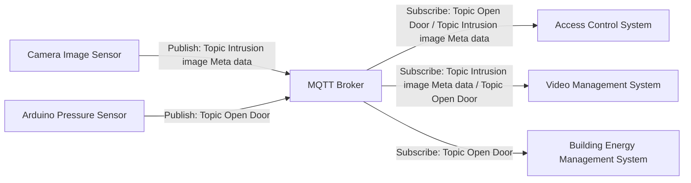

<!-- PDF page: 214 -->

[그림 145] MQTT 적용 사례

MQTT는 다수의 엔드포인트와 다수의 서버들 간에 유연한 데이터 전달을 위한 모델로 필요한 토픽(Topic)을 발행하고 구독하는 방식으로 동작하게 된다. [그림 145]는 아두이노를 이용한 압력 센서 정보를 출입통제 시스템, 영상보안 시스템, 빌딩 에너지 제어 시스템으로 문 개폐에 대한 토픽을 전송하고, 카메라의 이미지 센서에서 생성된 메타데이터 토픽을 여러 시스템에 MQTT를 이용하여 전달하는 개념도이다.

현재 표준화 단체에서는 CoAP과 HTTP 기반의 프로토콜이 대세이나 MQTT와 REST 프로토콜을 이용한 아키텍처도 여전히 제시되고 있다. OASIS에서는 MQTT에 대한 표준을 지속적으로 업데이트 하고 있다[14].

〈표 80〉 MQTT와 CoAP 비교

| 구분 | MQTT | CoAP |
| --- | --- | --- |
| 목적 | IoT를 위한 메시지 프로토콜 | IoT를 위한 메시지 프로토콜 |
| 토폴로지 | N:M 방식 | 1:1 방식 |
| 구성 | 브로커와 다수의 클라이언트 | 서버, 클라이언트 |
| 동작방식 | 발행과 구독 | 요구 및 응답 |
| 정보 | 이벤트 | 상태정보 |
| 전송프로토콜 | TCP 위주 | UDP 위주 |
| 표준 | OASIS 표준 | IETF CoRE 표준 |
