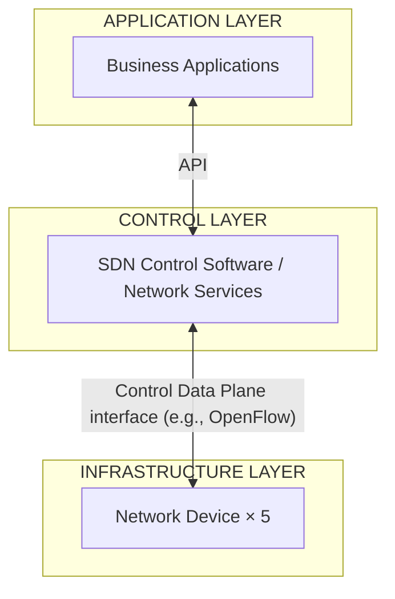
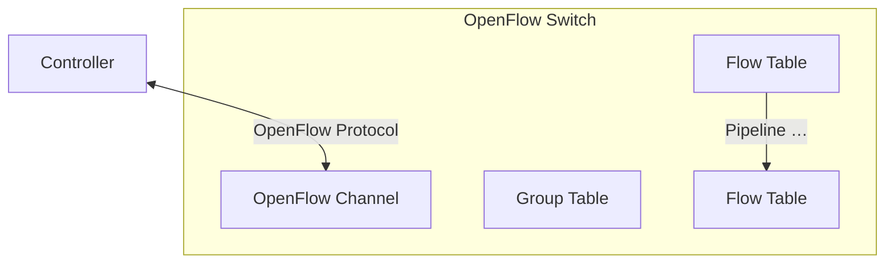

<!-- PDF page: 216 -->

② SDN의 개념

SDN은 [그림 146]과 같이 **제어 플레인**(네트워크에 무엇이 어디로 이동할지 알려주는 역할)을 **데이터 플레인**(특정 목적지로 패킷을 보냄)과 분리하여 네트워크를 프로그래밍 할 수 있도록 한다. SDN의 기반은 오픈플로우와 같은 산업 표준 제어 프로토콜을 사용하고 SDN 컨트롤러를 통해 프로그래밍할 수 있는 스위치이다.

[그림 146] SDN 아키텍처 [5]

③ 오픈플로우(Openflow) 기술

**오픈플로우** 기술은 [그림 147]과 같이 패킷을 제어하는 기능과 전달하는 기능을 분리하고 프로그래밍을 통해 네트워크를 제어하는 기술이다. 오픈플로우는 **컨트롤러**와 **스위치**로 구성된다. 컨트롤러는 스위치에 명령을 내리고, 스위치는 그 명령에 따라 패킷을 목적지로 전송하거나 수정하는 등의 데이터 흐름과 관련된 일을 수행한다.

[그림 147] 오픈플로우 스위치 주요 컴포넌트 [6]

