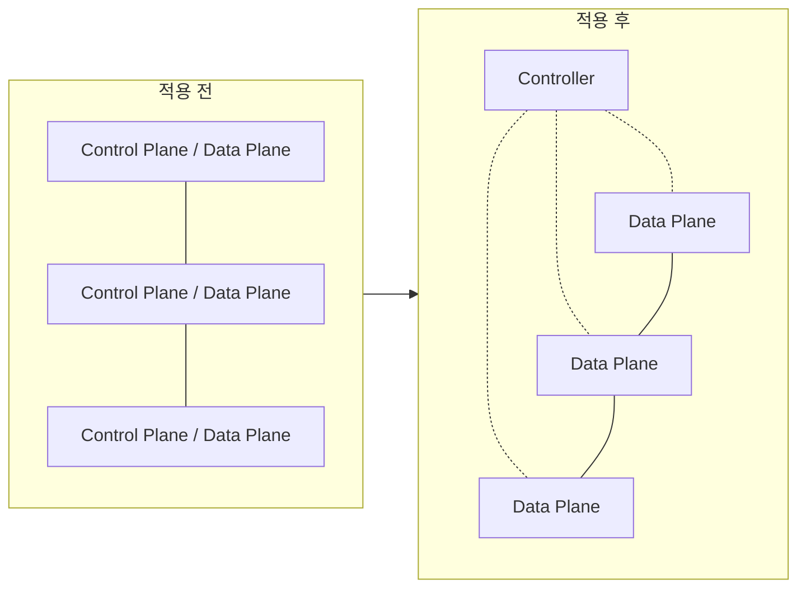

<!-- PDF page: 217 -->

④ SDN 적용사례

SDN은 [그림 148]과 같이 지금까지 네트워크 장비들은 제어 플레인과 데이터 플레인이 하나의 장비에 구현이 되어 있었다. 그러나, SDN이 적용되면서 컨트롤러에서 각 네트워크 장비의 제어 플레인 기능을 수행하게 되며, 실제 물리적인 네트워크 장비에는 데이터 플레인 기능만이 남게 된다.

여기에서 오픈플로우는 SDN 동작을 위한 인터페이스 표준기술로서 역할을 수행한다.

[그림 148] SDN 적용 전/후의 네트워크 구조

예를 들면, 중 대형 라우터 여러 모듈 중에서 연산처리를 수행하는 부분을 제거하고, 단순한 스위칭 기능만을 남겨두는 것을 말하며, 각 라우터는 컨트롤러에서 내리는 명령에 따라 단순히 동작을 수행하게 된다.

#### 다) NFV(Network Function Virtualization)

NFV는 네트워크 사업자의 높은 관심에 힘입어 새로운 화두로 떠오르고 있다. 또한, NFV 그룹에서는 주요 통신사업자 및 장비업체들을 위한 규격을 준비하고 있으며, 기술의 실현가능성을 점검하는 PoC(Proof of Concept)를 추진하고 있다.

① NFV 도입배경

네트워크 속도의 증가 및 다양한 서비스의 등장에 따라, 현재 인터넷 서비스 제공 사업자에게는 급증하는 네트워크 장비들을 수용할 수 있는 공간과 전력을 확보하는 것이 심각한 문제가 되고 있다. 또한, 네트워크 장비의 수명은 짧아져 신규 장비 도입 후 수익을 확보하는 것이 갈수록 어려워지고 있다. NFV는 가상화 기술을 통해 이런 문제점들을 해결하기 위한 방법으로 도입되었다.

② NFV의 개념

**NFV**는 고성능 x86 플랫폼에서 실행되며, 사용자가 필요에 따라 필요한 네트워크 기능을 활성화할 수 있다. 구현방식은 **VM(Virtual Machine)** 또는 **서비스 프로파일**을 만들고 x86의 성능을 활용해서 네트워크 위에서 가상화를 구현한다.

③ NFV 아키텍처 프레임워크 구조

NFV 아키텍처 프레임워크는 〈표 81〉과 같이 3개 기능 그룹으로 구성되는데, VNF그룹, NFV인프라, 관리 및 전달(Management and Orchestration)이다.
