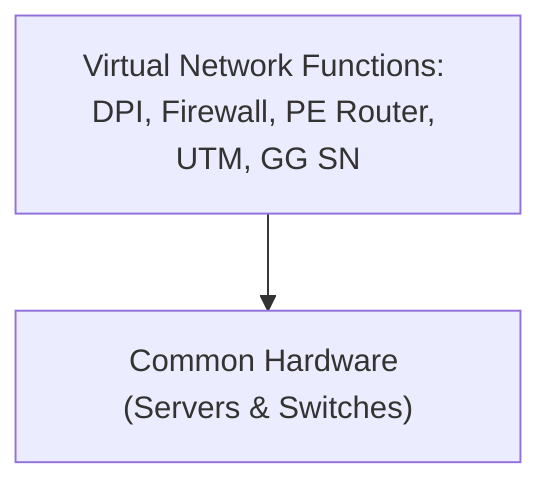

<!-- PDF page: 218 -->

[그림 149] NFV 아키텍처 프레임워크(5개 VNF 인터페이스 타입) [7]

<!-- 복잡한 인터페이스·참조점 연결 그림 생략. 원본의 구성 및 인터페이스 라벨을 아래에 전사했다. -->

- CSS/BSS
- EM1, EM2, EM3 / VNF1, VNF2, VNF3
- NFVI: Virtual Computing, Virtual Storage, Virtual Network / VirtualisationLayer / Hardwareresources: Computing Hardware, Storage Hardware, Network Hardware
- NFV Managam ent and Orchestration: NFV Orchestrator, VNF Manager(s), Service, VNF and Infrastructure Description, Virtualised Infrastructure Manager(s)
- 인터페이스: Os-Ma, Or-Vnfm, Ve-Vnfm, Vn-Nf, Vi-Vnfm, Nf-Vi, Or-Vi, Vl-Ha, SWA-1, SWA-2, SWA-3, SWA-4, SWA-5
- 범례: Execution reference points, Other reference points, Main NFV reference points

〈표 81〉 NFV 아키텍처 프레임워크 구성

| 구분 | 내용 |
| --- | --- |
| VNFs | Virtual Network Functions 여러 응용 프로그램을 지원하기 위한 네트워크 기능 집합 소프트웨어 |
| NFVI | NFV Infrastructure 컴퓨팅, 저장소, 네트워크 기능을 지원하는 물리적 하드웨어 자원, 가상화 지원 기능 및 VNF 실행을 지원하는 기능을 제공 |
| Management & Orchestration | 하드웨어적, 소프트웨어적 자원관리, 전달, VFN 관리기능 제공 |

④ NFV의 적용사례

NFV는 가상화 기능을 이용한 네트워크 장비구현 방식으로, 특화된 장비에서만 동작하는 기능이 아니라, [그림 150]과 같이 일반적인 고성능의 x86서버 플랫폼에서 네트워크 장비의 기능을 구현한다.

[그림 150] NFV 구현방식

