<!-- PDF page: 001 -->

# 정보보안 이해와 활용

TOPCIT ESSENCE Ver. 3

기술영역

04 정보보안 이해와 활용

<!-- PDF page: 002 -->

<!-- 본문 없는 페이지: 원본 확인 -->

<!-- PDF page: 003 -->

TOPCIT ESSENCE Ver. 3

기술영역

04 정보보안 이해와 활용

<!-- PDF page: 004 -->

TOPCIT 에센스는 TOPCIT을 준비하는 응시생들에게
학습자료를 제공하기 위해 발행되었습니다.
더 나아가 실무중심의 ICT관련 지식을 습득하고자 하는 학습자들이
자기주도적 학습을 위한 자원으로 활용할 수 있기를 바랍니다.

이 책의 내용에 대한 추가 지원과 문의는
TOPCIT 홈페이지 또는 홈페이지에 안내된 이메일을 이용해 주시기 바랍니다.

TOPCIT 에센스의 내용 중 일부는
집필진의 주관적인 의견이 반영되어 있으며,
해당 의견은 TOPCIT 사업단의
공식적인 입장이 아님을 밝혀둡니다.

주관부처 과학기술정보통신부
주관기관 정보통신기획평가원
참여기관 한국생산성본부

펴 낸 곳 TOPCIT 사업단

1판 발행일: 2014. 12. 10.
2판 발행일: 2016. 02. 26.
3판 발행일: 2020. 02. 26.

TOPCIT 에센스의 저작권은 과학기술정보통신부에 있으며
모든 내용의 무단전재와 복제를 금합니다.

<!-- PDF page: 005 -->

TOPCIT ESSENCE Ver. 3

기술영역

04 정보보안 이해와 활용

<!-- PDF page: 006 -->

TOPCIT ESSENCE Ver. 3

<!-- PDF page: 007 -->

기술영역

04 정보보안 이해와 활용

<!-- PDF page: 008 -->

CONTENTS

| 목차 | 쪽 |
| --- | --- |
| I. 정보보안 개념 | 12 |
| 01 정보보안의 개요 | 13 |
| 가) 정보보안의 개요 | 13 |
| 02 정보보안의 기본 용어 | 14 |
| 가) 인증(Authentication) | 14 |
| 나) 부인방지(non-repudiation) | 14 |
| 다) 암호 | 14 |
| 라) 전자서명(Digital Signature) | 15 |
| 마) 해쉬함수(Hash Function) | 15 |
| 바) 악성코드 | 15 |
| 사) 주요 보안 솔루션 | 15 |
| 03 정보보안 신기술 용어 | 17 |
| 가) 블록체인(block chain) | 17 |
| 나) FIDO(Fast IDentity Online Alliance) | 17 |
| 다) 망분리와 망연계 | 18 |
| 라) 이상금융거래 탐지시스템(FDS: Fraud Detection System) | 18 |
| 마) 양자 암호(Quantum cryptography) | 18 |
| 바) 신뢰 플랫폼 모듈(TPM, Trusted Platform Module) | 19 |
| 사) 재식별화(re-identification) | 19 |
| 아) EU–GDPR | 19 |
| II. 정보보안 기반기술 | 20 |
| 01 암호 기술 | 22 |
| 가) 암호의 개념 | 22 |

<!-- PDF page: 009 -->

| 목차 | 쪽 |
| --- | --- |
| 나) 암호화(Encryption)와 복호화(Decryption) | 22 |
| 다) 암호기술의 분류 | 22 |
| 라) 암호 알고리즘과 암호 시스템 | 23 |
| 마) 비밀키 암호와 공개키 암호 알고리즘 | 24 |
| 바) 해쉬 함수(Hash Function) | 27 |
| 02 인증 기술 | 31 |
| 가) 인증(Authentication)의 개념 | 31 |
| 나) 인증방식의 유형 | 32 |
| 다) 인증기술의 종류 | 32 |
| 라) 전자서명 | 35 |
| 마) PKI(Public Key Infrastructure) | 37 |
| 03 접근통제 기술 | 39 |
| 가) 접근통제(Access Control) 개요 | 39 |
| 나) 접근통제 정책 | 40 |
| 다) 접근통제 정책의 종류 | 41 |
| 라) 접근통제 메커니즘 | 42 |
| 마) 접근통제 모델 | 42 |
| III. 정보보안 최신 기술 | 44 |
| 01 최신 정보보안 위협 | 46 |
| 가) APT(Advanced Persistent Threat) 공격 | 46 |
| 나) 파밍(Pharming) | 47 |
| 다) 큐싱(Qshing) | 47 |
| 라) 스미싱(Smishing) | 48 |
| 마) 스피어 피싱(Spear Phishing) | 48 |

<!-- PDF page: 010 -->

| 목차 | 쪽 |
| --- | --- |
| 바) 크립토재킹(Cryptojacking) | 49 |
| 사) 랜섬웨어(Ransomware) | 49 |
| 아) Drive by download 공격 | 50 |
| 자) 악성 코드 설치 없는 “Fileless” 공격 | 50 |
| 차) 멀버타이징(Malvertising) | 51 |
| 02 최신 정보기술 관련 보안동향 | 51 |
| 가) IoT 보안 | 51 |
| 나) 클라우드 보안 | 53 |
| 다) 빅데이터 보안 | 54 |
| 라) 모바일 보안 | 56 |
| IV. 보안관리체계와 표준 | 57 |
| 01 정보보호 관리체계 | 58 |
| 가) 정보보호 관리체계(ISMS)의 개요 | 58 |
| 나) 위험관리(Risk Management) | 59 |
| 다) 정보보호 및 개인정보보호 관리체계(ISMS–P) | 60 |
| 02 개인정보보호 | 62 |
| 가) 개인정보보호 수칙 | 62 |
| 03 정보보호 표준 및 관련 체계 | 63 |
| 가) ISO 27001: 2013 | 63 |
| 나) OWASP TOP 10 | 63 |
| 다) CWE(Common Weakness Enumeration) | 64 |
| 라) CWSS(Common Weakness Scoring System) | 64 |
| 마) CVE(Common Vulnerabilities and Exposures) | 64 |

<!-- PDF page: 011 -->

| 목차 | 쪽 |
| --- | --- |
| 바) CVSS(Common Vulnerabilities Scoring System) | 64 |
| 사) SANS(SysAdmin, Audit, Networking, and Security) Top 25 | 64 |
| V. 애플리케이션 보안 | 66 |
| 01 시큐어 코딩의 필요성 | 68 |
| 가) 시큐어 코딩의 필요성 | 68 |
| 02 시큐어 코딩 주요내용 | 68 |
| 가) SW 보안약점과 보안 취약점 | 68 |
| 나) 시큐어 개발 생명주기(Secure SDLC) | 68 |
| 03 시큐어 코딩 주요기법 | 69 |
| 가) JAVA 시큐어 코딩 주요기법 | 69 |
| 나) C 시큐어 코딩 주요기법 | 73 |
| 다) Android–JAVA 시큐어 코딩 주요기법 | 75 |
| VI. 데이터 보안 | 78 |
| 01 데이터베이스 보안의 개요 | 80 |
| 가) 데이터베이스 보안의 개요 | 80 |
| 나) 데이터베이스의 보안 위협 및 대응 | 80 |
| 02 데이터베이스 접근통제 | 81 |
| 가) 데이터베이스 접근통제 정책 | 81 |
| 나) 데이터베이스 접근통제 구축 방식 | 81 |
| 03 데이터베이스 암호화 | 83 |

<!-- PDF page: 012 -->

| 목차 | 쪽 |
| --- | --- |
| 가) 데이터베이스 암호화 적용 시 고려사항 | 83 |
| 나) 데이터베이스 암호화 대상 및 방식 | 83 |
| 다) 데이터베이스 암호화의 유형 | 83 |
| 라) 데이터베이스 암호화 적용 | 85 |
| 마) 데이터베이스 암호화 적용절차 | 87 |
| 04 데이터베이스 암호화 키(Key) 관리 | 89 |
| 가) 데이터베이스 암호화 키의 종류 | 89 |
| 나) 암호화 키 생명주기 단계별 관리방안 | 89 |
| VII. 시스템 아키텍처 보안 | 91 |
| 01 윈도우(Windows) 시스템 보안 | 92 |
| 가) 윈도우 시스템 보안 개요 | 92 |
| 나) 계정 및 패스워드 관리 | 93 |
| 다) 접근통제 | 94 |
| 라) 시스템 보안 | 95 |
| 마) 서비스 보안 | 95 |
| 바) 터미널 서비스 점검 | 95 |
| 02 유닉스(Unix) 계열 시스템 보안 | 96 |
| 가) 유닉스 계열 시스템 보안 개요 | 96 |
| 나) 계정 및 패스워드 관리 | 96 |
| 다) 접근통제 | 97 |
| 라) 시스템 보안 | 97 |
| 마) 서비스 보안 | 97 |
| VIII. 네트워크보안 이해하기 | 100 |

<!-- PDF page: 013 -->

| 목차 | 쪽 |
| --- | --- |
| 01 네트워크 보안의 개요 | 101 |
| 가) 네트워크 보안 개념 | 101 |
| 나) 통신 프로토콜 계층과 보안 | 105 |
| 다) 네트워크 공격의 유형과 대응 | 107 |
| 02 보안 프로토콜과 보안 솔루션 | 110 |
| 가) IPSec | 110 |
| 나) SSL | 113 |
| 03 무선랜 보안 | 115 |
| 가) 무선랜의 특징 | 115 |
| 나) 보안 위협과 대응 | 116 |
| 다) 무선랜 보안 표준 | 117 |

<!-- PDF page: 014 -->

## I. 정보보안 개념

### 주제

정보보안의 개념 이해하기

### 최근 동향 및 주요 이슈

클라우드의 대중화, 빅데이터 및 인공지능 산업의 활성화, IoT산업의 본격화 등 IT 관련 신기술은 점차 고도화
되고 있고 다양한 융합 기술과 서비스들이 등장하고 있지만 그에 따른 정보보안 기술의 적용은 미비함으로 인
해 신기술 및 융합기술을 악용한 각종 보안침해 사고가 증가할 것으로 예상된다. 따라서 신기술 및 융합기술에
대한 정보보안을 위해 다양한 보안기술 및 보안 서비스 개발이 절실하게 요구되는 상황이며, 이를 위해 기본적
인 토대가되는 정보보안 개념의 이해가 필요하다.

### 학습 목표

1. 정보보안의 개념에 대해 설명할 수 있다.

2. 정보보안의 목표, 중요성에 대해 설명할 수 있다.

### 핵심 키워드

정보보호, 관리적 · 기술적 · 물리적 정보보안, 기밀성, 무결성, 가용성, 부인방지, 인증, 접근통제

<!-- PDF page: 015 -->

### 실무 미리보기

A 기업에 근무하는 김 대리는 Java 소스개발과 배포, 그리고 소스 프로그램들의 유지보수를 담당하고 있다. 김
대리는 주기적으로 해당 웹 페이지와 서버를 점검하고 있다.
이 과정에서 김 대리는 관리해야 하는 많은 소스들의 무결성을 보장해야 하며, 응용 프로그램이 원활히 작동할
수 있도록 서버의 가용성을 보장하기 위해 성능 및 용량 관리 등을 해야 한다. 응용 프로그램에서 저장하는 고
객 정보의 기밀성을 유지하기 위해 암호화 등의 기술적 보호조치를 취해야 한다.
김 대리는 업무상 정보의 기밀성, 무결성, 가용성을 보장하기 위해 노력하고 있는데 이러한 정보보호의 개념과
목표에 대해 좀더 자세히 알아보도록 하자.

### 01 정보보안의 개요

#### 가) 정보보안의 개요

① 정보보안의 개념

정보보안이란 정보를 수집, 가공, 저장, 전송 등의 과정에서 정보의 훼손, 변조, 유출 등을 방지하기 위해 관리적, 물리적,
기술적으로 정보를 보호하는 것을 의미한다.

② 정보보안의 필요성

인터넷 등의 공간에서 개인 프라이버시를 보장하고 인터넷 범죄를 차단해야 할 필요성이 점차 증대하고 있다. 인터넷을
통해 전세계가 연결되어 글로벌화에 따른 국내 주요 기술 및 정보 유출의 우려 또한 커지고 있다.

③ 정보보안의 목표

정보보안의 3대 목표는 기밀성, 무결성, 가용성이며, 관리적, 물리적, 기술적으로 이러한 성질을 보장하는 것을 의미한다.

기밀성 · 무결성 · 가용성

<!-- 생략: 그림 1의 중앙 서버 아이콘, 삼각 순환 화살표와 주변 정보 보안 위협의 공간 배치 -->

[그림 1] 정보보안의 3대 목표

<!-- PDF page: 016 -->

• 기밀성이란 정보를 저장, 전송하는 과정에서 정보의 원본에 대해 인가 되지 않은 사용자에게 노출되지 않도록 보장하는
것을 의미한다.

• 무결성이란 정보를 송수신하는 과정에서 불법적으로 생성, 변경, 삭제되지 않고 원본이 유지되는 것을 의미한다.

• 가용성이란 인가 받은 사용자에 대하여 요구한 정보를 필요한 시점에 접근 및 사용을 보장해 주는 것을 의미한다.

### 02 정보보안의 기본 용어

#### 가) 인증(Authentication)

인증이란 정보의 주체가 되는 송신자와 수신자 간에 교류되는 정보의 내용이 변조 또는 삭제되지 않았는지, 그리고 주체
가 되는 송, 수신자가 정당한지를 확인하는 방법을 말한다.

#### 나) 부인방지(non-repudiation)

메시지를 송수신한 후 송수신 사실을 증명함으로써 송수신 여부에 대한 부인을 방지하기 위한 보안 기술을 말하며, 아래
3가지 유형으로 나누어 볼 수 있다.

① 송신 부인 방지(non-repudiation of origin)

메시지를 송신하고도 송신하지 않았다고 주장하는 송신자의 부인을 방지하는 것을 말한다.

② 전달 부인 방지(non-repudiation of delivery)

메시지가 전달되었음에도 메시지가 전달되지 않았다고 주장하는 수신자의 부인을 방지하는 것을 말한다.

③ 수신 부인 방지(non-repudiation of receipt)

수신자가 메시지를 수신했음에도 수신하지 않았다고 주장하는 수신자의 부인을 방지하는 것을 말한다.

#### 다) 암호

암호 기술은 크게 암호화 기술과 암호 프로토콜 기술로 분류된다.

① 암호화 기술

암호화 키와 복호화 키가 같은지의 여부에 따라, 암호화 키와 복호화 키가 같은 대칭 키 암호 방식과 암호화 키와 복호화
키가 서로 다른 공개키 암호 방식으로 분류할 수 있다.

② 암호 프로토콜

암호 기술을 사용하는 프로토콜을 의미한다. 프로토콜은 어떤 목적을 달성하기 위해 2명 이상이 참여하는 유한한 일련의
단계를 의미하므로 암호 프로토콜은 프로토콜의 각 메시지의 의미를 보장함은 물론 해당 암호 프로토콜의 특정 목적(인
증, 기밀성, 무결성과 부인방지 등)을 보장하기 위하여 참여자 또는 제3자가 부정을 하지 못하도록 해야 한다.

<!-- PDF page: 017 -->

#### 라) 전자서명(Digital Signature)

전자서명은 서명자가 특정 문서에 자신의 개인키를 이용하여 해쉬 연산을 함으로써 데이터의 무결성과 서명자의 인증성
을 함께 제공하는 방식이다. 메시지 전체에 대해 직접 서명하는 것은 공개키 연산을 모든 메시지 블록마다 반복해야 하기
때문에 매우 비효율적이며 따라서 메시지에 대한 해쉬 값을 계산한 후 이것에 대해 서명함으로써 효율적으로 전자서명을
생성할 수 있다. 서명자는 메시지 자체가 아니라 해쉬 값에 대해 서명을 하였지만 같은 해쉬 값을 가지는 다른 메시지를
찾아내는 것이 어렵기 때문에 이 서명은 메시지에 대한 서명이라고 인정된다.

#### 마) 해쉬함수(Hash Function)

해쉬 함수 또는 해쉬 알고리즘(Hash Algorithm)은 다양한 크기의 임의의 문자열을 고정된 길이의 짧은 해쉬 값(해쉬 코드)
으로 변환하여 출력하는 수학적 함수이다. 즉 임의의 길이를 갖는 입력 비트열을 고정된 짧은 길이로 함축하는 기능이라
고 볼 수 있다.
암호 알고리즘에는 키가 사용되지만 해쉬 함수는 키를 사용하지 않으므로 같은 입력에 대해서는 항상 같은 출력을 가지게
된다. 이러한 특성을 갖는 해쉬 함수는 입력 메시지에 대한 오류나 변조를 탐지할 수 있는 무결성 검증 등에 사용할 수 있
다.

#### 바) 악성코드

악성코드는 악성 소프트웨어(malicious software)의 줄임말로, 컴퓨터, 파일시스템 또는 네트워크에 대해 악성 행위를 하도
록 설계된 소프트웨어를 말한다. 악성코드는 아래와 같은 유형으로 분류할 수 있다.

① 웜(Worm)

독립적으로 실행되는 악의적인 소프트웨어로, 스스로를 복제하고 다른 컴퓨터로 확산된다.

② 바이러스(Virus)

다른 독립적 프로그램의 코드 내에 삽입되어 해당 프로그램이 악성 행동을 하고 스스로 확산되도록 하는 악성코드를 말한
다.

③ 트로이 목마(Trojan horse)

악성코드가 숨겨진 프로그램으로 정상적인 프로그램으로 보이지만 사용자가 실행하면 악성코드가 실행된다.

#### 사) 주요 보안 솔루션

① 방화벽(Firewall)

사설 네트워크를 외부로부터 보호하기 위해 공중 네트워크와 사설 네트워크 사이에 설치하는 보안솔루션을 말한다. 일반
적으로 방화벽에는 크게 두 가지 종류가 있는데 첫 번째 형태는 패킷 필터링 게이트웨이(Packet Filtering Gateway)로 일
련의 규칙을 바탕으로 패킷의 통과 여부를 판단하는 장치이며, 두 번째 형태는 프록시 서버(Proxy Server)로 사설 네트워
크로 접속하기 위해 특정 호스트들에게 인증을 제공하고 패킷을 전달하도록 허가하는 시스템을 지칭한다. 그러나 두 가지
방법을 혼용하여 보안성을 높인 방법도 사용되고 있다.

② 침입 방지 시스템(IPS: Intrusion Protection System)

대상 시스템(네트워크 탐지 영역)에 대한 인가되지 않은 행위와 비정상적인 행동을 탐지하고, 탐지된 불법 행위를 구별하
여 실시간으로 침입을 차단하는 기능을 가진 보안 시스템이다. 침입자 행위의 평균 영역과 인가자 행위의 평균 영역간에
공통되는 영역이 존재하는 특성이 침입탐지를 어렵게 하는 요인임을 짐작할 수 있다. 침입탐지 시스템은 일반적인 보안

<!-- PDF page: 018 -->

시스템 구현 절차의 관점에서 방화벽과 더불어 가장 우선적으로 구축되며, 침입탐지시스템의 구축 목적은 해킹 등의 불법
행위에 대한 실시간 탐지 및 차단과 방화벽에서 허용한 패킷을 이용하여 행해지는 공격에 대한 방어 등의 목적으로 구축
된다.

③ 가상사설망(VPN)

원격지 간에 사설망(Private Network)을 물리적으로 구축하지 않고 인터넷과 같은 공중망(Public Network)을 사설망처럼 안
전하게 즉, 접근통제, 인증과 기밀성 서비스를 이용할 수 있도록 하는 기술이다. VPN을 구현하는 대표적 기술로는 IPSec
과 SSL이 있으며, 전용 시스템에 구현 하거나, 라우터에 구현, 방화벽에 구현하는 등의 구현 방법이 있다.

④ 통합인증(SSO: Single Sign On)

하나의 사이트에 로그인 한 후 여러 다른 사이트에 별도의 인증절차 없이 자동으로 인증할 수 있도록 한다. 일반적으로 서
로 다른 시스템 및 사이트에서 각각의 사용자 정보를 관리하게 되는데, 필요에 따라서 사용자 정보를 연동하여 사용해야
하는 경우도 있다. 이 때, SSO를 이용하여 하나의 사용자 정보를 기반으로 여러 시스템을 하나의 통합 인증을 사용하도록
할 수 있다.

⑤ 웹방화벽(WAF: Web Application Firewall)

웹 서버 앞 쪽에 위치하여 외부로부터 들어오는 HTTP/HTTPS 프로토콜에 대한 트래픽을 감시하고, SQL Injection 공격이
나 XSS 공격 등과 같은 웹 애플리케이션에 대한 악의적인 공격이 탐지되면 해당 공격이 웹 서버에 도달하기 전에 차단하
는 역할을 수행하는 보안 솔루션이다.

⑥ 네트워크 접근 제어 시스템(NAC: Network Access Control)

엔드포인트(Endpoint), 즉 사용자 컴퓨터가 처음 내부망 네트워크에 접근을 시도할 때 접근하는 사용자 컴퓨터에 대해 네
트워크 사용자 인증 수행 및 백신 프로그램 설치 등 각종 보안 정책 준수 여부를 확인하고, 보안 정책 미 준수 시 사전에
정의된 보안 정책에 따라 네트워크 접근을 통제하는 역할을 수행한다.

⑦ 무선 침입방지 시스템(WIPS: Wireless Intrusion Prevention System)

WIPS는 특정조직에서 운영되는 무선랜을 지속적으로 모니터링 하여 인가되지 않은 무선장비들의 접근을 자동으로 탐지
및 방지하고, 무선랜의 안정성을 높이고 통합관리 할 수 있도록 지원하는 시스템이다. WIPS는 노출된 무선 네트워크에서
불법 AP나 사용자 단말기를 이용한 침입 시도 공격 등을 탐지 및 차단하는 기능을 제공한다.

⑧ 통합 보안관리(ESM: Enterprise Security Management)

기능별, 제품별로 모듈화된 보안관리 기능을 통합하여 일관되고, 직관적인 관리자 및 사용자 인터페이스를 제공하기 위한
개념으로 효율적이고 정책지향성의 체계적인 보안관리 시스템을 구축하여, 표준 정책 기반하에서 모든 시스템의 통합 보
안관리 체계를 구축하기 위한 보안 솔루션이다.

⑨ 보안 정보 및 이벤트 관리(SIEM: Security Information Event Management)

기존의 ESM의 역할을 보안 영역에서 기업 전반으로 확대시키고 기업 컴플라이언스 대응 기능을 추가하여 빅데이터의 방
대한 정보 속에서 단순한 로그 수집 및 분석이 아닌 사후에 추적 등이 가능하도록 상관분석과 포렌식 기능을 제공해 주는
지능적 위협에 대한 조기 경고 모니터링 체계를 수립하기 위한 솔루션을 말한다.

<!-- PDF page: 019 -->

### 03 정보보안 신기술 용어

#### 가) 블록체인(block chain)

암호화폐인 비트코인 시스템과 네트워크에서 발생하는 모든 거래는 하나의 공개 장부에 기록되고, 분산되어 저장되는 단
일장부를 말한다. 블록체인은 분산장부(Distributed Ledger)로서 네트워크 참여자들이 데이터를 저장하고 검증하기 위한 구
조로 설계 되어 있다. 거래가 발생하게 되면 거래된 정보의 검증을 위해 일정시간(10분) 동안 발생한 거래를 모아서 블록
(block)을 생성하고, 이러한 블록들을 순차적으로 연결하여 체인(chain) 형태를 구성하게 되기 때문에 블록체인이라고 부
르는 것이다.
거래 원장의 복사본이 각 네트워크 구성원에게 분산되어(distributed) 새로운 거래가 발생할 때마다 구성원들의 동의를 통
해 해당 거래를 인증하게 되는데, 기존 중앙 집중화된 시스템에 의존하지 않고 개인 대 개인 간(P2P) 네트워크 방식을 이
용함으로써, 거래 중개자의 개입이 불필요하게 된다. 따라서 거래의 효율성과 투명성은 높아지고 적은 비용으로 보다 빠
르고 안전한 거래가 가능하게 되는 것이다. 또한, 블록체인에 기반한 거래 정보의 위변조가 불가능하기 때문에 거래의 신
뢰성이 높아지고 거래정보의 추적이 용이하게 되기도 한다.

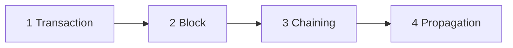

| 단계 | 그림 내부 내용 |
| --- | --- |
| Transaction | INPUTS: 홍길동 100,000 / OUTPUTS: 홍길서 70,000, 홍길동 30,000 |
| Block | Block #15: Header, Transaction #123, …, Transaction #216 / 2015년 10월 28일 14시 20분. Block #16: Header, Transaction #217, …, Transaction #300 / 2015년 10월 28일 14시 30분 |
| Chaining | Block #16, Block #15, Block #14, … / Block 내 Header정보를 기준으로, 블록들이 사슬(Chain)처럼 연결되어 Ledger 구성 |
| Propagation | 분산저장을 통한 비용 절감 / 분산되어 저장된 장부 기록 위·변조 불가 |

<!-- 생략: 그림 2의 블록 입체 표현과 Node 원형 네트워크 배치 -->

[그림 2] 블록체인의 개념도

#### 나) FIDO(Fast IDentity Online Alliance)

온라인 환경에서 바이오 인식기술을 활용한 인증방식에 대한 기술표준(De Facto)을 정하기 위해 2012년 7월 설립된 기관
으로 FIDO 규격에서는 이용자 단말에서의 사용자 로컬 인증과 서비스 제공 기관의 서버에서 수행하는 원격인증을 분리하
였다.

① FIDO 1.0

FIDO 1.0은 기존의 생체인증과 유사하지만 사용자의 개인정보를 서버에 저장하지 않는 UAF(Universal Authentication
Framework) 프로토콜과 이중인증을 통해 보안성을 향상시키는 U2F(Universal 2nd Factor)프로토콜의 두 가지 인증방법을
제공한다.

<!-- PDF page: 020 -->

② FIDO 2.0

FIDO 2.0은 PC와 웹 환경에서 비밀번호 대신 바이오정보를 사용한 편리한 인증과 결제 환경을 제공한다. PC와 노트북에
바이오 인증 장치 확대가 예상되며 스마트폰을 키(Key)로 사용해 다양한 단말기 인증 제공도 가능하다. FIDO 2.0은 FIDO
클라이언트와 ASM을 플랫폼에서 제공하는 것을 목적으로 개발되는 범용인증기술 표준 규격으로 플랫폼은 크게 윈도우와
안드로이드를 포함하는 운영체제 플랫폼과 웹브라우저를 기반으로 하는 웹 플랫폼을 의미한다. FIDO 서버, RP 서버와 RP
클라이언트는 서버에서 제공해야 하는 컴포넌트로 서버파트 생각하면 더 이상 표준 프로토콜이 필요하지 않게 된다. 따라
서 FIDO 2.0에서는 UAF Protocol을 사용하지 않고 서버에서 정의하는 자체 프로토콜을 사용하여 메시지를 주고받는다. 기
존 FIDO 1.0 에서 안드로이드 앱으로 제공되었던 FIDO 클라이언트는 운영체제에서 API로 제공될 예정이며 웹브라우저에
서는 자바스크립트 API로 제공된다.

#### 다) 망분리와 망연계

외부 인터넷 망을 통한 불법적인 접근과 내부정보 유출을 차단하기 위해 업무망과 외부 인터넷 망을 분리하는 망 차단조
치를 말하며, 물리적 망분리와 논리적 망분리의 두 가지 유형이 있다.

〈표 1〉 물리적 망분리와 논리적 망분리

<table>
<tr><td>구분</td><td>물리적 망분리</td><td>논리적 망분리</td></tr>
<tr><td>운영방법</td><td>업무용 망과 인터넷용 망을 물리적 분리(PC 2대 사용)</td><td>가상화 등의 방법을 사용하는 논리적 분리(PC 1대 사용)</td></tr>
<tr><td>도입비용</td><td>많음(추가 PC, 망구축)</td><td>적음(구축환경에 따라 상이)</td></tr>
<tr><td>보안성</td><td>높은 보안성(근본적 분리)</td><td>낮은 보안성(취약점 발생)</td></tr>
<tr><td>효율성</td><td>효율성 저하(업무환경)</td><td>관리 용이(보안정책 적용)</td></tr>
<tr><td>세부방식</td><td>2PC, 멀티 PC, 망 전환 장치</td><td>서버 기반, PC 기반</td></tr>
</table>

#### 라) 이상금융거래 탐지시스템(FDS: Fraud Detection System)

FDS는 전자금융거래에 사용되는 단말기 정보, 접속정보, 거래내용 등을 종합적으로 분석하여여 의심거래를 탐지하고, 이상금
융거래를 차단하는 시스템으로, 사용자의 평소 거래 패턴을 분석하여 패턴에 위배되는 액션이 취해지게 되면 이상 행위로
판단하기 때문에 패턴분석이 FDS의 핵심 엔진이며, 아래와 같은 기능을 가진다.

① 정보수집

이용자의 정보 및 행위에 대한 정보 수집으로 이용자 매체환경 정보와 사고 유형 정보를 수집한다.

② 분석 및 탐지

수집된 정보를 통해 이상 행위에 대한 분석으로 이용자 유형별, 거래 유형별 다양한 상관 관계 분석 및 패턴을 검사해 이
상 행위를 탐지한다.

③ 대응

이상 행위로 판단 되었을 때 거래를 차단하거나 추가 인증을 요구하여 부당 거래를 차단한다.

#### 마) 양자 암호(Quantum cryptography)

역학의 특성을 활용한 암호 기술이다. 수학적 복잡성을 기반으로 하는 기존의 암호체계와는 달리 양자 암호는 양자
(quantum)의 특성을 기반으로 한다. 양자는 복사할 수 없고 원래의 상태로 되돌릴 수 없는 특성을 가지는데, 이는 송신자
와 수신자 이외의 제 3자가 도청을 위해 측정하는 순간 양자 상태를 변화시켜 수신자가 도청 시도를 파악할 수 있다.

<!-- PDF page: 021 -->

#### 바) 신뢰 플랫폼 모듈(TPM, Trusted Platform Module)

국제산업표준단체인 TCG(Trusted Computing Group)에서 소프트웨어만으로 운영되는 보안 기술의 한계점을 극복하기
위한 표준 규격으로 암호화된 키, 패스워드, 디지털 인증서와 같이 보안을 필요로 하는 중요한 데이터를 하드웨어적으
로 분리된 안전한 공간에 저장하여 키(key)의 관리나 암호화 처리 등을 해당 보안 장치 내부에서만 처리하도록 하는 강
력한 보안 환경을 제공하는 모듈이다. 2016년 9월 최신 TPM 2.0이 공개되었으며, 여기에는 모바일용 신뢰 플랫폼 모듈인
MTM(Mobile Trusted Module)이 포함되어 있다.

#### 사) 재식별화(re-identification)

개인을 식별할 수 없도록 변환하는 과정이나 방법을 비식별화(de-identification)라고 하는데, 이를 다시 식별할 수 있도록
다른 정보와 조합 • 분석 • 처리하여 개인을 식별해내는 과정 또는 방법을 재식별화(re-identification)라고 한다. SNS나 검색
엔진 등의 웹사이트를 통한 정보 수집, 또는 의료 • 금융 기관 등의 개인정보를 취급하는 업체들이 데이터를 분석하는 과
정에서 고의 또는 실수로 재식별화가 되어 개인정보가 유출될 수 있다. 최근 다양한 분야에서 빅데이터(big data)가 활용되
고 있는 재식별화로 인한 개인정보의 무분별한 유출이 우려되고 있다.

#### 아) EU-GDPR

2018년 5월 25일부터 시행되는 EU(유럽연합)의 개인정보보호 법령이며, 동 법령 위반시 과징금 등 행정처분이 부과될
수 있어 EU와 거래하는 우리나라 기업도 이 법에 위반되지 않도록 주의할 필요가 있다. 유럽연합은 개인정보보호규정
(General Data Protection Regulation)을 제정하여 일반적인 개인정보와 익명정보, 가명정보라는 개념을 사용하여 개인정보
보호와 함께 빅데이터 산업의 활성화를 위한 개인정보 활용 기회를 동시에 마련하고 있다.
GDPR의 주요 변화된 내용은 다음과 같다.

① 강행 규정화(과징금 부과)

이전 EU 지침은 권고 차원의 규정인 점에 반해, GDPR은 모든 회원국이 의무적으로 준수해야하는 강행 규정이라는 점에
서 큰 차이가 있다(위반시 과징금 부과).

② 적용대상 확대

GDPR은 EU 내 사업장을 운영하는 기업 뿐만 아니라 전자상거래 등을 통해 해외에서 EU 주민의 개인정보를 처리하는 기
업에게도 적용된다.

③ 책임성 강화

개인정보책임자(DPO) 지정 등 기업의 책임성을 강화하는 내용과 정보이동권 등 정보주체의 권리를 강화하는 내용이 추가
되었다.

[참고 및 추천 자료]

[1] 양대일, IT CookBook, 정보 보안 개론(개정판): 한 권으로 배우는 보안 이론의 모든 것, 한빛미디어, 2018.

[2] 정보 보호 기술 용어, 한국정보통신기술협회, 2013.

[3] 이문구, Introduction to Information Security with a Workbook(정보보호개론), 이한출판사, 2012

<!-- PDF page: 022 -->

## II. 정보보안 기반기술

### 주제

암호와 인증기술 및 접근통제 이해하기

### 최근 동향 및 주요 이슈

사이버 세상이 확대 발전됨에 따라 불법적 접근, 정보 유출, 파일 변조 등과 같은 문제들이 날로 그 심각성을 더
해가고 있다. 심지어 윈도우나 백신 프로그램의 패치 프로그램까지도 바이러스에 감염된 상태이거나 변조된 상
태로 배포되는 상황도 벌어지고 있는데, 정보보안의 관점에서 기밀성(Confidentiality)과 무결성(Integrity)을 보장함
으로써 다양한 보안 위협에 능동적으로 대응할 수 있다. 기밀성이란 데이터에 대해 접근 권한을 가진 정당한 사
용자만이 볼 수 있게 하는 개념이며, 무결성은 데이터가 변경이나 위조되지 않고 원래의 데이터임을 보장하는
개념이다. 따라서 정보보안에 있어 기밀성의 보장과 무결성의 보장을 각각 혹은 통합적으로 해당 데이터의 특
성을 고려한 적용을 하는 것이 매우 중요하다.

### 학습 목표

1. 기밀성 지원을 위한 암호의 개념과 고전암호에 대해 설명할 수 있다.

2. 비밀키 암호화와 공개키 암호화 알고리즘에 대해 설명할 수 있다.

3. 무결성 지원을 위한 해쉬함수에 대해 설명할 수 있다.

4. 안전한 거래를 위한 전자서명과 PKI(Public Key Infrastructure)에 대해 설명할 수 있다.

5. 접근통제를 위한 인증기술과 인증방법을 설명할 수 있다.

### 핵심 키워드

암호 알고리즘, 비밀키 암호화, 공개키 암호화, 해쉬 함수, 인증, 전자서명, PKI, 접근통제, 암호 프로토콜, DES,
AES, RSA, ECC, 해쉬 충돌, 공인인증서, Multi Factor 인증, 세션키

<!-- PDF page: 023 -->

### 실무 미리보기 안전하게 정보 관리하기

웹 응용프로그램 개발 회사에 근무하는 김 대리는 Java 기반의 소스개발과 배포, 그리고 소스 프로그램들의 유
지보수를 담당하고 있다. 담당 업무 처리 과정에서 김 대리는 주기적으로 해당 웹 페이지와 서버를 점검해야 한
다. 그러나 주기적인 점검만으로는 다양하고 지능화되어 가는 각종 보안 위협으로부터 자유로울 수 없다.

또한 업무 수행과정에서 협력하는 기업과 소스 프로그램을 주고 받아야 하는데 이때 타 경쟁 기업에 소스 프로
그램이 공개되지 않도록 하여야 한다.

이러한 상황에서 김 대리가 관리하는 많은 수의 소스 프로그램들의 저장 또는 전송 과정에서 인가되지 않은 제
3자가 소스 프로그램을 알 수 없도록 하는 기밀성 보장을 위해 김 대리가 취해야 할 조치들은 어떤 것이 있으
며, 또 이 개념들을 실제 적용하는 방법에 대해서 알아본다.

<!-- PDF page: 024 -->

### 01 암호 기술

#### 가) 암호의 개념

누구나 볼 수 있는 형태의 평문(Plaintext)을 해석하기 불가능한 형태의 암호문(Ciphertext)으로 변형하는 과정을 암호화
(Encryption)라 하며, 암호문을 평문으로 다시 바꾸어 해독 가능한 형태로 만드는 과정을 복호화(Decryption)라 하는데, 이
들을 암호학(Cryptography)이라 부른다. 이 두 변환 과정에서 사용되는 수학적 기능을 암호 알고리즘이라고 하며 암호 알
고리즘은 암호화와 복호화를 수행하기 위해 키(Key)를 사용하게 된다. 한마디로 정보보안의 3대 목표 중의 하나인 기밀성
을 얻기 위한 중요한 수단이 암호화이다.

#### 나) 암호화(Encryption)와 복호화(Decryption)

암호화란 평문(Plain text)을 인가받지 않은 제 3자가 인식할 수 없는 형태로(암호문) 변환하는 과정을 말하며, 복호화란 암
호화 과정의 역과정으로 변환된 암호문을 다시 평문으로 복원하는 과정을 말한다.

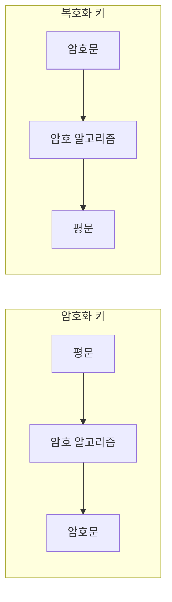

<!-- 생략: 그림 3의 열쇠 아이콘 -->

[그림 3] 암호화와 복호화

암호화는 처음에 주로 군사적인 목적으로 사용되었지만, 현재는 정보통신과 인터넷 기술이 발달함에 따라 다양한 중요 정
보를 보호하기 위한 방안으로 암호화를 활용하고 있다.

#### 다) 암호기술의 분류

암호 기술은 [그림 4] 에서와 같이 크게 암호화 기술과 암호 프로토콜 기술로 분류된다.

① 암호화 기술

암호화 키와 복호화 키가 같은지의 여부에 따라, 암호화 키와 복호화 키가 같은 대칭 키 암호 방식과 암호화 키와 복호화
키가 서로 다른 공개키 암호 방식으로 분류할 수 있다.

② 암호 프로토콜

암호 기술을 사용하는 프로토콜을 의미한다. 프로토콜은 어떤 목적을 달성하기 위해 2명 이상이 참여하는 유한한 일련의

<!-- PDF page: 025 -->

단계를 의미하므로 암호 프로토콜은 프로토콜의 각 메시지의 의미를 보장함은 물론 해당 암호 프로토콜의 특정 목적(인
증, 기밀성, 무결성과 부인방지 등)을 보장하기 위하여 참여자 또는 제3자가 부정을 하지 못하도록 방지해야 한다.

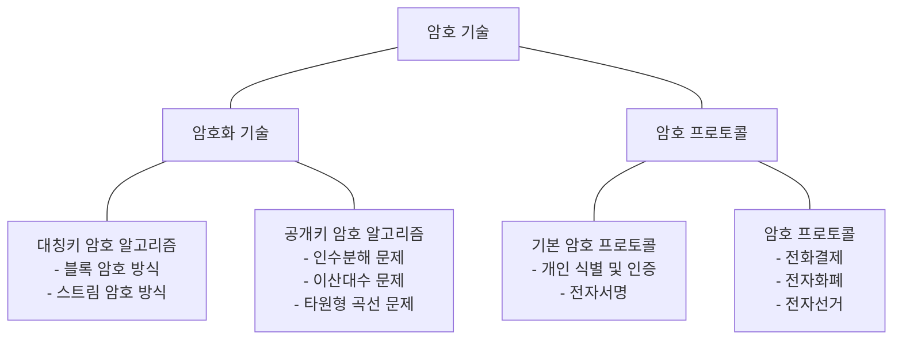

[그림 4] 암호기술의 분류

#### 라) 암호 알고리즘과 암호 시스템

① 암호 알고리즘

암호 키를 이용한 암호 알고리즘 기술은 [그림 5]와 같이 표현할 수 있다. 이 그림에서 P는 평문, E는 암호화 함수, K(KE,
KD)는 키 값이다. 공개키 방식에서와 같이 암호화 키와 복호화 키가 다를 수 있는데 이때는 각각 KE와 KD로 표현한다. 통
상 암호문이 전달되는 통로는 안전하지 않은 통신회선 또는 네트워크이므로, 송수신자의 입장에서 평문을 암호화시킨 결
과를 전달하는 것이 기밀성을 확보하는 방법이 된다.

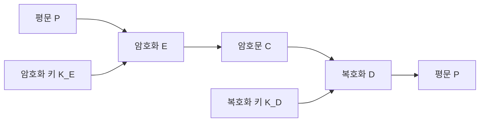

C = E(K<sub>E</sub>, P) / P = D(K<sub>E</sub>, C)

<!-- 원문의 복호화 식에 적힌 K_E 표기를 유지 -->

[그림 5] 암호 알고리즘

수신자는 누구나가 볼 수 있는 평문 P를 상대편에게 안전하게 전달하려고 한다. 송신자는 평문 P를 암호화 키 KE와 암호
화 알고리즘 E를 이용하여 암호문 C를 생성하여 수신자에게 전달한다. 암호문 C는 일반적으로 복호화 키를 모르는 상태
에서는 그 내용을 알 수 없는데 이를 계산적 불가라 부른다. 여기서 계산적 불가란 무한 시간을 투입하는 경우 복호화 키
를 모르더라도 평문 내용을 알아낼 수 있다는 의미이다. 공격자는 다양한 방법으로 평문의 내용을 얻으려 시도한다. 정당
한 수신자는 송신자가 전송한 암호문 C를 수신하여 복호화 키 KD와 복호화 알고리즘 D를 이용하여 송신자가 원래 전송
하려던 평문 P를 얻게 된다.

<!-- PDF page: 026 -->

② 암호 시스템

암호화하고 복호화하는 일련의 과정에 필요한 요소들을 모두 합쳐 암호 시스템이라 부르는데, 일반적으로 암호 시스템이
갖추어야 할 요건은 다음과 같다.

• 암호화 키에 의하여 암호화 및 복호화가 효과적으로 이루어져야 한다.

• 암호 시스템의 사용이 용이하여야 한다.

• 암호화 알고리즘보다는 암호 키에 의한 보안이 이루어져야 한다.

#### 마) 비밀키 암호와 공개키 암호 알고리즘

① 비밀키 암호 알고리즘

비밀키 암호 알고리즘은 암호화에 사용하는 암호화 키와 복호화에 사용하는 복호화 키가 동일하며, 키의 길이가 짧아도
되고 암호화와 복호화 연산의 속도가 빠르다는 장점이 있다.

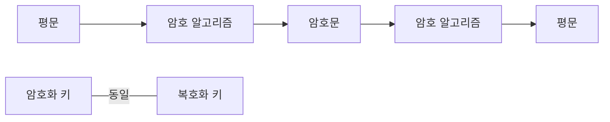

<!-- 생략: 그림 6의 열쇠 아이콘 -->

[그림 6] 비밀키 암호 알고리즘

그러나 송신자와 수신자 사이의 거리가 먼 경우 키를 공유하는 방법에 어려움이 있고, 암호화 통신을 필요로 하는 상대가
많을 경우 서로 다른 키를 생성하고 유지하는데 많은 부담이 따른다. 키를 비밀리에 보관하고 관리해야 한다는 측면에서
비밀키 암호 방식, 통상적으로 사용한다는 의미에서 관용 암호 방식이라고도 한다.
비밀키 암호 방식은 암호 알고리즘이 치환과 전치의 조합으로 구성되어 있어 연산 속도가 빠르다는 특성으로 키 공유의
어려움에도 불구하고 아직도 많이 애용되고 있다. 또한 이 방식은 평문 데이터를 처리하는 방식에 따라 〈표 2〉에서와 같이
블록 암호(Block Cipher)와 스트림 암호(Stream Cipher)로 구분된다.

〈표 2〉 블록 암호와 스트림 암호의 비교

<table>
<tr><td>구분</td><td>블록 암호화</td><td>스트림 암호화</td></tr>
<tr><td>동작 방식</td><td>평문을 블록이라고 부르는 고정길이의 입력으로 나누어 블록 단위로 암호화 수행</td><td>평문을 비트 단위로 암호화 수행</td></tr>
<tr><td>장점</td><td>구현이 용이</td><td>오류 확산의 위험이 낮음<br/>이동통신 환경에서 구현 용이</td></tr>
<tr><td>단점</td><td>오류 확산 위험이 높음<br/>초기값 설정 필요</td><td>느린 수행 시간<br/>악의적 공격자에 의해 쉽게 내용 변경이 가능</td></tr>
</table>

• 블록 암호 알고리즘
블록 암호 알고리즘은 비밀키를 이용하여 고정된 크기의 입력 블록을 고정된 크기의 출력 블록으로 변형하는 암호
알고리즘에 의해 암호화와 복호화 과정이 수행된다. 블록 암호 알고리즘에는 Feistel Network, DES(Data Encryption
Standard), AES(Advanced Encryption Standard), IDEA(International(Data Encryption Algorithm), SEED, ARIA 등이 있다.

<!-- PDF page: 027 -->

블록 암호 방식에 대한 주요 공격 기법들은 〈표 3〉과 같다.

〈표 3〉블록 암호 공격 기법

<table>
<tr><td>공격 기법</td><td>내용</td></tr>
<tr><td>차분 공격</td><td>선택 평문 공격 방법으로, 두 개의 평문 블록들의 비트의 차이에 대하여 대응되는 암호문 블록들의 비트 차이를 이용하여 암호화에 사용된 키를 찾아내는 공격 기법</td></tr>
<tr><td>선형 공격</td><td>평문 공격 방법으로, 암호 알고리즘 내부의 비선형 구조를 적절하게 선형화시켜 암호화 키를 찾아내는 공격 기법</td></tr>
<tr><td>전수 공격</td><td>암호화에 사용한 키의 모든 경우에 대하여 평문과 암호문을 대비하는 방법으로 암호화 키를 알아내는 공격 기법</td></tr>
<tr><td>통계적 분석</td><td>암호문에 대한 평문의 각 단어의 빈도에 관한 통계 자료를 포함하여 알려진 모든 통계적 자료를 이용하여 해독하는 공격 기법</td></tr>
<tr><td>수학적 분석</td><td>통계적 방법을 포함하며 수학적 이론을 이용하여 해독하는 공격 기법</td></tr>
</table>

• 스트림 암호 알고리즘
스트림 암호는 유럽을 중심으로 발달한 방식으로, 블록 단위로 암호화와 복호화를 수행하는 블록 암호와 달리 [그림 7]
에서와 같이 평문의 비트열과 키의 비트열의 비트 단위 XOR 연산으로 암호문을 생성하는 방식이다. 스트림 암호로는
RC4가 대표적이며, A5/1, A5/2 등의 알고리즘도 있다.

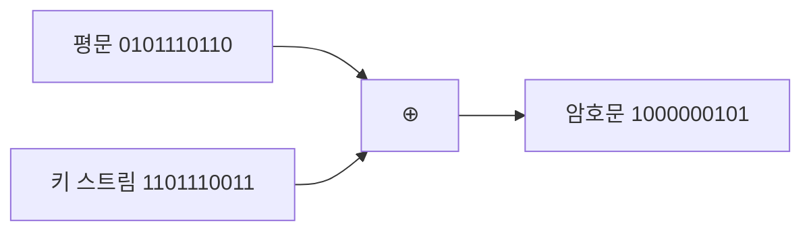

[그림 7] 스트림 암호 알고리즘

② 공개키 암호 알고리즘

공개키 암호 알고리즘은 1976년 디페와 헬만에 의해 공개키 암호의 개념이 도입되고 1978년 RSA라는 실용적인 공개키
암호 알고리즘이 개발된 이후 공개키 암호는 현대 암호를 이루는 중요한 요소가 되었다.

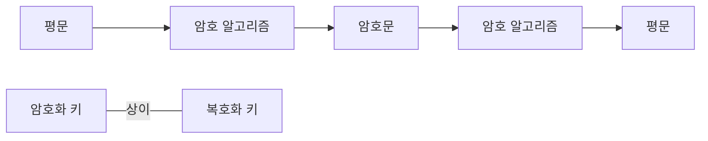

[그림 8] 공개키 암호 알고리즘

공개키 암호는 [그림 8]에서와 같이 비밀키 암호와 달리 송신자와 수신자가 서로 다른 키를 사용하여 비밀 통신을 수행하
게 된다. 송신자는 수신자의 공개키를 사용하여 데이터를 암호화한 결과를 네트워크를 통해 전송한다. 수신자는 자신의
공개키에 대응하는 개인키를 이용하여 암호화된 데이터를 복호화하여 평문을 복원한다.

<!-- PDF page: 028 -->

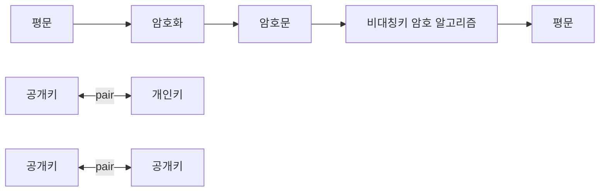

<!-- 원문 하단의 두 '공개키' 표기를 유지. 열쇠 아이콘 생략 -->

[그림 9] 공개키 암호 알고리즘의 키 메커니즘

공개키 암호 방식은 다른 사용자들과 키를 공유하지 않더라도 암호 알고리즘을 통한 안전한 통신을 할 수 있다는 장점을
가진다. 각 사용자는 자신에게 송신하기 위해 사용될 키(공개키라 부름)를 공개하고, 자신의 공개키로 암호화된 정보를 복
호화할 수 있는 키(개인키라 부름)를 비밀로 보유하고 있음으로써 누구나 암호화할 수 있지만 공개키에 대응되는 개인키
(Private Key)를 가진 당사자만 복호화할 수 있는 특징을 가진다. 예를 들어, n명의 사용자로 구성된 네트워크 환경에서 각
사용자는 공개키와 개인키 두 개를 보유하고 있으므로 네트워크 전체적으로 2n개의 키가 필요하며, 각 사용자는 자신의
개인키와 공개키 즉, 2개의 키만 보유하면 된다.
공개키 암호의 경우 모두가 확인할 수 있는 공개키에 대응되는 개인키가 각 사용자만 알고 있는 정보이기 때문에 다양한
인증 기능 및 안전한 키 교환 등에 활용될 수 있는 장점을 가진다. 대표적인 공개키 암호 알고리즘에는 RSA(Rivest, Shamir
and Adleman), 엘가말(ElGamal), ECC(Elliptic Curve Cryptosystem, 타원 곡선 암호 시스템) 등이 있다.

• RSA

RSA는 공개키 암호 시스템으로 암호화와 인증에 사용된다. 이 방식은 큰 정수의 인수분해의 어려움에 안전성을 두고 있
다. RSA에서는 암호화 과정에서 난수를 사용하지 않기 때문에 같은 메시지에 대한 암호문은 항상 같다는 특징이 있다.
RSA 방식의 안전성은 소수 p와 q에 의존하므로, 소수의 선택 조건이 중요하다.

• 엘가말
이산대수 문제의 어려움에 기반을 둔 최초의 공개키 암호 알고리즘인 엘가말은 1984년 스탠퍼드 대학의 암호 학자 T. 엘
가말(ElGamal)에 의해 제안되었다. 엘가말로 암호화하면 메시지의 길이가 두 배로 늘어나는 특징이 있다. 하지만 암호화
할 때 난수를 이용하므로 같은 메시지에 대해 암호화하여도 암호화할 때마다 서로 다른 암호문을 얻게 되는데, 이것이
정보보안 측면에서 큰 장점이 된다.

• ECC

타원 곡선(Elliptic Curves) 암호 방식은 타원곡선 상의 이산대수 문제에 기반한 것으로 안전성이 높고 속도가 빨라서 새
로운 공개키 암호 방식으로 각광받고 있다. 예를 들어 RSA의 1024비트의 키와 타원곡선 암호의 160비트의 키는 같은 수
준의 안전도를 갖는 것으로 알려져 있다. 또한, ECC는 전원의 양이 한정된 휴대폰 등과 같은 이동 통신 기기의 암호화에
적합한 방식이다.

<!-- PDF page: 029 -->

③ 비밀키 암호 알고리즘과 공개키 암호 알고리즘의 비교

〈표 4〉는 비밀키 암호 방식과 공개키 암호 방식을 비교한 결과이다.

〈표 4〉 비밀키 암호와 공개키 암호의 비교

<table>
<tr><td>구분</td><td>비밀 암호</td><td>공개키 암호</td></tr>
<tr><td>키의 관계</td><td>암호화 키 = 복호화 키</td><td>암호화 키 ≠ 복호화 키</td></tr>
<tr><td>암호화 키</td><td>비공개</td><td>공개</td></tr>
<tr><td>복호화 키</td><td>비공개</td><td>비공개</td></tr>
<tr><td>알고리즘</td><td>공개</td><td>공개</td></tr>
<tr><td>키의 수</td><td>n(n−1)/2</td><td>2n</td></tr>
<tr><td>1인당 관리해야 할 키</td><td>n−1</td><td>1</td></tr>
<tr><td>암호화 속도</td><td>고속</td><td>저속</td></tr>
<tr><td>인증(전자서명)</td><td>복잡</td><td>간단</td></tr>
<tr><td>장점</td><td>빠른 암호화/복호화 시간<br/>키 길이가 짧음</td><td>키 분배 용이<br/>관리해야 할 키의 수 적음<br/>인증 등 다양한 분야에 활용</td></tr>
<tr><td>단점</td><td>사용자 수의 증가에 따라 관리해야 할 키의 수가 증가<br/>키 변화의 빈도가 높음</td><td>느린 암호화/복호화 시간<br/>키 길이가 김<br/>키 변화 빈도가 낮음</td></tr>
</table>

#### 바) 해쉬 함수(Hash Function)

① 해쉬 함수의 개념

해쉬 함수 또는 해쉬 알고리즘(Hash Algorithm)은 [그림 10]과 같이 다양한 크기를 갖는 임의의 데이터로부터 고정된 길이
의 짧은 해쉬 값(해쉬 코드)을 출력하는 수학적 함수이다. 다시 말해서 해쉬 함수는 임의의 길이를 갖는 입력 비트열을 고
정된 짧은 길이로 함축하는 기능이라고 볼 수 있다. 예를 들어 HAS-160(Hash Algorithm Standard 160), SHA-1의 경우 160
비트의 결과를 출력한다.

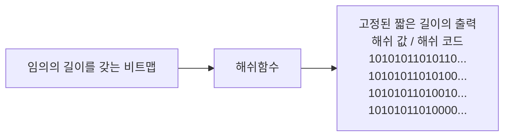

<!-- 생략: 그림 10의 영상·음악·그림·사진 및 기계·도장 아이콘 -->

[그림 10] 해쉬 함수

암호 알고리즘에는 키가 사용되지만 해쉬 함수는 키를 사용하지 않으므로 같은 입력에 대해서는 항상 같은 출력이 나오게
된다.이러한 특성을 갖는 해쉬 함수를 사용하는 목적은 입력 메시지에 대한 변경할 수 없는 증거값을 추출하여 메시지의
오류나 변조를 탐지할 수 있는 무결성을 검증하는 데 있다.

<!-- PDF page: 030 -->

② 해쉬함수의 성질

해쉬 함수는 동작 알고리즘이 간단하기 때문에 함수 h와 입력 x가 주어졌을 때, h(x)를 계산하는 것이 용이하며, 상대적으
로 CPU, 메모리 같은 시스템 자원을 덜 소모하는 특성이 있다. 또한 안정성 측면에서 해쉬 함수는 〈표 5〉의 기본 성질을
만족하여야 한다.

〈표 5〉 해쉬 함수의 기본 성질

<table>
<tr><td>성질</td><td>특징</td></tr>
<tr><td>역상 저항성</td><td>y가 주어졌을 때 h(x)=y 가 되는 x를 찾기가 어려움</td></tr>
<tr><td>제 2 역상 저항성</td><td>h(x)=y인 x, y가 있을 때 h(x&#x27;)=y(단 x≠x&#x27;)가 되는 x&#x27;를 찾는 것이 어려움</td></tr>
<tr><td>충돌 저항성</td><td>h(x)=h(x&#x27;)인 x와 x&#x27;(단 x≠x&#x27;)를 찾는 것이 어려움</td></tr>
</table>

해쉬 함수는 해쉬 값을 이용하여 원래의 문장을 복원할 수 없다는 특징 때문에 보안 분야에서 널리 활용된다. 즉, 해쉬 값
을 통해 원문을 복원하는 것은 계산적으로 불가능하다.
따라서 패스워드와 같은 민감한 자료들을 안전하게 저장할 때 주로 사용하지만, 서로 다른 두 개의 입력값에 대해 동일한
결과를 출력하는 해쉬 충돌을 이용한 우회적 공격이 가능하다.

③ 해쉬 함수의 종류

• MD5(Message Digest Algorithm 5)
MD5는 프로그램이나 파일의 무결성 검사 등에 사용되는 128비트 해쉬 함수이다. IETF의 RFC 1321로 지정되어 있으나
다수의 중요 결함이 발견되어 현재는 해쉬 용도로 SHA-2와 같이 다른 안전한 알고리즘을 사용할 것을 권장하고 있다.
MD5는 흔히 패스워드 저장에 많이 사용되는데, 패스워드를 MD5로 해쉬한 결과값을 저장한다. 따라서 서버 운영자나 제
3자가 시스템에 저장된 패스워드의 해쉬 결과값만으로는 원래의 패스워드를 알 수 없게 된다. 만일 사용자가 패스워드
를 정확하게 입력했다면 동일한 해쉬 값이 출력되기 때문에, 올바른 패스워드라는 것을 확인할 수는 있는 것이다.

• SHA(Secure Hash Algorithm)
MD5에서 발전한 SHA는 서로 연관된 해쉬 함수들의 집합을 의미한다. 미국 국가안보국(NSA)이 1993년에 처음으로 설계
했으며 미국 국가 표준으로 지정되었다. 최초의 함수를 나중에 설계된 함수들과 구별하기 위하여 SHA-0이라고도 불린
다. 2년 후 SHA-0의 변형인 SHA-1이 발표되었으며, 그 후에 4종류의 변형, 즉 SHA—224, SHA—256, SHA—384, SHA-
512가 더 발표되었다. 이들을 통칭해서 SHA—2라고 한다. 현재는 SHA-1과 2와는 완전히 다른 SHA—3을 개발 중이며,
2012년 SHA—3로 확정되었다.
SHA-0과 SHA-1은 160비트의 해쉬 값 크기를 가지며 SHA-224/256/384/512는 각각 224/256/384/512 비트의 해쉬
값을 제공한다. 또한, 안전한 해쉬 함수를 이용하기 위하여 SHA-256이상의 해쉬 함수를 사용할 것을 권고한다. 한편
SHA—2에 대한 공격은 아직 발견되지 않았으나 SHA—2 함수들이 SHA-1과 비슷한 방법을 사용하기 때문에 공격이 발견
될 가능성이 있다.

④ 해쉬 함수의 보완

솔트(Salt)는 해쉬 함수에서 해쉬 값을 생성할 때 추가되는 임의의 비트열이다. 원본 메시지에 비트열을 추가하여 해쉬 값
을 생성하는 것을 솔팅(Salting)이라 한다. 예를 들어 [그림 11]과 같이 패스워드 “@Kr5792cc”에 솔트인 “topcit”을 추가하여
해쉬 값을 생성할 수 있다.

<!-- PDF page: 031 -->

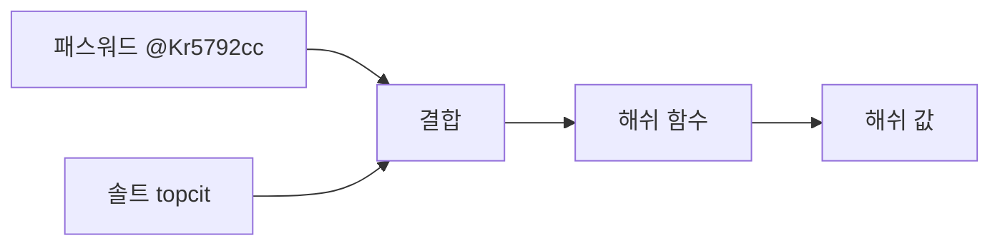

[그림 11] 해쉬함수와 솔트(Salt)

솔팅 방법을 사용하면, 공격자가 패스워드 “@Kr5792cc”의 해쉬 값을 알아내더라도 솔팅된 해쉬 값을 대상으로 패스워드 일
치 여부를 확인하기 어렵다. 또한 사용자별로 다른 솔트를 사용한다면 동일한 패스워드를 사용하는 사용자의 해쉬 값이 서로
다르게 생성되어 인식 가능성 문제가 크게 개선된다.
솔트와 패스워드의 해쉬 값을 서버의 데이터베이스에 저장해 놓고, 사용자가 로그인할 때 입력한 패스워드를 해쉬 처리하여
일치 여부를 확인할 수 있다. 이 방법을 사용할 때에는 모든 패스워드가 고유의 솔트를 가져야 하고, 솔트의 길이는 32바이트
이상이 되어야 솔트와 다이제스트를 추측하기 어렵다고 알려져 있다.

⑤ 해쉬 함수의 활용

• 무결성 검증 방식
서버나 네트워크 보안에서 무결성 검증 방식은 〈표 6〉에서와 같이 데이터 전송 중 발생하는 오류를 검출하는 방식
과 임의의 변경을 방지하는 방식으로 구분된다. 데이터 전송 중 발생하는 오류로 인한 무결성 검사 방식에는 체크섬
(Checksum)과 순환중복검사(CRC: Cyclic Redundancy Check) 등이 있는데, 체크섬은 중복검사의 한 형태로 추가적인
데이터를 더하여 체크섬 값을 얻은 후 이를 일정한 비트 값으로 변환하여 메시지에 추가하고 이를 근거로 무결성을 검
사하는 방식이다.
순환중복검사는 주로 인터넷 등의 통신 시스템에서 전송 데이터 오류검증 방법으로 사용하는데, 오류 검출과 정정에 용
이한 다항식을 기반으로 송신 쪽에서 체크섬을 계산하여 헤더에 추가하여 보내면 수신 쪽에서 다시 동일한 다항식을 기
반으로 계산하고 보내진 체크섬과 비교하는 방식으로 무결성을 검증한다.

〈표 6〉 무결성 검증 방식

<table>
<tr><th>변경 원인</th><th>해결 방안</th></tr>
<tr><td>데이터전송 오류</td><td>• 체크섬<br/>• 순환중복검사<br/>✓ 데이터 검증 시 사용<br/>✓ 고정 길이의 숫자 값 생성</td></tr>
<tr><td>임의 변경</td><td>• 해쉬 함수<br/>✓ MD5<br/>- 순환중복검사의 확장<br/>- MD2~4의 보완<br/>- 128비트 해쉬 함수<br/>- SHA-1 사용 추천<br/>✓ SHA-1<br/>- MD5 대체 및 확장<br/>- 보안 프로토콜, 프로그램에서 사용<br/>✓ SHA-2<br/>- SHA265~512를 통칭<br/>- SHA1에 대한 공격법 존재</td></tr>

</table>

<!-- PDF page: 032 -->

• 파일의 무결성
김 대리는 무결성 보장을 위해 인터넷 상에서 파일을 전송하거나 홈페이지에 올릴 경우 해쉬 함수를 이용하여 계산한
해쉬 값을 함께 전송해서 변조된 파일이 아님을 확인할 수 있는 방법을 확보하였다. 또한 김 대리가 서버에 관리하던 중
요한 소스 파일 역시 파일의 목록을 만든 다음에 각 파일에 대한 해쉬 값을 저장해 두고, 일정시간 간격으로 파일 목록
에 대한 해쉬 값을 가져와서 처음 만들어 놓은 해쉬 값과 비교하는 형태로 변조 여부를 [그림 12]에서와 같이 관리하기로
하였다.

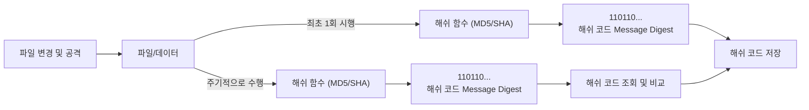

[그림 12] 서버 파일 무결성 검사

그러나, 이러한 주기적인 무결성 검사로는 검사 주기 사이에 발생한 보안사고는 찾아낼 수 없다. 무결성 검사 주기가 짧으
면 짧을수록 좋겠지만 파일의 개수가 많아지면 파일마다 해쉬 값을 만들고 비교하는 것이 서버의 부하를 증가시키기 때문
에 효과적인 방법은 아니다.
주기적인 무결성 검사 방법을 대체하는 방법은 커널 수준에서 실시간 탐지가 가능한 무결성 기법의 도입이다. 즉 무결성
검사는 최초 1회에만 수행하고 이후 해당 파일이 실행되거나 메모리에 적재될 때마다 검사하여 실시간으로 파일 변조 여
부를 검사하는 방식이 효과적이다. 이로써 지속적인 CPU 부하가 발생하지 않으며 변조된 실행 파일이 메모리에 적재되는
것을 차단할 수 있다.

• 전송 과정에서의 무결성
네트워크에서 전송되는 메시지에 대한 무결성 또한 중요한 보안 사항이다. [그림 13]에서처럼 해커는 전달되는 메시지를
가로채 변조할 수 있다. 전송된 메시지에 대한 무결성 검사를 위해 송신자는 메시지에 대한 해쉬 값을 생성하고 이를 메
시지와 함께 전송하며, 수신자는 메시지 수신 즉시 메시지의 무결성 검사를 수행하고 만약 변조 되었다면 해당 메시지를
무시하면 된다.
송신자의 신분에 대한 인증이 필요없고 데이터가 전송 중 변조되지 않았다는 무결성만 필요한 경우에는 해쉬 함수를 메
시지인증코드(MAC: Message Authentication Code)라는 형태로 사용할 수 있다. 송신자가 메시지를 입력하여 해쉬 값을
계산하면 메시지인증 코드가 된다. 메시지와 함께 이 메시지인증코드를 함께 보내면 수신자는 메시지가 통신 도중 변조
되지 않았다는 확신을 가질 수 있다.

<!-- PDF page: 033 -->

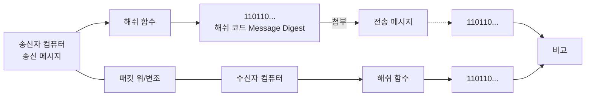

<!-- 생략: 그림 13의 컴퓨터·문서·공격·저울 아이콘 -->

[그림 13] 전송 파일의 무결성 검사

• 패스워드를 기초로 한 암호화
해쉬 함수와 암호화는 모두 패스워드를 효과적으로 숨기는 기술이나, 암호화 알고리즘이 암호화되지 않은 평문을 암호
화한 뒤에 이를 다시 복호화할 수 있는 반면, 해쉬 함수는 결과값을 이용한 원래값을 찾는 것이 불가능하다는 차이점이
있다.
해쉬 함수는 패스워드를 기초로 한 암호화(PBE: Password Based Encryption)에 사용될 수 있다. PBE에서는 패스워드와
솔트(의사난수 생성기를 이용하여 생성한 난수)를 결합한 결과를 해쉬 함수에 입력하여 얻은 해쉬 값을 암호화 키로 사
용한다. 이 방법을 이용하여 패스워드에 대한 공격을 막을 수 있다.

• 전자 서명
해쉬 함수는 전자서명에 사용될 수 있다. 서명자가 특정 문서에 자신의 개인키를 이용하여 해쉬 연산을 함으로써 데이
터의 무결성과 서명자의 인증성을 함께 제공하는 방식이다. 메시지 전체에 대해 직접 서명하는 것은 공개키 연산을 모든
메시지 블록마다 반복해야 하기 때문에 매우 비효율적이며 따라서 메시지에 대한 해쉬 값을 계산한 후 이것에 대해 서
명함으로써 매우 효율적으로 전자서명을 생성할 수 있다. 서명자는 메시지 자체가 아니라 해쉬 값에 대해 서명을 하였지
만 같은 해쉬 값을 가지는 다른 메시지를 찾아내는 것이 어렵기 때문에 이 서명은 메시지에 대한 서명이라고 인정된다.

### 02 인증 기술

#### 가) 인증(Authentication)의 개념

인증이란 정보의 주체가 되는 송신자와 수신자 간에 교류되는 정보의 내용이 변조 또는 삭제되지 않았는지, 그리고 주체
가 되는 송, 수신자가 정당한지를 확인하는 방법을 말한다. 즉, 인증은 메시지 인증과 사용자 인증으로 나눌 수 있다.

<!-- PDF page: 034 -->

① 사용자 인증(User Authentication)

[그림 14]에서와 같이 네트워크상에서 사용자가 자신이 진정한 사용자라는 것을 상대방에게 증명할 수 있도록 하는 기능
을 말한다. 반면 제3자가 위장을 통해 사용자 행세를 하는 것이 불가능해야 한다.

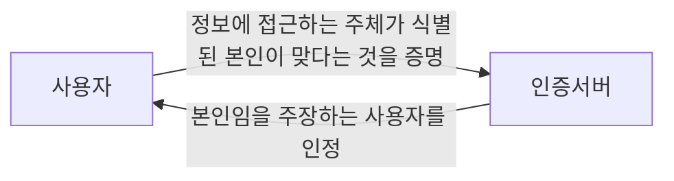

<!-- 그림 14의 사용자 아이콘을 사용자 노드로 표시 -->

[그림 14] 사용자 인증

사용자 인증은 신원확인(Identification)이라고도 하는데 서버에 로그인하는 경우 등 사용자의 신분을 확인하고 정보서비스
를 이용할 수 있는 권한을 부여해주기 위해 사용된다. 일단 사용자 인증을 통과하면 원격 접속자가 해당 사용자로서의 모
든 권한을 수행할 수 있기 때문에 중요한 서비스를 제공하는 서버의 입장에서는 원격 접속자에게 엄격한 인증절차를 거치
도록 요구해야 한다.

② 메시지 인증(Message Authentication)

전송되는 메시지의 내용이 변경이나 수정되지 않고 본래의 정보를 그대로 가지고 있다는 것을 확인하는 것을 말한다. 전
송되는 메시지에 대해 메시지가 변경되지 않았다는 사실과 누가 보낸다는 사실을 함께 증명하는 것은 전자서명을 통해 달
성할 수 있다.

#### 나) 인증방식의 유형

사용자가 가지고 있는 지식을 이용하는 방법, 사용자가 가진 물건을 이용하는 방법, 사용자 자신의 신체적인 특징을 이용
하는 방법 등이 있다.

• 지식 기반 인증
사용자가 알고 있는 정보(What you know)에 기반한 방법으로 PIN(Personal Identification Number), 패스워드, 계좌번호
등의 수단을 사용하는 인증 방식이다.

• 소유기반 인증
사용자가 소유하고 있는 도구(What you have)에 기반한 방법으로 OTP(One Time Password), 스마트카드, 카드 키(Key)
등의 수단을 사용하는 인증 방식이다.

• 존재기반 인증
사용자의 신체나 신체의 특징에 기반(What you are)한 방법으로 홍채인식, 지문인식, 음성인식, 얼굴인식 등의 수단을 사
용하는 인증 방식이다.

#### 다) 인증기술의 종류

① 패스워드 인증

• 패스워드 인증의 개요
사용자가 미리 패스워드를 설정한 후, 인증 시 입력된 패스워드와 설정된 패스워드를 비교하여 사용자를 인증하는 방식

<!-- PDF page: 035 -->

으로, 가장 널리 사용되는 인증 기술이지만 [그림 15]에서와 같이 가장 안전하지 않은 인증기술이기 때문에 사용시 세심
한 주의가 필요하다.

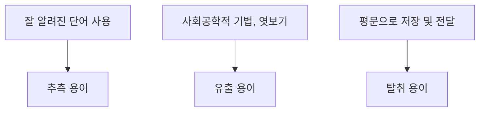

[그림 15] 패스워드 인증방식의 취약성

• 패스워드 정책
패스워드의 생성은 대문자, 소문자, 숫자, 특수문자를 조합하여 적어도 8자리 이상으로 생성하며, 사용자는 쉽게 기억할
수 있고 공격자는 추측이 어려워야 한다.
패스워드를 평문 상태로 패스워드를 저장하거나, 양방향 암호 알고리즘이 아닌 해쉬 함수를 사용하여 저장해야 하며, 인
증 시스템은 실패한 로그인 시도 횟수를 제한해야 한다.

• 패스워드에 대한 공격 기법
패스워드에 대한 공격 기법: 패스워드에 대한 공격은 무차별공격(Brute Force Attack), 사전공격(Dictionary Attack), 트로
이목마, 패스워드 파일에 대한 직접접근 및 사회공학적 기법 등이 있음

• 패스워드 공격에 대한 대응 방안
패스워드 발생기 사용, 로그인 실패 횟수 제한, 주기적 패스워드 변경, 사전공격 및 무차별 공격탐지를 위한 침입탐지시
스템(IDS) 사용, 보안인식교육, OTP 사용 등과 같은 다양한 대응 방안을 구현하여 활용

② OTP(One Time Password)) 인증

• OTP의 개념
OTP란 인증 시스템에서 사용자 인증을 위하여 사용하는 방법 중 하나로 매 세션마다 일회용 패스워드를 생성하여 입력
하는 일회용 패스워드 생성기를 사용하는 인증기술

• OTP의 종류
OTP의 종류는 〈표 7〉과 같이 크게 동기식과 비동기식으로 구분

〈표 7〉 OTP의 종류

<table>
<tr><th></th><th>구분</th><th>내용</th></tr>
<tr><td>동기식<br/>(Sync)</td><td>시도-응답<br/>(Challenge-Response)</td><td>인증서버에서 난수를 생성하여 클라이언트에 전송하고, 난수를 입력값으로 하여 일회용 비밀번호를 생성</td></tr>
<tr><td rowspan="2">비동기식<br/>(Async)</td><td>시간 동기화<br/>(Time-Synchronous)</td><td>인증서버와 클라이언트 간 시간을 동기화하고, 시간을 입력값으로 하여 일회용 비밀번호를 생성</td></tr>
<tr><td>이벤트 동기화<br/>(Event-Synchronous)</td><td>인증서버와 인증 횟수(Counter) 기록을 공유하고, 인증 횟수를 입력값으로 하여 일회용 비밀번호를 생성</td></tr>

</table>

<!-- PDF page: 036 -->

시간 동기화 방식의 OTP의 동작절차는 [그림 16]에서와 같다.

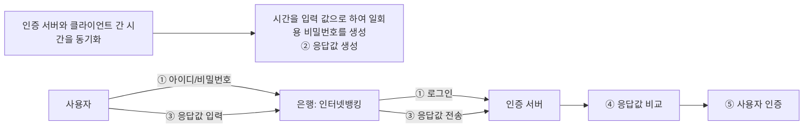

[그림 16] 시간 동기화 방식의 동작 절차

③ 생체(Biometric) 인증

• 생체인증의 개념
사람의 측정 가능한 신체적 또는 행동적 특성을 자동화된 장치인 센서로 추출하여 인증수단으로 활용하기 위한 인증기술

• 생체인증의 특성
보편성: 누구나 갖고 있는 생체적 특성
유일성: 개개인을 구분할 수 있는 고유한 특성
획득성: 센서로부터 측정되어 정량화될 수 있는 특성
영속성: 변하지 않고 변경이 되지 않는 특성
정확성: 환경변화와 무관한 인증 정밀도를 요구하는 특성
수용성: 생체정보 추출/사용 과정에 대한 거부감이 없어야 하는 특성

• 생체인증의 종류
생체인증의 종류는 〈표 8〉과 같이 크게 신체 정보를 이용한 방식과 행동 특성을 이용한 방식으로 구분

〈표 8〉 생체 인증의 종류

<table>
<tr><th>구분</th><th>종류</th><th>설명</th></tr>
<tr><td rowspan="5">신체</td><td>지문</td><td>반도체, 광학, 혼합 방식이 있으며, 시장 점유율이 가장 높음</td></tr>
<tr><td>홍채</td><td>매우 정확하고 신속하나 고가의 생체인식 시스템이 필요함</td></tr>
<tr><td>얼굴</td><td>얼굴은 인식정보를 담고 있고 전달해주는 가장 자연스러운 인증 방법</td></tr>
<tr><td>정맥</td><td>정맥의 형태를 인식하여 파악하는 패턴인식</td></tr>
<tr><td>DNA</td><td>가장 정확한 인증 방법</td></tr>
<tr><td rowspan="2">행동</td><td>서명</td><td>일정한 패턴을 지니고 있으므로 최종 서명 형태뿐만 아니라, 손의 움직임에 대한 일종의 궤도에 의해서 식별 가능</td></tr>
<tr><td>음성</td><td>주로 물리적 접근 제어 애플리케이션에서 많이 사용함</td></tr>
</table>

<!-- PDF page: 037 -->

• 생체인증의 처리과정
생체인증 시스템은 [그림 17]에서와 같이 '생체정보 등록 시스템'과 '생체인증 시스템'으로 구성되며, 사전에 사용자의 생
체정보를 생체정보 DB에 저장한 후, 인증 시 저장된 생체정보 DB와 사용자로부터 추출된 생체인증 정보를 비교하여 인
증 수행

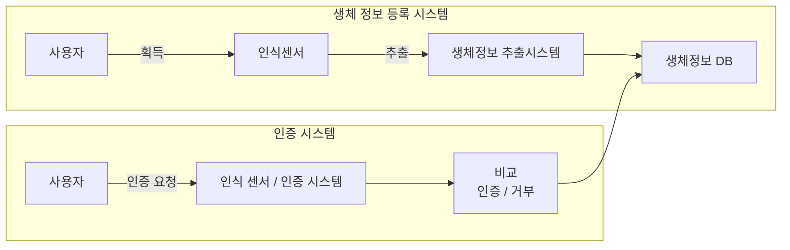

<!-- 생략: 그림 17의 인증/거부 순환 화살표의 공간 배치 -->

[그림 17] 생체 인증의 과정

④ 멀티팩터(multi factor) 인증

[그림 18]에서 보는 바와 같이 멀티팩터 인증이란 단일 인증방식의 취약점을 보완하기 위하여 복수 개의 인증 기술을 조합
하여 인증의 보안성을 향상시킨 방식으로

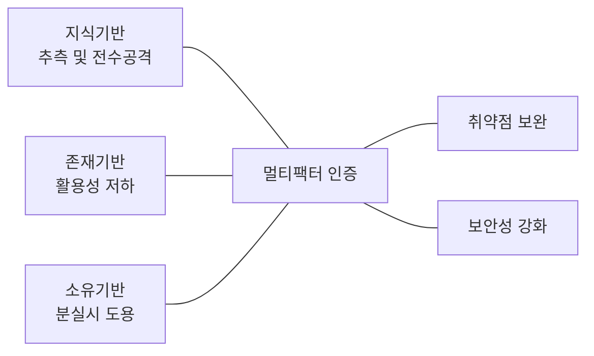

[그림 18] 멀티팩터 인증의 개념

보다 강력한 멀티팩터 인증 시스템을 구현하기 위하여 OTP + 지문인식 등의 사례와 같이 지식, 소유, 존재기반의 인증기
술들을 다양하게 혼합하여 사용하는 것이 바람직한 인증 시스템의 구현이라고 볼 수 있다.

#### 라) 전자서명

① 전자서명의 개념

암호기술의 인증기능을 이용해 전자문서에 서명이 가능하게 하는 기술이 [그림 19]에서 보이는 전자서명이다. 공개키 암호
기술이 가지는 인증기능을 이용해 서명자의 신분을 인증하고 서명대상인 전자문서의 인증을 동시에 수행하도록 하여 전
자서명 효과를 얻을 수 있다.
공개키 암호 방식의 기본 가정은 공개키에 대해 쌍이 되는 개인키(비밀키)는 사용자(소유자)가 안전하고 비밀스럽게 보관
한다는 것이다. 이러한 환경에서 개인키를 이용하여 어떤 서명 연산을 한다면 이것은 개인키를 가지고 있는 해당 사용자
만이 가능한 작업이며 이 결과는 그 사용자의 서명으로 인정할 수 있는 것이다.
공개키 암호 기술을 이용하여 송신자는 전달하고자 하는 메시지와 메시지의 해쉬 값인 메시지 다이제스트(Message

<!-- PDF page: 038 -->

Digest)를 개인키로 암호화한 결과인 전자서명을 함께 전달하고, 수신자는 수신한 전자서명을 송신자의 공개키로 복호화
한 결과와 수신한 메시지를 이용하여 계산한 메시지 다이제스트 값을 비교하여 송신자의 인증, 부인방지 및 메시지 무결
성 등을 확인한다.

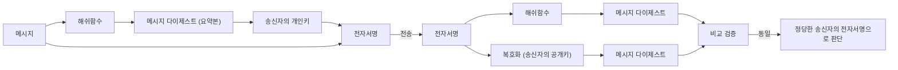

<!-- 그림 19의 전송 묶음에 적힌 '전자서명' 표기를 유지 -->

[그림 19] 전자서명의 개념

② 안전한 전자서명 알고리즘의 요건

• 위조 방지: 정당한 서명자 이외의 타인은 서명을 위조할 수 없어야 함

• 사용자 인증: 전자서명으로부터 서명자가 누구인지 확인할 수 있어야 함

• 부인 방지: 서명자는 문서에 서명한 사실을 부인할 수 없어야 함

• 변조 방지: 한번 서명한 문서의 내용을 변경할 수 없어야 함

• 재사용 방지: 하나의 서명은 다른 문서의 서명으로 재사용 할 수 없음

③ 전자서명의 동작

전자서명의 동작은 〈표 9〉에서와 같이 크게 6단계 절차로 이루어진다.

〈표 9〉 전자서명의 동작 절차

<table>
<tr><td>순서</td><td>설명</td></tr>
<tr><td>1단계</td><td>송신자는 송신할 메시지에 대해 해쉬 알고리즘을 적용하여 고정길이 문자열인 메시지 다이제스트를 생성</td></tr>
<tr><td>2단계</td><td>송신자는 생성된 메시지 다이제스트를 자신의 개인키를 이용하여 암호화하여 전자서명을 생성</td></tr>
<tr><td>3단계</td><td>송신자는 송신 메시지와 전자서명을 수신자에게 전송</td></tr>
<tr><td>4단계</td><td>수신자는 수신한 전자서명을 송신자의 공개키를 이용하여 복호화함으로써 송신자가 생성한 메시지 다이제스트를 추출</td></tr>
<tr><td>5단계</td><td>수신자는 수신한 메시지에 송신자와 동일한 해쉬 알고리즘을 적용하여 새로운 메시지 다이제스트를 생성</td></tr>
<tr><td>6단계</td><td>수신자는 송신자에게 받은 메시지 다이제스트와 자신이 생성한 메시지 다이제스트를 비교하여, 동일한 경우 정당한 송신자의 전자서명으로 판단</td></tr>
</table>

<!-- PDF page: 039 -->

#### 마) PKI(Public Key Infrastructure)

① PKI 정의

PKI는 안전한 거래를 위해 필요한 암호화, 인증 등에 필수 요소라 할 수 있는 공개키 관리를 위한 기반 구조로서 정보보안
서비스를 제공해 주는 암호화 및 복호화 키와 인증서(Certificate)를 안전하게 분배하기 위한 기반 구조이다. PKI는 정보시
스템 보안, 전자상거래 등 안전한 통신을 원하는 여러 응용 분야에서 인증서의 사용 및 암호화 통신을 용이하도록 하는 정
책, 수단, 도구 등을 수립하고 제공하는 객체들의 네트워크 구조이다.

② PKI 구성 요소

공개키 기반 구조는 〈표 10〉에서 보는 것처럼 정책승인기관(PAA), 정책인증기관(PCA) 인증기관(CA), 등록기관(RA) 및 공인
인증서(Certificate) 등으로 구성된다.

〈표 10〉 공개키 기반 구조의 구성 요소

<table>
<tr><td>구성</td><td>세부내용</td></tr>
<tr><td>정책 승인 기관(PAA)</td><td>PKI 전반에 사용되는 정책과 절차를 생성하여 수립(행정안전부)</td></tr>
<tr><td>정책 인증 기관(PCA)</td><td>정책승인기관에서 승인된 정책에 대한 세부정책 수립(한국인터넷진흥원)</td></tr>
<tr><td>인증기관(CA)</td><td>사용자의 공개키 인증서 발행, 인증서 폐기 목록 관리 (한국정보인증, 코스콤, 금융결제원, 한국전자인증, 한국무역정보통신)</td></tr>
<tr><td>등록기관(RA)</td><td>인증기관의 업무 대행, 공인인증서 등록 신청서 접수(은행, 증권사)</td></tr>
<tr><td>인증서 소유자</td><td>인증서를 발급받고, 전자문서에 서명하고 암호화를 하는 공개키 인증서의 소유자</td></tr>
<tr><td>사용자</td><td>인증기관의 공개키를 이용하여 인증경로 및 전자서명을 검증하는 사용자</td></tr>
<tr><td>공개키 인증서(Certificate)와 CRL 저장소</td><td>X. 509 v3 표준을 준수하는 인증서 표준을 사용<br/>전자서명 검증 키와 소유자 관계를 증명해 주는 전자적 파일<br/>폐기된 인증서들의 목록을 관리하기 위한 CRL 저장소</td></tr>
</table>

③ PKI의 운영

사용자가 등록기관(RA)의 지점에서 가입신청 및 신원확인 완료 후 등록기관(RA)에 인증서 발급요청을 하면 등록기관(RA)
은 인증기관(CA)에 발급등록 요청 정보를 송신한다. 인증기관(CA)은 인증기관(CA)의 개인키로 서명한 인증서를 발행하여
디렉터리 서버에 게시하고 등록기관(RA)을 통하여 사용자에게 전달한다. 사용자는 발급 받은 인증서를 PC의 하드디스크
나 이동식 디스크에 저장하여 금융거래 및 전자 상거래 등에서 사용하게 되는데, 이때 금융기관에서는 공인인증기관을 통
하여 인증서 검증을 수행한다. 공개키 기반 구조의 참가자들과 이들간의 업무 흐름은 [그림 20]과 같다.

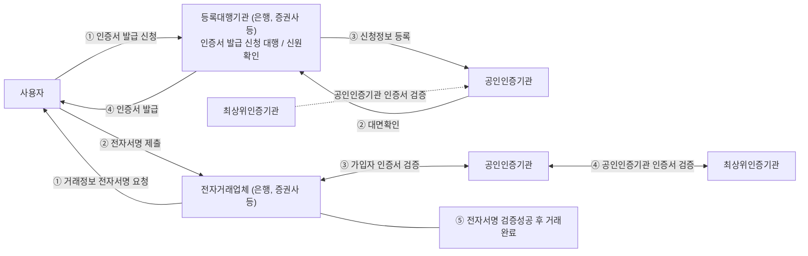

<!-- 생략: 그림 20 중앙 인증서 프로그램 화면과 사용자 삽화 -->

[그림 20] PKI의 참가 요소들과 업무 흐름

<!-- PDF page: 040 -->

④ PKI에서의 전자서명과 암호화

PKI 환경 즉, 송신자와 수신자 모두가 공인인증서 암호체계를 운용하고 있을 때, 사용자 인증과 메시지 기밀성을 목적으
로 활용하는 과정은 [그림 20]에, 송신 측과 수신 측의 주요 동작 단계에 대한 설명은 〈표 11〉에 있다. [그림 21]에서 세션키
(Session Key)란 메시지에 대해 비밀키 방식을 적용하기 위해 송신자가 생성한 일회용 비밀키로, 이 키를 안전하게 전송하
기 위해 수신자의 공개키를 이용하여 암호화시켜 전달한다. 이 암호화시킨 세션키를 전자봉투라 한다.

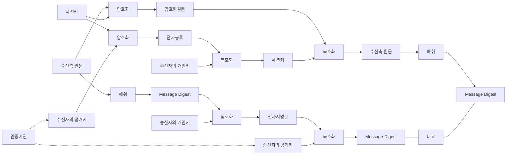

[그림 21] 공개키 기반 구조에서의 전자서명 및 암호화 처리 절차

〈표 11〉 송신 측과 수신 측의 동작 단계

<table>
<tr><th>구분</th><th>순서</th><th>설명</th></tr>
<tr><td rowspan="4">송신 측</td><td>1단계</td><td>메시지 원문에 해쉬 알고리즘을 적용하여 메시지 다이제스트 생성</td></tr>
<tr><td>2단계</td><td>생성된 메시지 다이제스트에 공개키 암호화 알고리즘을 적용하여 송신자의 개인키로 암호화 (전자서명 생성)</td></tr>
<tr><td>3단계</td><td>메시지 원문에 비밀키 암호화 알고리즘을 적용하여 세션키로 암호화</td></tr>
<tr><td>4단계</td><td>암호화에 사용된 세션키를 수신자의 공개키로 암호화(전자봉투)</td></tr>
<tr><td rowspan="5">수신 측</td><td>1단계</td><td>전자서명문을 송신자의 공개키로 복호화하여 메시지 다이제스트 생성</td></tr>
<tr><td>2단계</td><td>암호화된 세션키를 수신자의 개인키로 복호화하여 세션키 추출</td></tr>
<tr><td>3단계</td><td>추출된 세션키를 이용하여 암호화된 원문의 복호화</td></tr>
<tr><td>4단계</td><td>복호화된 원문에 해쉬 알고리즘을 적용하여 메시지 다이제스트 생성</td></tr>
<tr><td>5단계</td><td>생성된 두 메시지 다이제스트의 비교</td></tr>
</table>

<!-- PDF page: 041 -->

⑤ 공개키 인증서

공개키 인증서는 X. 509 표준을 준수하여 공인 인증기관에서 발급하는 것으로, 일반 국민들이 금융거래 및 전자상거래에
서 사용하기 위한 NPKI 인증서와 행정기관에서 행정업무용으로 사용되는 GPKI 인증서 등이 있으며, 이들을 공인인증서라
부른다.
공인인증서 암호체계는 2011년부터 고도화가 시행되어 RSA 알고리즘의 전자서명키의 길이가 1,024비트에서 2,048비트로
증되었고 해쉬 함수는 SHA-1(160비트 출력값을 가지는 해쉬 함수) 대신 SHA-256(256비트 출력값을 가지는 해쉬 함수)으
로 교체되었다. NPKI 인증서에 포함되는 주요 내용은 〈표 12〉와 같다.

〈표 12〉 공개키 인증서의 주요 내용

<table>
<tr><td>내용</td><td>설명</td></tr>
<tr><td>버전(Version)</td><td>인증서 형식의 버전 구분</td></tr>
<tr><td>일련번호(Serial Number)</td><td>발행 CA 내에서의 인증서 일련번호로 유일한 정수값</td></tr>
<tr><td>알고리즘 식별자 (Algorithm Identifier)</td><td>인증서를 생성하는데 이용된 서명 알고리즘 OID(Object Identifier)</td></tr>
<tr><td>발급자(Issuer)</td><td>인증서를 발행한 CA의 DN(Distinguish Name)</td></tr>
<tr><td>유효기간(Period of Validity)</td><td>인증서의 유효기간으로 시작일과 만료일을 초 단위까지 표기</td></tr>
<tr><td>주체(Subject)</td><td>인증서 소유자의 DN</td></tr>
<tr><td>공개키 정보(Public-key Information)</td><td>주체의 공개키와 이 키가 사용될 알고리즘의 식별자</td></tr>
<tr><td>서명(Signature)</td><td>CA의 개인키로 서명한 서명문</td></tr>
</table>

⑥ 인증서 유효성 검증방법

• CRL(Certificate Revocation List): 인증서 폐기 목록
인증서 발급자(CA)로부터 폐기된 인증서 목록을 의미하며, 폐기된 인증서의 Serial, 폐기 날짜, 폐기 사유 등을 담고 있
음. RFC 3280에 의하면, 영구적인 폐기(Revoked)와 임시적인 폐기(Hold)가 있음. CRL은 CRL 배포지점으로부터 주기적
으로 다운로드 해야하며, 해당 주기가 너무 길면 폐기된 인증서를 사용할 수 있고 너무 짧으면 인증서를 사용할 때마다
오버헤드가 증가함

• OCSP: Online Certificate Status Protocol; 온라인 인증서 상태 프로토콜
CRL을 주기적으로 갱신해줘야 하는 단점을 보완한 프로토콜이다. OCSP는 사용자가 서버에 접근을 시도하면 인증서
상태 정보를 실시간으로 요청하여 인증서의 유효성 여부를 즉시 응답해 줌. RFC 6960에 정의되어 있으며, 일반적으로
HTTP로 구성된 서버를 이용

### 03 접근통제 기술

#### 가) 접근통제(Access Control) 개요

① 접근통제의 개념

접근통제란 사용자와 시스템이 상호작용을 하면서 누가 시스템에 접근하여 무슨 작업을 할 수 있는지를 통제하는 것을 말
하며, 세부적으로 식별, 인증 및 인가의 세 부분으로 구성된다.

<!-- PDF page: 042 -->

• 식별(Identification)
주체의 고유한 증표를 이용하여 시스템에 신원을 밝히는 과정으로, 주체가 누구인지를 시스템이 식별하는 과정(예: ID,
사원카드, 생체인식)

• 인증(Authentication)
주체가 식별된 본인이 맞다는 것을 시스템에 증명해 보이는 과정으로, 시스템이 본인임을 주장하는 사용자를 인정하는
과정(예: 비밀번호(지식 기반), 인증서(소유 기반), OTP(소유 기반), 생체인식(존재 기반))

• 인가(Authorization)
시스템이 인증된 사용자로 하여금 어떤 일을 할 수 있고, 어떤 객체에 접근할 수 있는가를 제어하는 과정(예: 강제적 접
근통제, 임의적 접근통제, 역할 기반 접근통제)

② 접근통제 수행 절차

접근통제는 식별 및 인증 후 인가 과정을 통하여 객체에 접근할 수 있는 권한을 획득하여 비로소 객체에 접근하게 된다.

```mermaid
flowchart LR
  S["주체"] --> I["식별"]
  S --> A["인증"]
  G["인가"] --> S
  S -->|접근| O["객체"]
```

[그림 22] 접근통제 수행 절차

#### 나) 접근통제 정책

시스템의 보안정책은 접근통제 시스템의 설계 및 관리를 다루기 위한 상위 지침들이다. 일반적으로, 대상 시스템 자원들
을 보호하기 위해서 조직이 희망하는 기본적인 원칙들의 표현이다. 즉, 정책은 어떤 주체(who)가 언제(when), 어떤 위치
에서(where), 어떤 객체(what)에 대하여, 어떠한 행위(how)를 하도록 허용(또는 거부)할 것인지 접근통제의 원칙을 정의한
다. 접근할 수 있는 범위를 제한하는 접근통제 원칙은 다음의 2가지 기본정책으로 구분할 수 있다.

① 최소권한정책(Minimum Privilege Policy)

이 정책은 "need—to—know” 정책이라고 부르며, 시스템 주체들은 그들의 활동을 위하여 필요한 최소분량의 정보를 사용
해야 한다. 이것은 객체접근에 대하여 강력한 통제를 부여하는 효과가 있으며, 때때로 정당한 주체에게 소용없는 초과적
제한을 부과하는 단점이 있을 수 있다.

<!-- PDF page: 043 -->

② 최대권한정책(Maximum Privilege Policy)

이 정책은 데이터 공유의 장점을 증대시키기 위하여 적용하는 최대 가용성 원리에 기반 한다. 즉, 사용자와 데이터 교환의
신뢰성 때문에 특별한 보호가 필요하지 않은 환경에 효과적으로 적용할 수 있다.

#### 다) 접근통제 정책의 종류

권한이 있는 사용자에게만 정보 자원에 접근이 가능하도록 하기 위한 접근통제 체계를 구현하기 위한 정책으로 대표적인
접근통제 정책에는 강제적 접근통제, 임의적 접근통제 정책, 역할 기반 접근통제 정책 등이 있다.

① 강제적 접근통제(MAC: Mandatory Access Control)

주체에게 보안 등급(Security Level)을 부여하고 객체에게는 보안 레이블(Security Label)을 부여한 후 사전에 정한 규칙에
따라 해당 주체가 객체에 대하여 접근이 가능한지의 여부를 판단할 수 있도록 하는 정책이다. 주로 군사적 목적으로 사용
하는 정책으로 강력한 보안 체계를 유지할 수 있지만 관리 효율성은 저하된다.

```mermaid
flowchart LR
  subgraph LEVEL["Security Level"]
    T["Top Secret"]
    S["Secret"]
    C["Confidential"]
  end
  subgraph LABEL["Security Label"]
    T2["Top Secret"]
    S2["Secret"]
    C2["Confidential"]
    B["SBU"]
    U["Unclassified"]
  end
  T --> T2 & S2 & C2 & B & U
  S --> S2 & C2 & B & U
  C --> C2 & B & U
```

[그림 23] 강제적 접근통제

② 임의적 접근통제(DAC: Discretionary Access Control)

주체의 계정 또는 계정이 속한 그룹의 신원에 근거하여 객체에 대한 접근을 제어하며, 객체의 소유자가 직접 접근 여부를
결정하는 모델 이다. 주로 유닉스나 리눅스의 시스템 접근통제로 사용되는 정책이다.

```mermaid
flowchart LR
  subgraph SUBJECT["주체"]
    L["이 부장"]
    K["김 대리"]
    P["박 사원"]
  end
  subgraph OBJECT["객체"]
    H["인사정보"]
    S["영업정보"]
    N["사내공지"]
  end
  L --> H & N
  K --> S & N
  P --> N
```

[그림 24] 접근통제 수행 절차

③ 역할기반 접근통제(RBAC: Role Based Access Control)

관리자에 의해 사전에 역할(Role)을 정의하고, 각 역할에 따라 접근이 가능한 객체를 매핑한 후 주체에게 역할을 부여하여
접근을 제어하는 정책이다. 이 정책은 변화가 빈번한 조직이나 시스템에서 활용될 수 있는 모델로 관리 효율성은 향상될
수 있지만 보안성이 저하될 수 있는 단점이 있다.

<!-- PDF page: 044 -->

```mermaid
flowchart LR
  subgraph S["주체"]
    A["이 부장"]
    B["김 대리"]
    C["박 사원"]
  end
  subgraph R["역할"]
    HR["인사담당"]
    SALE["영업담당"]
  end
  subgraph O["객체"]
    H["인사정보"]
    S1["영업정보"]
    N["사내공지"]
  end
  A --> HR
  B --> SALE
  C --> SALE
  HR --> H & N
  SALE --> S1 & N
```

[그림 25] 접근통제 수행 절차

#### 라) 접근통제 메커니즘

① 접근통제 행렬(Access Control Matrix)

주체와 객체를 행과 열로 표현하고 행렬의 각 엔트리는 접근 권한을 표시한다. 주체와 객체의 모든 관계를 행렬로 관리하는데 특정 자원에 접근하기 위해 행렬을 검색하는 것은 비효율적이므로 Capability List와 Access Control List 나누어 관리한다.

<table>
<tr><th colspan="2" rowspan="2"></th><th colspan="4">객체</th></tr>
<tr><th>객체1</th><th>객체2</th><th>객체3</th><th>객체4</th></tr>
<tr><th rowspan="4">주체</th><th>사용자A</th><td>읽기, 쓰기</td><td>읽기</td><td>읽기, 쓰기</td><td>접근불가</td></tr>
<tr><th>사용자B</th><td>읽기, 쓰기</td><td>읽기, 쓰기</td><td>읽기, 쓰기</td><td>읽기, 쓰기</td></tr>
<tr><th>사용자C</th><td>읽기</td><td>접근불가</td><td>접근불가</td><td>접근불가</td></tr>
<tr><th>사용자D</th><td>읽기, 쓰기</td><td>읽기, 쓰기</td><td>접근불가</td><td>접근불가</td></tr>
</table>

[그림 26] 접근통제 행렬(Access Control Matrix)

② ACL(Access Control List)

객체를 기준으로 주체에 대한 접근 권한을 관리하며, Access Control Matrix의 열에 해당한다.

③ CL(Capability List)

주체를 기준으로 객체에 대한 접근 권한을 링크드리스트 형식으로 관리하며, Access Control Matrix의 행에 해당한다.

④ SL(Security Label)

객체에 부여된 보안 속성 정보의 집합을 말한다.

#### 마) 접근통제 모델

① Bell–Lapadula 모델

최초의 수학적 모델이며, 강제적 정책에 의한 접근 통제 모델(MAC 정책)로 미 국방성의 지원에 따라 설계된 모델로서 기밀성을 강조한다. 정보의 불법적인 파괴나 변조보다 기밀 유출 방지에 중점을 두었으며, 정보가 높은 레벨에서 낮은 레벨로 흐르는 것을 방지하기 위한 모델이다.

② Biba 모델

Bell–Lapadula 모델의 단점인 무결성을 보장하도록 만들어진 모델(기밀성 보장하지 않음)로 주체에 의한 객체 접근의 항목으로 무결성을 다룬다.

<!-- PDF page: 045 -->

③ Clark and Wilson 모델

무결성 중심의 상업용으로 설계한 것으로 애플리케이션의 보안 요구사항을 다루는데 정보의 특성에 따라 비밀 노출 방지
보다 변조 방지가 더 중요할 수 있다는 것에 기초한다. 객체는 항상 프로그램을 통해서만 접근 가능하도록 하는 모델이다.

④ Chinese Wall 모델(만리장성 모델, Brewer-Nash)

충돌을 야기하는 어떠한 정보의 흐름도 차단해야 한다는 모델로 이익의 상충을 금지하기 위한 모델로 직무 분리를 접근
통제에 반영한 개념이 적용된 모델이다.

[참고 및 추천 자료]

[1] 한상욱, 박병권, 김용수, 문성욱, “물리계층의 신개념 보안통신기술, 양자암호통신”, 정보와 통신, 한국통신학회, vol. 31,
no.6, 2014.

[2] 암호이용 안내서, 방송통신위원회, 한국인터넷진흥원, 2010.

[3] W. Stallings, Cryptography and Network Security - Principles and Practice, Prentice Hall, 2011.

[4] 양대일, IT CookBook, 정보 보안 개론(개정판): 한 권으로 배우는 보안 이론의 모든 것, 한빛미디어, 2018.

[5] 이문구, 정보보호개론, 이한미디어, 2012.

[6] W. Stallings, Network Security Essentials, Pearson, 2011.

[7] “https://seed.kisa.or.kr/iwt/ko/index.do”, KISA 암호이용활성화, 2018.

[8] S. Oaks, Java Security, O’Reilly Media, 2001.

<!-- PDF page: 046 -->

## III. 정보보안 최신 기술

>>> 주제

최신 정보보안 위협 및 대응기술에 대해 이해하기

>>> 최근 동향 및 주요 이슈

IT 보안 측면에서도 사이버 공격과 사회공학적 기법의 결합, 다양한 사이버 공격기술의 결합을 통한 사이버 융
복합 공격 등 새로운 사이버 공격 유형이 출현하게 됨에 따라 금융 IT 환경의 보안 위협은 점차 지능화, 고도화,
다변화하고 있는 추세이며, 사물인터넷, 빅데이터가 다가올 미래의 기업과 국가의 경쟁력을 좌우할 만한 핵심
기술로 부상함에 따라 본격적인 활성화를 위한 보안 적용을 위한 구체적인 방안이 시급히 요구되는 상황이다.

>>> 학습 목표

1. 최신 정보보안 위협 및 대응방안에 대해 설명할 수 있다.

2. 클라우드 환경에서의 보안위협과 대응을 위한 정보보안 기술에 대해 설명할 수 있다.

3. 빅데이터 환경에서의 보안위협과 대응을 위한 정보보안 기술에 대해 설명할 수 있다.

4. 웹 • 모바일 환경에서의 보안위협과 대응을 위한 정보보안 기술에 대해 설명할 수 있다.

>>> 핵심 키워드

APT, 스미싱, 스피어 피싱, 랜섬웨어, “Fileless” 공격, 멀버타이징(Malvertising), IoT 보안, Security by Design,
Privacy by Design, 클라우드 보안, 하이퍼바이저 감염, 가상머신 공격, 가상머신의 이동성, VM간 독립성, 하이
퍼바이저 방식 탐지기법, VM방식 탐지 기법, PPDM, 개인정보 비식별화, 가명처리, 총계처리, 범주화, 데이터 마
스킹

<!-- PDF page: 047 -->

* 실무 미리보기 최신 정보보안 위협 및 대응기술

A 기업에서는 최근 개발한 냉장고, TV 등 가전제품을 해킹당하는 사고가 발생하였다. 이를 구입한 다수의 고객
들은 수백만 건의 스팸 메일을 받았다고 고객센터에 사고접수를 한 상태이다. B 기업에서는 최근 개발하여 출
시한 스마트폰이 악성 앱에 감염되어 무선통신망을 통해 차량 전자제어장치를 원격 제어하는 등 사물인터넷 보
안 침해사고가 발생하였다.

이렇듯 최신 기술을 적용한 가전, 유무선 통신기기 등 수많은 제품들이 출시되고 있으며, 이를 해킹하려는 다양
한 시도가 이루어지고 있음을 알 수 있다.

최신 정보보호 위협에는 어떤 것들이 있으며, 이에 대한 대응방안들은 무엇이 있는지 살펴보고자 한다.

<!-- PDF page: 048 -->

### 01 최신 정보보안 위협

#### 가) APT(Advanced Persistent Threat) 공격

① APT 공격의 개념

```mermaid
flowchart TB
 A["정치적, 사회적, 경제적,<br/>기술적, 군사적으로<br/>중요한 공격대상이 표적"] --- D["복합적 · 지능적으로 공격을 수행하기 위한 해킹 전략"]
 B["정기적인 정보 수집으로<br/>취약점 파악"] --- D
 C["다양한 공격기술과<br/>사회 공학적 해킹기법활용"] --- D
```

[그림 27] APT 공격의 개념

② APT 공격의 절차

APT 공격은 침투, 검색, 수집 및 유출 단계 등의 과정을 거쳐 공격이 수행된다.

• 1단계: 공격자가 취약한 시스템이나 직원들의 PC 악성코드 감염

• 2단계: 악성코드를 이용한 내부 네트워크 침투

• 3단계: 침투한 내부 시스템 및 인프라 구조에 대한 정보를 수집 및 공격 준비

• 4단계: 취약한 시스템으로부터 중요 정보 유출, 시스템 파괴 또는 서비스 거부 공격

③ APT 공격의 사례

• 국내에서는 2011년 N 금융기관 해킹에 의한 데이터 삭제를 통한 전산망 마비 사건
• H 금융기관 해킹에 의한 175만 고객정보 유출사건

• N 포털사 해킹에 의한 3,500만 명 고객정보 유출 사건

④ APT 공격의 대응방안

〈표 13〉 APT 공격의 대응방안

<table>
<tr><td>대응방안</td><td>내용</td></tr>
<tr><td>보안관리 및 운영, 교육 강화</td><td>• 표적이 되는 대상의 보안체계 분석을 바탕으로 여러 취약점을 분석함으로써 조직의 종합적인 보안위협을 분석하고 보안체계를 재정비<br/>• 지속적 운영을 위한 보안 관리 조직을 중심으로 꾸준한 관리와 상시적인 보안관제 및 정기적인 모의해킹을 포함한 관리 필요</td></tr>
<tr><td>엔드포인트 보안</td><td>• APT 공격의 1차 목표는 엔드포인트이며, 엔드포인트에서는 인터넷, 메일, SNS, 메신저 P2P, USB 등의 매체를 통해 악성코드 잠입이 가능<br/>• 운영체제 보안 업데이트, 보안 소프트웨어 설치 및 운용, 화이트리스트 기반 애플리케이션 제어 필요</td></tr>
<tr><td>접근 권한 관리</td><td>• 중요정보에 대한 접근권한 관리, 접근권한 최소화, 정보의 중요도에 따른 정보권한 세분화<br/>• 중요도 높은 정보의 경우 사람 및 기기 인증, 권한관리의 전략적 수행, 권한의 자동할당 및 회수</td></tr>
<tr><td>중요정보 암호화 및 DLP</td><td>• APT공격의 최종 목표는 데이터이므로 데이터를 암호화 저장<br/>• 중요 정보의 저장형태에 따라 정보유출의 다양화가 가능하므로, DLP(Data Loss Prevention) 등의 솔루션 도입 필요</td></tr>
</table>

<!-- PDF page: 049 -->

#### 나) 파밍(Pharming)

① 파밍(Pharming) 공격의 개념

악성코드에 감염된 PC의 호스트 파일(C:₩windows₩system32₩drivers₩hosts)이나 브라우저의 ‘즐겨찾기’를 조작해서
금융회사나 포털사이트 등의 홈페이지에 접속하게 되면 자동으로 피싱(가짜)사이트로 유도되어 금융정보나 접속정보를
탈취함으로써 불법금융사기나 개인정보유출 등의 피해를 야기시키는 사기수법을 말한다.

② 파밍 공격의 수행 절차

```mermaid
flowchart LR
 H["해커"] -->|① 악성코드유포| V["피해자<br/>악성코드 설치"]
 V -->|② 접속시도| B["정상 사이트<br/>(은행)"]
 B -->|③ 가짜사이트로 이동| F["가짜 사이트<br/>(보안카드 번호를 입력해주세요)"]
 F -->|④ 금융정보 입력 유도| V
 V -->|⑤ 개인 · 금융 정보 입력| F
 F -->|⑥ 금융정보 탈취| H
 H -->|⑦ 수집한 금융정보 이용하여 예금인출| B
```

③ 파밍 공격의 대응방법

• 웹 브라우저의 [인터넷 옵션] 메뉴를 클릭하고 [보안]탭을 선택하여 보안 수준을 강화

• 백신 프로그램을 최신 상태로 유지하고, 악성코드 감염여부를 수시로 점검
• PC의 호스트 파일(C:₩windows₩system32₩drivers₩hosts)의 위변조 여부를 수시로 확인

#### 다) 큐싱(Qshing)

① 큐싱의 개념

큐싱은 'QR코드'와 개인정보, 금융정보를 '낚는다'(fishing)의 합성어로 QR코드를 통해 악성 링크로 접속하게 하거나 직접
악성코드를 감염시키는 공격기법이다.

② 큐싱 공격 절차

스마트폰을 악성코드에 감염시켜 사용자가 정상 금융 사이트에 접속하더라도 가짜 금융사이트(피싱사이트)로 연결→가짜
금융사이트에서 추가인증이 필요한 것처럼 QR코드를 보여주고 이를 통해 악성 앱이 설치되도록 유도→악성 앱을 통해 보
안카드, 전화번호, 문자메시지 등의 정보를 탈취하고 문자 수신방해, 착신전환 서비스 설정 등 모바일 환경을 조작→소액
결제, 자금이체 등 금전적 이득을 위한 금융사기 피해를 유발

③ 파밍(Pharming)과 큐싱(Qshing)의 결합

악성코드가 기존 PC 인터넷 뱅킹을 노리는 파밍(Pharming)에 스마트폰의 금융정보를 노리는 큐싱(Qshing)을 결합한 형태
로 진화하고 있는 것으로 확인되었다.

<!-- PDF page: 050 -->

④ QR코드 관련 공격 대응

QR코드 관련 악성코드로 인한 피해를 예방하기 위해서는 백신, 웹 브라우저 등 응용소프트웨어의 보안을 최신 버전으로
유지하도록 관리해야 한다. 또한 QR코드 등을 통해 악성 앱이 설치되는 것을 예방하기 위해 스마트폰에서 '출처를 알 수
없는 앱 설치' 허용 옵션을 사용하지 않도록 설정을 변경해야 한다.

#### 라) 스미싱(Smishing)

① 스미싱공격의 개념

스미싱(Smishing)은 문자(SMS)와 피싱(Phishing)의 합성어로 스마트폰 보급 확대와 소액결제와 같은 다양한 금융서비스가
확대됨에 따라 SMS를 통하여 무료쿠폰 지급을 사칭하거나 이벤트 당첨 등을 사칭하여 스마트폰 소액결제 서비스를 악용
하여 공격이 진행되는 사기수법이다.

② 스미싱 공격의 수행 절차

```mermaid
flowchart LR
 A["① 문자메시지 내 인터넷 URL 클릭"] --> B["② 스마트폰에 악성코드 설치"] --> C["③ 범인에게 소액결제 인증번호 전송"] --> D["④ 범죄자가 게임 아이템 사이버 머니 등 구입"] --> E["⑤ 소액결제 대금 청구 (스마트폰 피해자)"]
```

[그림 28] 스미싱 공격의 수행 절차

③ 스미싱 공격의 대응방법

• 출처가 불명확한 홍보성 SMS의 웹사이트 링크 접속 자제

• SMS에 포함된 웹사이트 링크 접속 시 정확한 도메인 URL 확인

• 스미싱 차단앱 설치

• 동의없이 애플리케이션이 설치될 경우 다운로드/설치 취소

• 불법 애플리케이션이 설치된 경우 애플리케이션 관리 메뉴에서 삭제

• 스미싱 피해가 예상될 경우 본인의 휴대폰 결제 내역 확인(통신사 또는 결제대행사)

#### 마) 스피어 피싱(Spear Phishing)

① 스피어 피싱의 개념

공격자는 정보보안 체계가 잘 구축된 조직의 시스템이나 네트워크를 공격 목표로 하기 보다는 해당 기업에서 근무하는 주
요 직무자(기밀데이터나 중요 시스템의 접근 권한자 등)를 공격 목표로 설정한다. 공격 준비 단계에서 대상자에 대해 수집
한 정보를 바탕으로 스피어 피싱 이메일을 보낸다. 이러한 사회공학적 기법을 이용하여 주요 직무자의 단말기 권한을 획
득한 후 수개월 이상 모니터링을 통해 계정정보(ID, 비밀번호 등)를 가로채거나 원격 제어 도구를 이용해 주요 시스템과 네
트워크를 장악한다.

② 스피어 피싱의 대응 방안

보안관리자, 웹서버 운영자 등 주요 직무자 및 최종 사용자에 대해서는 스피어 피싱 위협에 대한 인식과 대응 교육을 수행
해야 한다. 웹서버 운영자의 경우는 특히 악성코드 유포 탐지, 웹 방화벽 운영, 웹 서버 보안 등의 대책을 마련해야 하며 응
용 프로그램 및 운영체제의 경우, 지속적인 보안 취약점을 모니터링하고 보안 패치를 주기적으로 이행하도록 해야 한다.

<!-- PDF page: 051 -->

#### 바) 크립토재킹(Cryptojacking)

① 크립토재킹의 개념

크립토재킹은 가상통화인 Crytocurrency와 탈취인 Hijacking의 합성어로 해커들이 사용자의 PC를 이용하여 가상화폐를
채굴하는 공격이다. 공격자가 사용자PC에 악성코드를 감염시켜 해당 PC의 자원을 소모시켜 가상화폐를 채굴하거나, 웹
사이트를 해킹하여 자바스크립트로 이루어진 악성스크립트를 통해 가상화폐를 채굴하는데 사용되기도 한다.

② 크립토재킹의 대응방안

• 백신 프로그램을 최신 상태로 유지하고, 악성코드 감염여부를 수시로 점검
• 안티마이너(AntiMiner), 노코인(NoCoin), 마이너블록(MinerBlock) 등과 같은 브라우저 확장 프로그램 사용

• coinhive.com 등과 같은 악성 사이트에 대해 IP 방화벽 차단 및 스크립트를 보안장비(IDS/IPS) 탐지룰을 작성하여 차단

#### 사) 랜섬웨어(Ransomware)

① 랜섬웨어의 개념

Ransom과 Software의 합성어로 시스템을 사용 불가능한 상태로 변경하거나 데이터를 암호화해 사용할 수 없도록 하고
이를 인질로 금전을 요구하는 악성 프로그램이다. 1989년 최초의 랜섬웨어 AIDS를 시작으로 유행하기 시작했으며 국내의
경우 2015년 크립토락커 한글버전이 유포되면서 본격적으로 사회문제로 대두되었다. 랜섬웨어가 지정한 기간 내에 금전
지불 등 요구사항을 수용하지 않으면 요구 금액이 증가할 수 있고 감염 시스템과 암호화된 데이터는 사용할 수 없거나 삭
제될 수 있다.

② 랜섬웨어의 주요 특징

• 랜섬웨어는 비밀키 암호화 방식을 사용하기 때문에 암호화 키와 복호화 키가 동일해야 하는데, 암호화 할 때 여러 개의
키를 사용하는 경우 복호화 할 때도 여러 개의 키를 사용해서 복호화 해야 하기 때문에 일괄 복호화가 불가능할 뿐만 아
니라 복호화 할 때 많은 시간이 소요된다.

• 비트코인 등 가상통화 지불 요구
요구한 금액을 지급해도 100% 복호화 보장 안됨: 암호화된 파일에 대한 복호화를 빌미로 비트코인 등 가상통화 지불을
요구하는데, 요구한 금액을 지불하더라도 완벽한 복구가 불가능하다.

• 공격에 성공한 랜섬웨어는 변형된 변종이 지속적으로 발생
크립토락커(CryptoLocker), 크립토월(Cryptowall) 및 크립트XXX(CryptXXX) 등과 같이 감염경로와 공격방식을 달리하는 변
종들이 지속적으로 발생하고 있다.

③ 랜섬웨어의 공격 절차

감염 경로에 접속→PC로 랜섬웨어 다운로드 및 랜섬웨어 실행→암호화 대상(문서 파일, 이미지 등) 검색 및 암호화→복호
화 대가 요구

<!-- PDF page: 052 -->

④ 랜섬웨어의 대응 방안

• 사용하는 모든 프로그램을 최신 버전으로 유지
윈도우즈 운영체제나 익스플로러, 크롬, 파이어폭스 등과 같은 인터넷 브라우저, 그리고 PC에서 사용하는 프로그램(한
글, MS오피스, 어도비, 자바 등)의 소프트웨어 취약점을 이용한 악성코드 감염 공격이 늘어나고 있으며, 특히 운영체제나
소프트웨어 취약점이 발견되는 즉시 해당 취약점을 이용하여 공격하는 '제로데이 공격'이 증가하고 있는 만큼 사용하는
운영체제 및 모든 프로그램을 최신 버전으로 유지하고 보안 업데이트를 즉시 적용할 수 있도록 해야 한다.

• PC, 스마트폰에 최신의 백신 프로그램 설치
악성코드로부터 PC나 스마트폰을 안전하게 보호하기 위해 백신 설치는 기본이고, 주기적인 백신 엔진 업데이트는 필수
이며 자동 업데이트를 권장한다. 또한, 가끔은 백신이 올바르게 실시간 검사 및 주기적 검사를 하고 있는지, 엔진 업데이
트는 정기적으로 되고 있는지 점검하는 것도 필요하다. 악성코드는 변형된 변종 악성코드가 출현하거나 새로운 종류의
신종 악성코드가 출현할 수도 있기 때문에 이에 대비하기 위해서 백신 프로그램은 항상 최신 버전으로 업데이트 해야
한다.

• 팝업 차단 기능 설정
해커가 애드웨어를 이용하여 악성코드를 유포하는 위장 광고 사이트를 등록하기도 하는데 SW 다운로드 사이트는 애드
웨어를 이용자에게 배포하고, 해당 애드웨어를 통해 이용자는 위장 광고 사이트에 접속하게 되어 악성코드에 감염되는
것이다. 그렇기 때문에 인터넷 브라우저의 팝업 차단 설정 기능을 사용하여 광고 창이 팝업되는 것을 차단해야 한다.

• e메일 주소 배포 자제 및 계정 패스워드 주기적 변경
배포된 e메일 주소를 통해서 해커로부터 악성코드가 포함된 e메일이나 스피어 피싱 공격을 위한 e메일을 수신할 수도
있기 때문에 e메일 주소 배포를 자제해야 한다. 또한 e메일 계정이 해킹되어 해커가 해당 e메일 계정을 통해 메일 주소
록에 저장된 지인들에게 스피어 피싱 공격을 위한 e메일을 발송할 수도 있기 때문에 계정 패스워드를 주기적으로 변경
하는 것이 필요하다.

• 중요 자료는 정기적 백업 수행
랜섬웨어에 감염되면 PC 내 중요 문서나 파일들이 암호화 되어 열람하거나 사용할 수 없게 되기 때문에 중요 자료는 정
기적 백업 수행이 필요하다. 백신은 랜섬웨어 등 악성코드를 사전 감염방지 및 치료는 가능하지만 암호화된 문서를 복호
화하지는 못한다. 따라서 중요한 문서나 파일 등은 별도의 외부 저장장치에 정기적으로 백업하여 안전한 장소에 보관해
야 한다.

#### 아) Drive by download 공격

최근 악성코드들은 감염 전파를 위해 네트워크를 통한 취약한 서비스를 공격하는 방식에서 벗어나 웹 서핑 중 사용자
가 악의적인 웹 사이트에 접속하는 순간 악성코드에 감염되는 Drive-by download 방식을 통해 유포되고 있다. Drive-
by download를 통한 악성코드 유포 방식은 사용자 몰래 악성코드 감염이 가능하며, 다수의 사용자가 접속하는 웹 서버를
Drive- by download 공격 매개체로 활용함으로써, 다수의 사용자를 한 번에 감염시키는 것이 가능하다. 이와 같은 과정을
통해 악성코드에 감염된 사용자 PC는 DDoS 공격, 스팸 메일 발송, 개인 정보 탈취 등과 2차 피해를 유발할 수 있으며, 이
또한 사용자가 인식하지 못하게 발생한다.

#### 자) 악성 코드 설치 없는 “Fileless” 공격

시스템에 외부 공격자가 침입해 악성코드에 감염시키는 것은 일반적으로 첨부파일 실행이나 악성실행 파일의 클릭을 통
해 이루어지지만, Fileless 공격은 파일 실행 없이 사용자가 악성 사이트로 연결되는 링크를 클릭하면 악성코드는 주로 웹

<!-- PDF page: 053 -->

브라우저의 취약점을 이용하여 발생하며, 윈도우 7부터 기본 탑재된 파워쉘(Powershell)*과 윈도우 관리도구인 명령 유틸
리티(WMIC)** 등을 통해 공격이 수행되는 공격 기법이다. 이러한 공격은 사용자의 PC에 SW를 설치하지 않기 때문에 바
이러스 백신 도구를 통해 탐지하기가 어려울 수 있다.
* 파워쉘: 시스템 관리용으로 특별히 설계된 작업 기반 쉘 및 스크립트 언어로서 윈도우 운영 체제 및 응용 프로그램의 관
리를 쉽게 제어하고 자동화하는데 사용
** WMIC(Windows Management Instrumentation Command): 윈도우에서 제공하는 윈도우 관리용 시스템 명령 입력 도구

#### 차) 멀버타이징(Malvertising)

악성 소프트웨어를 뜻하는 Malware와 Advertising의 합성어로 온라인 광고를 통해 악성코드를 유포시키는 기법을 말한다.
멀버타이징 기법은 정상적인 온라인 광고 네트워크나 웹사이트에 악성코드 유포 광고를 삽입하는데, 온라인 광고는 방문
자의 관심을 주목할 만한 주제나 방문자가 많은 사이트에 게시되기 때문에 악성코드 유포를 위한 최적의 환경 조건을 제
공하게 된다. 또한 온라인 광고는 수많은 정상적으로 운영 중인 웹사이트와 서로 연동되기 때문에 공격자가 각각의 웹사
이트를 직접적으로 해킹하지 않아도 악성코드를 손쉽게 대량 유포할 수 있어 악성코드 감염 위험이 지수적으로 증가하는

결과를 초래하게 된다.

### 02 최신 정보기술 관련 보안동향

#### 가) IoT 보안

① IoT 보안 개요

IoT 기술의 활성화 및 신규 서비스 창출을 위해 보안은 반드시 제공해야 하는 핵심기술이다. 인터넷에 연결된 장치 수의
증가는 공격할 수 있는 대상의 증가와 위협 요소의 확장을 의미한다. 특히 의료 서비스나 산업 시설 제어 서비스에 적용
되는 사물인터넷 장치와 통신 기술에서 보안 기술은 필수적이다. 이러한 서비스가 침해되었을 경우 단순한 경제적 피해를
넘어서 인명 피해가 유발될 수 있기 때문이다. 또한 주변의 일상 사물들이 연결된다는 것은 개인 정보 유출이나 프라이버
시 침해가 우려되는 범위의 증가를 의미하고, 그 침해 정도도 현재와 비교할 수 없을 정도로 증폭될 것은 자명하다.
IoT 장치 및 서비스의 설계, 개발 단계부터 보안과 프라이버시 보호 체계를 고려해야 한다. 또한, IoT 장치를 배포, 설치하
는 단계에서도 사전에 잠재적 보안 위협을 차단할 수 있도록 해야 하며, 실사용이 이루어지는 설정, 운영, 실행 및 폐기 단
계에 이르기까지 사물인터넷 생명주기 전 단계에 걸쳐 보안의 잠재적 위협요소와 취약점을 점검하고 보안을 적용해야 한
다.

② IoT 장치의 설계/개발 단계의 보안 적용

• Security by Design
IoT 장치가 갖는 저전력/저성능 특성을 고려하여 기밀성, 무결성/인증, 가용성 등 정보 및 기기의 오용을 최소화 하면서
경량화 할 수 있는 방안을 고려한다. IoT 서비스에서는 IoT 장치 및 정보에 대하여 서비스 운용환경에 맞는 장치의 접근
권한관리, 종단간 통신보안, 무결성/인증 제공 등의 방안을 제공한다. 소프트웨어 보안 기술과 하드웨어 보안 기술의 적
용을 적극 검토하고, 안전성이 검증된 표준 보안 기술을 활용한다.

• Privacy by Design
IoT 장치와 IoT 서비스 운영 정책에 사용자의 프라이버시 보호 방법론을 기본으로 적용한다. IoT 장치가 수집하는 프라이
버시 정보에 대하여 암호화 전송, 익명 저장 및 무결성/인증 방안 등을 포함한다. IoT 서비스는 수집된 프라이버시 정보

<!-- PDF page: 054 -->

에 대한 비식별화, 접근관리/인증, 기밀성, 안전한 저장 등에 대한 방안을 포함한다. IoT 서비스 제공자는 사용자에게 프
라이버시 정보의 사용 범위 및 기간 등을 포함한 운영 정책을 가시화하여 투명성을 최대한 보장한다.

③ 안전한 소프트웨어 및 하드웨어 개발 기술 적용 및 검증

IoT 제품 • 서비스 설계 개발에서 시큐어 코딩, 소프트웨어, 애플리케이션 보안성 검증 및 시큐어 하드웨어 장치를 활용해
야 한다.

• 시큐어 코딩의 적용
IoT 장치와 관계없이 소스코드 구현단계부터 내재될 수 있는 보안 취약점을 사전에 예방하기 위해 시큐어 코딩을 적용
해야 한다. Java, C/C++로 개발된 소프트웨어는 현재 마련되어있는 시큐어 코딩 가이드를 활용하고, 가이드가 개발되어
있지 않은 언어는 국제표준에 근거하여 별도의 분석도구 및 방법론을 이용하여 반드시 소스 코드에 대한 보안 품질 검
증을 수행해야 한다.

• 소프트웨어 보안성 검증
IoT 제품 • 서비스 개발 시, 제품 및 서비스의 생산성을 높이고 품질을 향상시키기 위해 다양한 SW를 활용할 경우, 현재
까지 알려진 보안 취약점에 대한 보안성 검증을 수행하고 보안패치를 반드시 적용해야 한다. 알려진 보안 취약점에 대한
보안성을 검증하기 위해 아래의 가이드라인 절차와 같이 수행하며, 참조사이트를 통해 알려진 취약점을 검색 • 대응한
다.

• 시큐어 하드웨어 장치 활용
IoT 장치는 응용 서비스 종류에 따라 다양한 수준의 보안 강도를 필요로 한다. IoT 장치는 공격자에게 쉽게 노출될 수 있
는 환경에 주로 설치되기 때문에 부채널 공격이나 펌웨어 코드 추출, 키 값 추출 등 다양한 하드웨어 보안 취약성을 갖
는다. 이 때문에 하드웨어 보안성을 강화하기 위해 펌웨어/코드 암호화, 실행코드 영역제어, 역공학 방지 기법 등 다양한
하드웨어 보안 기법이 존재하며 이를 IoT 장치의 응용 환경에 따라 적절히 적용할 필요가 있다.

• 소프트웨어 보안 기술과 하드웨어 보안 기술 융합
소프트웨어 보안 기술과 하드웨어 보안 기술이 융합되는 경우, 소프트웨어 보안 기술과 하드웨어 보안 기술 간에 반드시
신뢰하는 접근 방법(단방향 및 양방향 인증) 기반의 안전한 보안 채널을 구성하여 전송 데이터에 대한 기밀성과 무결성
기능을 제공해야 한다.

④ IoT 서비스 제공을 위한 시스템 구성 요소별 보안

• IoT 네트워크
사물인터넷 서비스에서 주로 사용되는 통신/네트워크 접속 프로토콜에 적합한 보안 요구사항을 적용한다.

• IoT 전용 프로토콜
프로토콜간 연동 시 보안 취약성 해소 필요, 사물인터넷 표준 기구에서 표준화한 데이터 전송 프로토콜 보안 요구사항을
적용한다.

• IoT 플랫폼
검증된 표준 기구에서 정의하고 있는 사물인터넷 플랫폼 보안 요구 사항을 적용한다.

<!-- PDF page: 055 -->

• 서비스 모델
서비스별 다양한 보안 요구사항 및 보안관련 법/규제 사항을 적용한다.

#### 나) 클라우드 보안

① 클라우드 보안 개요

클라우드의 특성에 따라 저장된 데이터의 정확한 위치를 파악하기 어렵고, 데이터가 집적되어 있다는 것이 클라우드 보안
우려의 출발점이 된다. 특히, Public 클라우드를 사용했을 때 외부 공간에 민감한 데이터를 클라우드 상에 저장하는 것에
대한 신뢰성과 안정성에 대한 의문 제기는 클라우드 도입 및 확산의 장애요인으로 자리매김 되고 있다.

② 클라우드 보안 위협

• 하이퍼바이저 감염
클라우드 서비스를 구동하기 위해 필수적인 가상화 시스템 내 하이퍼바이저가 취약할 경우 이를 활용하는 여러 개의 가
상머신(VM)이 동시에 피해를 입을 가능성이 존재한다.

• 가상머신 공격
사용자의 가상머신들이 상호 연결되어 내부의 가상머신에서 다른 가상머신으로의 패킷스니핑, 해킹, DDoS 공격, 악성코
드 전파 등의 공격경로가 존재한다.

• 공격자 추적
가상환경에서는 공격자를 특정하여 추적하기가 용이하지 않기 때문에 기존 네트워크 보안장비(방화벽, IPS, IDS 등)로는
가상화 내부 영역에 대한 공격 및 침입탐지의 어려움이 존재한다.

• 가상머신의 이동성
가상화 환경에서는 물리적 플랫폼 간 가상머신의 이동이 용이하기 때문에 악성코드가 감염된 가상머신이 다른 물리적
플랫폼으로 이동하면서 악성코드가 쉽게 전파될 가능성이 존재한다.

③ 클라우드 보안 위협 대응 방안

• 송수신 데이터 보호
인터넷을 통해 사용자의 데이터를 클라우드 서버에 전송할 때 발생할 수 있는 보안문제에 대해 TLS, SSH, VPN 등을 사
용하여 송수신 데이터에 대한 기밀성을 유지한다.

• 데이터의 저장 시 암호화
클라우드 스토리지 내 데이터 저장시 저장 데이터는 암호화하여 저장하고, 최소한 AES—256 등과 안전한 암호 알고리즘
을 사용한다.

• 접근 및 인증
안전한 접근 및 인증 메커니즘을 적용하도록 하고, 관리자 패스워드의 주기적인 변경이나 2-Factor 인증 등 접근통제 정
책을 수립하여 이를 준수하도록 한다.

• VM간 독립성 확보
공유 저장소 및 공유 네트워크에 대한 위협에 대하여 VM의 가상네트워크 보안 장점을 최대한 활용함으로써 시스템을
보호하고, 사용자가 접근하는 VM 간의 완벽한 독립성(Isolation)을 제공한다.

<!-- PDF page: 056 -->

• 공격과 침입의 탐지
하이퍼바이저를 통해서 각 가상머신의 내부상태를 분석하고 침입을 탐지하는 기법인 하이퍼바이저 방식 탐지기법과 에
이전트리스(Agentless) 가상 보안 탐지기법인 VM 방식 탐지 기법을 적용하여 공격과 침입을 탐지한다.

#### 다) 빅데이터 보안

① 빅데이터 보안 개요

빅데이터 도입이 가속화되고 있는 가운데 방대한 고객정보 수집 및 집중에 따라 개인정보 유출 위험도 증대되고 있다.
빅데이터는 기존 데이터 유형과는 달리 신용정보, 위치정보 및 행위정보 등 민감한 개인정보를 광범위하게 집적하여 수
집 • 분석하기 때문에 유출사고 발생시 사고의 파장이나 사고 규모가 대형화될 수 밖에 없다. 따라서 금융부문에서 빅데이
터 활용이 확산되기 위해서는 무엇보다 보안이 우선적으로 전제되어야 하며, 빅데이터 수집에서 폐기에 이르기까지 빅데
이터 생명주기별 안전한 관리가 중요하다.

② 빅데이터 생명주기 단계별 보안 위협 및 대응

• 빅데이터 수집단계
데이터 수집 대상이 특정 개인인 경우 법률의 허용 규정이 있거나 사전에 정보주체의 동의를 얻거나, 사전 동의가 없으
면 개인정보를 비식별화 하여야 한다.
능동적 데이터 수집 기술인 Chukwa, Scribe 및 Flume 등을 통하여 빅데이터를 수집하는 경우, 수집되는 데이터에 대한
동의, 수집되는 데이터에 대한 접근 통제가 필요하고, 수동적 데이터 수집기술인 Web Robot이나 Web Crawler 등을 이
용하는 경우에는 로봇 배제 표준을 준수하도록 한다.

• 빅데이터 저장 및 관리단계
데이터 암호화데이터 분산 및 복제에 적합한 암호화 기술을 이용하여 암호화를 수행하고, 기술 • 물리적 접근통제를 적
용하여야 하며, 데이터 필터링을 통하여 데이터의 비식별화 상태로 저장 후 관리해야 한다.

• 데이터 처리 및 분석 단계
처리 및 분석 단계에서 데이터 비식별화를 위하여 K-익명성, L–다양성, 차분 프라이버시 등의 익명화 데이터 처리기술
을 사용하고, 민감정보에 대해서는 순서보존 암호화와 연산보존 암호화 등을 이용하여 암호화된 상태에서 처리되도록
해야 한다. 또한, 빅데이터 마이닝시에도 프라이버시 보존 데이터 마이닝(PPDM: Privacy Preserving Data Mining) 기법
등을 사용하여 프라이버시를 보호해야 한다.

• 데이터 폐기 단계
빅데이터 폐기 시, 빅데이터 분산 및 복제 환경의 특성을 반영하여야 하며, 삭제 시 복구가 불가능하도록 완전하게 폐기
해야 한다. 또한 데이터 폐기 모니터링 등에 대한 내부통제 차원의 관리체계가 필요하다.

③ 개인정보 비식별화 개요

• 개인정보 비식별화의 개념
데이터 내에 개인을 식별할 수 있는 정보에 대하여, 일부 또는 전부를 삭제, 또는 일부를 다른 속성 정보로 대체 처리함
으로써 다른 정보와 결합하여도 특정 개인을 식별하기 어렵게 하는 처리를 말한다.

• 개인정보 비식별화의 적용 대상
그 자체로 개인을 식별할 수 있는 정보 및 해당 정보만으로는 특정 개인을 알아볼 수 없더라도 다른 정보와 쉽게 결합하
여 개인을 알아볼 수 있는 정보들을 대상으로 한다.

<!-- PDF page: 057 -->

• 개인정보 비식별화 처리기법
빅데이터 처리기법에는 가명처리(Pseudonymisation), 총계처리(Aggregation), 데이터 값 삭제(Data Reduction), 범주화
(Data Suppression), 데이터 마스킹(Data Masking) 기법 등이 있다.

〈표 14〉 개인정보 비식별화 처리기법

<table>
<tr><td>처리기법</td><td>세부기술</td><td>주요내용</td></tr>
<tr><td>가명처리</td><td>휴리스틱 익명화, K-익명화, 암호화, 교환방법</td><td>개인정보 중 주요 식별요소를 다른 값으로 대체하여 개인 식별을 어렵게 처리하는 기법</td></tr>
<tr><td>총계처리</td><td>총계처리, 부분집계, 라운딩, 데이터 재배열</td><td>데이터의 총합값을 보임으로써 개별 데이터의 값을 식별되지 않도록 하는 기법</td></tr>
<tr><td>데이터 값 삭제</td><td>속성값 삭제, 속성값 부분 삭제, 데이터 행 삭제, 식별자 제거를 통한 단순 익명화</td><td>데이터 공유 • 개방 목적에 따라 데이터 셋에 구성된 값 중에 필요 없는 값 또는 개인식별에 중요한 값을 삭제하는 기법</td></tr>
<tr><td>범주화</td><td>범주화, 랜덤 올림 방식 , 범위 방법, 제어 올림</td><td>데이터의 값을 범주의 값으로 변환하여 개별 데이터 값을 식별되지 않도록 하는 기법</td></tr>
<tr><td>데이터 마스킹</td><td>임의 잡음 추가, 공백과 대체</td><td>공개된 정보 등과 결합하여 개인을 식별하는데 기여할 확률이 높은 주요 개인식별자가 식별되지 않도록 처리하는 기법</td></tr>
</table>

④ 주요 개인정보 비식별화 기술 및 활용방법

• 휴리스틱 익명화(Heuristic Pseudonymization)
식별자에 해당하는 값들을 몇 가지 정해진 규칙으로 개인정보를 은닉하거나, 판단에 따라 가공하여 자세한 개인 정보를
은닉하는 방법으로 성명, 사용자 ID, 소속(직장)명, 기관번호, 주소, 신용등급, 휴대전화 번호, 우편번호, 이메일 계정 등의
개인정보에 적용이 가능하다.

• K-익명화(K–anonymity)
동일한 속성값을 가지는 데이터를 k개 이상으로 유지하여 데이터를 공개하는 방법으로 지정된 속성이 가질 수 있는 값
을 일정 수준(k개) 이상으로 유지함으로써 프라이버시 누출을 방지하며, 나이, 신장, 주소, 우편번호, 소속(직장) 등의 개
인정보에 적용이 가능하다.

• 총계처리(Aggregation)
수집된 정보에 민감한 개인정보가 있을 경우 데이터 집단 또는 부분으로 집계(총합, 평균 등) 처리를 하여 민감성을 낮추
는 방법으로 나이, 신장, 소득, 카드사용액 등의 개인정보에 적용이 가능하다.

• 범주화(Data Suppression)
특정한 개인정보의 데이터를 은닉하기 위하여 데이터의 평균 또는 범주의 값으로 변환하는 방식으로 나이, 신장, 질병
등의 개인정보에 적용이 가능하다.

• 임의 잡음 추가 방법(Adding Random Noise)
민감한 개인식별 항목에 대해 임의의 숫자 등의 노이즈(Noise)를 추가하여 식별 정보 노출을 방지하는 방법으로 주민번
호, 사용자 ID, 성명, 생년월일, 키, 나이 등의 개인정보에 적용이 가능하다.

<!-- PDF page: 058 -->

#### 라) 모바일 보안

① 모바일 환경에서의 보안 위협 및 대응방안

스마트폰은 사용자 중심의 모바일 PC 플랫폼을 탑재하고 음성통화는 물론 이동통신 및 WiFi를 이용한 무선인터넷 연결성
과 웹 브라우저 및 멀티미디어 콘텐츠 서비스를 제공하고 있다. 이러한 개방형 OS를 통해 사용자가 디바이스에 다양한 앱
을 자유롭게 설치할 수 있는데, 이러한 스마트폰의 개방적인 웹 환경으로 인해 보안위협 요인이 이슈화되고 있다.

② 스마트 • 모바일 환경에서의 보안 위협

• 탈옥, 루팅에 의한 보안 취약점

• 스마트기기 도난 및 분실 위협

• 악성코드 감염 및 앱 위변조

• 불법 AP를 통한 스니핑, 세션 하이제킹

③ 모바일 환경에서의 보안위협 대응방안

〈표 15〉 모바일 환경에서의 보안위협 대응방안

<table>
<tr><td>위협요인</td><td>대응방안</td></tr>
<tr><td>단말기의 위협요인</td><td>응용 프로그램 코드 및 데이터의 암호화<br/>도난 및 분실 방지 솔루션 적용<br/>정기적인 보안 업데이트 및 안티바이러스 실행</td></tr>
<tr><td>메모리의 위협요인</td><td>안티바이러스 기술 및 메모리 해킹 방지 기술 적용<br/>개인정보 유출방지 솔루션 적용</td></tr>
<tr><td>앱 서비스의 위협요인</td><td>앱 위변조 방지 솔루션 적용<br/>전자서명 기술 등을 적용하여 불법적인 앱 차단</td></tr>
<tr><td>네트워크 위협요인</td><td>불법 AP 차단<br/>위치정보 보호 및 데이터 암호화 기술<br/>개인 방화벽 및 VPN 적용</td></tr>
</table>

[참고 및 추천 자료]

[1] 한국인터넷진흥원&순천향대학교, “전자인증 수단 이용기반 확대를 위한 안전성 기준 연구”, 한국인터넷진흥원, 2011.

[2] 양대일, “정보 보안 개론과 실습”, 서울: 한빛미디어, 2013.

[3] 한국과학기술정보연구원, “정보시스템 보안가이드”, 한국과학기술정보연구원, 2010.

[4] 안성원 외, 클라우드 보안의 핵심이슈와 대응책, 2017.

[5] 금융위원회 외, 개인정보 비식별조치 가이드라인, 2016.

[6] IoT 보안얼라이언스, IoT 공통보안가이드, 2016.

<!-- PDF page: 059 -->

## IV. 보안관리체계와 표준

>>> 주제

보안관리체계와 표준 이해하기

>>> 최근 동향 및 주요 이슈

국내 정보보호 관리체계인 ISMS(Information Security Management System) 인증 제도는 2013년 2월 18일부터
의무화되었다. ISMS 인증 의무화가 시행된 2013년에만 총 126건의 인증서가 발급되었으며 2002년부터 11년 간
발급된 총 151건과 비교하면 괄목할만한 수준으로 증가했다. 2014년, 2015년에는 의무대상 기업뿐만 아니라, 기
업이 자율적으로 인증을 받는 수가 점차 증가하는 추세이다.

>>> 학습 목표

1. 정보보호관리체계에 대해 설명할 수 있다.

2. 개인정보보호에 대해 설명할 수 있다.

3. 정보보안관련 표준에 대해 설명 할 수 있다.

>>> 핵심 키워드

정보보호 관리체계, 정보보호 관리과정, 정보보호 대책, 인증심사기준, 통제항목, ISO27001, 위험식별, 위험평가,
정량적 기법, 정성적 기법, 기준선 접근법, 상세위험 접근법, 전문가 판단법, 복합적 접근법, 개인정보, 수집, 이
용, 저장, 제공, 위탁, 파기, 고유식별정보, 개인정보처리시스템, 수집, 이용 동의, OWASP TOP 10, CWE, SANS
TOP 25

<!-- PDF page: 060 -->

* 실무 미리보기 보안관리체계와 표준

김 대리는 정보보호 관리체계를 구축한 후, 2개월 간 운영하며 문제점이 없는지 지속적으로 점검하였으며 내부
감사를 통해 개선을 해왔다.

이후, 정보보호 관리체계 인증심사를 신청하여 인증을 받았으며 3년 간 인증이 유효하며, 매 1년마다 사후심사
를 통해 지속적인 정보보호 관리체계를 유지한다는 것을 확인하기로 하였다.

김 대리가 구축 • 운영한 정보보호 관리체계란 무엇이며, 위험관리 방법 및 관련된 인증제도에는 어떤 것들이
있는지 구체적으로 살펴보고자 한다.

### 01 정보보호 관리체계

#### 가) 정보보호 관리체계(ISMS)의 개요

① 정보보호 관리체계의 개념

정보보호 관리체계란 정보자산의 기밀성, 무결성, 가용성을 유지하기 위하여 정보보호 대책을 관리하고, 위험을 기반으로
한 정보보호 구축, 대책 구현, 운영, 모니터링 및 검토, 개선 등의 과정을 지속적으로 관리 • 운영하는 체계를 말한다.
기업은 정보보호 관리체계의 구축 • 운영을 통해 기업 전반의 종합적인 정보보호 대책을 구현함으로써 침해사고 발생 시
신속하게 대응하고 피해에 의한 손실을 최소화할 수 있다.

② 정보보호 관리체계의 구성

정보보호 관리체계는 [그림 29]와 같이 관리체계 기반마련, 위험관리, 관리체계 운영, 관리체계 점검 및 개선 등으로 구성
되어 있다.

<!-- PDF page: 061 -->

정보보호관리체계 인증심사 구성 요소

인증 기준

| 정보보호 관리과정 (5단계, 12개 인증기준) | 정보보호 대책 (13분야, 92개 인증기준) |
| --- | --- |
| 정보보호 정책 수립 및 범위설정<br/>경영진 책임 및 조직구성<br/>위험관리<br/>정보보호대책 구현<br/>사후관리 | 1. 정보보호정책<br/>2. 정보보호조직<br/>3. 외부자 보안<br/>4. 정보자산 분류<br/>5. 정보보호 교육<br/>6. 인적 보안<br/>7. 물리적 보안<br/>8. 시스템 개발보안<br/>9. 암호통제<br/>10. 접근통제<br/>11. 운영보안<br/>12. 침해사고 관리<br/>13. 재해복구 |

| 분야 | 인증기준 수 |
| --- | ---: |
| 정보보호 관리과정 | 12 |
| 정보보호 대책 | 92 |
| 합계 | 104 |

관리과정 12개 + 정보보호대책 92개

총 104개 통제항목에 대한 적합한 평가

[그림 29] 정보보호 관리체계의 구성

#### 나) 위험관리(Risk Management)

위험관리란, [그림 30]과 같이 조직이 관리하고 있는 정보자산을 식별하여 가치를 산정하고 각 자산별 법적, 관리적, 물리적, 기술적 관점에서 위험을 식별하고, 수용 가능한 목표 위험 수준(DoA)¹을 초과하는 위험에 대해서는 효과적인 보호대책을 마련하는 일련의 과정이라고 볼 수 있다.

<!-- 원본의 3차원 위험 부피 그림은 생략. 축: 자산, 위협, 취약성. 위험관리 전 위험, 이후 잔여 위험. -->

[그림 30] 위험관리

1 DoA: Degree of Assurance

<!-- PDF page: 062 -->

① 위험식별

위험이란 예측하지 못한 상황이 발생하여 조직에 영향(손실)을 미칠 가능성을 의미하며, 자산, 위협, 취약성의 함수로 표현
할 수 있다. 정보자산별 가치를 산정하고, 각 자산이 가지는 위험을 식별하는 것이 이 과정에서 할 일이다.

② 위험평가

위험평가는 업무, 조직, 위치, 자산 및 기술적 특성에 따라 정보보호관리체계 범위에 근거한 위험분석 범위를 선정한다.
효율적인 위험분석 수행을 위하여 계량화 여부에 따른 정량적 혹은 정성적 방법을 선택하거나, 접근방법에 따라 기준선접
근법(Baseline Approach), 상세위험 접근법(Detailed Risk Approach), 복합적 접근법(Combined Approach) 등을 선택한다.

③ 위험평가 방법

• 계량화 여부에 따른 위험평가 방법

〈표 16〉 정량적 기법 vs 정성적 기법

| 구분 | 정량적 기법 | 정성적 기법 |
| --- | --- | --- |
| 특징 | 손실크기를 화폐 단위로 측정이 가능할 때 사용함<br/>과거자료 접근법, 수학공식 접근법, 확률분포 추정법 | 손실크기의 측정이 어려워 위험을 구간 또는 변수(예: H:3, M:2, L:1)로 표현<br/>분석자의 경험 및 지식에 기초한 위험분석 방법<br/>델파이법, 시나리오법, 순위결정법 |
| 장점 | 정량화된 자료의 사용으로 비용–효과 분석 및 예산 계획이 용이함<br/>수리적 방법의 사용으로 계산이 논리적임 | 정량화가 어려운 정보의 평가 시 활용<br/>용어의 이해가 쉬움<br/>분석의 소요시간이 짧음 |
| 단점 | 정확한 정량화 수치를 구하기 어려움<br/>수리계산에 많은 시간과 노력이 필요함 | 주관적 판단의 남용 여지가 있음<br/>비용–효과 분석이 어려움 |

• 접근방법에 따른 위험평가 방법

〈표 17〉 접근방법에 따른 위험평가 방법

| 구분 | 내용 |
| --- | --- |
| 기준선 접근법 | 모든 시스템에 대하여 정보보호의 기본수준을 정하고 이를 달성하기 위한 보호대책 수립<br/>적은 시간과 비용 소요되며 모든 조직에서 기본적으로 필요한 보호대책의 선택 가능<br/>조직의 특성을 고려하지 않으므로 조직 내 부서별로 적정 보안수준보다도 높거나 낮은 보안통제 적용 |
| 전문가 판단법 | 정형화된 방법이 아닌 전문가의 지식과 경험에 따른 위험 분석<br/>작은 조직에서 비용 효과적<br/>구조화된 접근 방법이 없기 때문에, 위험의 객관적 평가가 어려움 |
| 상세위험 접근법 | 자산의 가치 측정, 자산에 대한 위협의 정도와 취약성 분석 후 위험의 정도를 결정<br/>조직 내에 적절한 보호대책 수립 가능<br/>전문적인 지식, 시간 및 노력 필요 |
| 복합적 접근법 | 주요 시스템 또는 위험도가 높은 시스템을 식별하여 “상세위험 접근법”을 적용하며, 그 이외의 시스템에 대해서는 “기준선 접근법” 등을 적용<br/>보안전략을 빠르게 구축하여 시간과 노력을 효율적으로 활용 가능<br/>두 가지 방법의 적용대상을 명확하게 설정하지 못하는 경우 자원의 낭비 발생 |

#### 다) 정보보호 및 개인정보보호 관리체계(ISMS—P)

① ISMS-P의 개요

기존 정보보호관리체계(ISMS)와 개인정보보호관리체계(PIMS)를 단일 제도에서 체계적으로 보호할 수 있도록 인증제도를
통합

<!-- PDF page: 063 -->

<!-- 원본의 겹친 집합과 통합 관계 그림은 표로 전사. -->

| 기존 | 구성 |
| --- | --- |
| ISMS | 재해복구, 관제 |
| ISMS와 PIMS 공통 | 정책, 조직, 정보시스템, 시설, 문서 |
| PIMS | 개인정보취급자, 개인정보위탁사 |

통합: ISMS + PIMS

재해복구, 관제, 정책, 조직, 정보시스템, 시설, 문서, 개인정보취급자, 개인정보위탁사

[그림 31] ISMS–P의 개요

(출처: https://isms-p.kisa.or.kr)

② ISMS–P의 구성

ISMS–P는 16개의 관리체계 수립 및 운영, 64개의 보호대책 요구사항 및 22개의 개인정보 처리단계별 요구사항 등 102개의 인증기준 항목으로 구성되어 있다.

1 관리체계 수립 및 운영 (16개)

```mermaid
flowchart LR
 A["1.1 관리체계 기반 마련"] --> B["1.2 위험관리"] --> C["1.3 관리체계 운영"] --> D["1.4 관리체계 점검 및 개선"] --> A
```

2 보호대책 요구사항(64개)

- 2.1 정책, 조직, 자산관리
- 2.2 인적보안
- 2.3 외부자 보안
- 2.4 물리 보안
- 2.5 인증 및 권한관리
- 2.6 접근통제
- 2.7 암호화 적용
- 2.8 정보시스템 도입 및 개발보안
- 2.9 시스템 및 서비스 운영관리
- 2.10 시스템 및 서비스 보안관리
- 2.11 사고 예방 및 대응
- 2.12 재해복구

3 개인정보 처리단계별 요구사항(22개)

- 3.1 개인정보 수집 시 보호조치
- 3.2 개인정보 보유 및 이용 시 보호조치
- 3.3 개인정보 제공 시 보호조치
- 3.4 개인정보 파기 시 보호조치
- 3.5 정보주체 권리보호

[그림 32] ISMS–P의 구성

(출처: https://isms-p.kisa.or.kr)

<!-- PDF page: 064 -->

### 02 개인정보보호

#### 가) 개인정보보호 수칙

① 개인정보 수집 시 동의 획득 방안 반영

개인정보 수집 동의는 이용자의 개인정보 입력 전 단계에서 동의 사항을 공지해야 하며 동의 여부를 선택 가능하도록 구
현해야 한다.
정보 수집 동의시에는 a. 개인정보 수집 • 이용 목적, b. 수집하는 개인정보의 항목, c. 개인정보의 보유 • 이용 기간, d. 동
의 거부시 불이익을 모두 이용자에게 알리고 동의를 받아야 한다.

② 개인정보 파기 방안 반영

수집한 개인정보의 보유기간이 경과하거나 이용목적이 달성된 경우에는 지체 없이 개인정보를 재생 불가능한 형태로 파
기해야 하며, 다른 법령상 근거에 따라 계속 보유하여야 할 경우에는 반드시 현재 이용중인 개인정보와 별도로 분리하여
보관하여야 한다.
분리 보관 방법은 별도의 DB를 생성하여 저장하거나 물리적으로 다른 서버에 저장하는 방법이 있다. 별도로 보관하는 개
인정보DB의 경우 일반 개인정보DB의 접근권한과 다르게 설정하여 불필요한 접근 • 조회 • 유출을 방지할 필요가 있다.

③ 개인정보처리시스템에 대한 접근통제

개인정보처리자는 개인정보처리시스템에 대한 불법적인 접근 및 침해사고 방지를 위해 접속 권한을 제한하여 인가받지
않은 접근을 제한하고 접속한 IP 주소 등을 분석하여 불법적인 개인 정보 유출 시도를 탐지해야 한다. 접근통제 방법으로
는 ACL(Access Control List), 방화벽, 무료 침입탐지시스템(Snort) 등이 있다.

④ 개인정보 저장 및 전송 시 암호화 적용

• 개인정보를 개인정보처리시스템에 저장하거나 네트워크를 통해 전송할 때에는 불법적인 노출 또는 위 • 변조 방지를 위
해 암호화

• 비밀번호는 복호화 되지 않도록 일방향 암호화하여 저장

• 비밀번호 분실 시 복호화가 불가능하므로 임의의 비밀번호 제공 또는 재설정을 할 수 있는 기능을 포함하여 개발

• 주민등록번호, 여권번호, 운전면허번호, 외국인등록번호 등 고유식별정보 및 지문, 홍채, 음성, 필적 등 바이오정보는 안
전한 암호알고리즘으로 암호화하여 저장

• 개인정보를 전송하는 전송 구간에서는 SSL/TLS 등의 암호화 방식을 적용

⑤ 접속기록, 권한변경에 대한 로깅 및 저장 관리

개인정보처리자는 개인정보시스템의 접속기록을 최소 6개월 이상 보관 및 관리하여야 한다. 접속기록은 개인정보의 입 ·
출력 및 수정, 데이터 접근내역 등을 기록하는 로그 파일을 생성하여 불법적인 접근을 확인할 수 있는 자료이다.

<!-- PDF page: 065 -->

### 03 정보보호 표준 및 관련 체계

#### 가) ISO 27001: 2013

정보보호관리체계 및 인증제도 국제 표준 규격인 ISO 27001: 2013은 기존 품질경영인증(ISO 9001), 환경경영인증(ISO
14001) 등을 정보보안 부문의 인증인 ISO/IEC 27001, 27002(ISMS2.0)와 함께 인증 받을 수 있도록 하였으며, 부속서에 체크
리스트는 〈표 18〉에서와 같이 기존 12개 분야 133개 통제항목에서 14개 분야 114개 항목으로 변경되었다.

〈표 18〉 ISO 27001 통제분야

ISO/IEC 27001: 2013 2.0

| 통제분야 | 통제항목수 |
| --- | ---: |
| 정보보안 정책 | 2 |
| 정보보안 조직 | 7 |
| 자산관리 | 10 |
| 인적자원 보안 | 6 |
| 물리적 및 환경적 보안 | 15 |
| 통신 보안 | 7 |
| 접근통제 | 14 |
| 정보시스템 취득, 개발 및 유지보수 | 13 |
| 정보보안 사고 관리 | 7 |
| 업무 연속성 관리 | 4 |
| 준수 | 8 |
| 공급자 관계 | 5 |
| 암호통제 | 2 |
| 운영 보안 | 14 |
| 합계 | 114 |

#### 나) OWASP TOP 10

OWASP Top 10-2017 은 주로 애플리케이션 보안을 전문으로 하는 회사에서 제출한 40개 이상의 데이터와 500명 이상의
사람들이 완료한 업계 설문 조사를 기반으로 한다. 이 데이터는 수백 개의 조직과 10만 개가 넘는 실제 애플리케이션 및
API 에서 수집된 취약점을 포괄하고 있다. Top 10의 항목은 공격 가능성, 탐지 가능성 및 영향도를 합의 추정한 값으로 보
정한 널리 퍼진 데이터에 따라 선별되고 순위가 정해진다.

[그림 33]은 OWASP 2017 버전을 이전 버전인 2013 버전과 비교한 것이다.

<!-- PDF page: 066 -->

| OWASP Top 10 - 2013 | OWASP Top 10 - 2017 |
| --- | --- |
| A1 – 인젝션 | A1:2017 – 인젝션 |
| A2 – 취약한 인증과 세션 관리 | A2:2017 – 취약한 인증 |
| A3 – 크로스 사이트 스크립팅 (XSS) | A3:2017 – 민감한 데이터 노출 |
| A4 – 안전하지 않은 직접 객체 참조 [A7 항목과 병합됨] | A4:2017 – XML 외부 개체 (XXE) [신규] |
| A5 – 잘못된 보안 구성 | A5:2017 – 취약한 접근 통제 [합침] |
| A6 – 민감한 데이터 노출 | A6:2017 – 잘못된 보안 구성 |
| A7 – 기능 수준의 접근 통제 누락 [A4 항목과 병합됨] | A7:2017 – 크로스 사이트 스크립팅 (XSS) |
| A8 – 크로스 사이트 요청 변조 (CSRF) | A8:2017 – 안전하지 않은 역직렬화 [신규, 커뮤니티] |
| A9 – 알려진 취약점이 있는 구성요소 사용 | A9:2017 – 알려진 취약점이 있는 구성요소 사용 |
| A10 – 검증되지 않은 리다이렉트 및 포워드 | A10:2017 – 불충분한 로깅 및 모니터링 [신규, 커뮤니티] |

<!-- 원본의 순위 이동 화살표: A1→A1, A2→A2, A3→A7, A5→A6, A6→A3, A9→A9. A4/A7은 A5로 병합. A8/A10 제외 표식. -->

[그림 33] OWASP TOP 10 2017

(출처: https://www.owasp.org/images/b/bd/OWASP_Top_10-2017-ko.pdf)

#### 다) CWE(Common Weakness Enumeration)

CWE는 미국 국토보안부(U.S. Department of Homeland Security) 내 국가사이버보안국(National Cyber Security Division)의
지원으로 미국방성 산하기관인 MITRE에서 소프트웨어 취약점(weakness) 항목을 뷰, 카테고리, 취약점, 복합요소를 기준
으로 분류하여 정리한 분류체계이다(http://cwe.mitre.org).

#### 라) CWSS(Common Weakness Scoring System)

CWSS는 소프트웨어에서 아키텍처, 설계, 코드 또는 구현상에 존재하는 다양한 취약점들 및 소프트웨어의 보안상 중요 문
제가 될 수 있는 취약점들에 대해 상대적인 중요도를 결정하기 위한 점수체계이다.

#### 마) CVE(Common Vulnerabilities and Exposures)

CWE는 일반적인 취약점의 분류체계라고 한다면 CVE는 시간 경과에 따라 발견된 보안 취약점을 정리한 목록으로 발견된
보안 취약점의 히스토리 기록이라고 볼 수 있으며, “CVE–년도–순번”의 식별체계로 관리된다.

#### 바) CVSS(Common Vulnerabilities Scoring System)

CVSS는 보안 취약점들을 평가하고 확인할 수 있도록 제공된 오픈 프레임워크로서, 기본 메트릭 그룹, 임시 메트릭 그룹
및 환경 메트릭 그룹 등 3가지 메트릭 그룹으로 구성되어 있다. 3가지 메트릭 그룹에 의해 계산된 결과는 취약점의 종합
점수이며, 취약점의 우선순위가 된다.

#### 사) SANS(SysAdmin, Audit, Networking, and Security) Top 25

MITRE와 SANS 협회에서 CWE를 기반으로 컴포넌트 사이의 안전하지 않은, 위험한 자원 관리, 적절하지 못한 보안 대응
의 사용에 관련된 내용 등 3가지 범주에서 소프트웨어 취약점을 야기하는 가장 중요한 프로그래밍 오류들을 목록화한 것
이다.

<!-- PDF page: 067 -->

[참고 및 추천 자료]

[1] 한국인터넷진흥원 & 순천향대학교, “전자인증 수단 이용기반 확대를 위한 안전성 기준 연구”, 한국인터넷진흥원, 2011.

[2] 양대일, “정보 보안 개론과 실습”, 서울: 한빛미디어, 2013.

[3] 한국과학기술정보연구원, “정보시스템 보안가이드”, 한국과학기술정보연구원, 2010.

[4] 안성원 외, 클라우드 보안의 핵심이슈와 대응책, 2017.

[5] 금융위원회 외, 개인정보 비식별조치 가이드라인, 2016.

[6] IoT 보안얼라이언스, IoT 공통보안가이드, 2016.

[7] 염흥렬, 정보보호 표준화 방향, TTA Journal No. 110(IT Standard&Test)

[8] ICT표준 활용/개발 맵 Ver. 2015–정보보호 분야, 표준기획부(TTA), 2014.

[9] https://www.owasp.org/images/b/bd/OWASP_Top_10-2017-ko.pdf

<!-- PDF page: 068 -->

## V. 애플리케이션 보안

>>> 주제

애플리케이션 안전하게 관리하기

>>> 최근 동향 및 주요 이슈

사이버 공격의 대부분이 SW 보안 취약점을 악용하는 공격인 것으로 분석되고 있다. 이에 따라 애플리케이션 보
안의 중요성 또한 부각되고 있다. 애플리케이션을 안전하게 개발하기 위해서는 시큐어 코딩을 이해하여 실무에
적용하는 것이 중요하다.

>>> 학습 목표

1. SW에 잔존하는 보안약점과 보안취약점을 설명할 수 있다.

2. 시큐어 코딩의 개념, 기법, 생명주기를 이해할 수 있다.

3. 주요언어, 모바일환경에서의 시큐어 코딩을 설명할 수 있다.

>>> 핵심 키워드

시큐어 코딩, 보안약점, 보안취약점, 시큐어 SDLC

<!-- PDF page: 069 -->

* 실무 미리보기

A 기업은 최근 개인정보 취약으로 인해 보안성을 강화한 홈페이지를 구축하고 있으며, 보안 강화를 위해 시큐
어 코딩을 아래와 같이 고려하고 있다.

1) 시큐어 SDLC를 적용하려 하고 있다.
2) 요구사항 정의 단계에서 고객과 개발사가 시큐어 코딩을 고려한다.
3) 분석 설계 시 아키텍처 측면에서 시큐어 설계를 고려한다.
4) 개발 단계에서 개발된 코드를 개발자가 자가 검토하고 품질관리 부서에서 3자 보안 점검을 한다.
5) 운영유지보수 단계에서의 고려를 위해 시큐어 코딩 진단도구를 고려하고 있다.

그런데, 개발자들에 대한 시큐어 코딩의 이해도가 낮고 보안약점에 대한 교육이 되고 있지 않아 개발과정에서
어려움을 겪고 있다.
A 기업이 보안에 강한 애플리케이션을 구축하기 위해 개발 생명주기에 걸쳐 적용해야 하는 시큐어 코딩에 대
해서 알아보자.

<!-- PDF page: 070 -->

### 01 시큐어 코딩의 필요성

#### 가) 시큐어 코딩의 필요성

사이버 공격의 약 75%가 SW 자체의 보안 취약점을 악용하는 공격으로 분석되고 있다. 또한 개발단계에서 수정하는 비용
이 제품 출시 이후 수정하는 비용보다 수십 배의 비용을 절감할 수 있는 것으로 분석되고 있다.
이에 따라 사이버 공격을 예방 및 대응하기 위해서는 제품 출시 이전 단계인 SW 개발단계에서 보안 취약점을 제거하는
것이 효과적인 방법으로 부각되고 있다.
시큐어 코딩은 소프트웨어 개발 단계(SDLC, Software Development Life Cycle)에서 보안 약점을 제거함으로써 소프트웨어
의 취약점과 해킹의 위험성을 줄여주는 방어적 프로그래밍 기법이다.

### 02 시큐어 코딩 주요내용

#### 가) SW 보안약점과 보안 취약점

① 보안약점(Weakness): 소프트웨어의 결함, 오류, 버그 등 설계, 구현 단계에서 발생하는 에러로 소프트웨어의 취약점으로
이어질 수 있는 원인이 된다. 대표적인 예로는 CWE(Common Weakness Enumeration)가 있다.

② 보안취약점(Vulnerability): 해커가 시스템이나 네트워크에 접근하여 사용할 수 있는 소프트웨어의 실수로, 접근 가능한 보안
약점을 악용하여 Exploit 될 수 있는 것을 말한다. 예로는 CVE(Common Vulnerabilities and Exposures)가 있다.

#### 나) 시큐어 개발 생명주기(Secure SDLC)

```mermaid
flowchart LR
  subgraph SEC["Secure SDLC"]
    subgraph BASE["SDLC"]
      A["요구사항 정의"] --> B["분석/설계"] --> C["코딩"] --> D["테스팅"] --> E["유지보수운영"]
    end
    A -.-> A1["보안요구사항 도출 및 평가"]
    B -.-> B1["보안요구사항 결정 (위험평가 포함)"] -.-> B2["보안요구사항 통합"] -.-> B3["보안활동정의"]
    C -.-> C1["정적 보안테스트"] -.-> C2["동적 보안테스트"] -.-> C3["코드 인증"]
    D -.-> D1["동적 보안테스트"] -.-> D2["보안 감사"] -.-> D3["SW 보안인증"]
    E -.-> E1["변경관리"] -.-> E2["주기적인 재인증"]
  end
```

[그림 34] Secure SDLC

<!-- PDF page: 071 -->

① 시큐어 SDLC 요구사항 정의 단계

프로젝트 및 SW 특성에 따른 보안 목표를 정의하고, 잠재적 위협에 따른 보안 취약점 및 영향도를 분석하는 단계로서 SW
개발을 위한 보안 요구사항을 도출한다.

② 시큐어 SDLC 분석/설계 단계

전체 아키텍처 설계과정에서 보안 아키텍처를 설계하고 보안 요구사항을 정의하는 단계로서 안전한 보안 시스템 구축을
위한 개발자 교육 실시 및 보안 테스트 계획을 설계한다.

③ 시큐어 SDLC 코딩 단계

보안 관점에서 사용 프로그래밍 언어의 약점과 강점을 파악하여 코딩 규칙을 정의하고 개발된 코드에 대한 정적 단위 테
스트 실시 및 사전 정의한 시큐어 코딩 규칙의 준수 여부를 검증한다. 상용 패키지를 이용하는 경우 해당 패키지에서 발견
된 보안 취약점 내용 및 조치 내용을 점검한다.

④ 시큐어 SDLC 테스팅 단계

개발된 프로그램에 대한 동적 단위 테스트를 실시하고, 보안 적용된 응용 프로그램의 사용성 테스트를 수행한다. 인프라
및 응용 프로그램에 대해 시스템의 독립적인 취약성을 점검 수행하여 보안 개선사항을 도출하여 적용한다.

⑤ 시큐어 SDLC 유지보수 단계

SW 변경관리 절차에 따라 변경 시 보안 영향도 평가를 수행하고, 주기적인 취약성 점검 수행 및 보안 개선사항을 도출하
여 적용한다.

### 03 시큐어 코딩 주요기법

#### 가) JAVA 시큐어 코딩 주요기법

① SQL 삽입 공격 대응을 위한 시큐어 코딩 기법

• 공격개요
데이터베이스(DB)와 연동된 웹 응용프로그램에서 입력된 데이터에 대한 유효성 검증을 하지 않을 경우, 공격자가 입력
폼 및 URL 입력란에 SQL 문을 삽입하여 DB로부터 정보를 열람하거나 조작할 수 있는 보안약점을 말한다.

공격패턴

```sql
'or 1=1--
admin'--
'or 1=1#
```

```mermaid
flowchart LR
 P["공격패턴"] --> A["공격자"]
 A -->|① 조작된 Request| W["웹서버"] --> DB["DB<br/>조작된 SQL 쿼리 실행<br/>② DB 열람<br/>인가되지 않은 사용자 허용<br/>DB 무단 조작 및 삭제"]
 W -->|③ 공격 결과| A
```

[그림 35] SQL 삽입 보안 취약점

<!-- PDF page: 072 -->

• 코딩기법
PreparedStatement 객체 등을 이용하여 DB에 컴파일 된 쿼리문(상수)을 전달하는 방법을 사용한다. PreparedStatement
를 사용하는 경우에는 DB 쿼리에 사용되는 외부 입력값에 대하여 특수문자 및 쿼리 예약어를 필터링하고, 스트러츠
(Struts), 스프링(Spring) 등과 같은 프레임워크를 사용하는 경우에는 외부 입력값 검증모듈 및 보안모듈을 상황에 맞추어
적절하게 사용한다.

〈표 19〉코드 사례

안전하지 않은 코드

```java
String gubun = request.getParameter("gubun");
......
String sql = "select b_gubun "
    + " , a.idx "
    + " , a.b_id "
    + " , date_format(a.w_date, '%Y-%m-%d') "
    + " , a.pwd "
    + " , a.content "
    + " , b.idx "
    + " , a.security "
    + " from board a left outer join tail b on a.idx = b.b_id "
    + " where b_gubun = '" + gubun + "' ";
Connection con = db.getCon();
Statement stmt = con.createStatement();
ResultSet rs = stmt.executeQuery(sql);
```

외부로부터 입력받은 gubun의 값을 아무런 검증과정을 거치지 않고 SQL 쿼리를 생성하는데 사용하고 있다. 이 경우 gubun의 값으로 `a’ or ‘a’ = ‘a` 를 입력하면 조건절이 `b_gubun = ‘a’ or ‘a’ = ‘a’` 로 바뀌어 쿼리의 구조가 변경되어 board 테이블의 모든 내용이 조회된다.

안전한 코드

```java
String gubun = request.getParameter("gubun");
......
String sql = "select b_gubun "
    + " , a.idx "
    + " , a.b_id "
    + " , date_format(a.w_date, '%Y-%m-%d') "
    + " , a.pwd "
    + " , a.content "
    + " , b.idx "
    + " , a.security "
    + " from board a left outer join tail b on a.idx = b.b_id "
    + " where b_gubun = ? ";
Connection con = db.getConnection();
PreparedStatement pstmt = con.prepareStatement(sql);
pstmt.setString(1, gubun);
ResultSet rs = pstmt.executeQuery();
```

파라미터(Parameter)를 받는 PreparedStatement 객체를 상수 스트링으로 생성하고, 파라미터 부분을 setXXX 메서드로 설정하여, 외부의 입력이 쿼리문의 구조를 바꾸는 것을 방지해야 한다.

② 크로스 사이트 스크립팅(XSS) 공격 대응을 위한 시큐어 코딩 기법

• 공격개요
웹 페이지에 악의적인 스크립트를 포함시켜 사용자 측에서 실행되게 유도할 수 있다. 예를 들어, 검증되지 않은 외부 입
력이 동적 웹페이지 생성에 사용될 경우, 전송된 동적 웹페이지를 열람하는 접속자의 권한으로 부적절한 스크립트가 수
행되어 정보유출 등의 공격을 유발할 수 있다.

<!-- PDF page: 073 -->

```mermaid
flowchart LR
 A["공격자"] -->|① Posting 악성스크립트| W["웹서버<br/>악성스크립트가 서버에 저장됨"]
 U["사용자<br/>클라이언트 웹 브라우저에서 악성스크립트 실행"] -->|② Request| W
 W -->|③ Response 악성스크립트 포함| U
```

[그림 36] XSS 보안 취약점

•코딩기법
외부 입력값에 스크립트가 삽입되지 못하도록 문자변환 함수 또는 메소드를 사용하여 `<` `>` `&` `"` 등을 `&lt;` `&gt;` `&amp;`
`&quot;` 로 치환한다. HTML 태그를 허용하는 게시판에서는 허용되는 HTML 태그들을 화이트리스트로 만들어 해당 태그
만 지원하도록 한다.

〈표 20〉 안전한 코드 사례

안전한 코드

```java
String name = request.getParameter("name");
if(name != null)
{
    name = name.replaceAll("<", "&lt;");
    name = name.replaceAll(">", "&gt;");
    name = name.replaceAll("&", "&amp;");
    name = name.replaceAll("\"\"", "&quot;");
}
```

사용자로부터 입력받은 name에 포함된 스크립트 관련 문자열을 필터링하여 변환한다.

③ 운영체제 명령어 삽입 공격 대응을 위한 시큐어 코딩 기법

• 공격개요
적절한 검증절차를 거치지 않은 사용자 입력값이 운영체제 명령어의 일부 또는 전부로 구성되어 실행되는 경우, 의도하
지 않은 시스템 명령어가 실행되어 부적절하게 권한이 변경되거나 시스템 동작 및 운영에 악영향을 미칠 수 있다.

공격패턴: `usr_name=tom;/bin/ls`

```mermaid
flowchart LR
 P["공격패턴"] --> A["공격자"]
 A -->|① Request에 조작된 운영체제 명령어 삽입| W["웹서버"]
 A -->|② 공격자가 요청한 운영체제 명령이 실행됨| W
```

[그림 37] 운영체제 명령어 삽입 보안 취약점

<!-- PDF page: 074 -->

• 코딩기법

웹 인터페이스를 통해 서버 내부로 시스템 명령어를 전달시키지 않도록 응용프로그램을 구성하고, 외부에서 전달되는 값을 검증 없이 시스템 내부 명령어로 사용하지 않는다. 외부 입력에 따라 명령어를 생성하거나 선택이 필요한 경우에는 명령어 생성에 필요한 값들을 미리 지정해 놓고 외부 입력에 따라 선택하여 사용한다.

〈표 21〉 코드 사례

안전하지 않은 코드

```java
public static void main(String args[]) throws IOException {
    if(args.length == 0) {
        System.err.println("실행할 프로그램 명을 입력하세요.");
        return;
    }
    // 해당 프로그램에서 실행할 프로그램을 제한하고 있지 않아 파라미터로 전달되는 모든 프로그램이 실행될 수 있다.
    String cmd = args[0];
    Process ps = null;
    InputStream is = null;
    InputStreamReader isr = null;
    BufferedReader br = null;
    try {
        ps = Runtime.getRuntime().exec(cmd);
        is = ps.getInputStream();
        isr = new InputStreamReader(is);
        br = new BufferedReader(isr);
        String line = null;
        while((line = br.readLine()) != null) {
            System.out.println(line);
        }
    }
    ...(적절한 예외처리 및 자원해제 처리) · · ·
}
```

Runtime.getRuntime().exec()명령어를 통해 프로그램을 실행하며, 외부에서 전달되는 인자값은 명령어의 생성에 사용된다. 그러나 해당 프로그램에서 실행할 프로그램을 제한하지 않고 있기 때문에 외부의 공격자는 가능한 모든 프로그램을 실행시킬 수 있다.

안전한 코드

```java
public static void main(String args[]) throws IOException {
    // 해당 애플리케이션에서 실행할 수 있는 프로그램을 노트패드와 계산기로 제한하고 있다.
    List<String> allowedCommands = new ArrayList<String>();
    allowedCommands.add("notepad");
    allowedCommands.add("calc");
    if(args.length == 0) {
        System.err.println("실행할 프로그램 명을 입력하세요.");
        return;
    }

    String cmd = args[0];
    if(!allowedCommands.contains(cmd)) {
        System.err.println("허용되지 않은 명령어입니다.");
        return;
    }
    Process ps = null;
    InputStream is = null;
    InputStreamReader isr = null;
    BufferedReader br = null;
    try {
        ps = Runtime.getRuntime().exec(cmd);
        ......
```

미리 정의된 파라미터의 배열을 만들어 놓고, 외부의 입력에 따라 적절한 파라미터를 선택하도록 하여, 외부의 부적절한 입력이 명령어로 사용될 가능성을 배제하여야 한다.

<!-- PDF page: 075 -->

④ 위험한 형식의 파일 업로드 공격 대응을 위한 시큐어 코딩 기법

• 공격개요
서버 측에서 실행될 수 있는 스크립트 파일(asp, jsp, php 파일 등)이 업로드 가능하고, 이 파일을 공격자가 웹을 통해 직
접 실행시킬 수 있는 경우, 시스템 내부명령어를 실행하거나 외부와 연결하여 시스템을 제어할 수 있는 보안약점이다.

```mermaid
flowchart LR
 A["공격자"] -->|① 파일 업로드 웹쉘| W["웹서버"]
 A -->|② 웹쉘 실행, 피해서버 점령| W
```

[그림 38] 위험한 형식의 파일 업로드 보안 취약점

•코딩기법
화이트 리스트 방식으로 허용된 확장자만 업로드를 허용한다. 또한 파일 실행여부를 설정할 수 있는 경우, 실행 속성을
제거한다.

〈표 22〉 코드 사례

안전하지 않은 코드

```java
......
String filename = file.getOriginalFilename();
//upload 파일에 대한 확장자 체크를 하지 않음
File uploadDir = new File("/app/webapp/data/upload/notice");
String uploadFilePath = uploadDir.getAbsolutePath()+"/" + filename;
/* 이하 file upload 루틴 */
....
```

업로드할 파일에 대한 유효성을 검사하지 않으면, 위험한 유형의 파일을 공격자가 업로드하거나 전송할 수 있음

안전한 코드

```java
......
//화이트리스트 방식으로 업로드 파일의 확장자 체크
if(filename != null) {
if(filename.endsWith(".doc") || filename.endsWith(".hwp") ||
filename.endsWith(".pdf") || filename.endsWith(".xls") ) {
/* 이하 file 업로드 루틴 */
// 저장 시 파일명을 외부 사용자가 추측할 수 없는 형태로 변경
......
```

업로드 파일의 확장자를 검사하여 허용되지 않은 확장자일 경우 업로드를 제한하고 있으며, 저장 시 외부에서 입력된 파일명을 변경 함

#### 나) C 시큐어 코딩 주요기법

① 메모리 버퍼 오버플로우 공격 대응을 위한 시큐어 코딩 기법

• 공격개요
메모리 버퍼 오버플로우 공격은 연속된 메모리 공간을 사용하는 프로그램에서 할당된 메모리의 범위를 넘어선 위치에
자료를 읽거나 쓰려고 할 때 발생한다. 메모리 버퍼 오버플로우는 프로그램의 오동작을 유발시키거나, 악의적인 코드를

<!-- PDF page: 076 -->

실행시킴으로써 공격자 프로그램을 통제할 수 있는 권한을 획득하게 한다.

•코딩기법
프로그램상에서 메모리 버퍼를 사용할 경우 적절한 버퍼의 크기를 설정하고, 설정된 범위의 메모리 내에서 올바르게 읽
거나 쓸 수 있게 통제하여야 한다. 특히, 문자열 저장 시 널(NULL) 문자로 종료하지 않으면 의도하지 않은 결과를 가져오
게 되므로 널 문자를 버퍼 범위 내에 삽입하여 널 문자로 종료되도록 해야 한다.

〈표 23〉 코드 사례

안전하지 않은 코드

```c
...typedef struct _charvoid {
    char x[16];
    void * y;
    void * z;
} charvoid
void badCode() {
    charvoid cv_struct
    cv_struct.y =(void *) SRC_STR;
    printLine((char *) cv_struct.y);
    /* sizeof(cv_struct)의 사용으로 포인터 y에 덮어쓰기 발생 */
    memcpy(cv_struct.x, SRC_STR, sizeof(cv_struct));
    printLine((char *) cv_struct.x);
    printLine((char *) cv_struct.y);
}
```

포인터 구조체의 개별 필드에 특정 문자열을 복사하는 프로그램이다. 잘못 계산된 데이터 크기 sizeof(cv_struct)로 인해 프로그램은 연속된 메모리 공간인 포인터 y를 덮어쓰는 버퍼 오버플로우를 발생시킨다. 또한 프로그램은 복사된 문자열에 대해 종료 문자를 첨가시키지 않았기 때문에 문자열의 참조시 잘못된 결과를 가져올 수 있다.

안전한 코드

```c
typedef struct _charvoid {
    char x[16];
    void * y;
    void * z;
} charvoid

static void goodCode() {
    charvoid cv_struct
    cv_struct.y =(void *) SRC_STR;
    printLine((char *) cv_struct.y);
    /* sizeof(cv_struct.x)로 변경하여 포인터 y의 덮어쓰기를 방지함 */
    memcpy(cv_struct.x, SRC_STR, sizeof(cv_struct.x));
    /* 문자열 종료를 위해 널 문자를 삽입함 */
    cv_struct.x[(sizeof(cv_struct.x)/sizeof(char))-1] = '\0';
    printLine((char *) cv_struct.x);
    printLine((char *) cv_struct.y);
}
```

안전한 코드가 되기 위해서는 첫째, 문자열 복사는 구조체 내의 필드값 x에 한정되는 것이므로 정확한 문자열 계산인 sizeof(cv_struct.x)을 통해 허용된 범위의 인덱스만을 사용하도록 수정한다. 둘째, 복사된 문자열은 올바른 널(Null) 정보를 가져야 하므로 복사된 값을 가진 cv_struct.x 배열의 가장 마지막 인덱스를 계산하여 널(Null) 문자를 패딩해야 한다.

② 포맷 스트링 삽입 공격 대응을 위한 시큐어 코딩 기법

• 공격개요
외부로부터 입력된 값을 검증하지 않고 입 • 출력 함수의 포맷 문자열로 그대로 사용하는 경우 발생할 수 있는 보안약점
이다. 공격자는 포맷 문자열을 이용하여 취약한 프로세스를 공격하거나 메모리 내용을 읽거나 쓸 수 있다. 그 결과, 공격

<!-- PDF page: 077 -->

자는 취약한 프로세스의 권한을 취득하여 임의의 코드를 실행할 수 있다.

•코딩기법
printf(), snprintf() 등 포맷 문자열을 사용하는 함수를 사용할 때는 사용자 입력값을 직접적으로 포맷 문자열로 사용하거나
포맷 문자열 생성에 포함시키지 않는다. 포맷문자열을 사용하는 함수에 사용자 입력값을 사용할 때는 사용자가 포맷 스
트링을 변경할 수 있는 구조로 쓰지 않는다.

〈표 24〉 코드 사례

안전하지 않은 코드

```c
void incorrect_password(const char *user) {
    static const char msg_format[] = "%s cannot be authenticated.\n";
    size_t len = strlen(user) + sizeof(msg_format);
    char *msg =(char *)malloc(len);
    if(msg == NULL) {
        /* 오류 처리 */
    }
    int ret = snprintf(msg, len, msg_format, user);
    if(ret < 0 || ret >= len) {
        /* 오류 처리 */
    }
    fprintf(stderr, msg);
    free(msg);
    msg = NULL;
}
```

msg는 신뢰할 수 없는 사용자 입력을 포함하고 있고 fprintf() 호출에서 포맷문자열 인자로 전달되기 때문에 포맷스트링 삽입에 취약하다.

안전한 코드

```c
void incorrect_password(const char *user) {
    static const char msg_format[] = "%s cannot be authenticated.\n";
    size_t len = strlen(user) + sizeof(msg_format);
    char *msg =(char *)malloc(len);
    if(msg == NULL) {
        /* 오류 처리 */
    }
    int ret = snprintf(msg, len, msg_format, user);
    if(ret < 0 || ret >= len) {
        /* 오류 처리 */
    }
    if(fputs(msg, stderr) == EOF) {
        /* 오류 처리 */
    }
    free(msg);
    msg = NULL;
}
```

예제는 fprintf() 대신에 fputs()를 사용하여, msg를 포맷문자열처럼 취급하지 않고 그대로 stderr로 출력한다.

#### 다) Android—JAVA 시큐어 코딩 주요기법

① 외부에서 접근이 가능한 컴포넌트 공격 대응을 위한 시큐어 코딩 기법

• 공격개요
안드로이드 애플리케이션에서 manifest.xml 파일에 android:exported=”true”로 설정되어 있는 컴포넌트는 외부에서 해당
컴포넌트에 인텐트를 전달하여 활성화 시킬수 있다. 이 경우 해당 컴포넌트가 원래 의도하지 않았던 상황에서 수행을 시
작함으로써 시스템 보안에 침해를 가져올 수 있다.

<!-- PDF page: 078 -->

• 코딩기법

컴포넌트에 대한 접근권한을 외부에 제공하지 않는 것이 바람직하다.

〈표 25〉 코드 사례

안전하지 않은 코드

```xml
<manifest xmlns:...>
<application android:icon="@drawable/icon" android:label="@string/label">
  <service android:name=".syncadapter.SyncService" android:exported="true">
...
</application>
</manifest>
```

SyncService 서비스의 속성값이 android:exported="true"로 설정되어 있어 외부에서 해당 컴포넌트를 구동시킴으로써 보안상의 취약점이 발생할 수 있다.

안전한 코드

```xml
<manifest xmlns:...>
<application android:icon="@drawable/icon" android:label="@string/label">
  <service android:name=".syncadapter.SyncService" android:exported="false">
...
</application>
</manifest>
```

Android:exported 속성을 “false”로 설정하거나 설정을 제거하면 해당 속성이 “false”가 되어 외부로부터 차단된다.

② 공유 아이디에 의한 접근통제 통과 공격 대응을 위한 시큐어 코딩 기법

• 공격개요

Manifest.xml 파일의 manifest 태그에 android:sharedUserId 속성을 설정할 경우 같은 아이디와 서명을 사용함으로써 다른 응용프로그램이 해당 프로그램의 정보에 접근할 수 있게 된다. 이를 통해 의도적 및 비의도적으로 해당 프로그램의 무결성과 보안성이 침해 될 수 있다.

• 코딩기법

공유 아이디 설정을 하지 않는 것이 바람직하다.

〈표 26〉 코드 사례

안전하지 않은 코드

```xml
<manifest xmlns:android="http://schemas.android.com/apk/res/android"
Package="com.example.android.apis"
android:versionCode="1"
android:versionName="1.0"
android:sharedUserId="android.uid.developer1">
```

Manifest.xml 파일의 manifest 태그에 android:sharedUserId 속성을 설정하고 있어 같은 shareduserId 태그값과 응용프로그램 서명을 가진 다른 응용프로그램이 이 프로그램의 모든 데이터에 접근할 수 있다.

안전한 코드

```xml
<manifest xmlns:android="http://schemas.android.com/apk/res/android"
Package="com.example.android.apis"
android:versionCode="1"
android:versionName="1.0">
<!-- android:sharedUserId="android.uid.developer1" 삭제한다 -->
```

Manifest.xml 파일의 manifest 태그에 android:sharedUserId 속성을 설정하지 않아, 아이디 공유로 인한 데이터 유출이나 부적절한 접근 위험을 방지한다.

<!-- PDF page: 079 -->

[참고 및 추천 자료]

[1] 행정안전부, 소프트웨어 개발보안 가이드, 2017.

[2] 행정안전부, Android-Java 시큐어 코딩 가이드, 2011.

[3] owasp, "Secure SDLC Cheet Sheet”

[4] CWE, https://cwe.mitre.org/

[5] CVE, http://cve.mitre.org/

[6] 이길호, 시큐어 코딩 중심의 정보보안 강화연구, 한국정보보호학회, 2016.

<!-- PDF page: 080 -->

## Ⅵ. 데이터 보안

>>> 주제

데이터베이스 안전하게 관리하기!

>>> 최근 동향 및 주요 이슈

2014년 2월 28일 주민등록번호를 의무적으로 암호화해 보관하도록 하는 개인정보 보호법 개정안이 국회 본회
의를 통과했다. 개인정보가 유출될 경우 피해를 최소화하기 위해 주민등록번호를 보관하는 개인정보처리자에
게 의무적으로 주민등록번호를 암호화하도록 한 내용이며, 암호화 적용 대상 및 대상별 적용시기 등에 관해 필
요한 사항은 개인정보의 처리 규모와 유출 시 영향 등을 고려해 대통령령으로 했다. 그러나, 주민등록번호를 암
호화하는데 필요한 대규모 비용이나 장애발생 위험, 그리고 암호화 이후의 급격한 성능저하의 우려 때문에 시
행시기가 늦춰지고 있다. 이러한 동향 및 이슈에 따라 최근 데이터베이스 암호화와 관련된 관심이 증폭되고 있
다.

>>> 학습 목표

1. 데이터베이스 보안 요구사항에 대해 설명할 수 있다.

2. 데이터베이스 보안을 위한 제어 요소에 대해 설명할 수 있다.

3. 데이터베이스 암호화 대상을 선정하고 암호화 기술을 적용할 수 있다.

>>> 핵심 키워드

가상 테이블(Views), 데이터베이스 접근통제, API방식, 플러그인(Plug–in) 방식, TDE 방식, 마스터 키, 키 생명주
기, HSM(Hard Security Module), 난수 발생기

<!-- PDF page: 081 -->

* 실무 미리보기

데이터베이스는 개인정보부터 기업의 기밀정보까지 많은 양의 데이터가 집적되어 있어, 조직에 있어서는 보호해
야 할 중요 자산이며, 공격자에 있어서는 핵심 공격목표가 된다. 따라서, 데이터베이스의 다양한 보안위협 요소
에 대해서 파악하고, 이러한 보안위협으로부터 중요한 데이터를 안전하게 보호하기 위한 데이터베이스 접근통제
와 암호화 정책 수립 및 대책 마련이 필요하다.

A 기업은 데이터베이스의 안전한 관리를 위하여 접근통제와 암호화 대책을 마련하기 위하여 컨설팅을 의뢰하였
으며, 컨설팅 수행업체에 다음과 같은 요구사항을 제출하였다.

1) A 기업은 조직과 업무의 변경이 빈번하기 때문에 이러한 조직의 변화에 유연하게 적용할 수 있는 데이터베이
스 접근통제를 방식이 필요하다.
2) A 기업은 개인정보보호법 개정에 따라 법에서 정하고 있는 기간 내에 고유식별정보에 대하여 암호화를 수행
하여야 한다.
3) 고유식별정보 암호화에 따른 영향도를 철저히 분석하여 시스템 장애 및 성능상에 문제가 발생하지 않도록 해
야 한다.

따라서 A 기업의 경우 어떠한 데이터베이스 접근통제 방식을 사용하는 것이 바람직하며, 고유식별정보 암호화
를 위한 방법과 고려사항은 어떠한 것들이 있는지 살펴보고자 한다.

<!-- PDF page: 082 -->

### 01 데이터베이스 보안의 개요

#### 가) 데이터베이스 보안의 개요

① 데이터베이스 보안의 3원칙

데이터베이스 보안은 조직의 데이터베이스 정보의 유출, 변경 또는 파괴의 위협으로부터 기밀성, 무결성, 가용성을 확보하
기 위해 관리적, 물리적, 기술적 보호 조치를 하는 것을 의미한다.
과거에는 DB의 성능을 강조하였으나 최근에는 DB에 대한 안전한 관리 및 데이터 보호가 매우 중요시 되고 있으며 이는
IT 서비스의 발전과 더불어 데이터에 대한 가치가 그만큼 높아지고 있다는 것을 반증한다. DB는 개인정보부터 기업의 기
밀정보까지 많은 양의 데이터가 집적되어 있어 조직에 있어서는 보호해야 할 중요 자산이며, 공격자에 있어서는 핵심 공
격목표가 된다.

〈표 27〉 데이터베이스 보안의 3원칙

<table>
<tr><td>보안의 3원칙</td><td>세부내용</td><td>구현방안</td></tr>
<tr><td>기밀성</td><td>데이터베이스 내에 저장된 정보의 유출 차단<br/>인가자만 데이터베이스에 접근하여 정보 열람</td><td>DB 권한관리<br/>DB 암호화</td></tr>
<tr><td>무결성</td><td>인가자만 데이터베이스 정보의 변경 허용</td><td>DB 권한관리</td></tr>
<tr><td>가용성</td><td>지속적이고 중단 없는 데이터베이스 서비스 보장</td><td>DB이중화</td></tr>
</table>

② 데이터베이스의 보안의 필요성

• 지속 가능한 경영을 위한 데이터베이스 보안
H캐피탈, S포털, N게임사, K통신사 등 최근 연이어 발생한 개인정보 유출 사고는 다양한 공격이 지속적으로 이루어지고
있다는 점에서 데이터베이스 보안의 필요성을 역설하고 있는 사례이다. DB 정보유출 침해사고 발생 시 막대한 경제적
손실과 대고객 신뢰도 하락으로 기업의 존립 기반까지 위협할 수 있기 때문에 데이터베이스 보안은 지속 가능한 경영을
위한 필요조건이다.

• 규제 대응을 위한 데이터베이스 보안
데이터베이스 보안은 최근 개인정보보호의 중요성과 함께 개인정보보호법, 정보통신망법, 전자금융거래법 등 관련 법률
에서 의무화하고 있어, 이에 대한 대응 측면에서 데이터베이스 보안의 중요성이 강조되고 있다.

#### 나) 데이터베이스의 보안 위협 및 대응

① 데이터베이스 보안 위협

데이터베이스 보안 위협은 여러 가지 요인이 있지만, 조직에서 흔히 나타날 수 있는 데이터베이스 보안위협은 다음의 4가
지로 정리할 수 있다.

〈표 28〉 데이터베이스 보안 위협

<table>
<tr><td>보안 위협</td><td>설 명</td></tr>
<tr><td>웹 보안위협</td><td>외부의 인가되지 않은 사용자가 SQL 인젝션 공격이나, File Upload 후 웹 쉘(Web Shell) 실행 등을 통한 불법적인 정보 획득</td></tr>
<tr><td>취약한 식별 및 인증</td><td>정당한 사용자 신원을 획득하기 위해 반복적인 인증 시도 및 사회공학적 기법 등을 이용하여 인가된 사용자 신원 획득</td></tr>
<tr><td>데이터 유출</td><td>암호화되지 않은 데이터의 유출 및 암호화된 데이터의 암호 해독을 통한 불법적인 정보 획득</td></tr>
<tr><td>암호 모듈 오용</td><td>안정성이 확인 되지 않은 암호 모듈 사용, 적합하지 않은 암호 모드를 사용하여 암호문 해독</td></tr>
</table>

<!-- PDF page: 083 -->

② 데이터베이스 보안 위협 대응

데이터베이스 보안 위협에 대비하기 위한 방법으로 접근통제, 가상테이블 및 암호화 기술 등이 존재한다.

〈표 29〉 데이터베이스 보안 위협 대응

<table>
<tr><td>구분</td><td>세부내용</td><td>사례</td></tr>
<tr><td>접근통제 (Access Control)</td><td>허가 받은 사용자만 DB에 접근 가능하도록 통제, 허가 받지 않는 사용자의 DB 자체에 대한 접근차단</td><td>계정관리<br/>MAC, DAC, RBAC</td></tr>
<tr><td>가상 테이블 (Views)</td><td>가상 테이블을 이용하여 전체 DB 중 자신이 허가 받은 데이터만 접근 가능하도록 한정</td><td>CREATE VIEW</td></tr>
<tr><td>암호화 (Encryption)</td><td>중요 데이터를 단방향, 양방향 암호 알고리즘으로 암호화하여 저장</td><td>SEED, AES<br/>SHA—256</td></tr>
</table>

### 02 데이터베이스 접근통제

#### 가) 데이터베이스 접근통제 정책

① 임의적 접근통제(DAC) 정책

주체나 주체가 속해 있는 그룹의 신원에 근거하여 객체에 대한 접근을 제한하는 방식으로 객체의 소유자가 접근여부를
결정한다.
예: 테이블의 소유자가 다른 사람에게 권한을 부여(Grant)하거나 권한을 회수(Revoke)한다.

② 강제적 접근통제(MAC) 정책

비밀성을 갖는 객체에 대하여 주체가 갖는 권한에 근거하여 객체에 대한 접근을 제어한다.
예: 시스템 카탈로그(System Catalog)에 대한 접근은 DB관리자만 가능하도록 한다.
역할기반 접근통제(RBAC) 정책
중앙관리자가 주체와 객체 상호관계를 통제하며 조직 내에서 맡은 역할에 기초하여 자원에 대한 접근 허용여부 결정한다.
예: DBA의 역할(Role)을 정의하고, 특정인에 DBA Role 부여 및 필요한 권한을 부여한다.

#### 나) 데이터베이스 접근통제 구축 방식

① 에이전트 방식

DB서버 자체에 접근통제 및 로깅 기능을 포함하는 에이전트를 설치하고, DB에 접근하기 위한 전용 클라이언트를 사용하
여 접근하는 방식이다. 강력한 접근통제 구현이 가능하지만, DB서버에 트래픽을 발생시킴으로써 DB서버의 성능저하를 유
발시킬 수 있다.

```mermaid
flowchart LR
 U["사용자<br/>전용 클라이언트"] --- S["스위치"] --- D["데이터베이스<br/>에이전트"]
 U -.-> D
```

[그림 39] 에이전트 방식 데이터베이스 접근통제

<!-- PDF page: 084 -->

② 게이트웨이 방식

DB서버로 접속하기 위한 모든 요청을 DB접근통제 서버(프록시 서버)를 경유하도록 하는 방식으로 가장 강력한 접근통제
기능을 제공한다. DB접근통제 서버는 이중화 구성이 가능하여 장애발생 시에도 업무에 영향을 초래하지 않는다.

```mermaid
flowchart LR
 U["사용자"] --- S["스위치"] --- D["데이터베이스"]
 S --- P["DB 접근제어 서버"]
 U -.-> P -.-> D
```

[그림 40] 게이트웨이 방식 데이터베이스 접근통제

③ 네트워크 스니핑 방식

네트워크 패킷들에 대하여 TAP 장비 등을 통해 패킷 분석 및 로깅하는 방식으로 DB서버와 클라이언트 사이에 별도의 에
이전트 설치가 불필요하며, 네트워크에 부하 없이 시스템 구축이 용이하나, 부적절한 변조로 인한 데이터의 무결성 훼손
을 원천적으로 차단하기가 용이하지 않다.

```mermaid
flowchart LR
 U["사용자"] --- S["스위치"] --- T["TAP"] --- D["데이터베이스"]
 T --- P["DB 접근제어 서버"]
 U -.-> D
 T -.-> P
```

[그림 41] 네트워크 스위치 방식 데이터베이스 접근통제

④ 하이브리드 방식

DB접근통제 구축을 위하여 각 방식의 단점을 보완하기 위해 각각의 방식을 혼합하는 방식의 하이브리드 방식을 일반적
으로 많이 사용하는데, 하이브리드 방식은 에이전트 + 게이트웨이 방식, 게이트웨이 + 네트워크 스니핑 방식, 에이전트 +
게이트웨이 + 네트워크 스니핑 방식 등의 형태로 구성하여 사용한다.

<!-- PDF page: 085 -->

### 03 데이터베이스 암호화

#### 가) 데이터베이스 암호화 적용 시 고려사항

데이터베이스 암호화를 적용 할 때에는 어떤 데이터 컬럼을 암호화 대상으로 선정 할 것인가, 어떤 암호화 알고리즘으로
암호화 할 것인가, 암호화 적용 시 성능에는 어떤 영향을 미치는가, 그리고 암호 키 관리를 어떻게 할 것인가 등을 고려하
여 적용하여야 한다.

〈표 30〉 데이터베이스 암호화 적용 시 고려사항

| 고려사항 | 설명 |
| --- | --- |
| 암호화 대상 및 방식 | 국내 법 · 규정 등에서 정한 데이터 및 그 외 중요 데이터를 우선적으로 선정 |
| 암호화 알고리즘 | 국내외 암호 연구기관에서 권고하는 알고리즘으로 비밀번호는 일방향 알고리즘(SHA–256 이상)을 적용하고 그 외의 정보는 양방향 알고리즘(SEED, ARIA, AES 등을 적용 |
| 검색 및 성능 | 암호화 적용 시 인덱스 유지 등 성능을 고려하여야 하며, 부분암호화 등을 적용하는 방안에 대한 검토 필요 |
| 암호 키 관리 | 암복호화키, 마스터 키의 생성부터 폐기에 이르기 까지 안전하게 관리 |

#### 나) 데이터베이스 암호화 대상 및 방식

암호화 대상은 국내 법, 규정 등에서 정한 데이터 및 그 외 중요 데이터를 우선적으로 선정한다. 각 법률 및 규정에서 명시한 DB암호화 대상은 비밀번호, 바이오 정보, 주민등록번호, 여권번호, 운전면허번호, 외국인등록번호, 신용카드번호, 계좌번호, 거래로그 등이 있다. 정보의 특성에 따라 암호화 방식을 다르게 하도록 규정하고 있으며각 특성에 맞는 암호화 알고리즘으로 DB암복호화를 수행해야 한다.

〈표 31〉 데이터베이스 암호화 대상 및 방식

<table>
<tr><th>구분</th><th>대상</th><th>암호화 방식</th></tr>
<tr><td>공통</td><td>비밀번호</td><td>일방향 암호화 저장</td></tr>
<tr><td rowspan="5">개인정보보호법</td><td>여권번호</td><td rowspan="5">안전한 양방향 암호 알고리즘으로 암호화하여 저장</td></tr>
<tr><td>운전면허번호</td></tr>
<tr><td>외국인등록번호</td></tr>
<tr><td>주민등록번호</td></tr>
<tr><td>바이오정보</td></tr>
<tr><td rowspan="3">정보통신망법</td><td>주민등록번호</td><td rowspan="3">안전한 양방향 암호 알고리즘으로 암호화하여 저장</td></tr>
<tr><td>계좌번호</td></tr>
<tr><td>바이오정보</td></tr>
<tr><td>전자금융감독규정</td><td>거래로그</td><td>암호화하여 저장</td></tr>
</table>

#### 다) 데이터베이스 암호화의 유형

데이터베이스 암호화의 유형은 API방식, 플러그인 방식 및 TDE방식 등이 있으며, 이 밖에도 API와 Plug–In방식을 조합한
하이브리드 방식이나 Proxy방식 등 다양한 유형이 존재한다.

① API 방식

데이터베이스 암호화 유형 중 API방식은 응용프로그램 서버 내에 암복호화 모듈을 설치하여 암복호화를 수행하는 방식

<!-- PDF page: 086 -->

으로 다수의 응용프로그램 수정이 필요하며, AP서버와 DB서버간 암호화된 상태로 데이터가 송수신 된다. DB서버의 부하
발생 가능성이 낮으며, AP서버 부하발생 가능성이 높다.

```mermaid
flowchart LR
 I["Internet"] --- F1["방화벽"] --- N1(( )) --- F2["방화벽"] --- N2(( ))
 N1 --- W["Web Sever"]
 N2 --- A["Application Server<br/>App · 암호화 모듈"]
 N2 --- D["DBMS Server<br/>데이터베이스"]
 N2 --- C["암호 모듈 관리 콘솔"]
```

[그림 42] API 방식 데이터베이스 암호화

응용프로그램 변경이 용이하고 DB서버의 성능이 좋지 않은 경우, 네트워크 구간에서도 암호화된 상태로 데이터가 송수신
되는 이 방식을 선택하는 것이 바람직하다.

② 플러그인(Plug–in) 방식

플러그인 방식은 암복호화 모듈을 DB서버 내에 설치하여 암복호화를 수행하는 구조로 암복호화 시 DB서버의 부하가 발
생할 수 있으며, AP서버와 DB서버간의 평문 형태로 데이터가 송수신 된다.

```mermaid
flowchart LR
 I["Internet"] --- F1["방화벽"] --- N1(( )) --- F2["방화벽"] --- N2(( ))
 N1 --- W["Web Sever"]
 N2 --- A["Application Server<br/>App"]
 N2 --- D["DBMS Server<br/>암호화 모듈"]
 N2 --- C["암호 모듈 관리 콘솔"]
```

[그림 43] 플러그인 방식 데이터베이스 암호화

DB서버의 성능이 우수하고 응용프로그램의 수정이 어렵거나 불가능한 경우, 이 방식을 선택하는 것이 바람직하다.

③ TDE 방식

DBMS에 내장 또는 옵션으로 제공되는 암복호화 기능을 이용하는 방식으로 DBMS종류 및 버전에 따라 지원이 가능하다.
해당 DBMS커널 레벨에서 처리되므로 응용프로그램에 대한 수정이 없으나, DBMS의 종류나 버전에 따라 지원이 불가한
경우도 있다. DBMS를 신규로 도입하는 경우, 이 방식의 선택을 고려해 볼 수 있다.

<!-- PDF page: 087 -->

```mermaid
flowchart LR
 I["Internet"] --- F1["방화벽"] --- N1(( )) --- F2["방화벽"] --- N2(( ))
 N1 --- W["Web Sever"]
 N2 --- A["Application Server<br/>App"]
 N2 --- D["DBMS Server<br/>데이터베이스"]
 N2 --- C["암호 모듈 관리 콘솔"]
```

[그림 44] TDE방식 데이터베이스 암호화

#### 라) 데이터베이스 암호화 적용

일방향 암호 알고리즘과 양방향 암호 알고리즘의 개념을 데이터베이스에 다음과 같이 적용하여 활용할 수 있다.

① 일방향 암호 알고리즘의 적용

비밀번호 등의 데이터는 일방향 암호 알고리즘인 해쉬 암호 알고리즘을 사용하여 데이터 원문 추출이 계산적으로 불가능
하도록 해야 하며, SHA-256 이상의 해쉬 암호 알고리즘을 사용하는 것이 일반적이다.
현재 일방향 암호 알고리즘을 적용해야 하는 상황은 크게 두 가지로 정리해 볼 수 있는데, 기존 데이터베이스 내에 평문으
로 저장하고 있는 경우와, MD5나 SHA–1 등 안전하지 않은 해쉬 암호 알고리즘을 사용하고 있는 경우로 정리할 수 있다.

• 평문으로 저장하고 있는 경우
비밀번호를 평문으로 저장하고 있는 경우, 비밀번호만 해쉬 암호 알고리즘을 적용하면 레인보우(Rainbow) 공격 등 사전
(Dictionary) 공격에 취약할 수 있기 때문에 임의의 문자열인 SALT값을 사용자의 비밀번호에 추가하여 해쉬 암호 알고리
즘을 적용하고, SALT값은 안전한 장소에 보관한다.

비밀번호를 평문으로 저장하고 있는 경우

| EmpNum | LastName | FirstName | Password(평문) |
| --- | --- | --- | --- |
| 10001 | KIM | NAMIL | 1234 |
| 10002 | LEE | YOUNGPYO | god |
| 10003 | CHA | DORI | angel |

```mermaid
flowchart TB
 P["입력: 비밀번호"] --> H["SHA–256"] --> O["암호문(해쉬 값)"]
 S["SALT"] --> H
 S --- STORE["SALT는 안전한 장소에 보관"]
```

| EmpNum | LastName | FirstName | Password(평문) |
| --- | --- | --- | --- |
| 10001 | KIM | NAMIL | 03ac674216.. |
| 10002 | LEE | YOUNGPYO | 11043a8795.. |
| 10003 | CHA | DORI | C9d751a1a.. |

<!-- 아래 표의 Password(평문) 제목은 원본 그대로 유지. -->

[그림 45] 비밀번호를 평문으로 저장하고 있는 경우

<!-- PDF page: 088 -->

• 안전하지 않은 해쉬 암호 알고리즘을 사용하고 있는 경우
MD5나 SHA–1 등 안전하지 않은 해쉬 암호 알고리즘을 사용하고 있는 경우, 1차적으로 기존 저장된 해쉬 값을 SHA—256
해쉬 암호 알고리즘을 적용하여 이중 해쉬된 값으로 저장하고, 로그인이 성공한 사용자에 한하여 점차적으로 SHA-256
을 이용한 단일 해쉬 값으로 변환하여 적용한다. 이때, 단일 해쉬 값인지 이중 해쉬 값인지를 구별하기 위하여 로그인 성
공시간을 이용하거나, 별도의 컬럼을 추가하여 구별한다.

안전하지 않은 해쉬 암호 알고리즘을 사용하고 있는 경우

| EmpNum | LastName | FirstName | Password(MD5) |
| --- | --- | --- | --- |
| 10001 | KIM | NAMIL | 930e1c89.. |
| 10002 | LEE | YOUNGPYO | 347ed2f4.. |
| 10003 | CHA | DORI | ed6f836d.. |

```mermaid
flowchart TB
 I["입력: 암호문(해쉬 값)"] --> H["SHA–256"] --> O["암호문(해쉬 값)"]
 S["SALT"] --> H
 O --- C["로그인이 성공한 사용자에 한하여 SHA–256을 이용한 단일 해쉬 값으로 변환 적용"]
```

| EmpNum | LastName | FirstName | Password(SHA–256) |
| --- | --- | --- | --- |
| 10001 | KIM | NAMIL | 03ac674216.. |
| 10002 | LEE | YOUNGPYO | 11043a8795.. |
| 10003 | CHA | DORI | C9d751a1a.. |

[그림 46] 안전하지 않은 해쉬 암호 알고리즘을 사용하고 있는 경우

② 양방향 암호 알고리즘의 적용

개인정보 등의 데이터는 양방향 암호 알고리즘을 사용하여 암복호화를 수행해야 하며, SEED, ARIA, AES(Rijndael) 등의 안
전한 블록 암호 알고리즘을 사용하는 것이 일반적이다.
현재 안전한 블록 암호 알고리즘을 적용해야 하는 상황은 크게 두 가지로 정리해 볼 수 있는데, 기존 데이터베이스 내에
평문으로 저장하고 있는 경우와, DES, 3—DES 등 안전하지 않은 암호 알고리즘을 사용하고 있는 경우로 정리할 수 있다.

• 평문으로 저장하고 있는 경우
개인정보를 평문으로 저장하고 있는 경우, 128비트 이상의 비밀키를 사용하여 암호화하여 저장하고, 사용한 비밀키는 별
도의 안전한 장소에 보관하여야 한다.

<!-- PDF page: 089 -->

개인정보를 평문으로 저장하고 있는 경우

| EmpNum | LastName | FirstName | Password(평문) |
| --- | --- | --- | --- |
| 10001 | KIM | NAMIL | 761108–1234567 |
| 10002 | LEE | YOUNGPYO | 750624–2345678 |
| 10003 | CHA | DORI | 820301–3456789 |

```mermaid
flowchart TB
 I["입력: 주민등록번호"] --> H["SEED"] --> O["암호문"]
 K["비밀키"] --> H
 K --- C["128비트 이상의 비밀키 사용 → 안전한 장소에 보관"]
```

| EmpNum | LastName | FirstName | SSN(SEED) |
| --- | --- | --- | --- |
| 10001 | KIM | NAMIL | 7ocbf16566d.. |
| 10002 | LEE | YOUNGPYO | 26505d34366.. |
| 10003 | CHA | DORI | e318286c064.. |

[그림 47] 개인정보를 평문으로 저장하고 있는 경우

• 안전하지 않은 블록 암호 알고리즘을 사용하고 있는 경우
DES나 3-DES 등 안전하지 않은 블록 암호 알고리즘을 사용하고 있는 경우, 배치 작업 처리 방식으로 기존 암호화된 데
이터를 복호화한 후, 안전한 블록 암호 알고리즘을 사용하여 암호화를 수행한다.

안전하지 않은 블록 암호 알고리즘을 사용하고 있는 경우

| EmpNum | LastName | FirstName | SSN(DES) |
| --- | --- | --- | --- |
| 10001 | KIM | NAMIL | 70a627096.. |
| 10002 | LEE | YOUNGPYO | 0644e74bf.. |
| 10003 | CHA | DORI | cabc6b542.. |

```mermaid
flowchart TB
 I["입력: 암호문"] --> D["DES"] --> P["출력: 주민등록번호"]
 K1["비밀키"] --> D
 P --> I2["입력: 주민등록번호"] --> E["DES"] --> O["출력: 암호문"]
 K2["비밀키"] --> E
 K1 --- C["서로 다른 비밀키 → 안전한 장소에 보관"]
 K2 --- C
```

<!-- 두 번째 암호화 단계의 DES 표기는 원본 그대로 유지. -->

| EmpNum | LastName | FirstName | SSN(SEED) |
| --- | --- | --- | --- |
| 10001 | KIM | NAMIL | 03ac674216.. |
| 10002 | LEE | YOUNGPYO | 11043a8795.. |
| 10003 | CHA | DORI | C9d751a1a.. |

[그림 48] 안전하지 않은 블록 암호 알고리즘을 사용하고 있는 경우

#### 마) 데이터베이스 암호화 적용절차

데이터베이스 암호화 적용은 [그림 49]와 같이 사전협의, 사전 영향도 분석, 테스트 검증, 구축 및 안정화 등의 절차로 진
행된다.

<!-- PDF page: 090 -->

```mermaid
flowchart LR
 A["사전 협의<br/>· 환경조사<br/>· 시스템 정보 수집<br/>· 보안정책 협의<br/>· 일정 협의"] --> B["영향도 분석<br/>· 사전진단<br/>· DBMS분석<br/>· 애플리케이션 분석"] --> C["테스트<br/>· 테스트 환경 구성<br/>· 단위 테스트<br/>· 통합 테스트"] --> D["적용 및 모니터링<br/>· 운영 서버 적용<br/>· 모니터링 및 안정화<br/>· 기술 이전 및 교육"]
```

<!-- 그림 제목은 원본 그대로 유지. -->

[그림 49] 안전하지 않은 블록 암호 알고리즘을 사용하고 있는 경우

① DB암호화 적용 사전협의

DB애플리케이션 보안을 적용하기에 앞서 프로젝트에 참여하는 모든 이해관계자는 사전에 충분히 필요한 정보를 공유할
목적으로 사전협의를 진행하며, DB애플리케이션 보안을 적용하기 위한 DB암호화 대상, 적용 환경 및 보안 정책 등 사전
에 필요한 사항에 대해 협의를 진행한다.

② DB암호화 적용 영향도 분석

DB애플리케이션 보안 적용 이전에 운영서버에 대한 모니터링을 통해 애플리케이션과 DBMS의 영향도를 분석하는 단계
이다. DB애플리케이션 보안 적용 단계 중 중요한 하나로 운영시스템에 암호화를 적용하기 전에 암호화 대상 추출, 암호화
관련 SQL쿼리 등을 미리 추출하여 테스트 시스템에서 성능 테스트를 수행하는 등 암호화 사전 진단을 수행하는 것이 필
요하다. 전체적으로 DBMS분석, 애플리케이션 분석 단계를 수행하여 암호화 이후 성능 및 시스템 리소스 등의 변화에 대
한 영향도를 분석을 실시한다.

• 암호화 대상 선정
운영 중인 전체 DBMS의 테이블과 컬럼을 검색하여 암호화 대상이 되는 컬럼을 추출하여, 암호화 대상을 정한다.

• 쿼리문 분석
운영 중인 전체 DBMS에서 사용하고 있는 전체 쿼리문을 추출하여, 쿼리문 수행 시 추출되는 데이터 양과 쿼리문 수행
시간 등을 분석하고, 최적화가 필요할 것으로 예상되는 대상 쿼리문을 선정한다.

• DBMS 분석
DBMS에서 사용 중인 CPU, 메모리 및 스토리지 등의 리소스를 확인하고, 암호화 적용에 따라 추가적으로 필요한 적정
수준의 리소스를 산정한다.

• 애플리케이션 분석
암호화 적용에 따라 영향을 받는 애플리케이션 모듈을 추출하고, 암호화 적용을 위하여 추가적으로 필요한 공통 모듈 및
변경이 필요한 애플리케이션 로직 등에 대하여 분석하고 최적화가 필요한 애플리케이션 모듈을 선정한다.

③ DB암호화 적용 테스트

DB 애플리케이션 운영 환경과 동일한 테스트 환경을 구축하여 암호화를 적용한 후, 애플리케이션 등의 업무 테스트를 진
행하는 단계이다. 테스트를 통해 운영 환경에 이행 시 발생할 수 있는 문제를 도출하고 모든 이슈를 해결하여 운영 환경으
로의 이행을 준비해야 한다. 모든 애플리케이션과 모든 쿼리문에 대한 테스트를 수행한다.

<!-- PDF page: 091 -->

④ DB암호화 적용 및 모니터링

테스트 단계에서 검증된 사항을 종합하여 운영 환경에 DB애플리케이션 보안을 적용하는 단계이다. 데이터에 대한 암호화
적용뿐만 아니라 테스트 검증 단계에서 변경된 소스코드와 최적화된 쿼리문을 반영하고, 테스트 단계에서 도출된 이슈를
해결하여 운영환경에 적용한다. 적용된 애플리케이션 및 쿼리문에 대한 장애 발생 여부와 및 애플리케이션 수행 성능 등
을 지속적으로 모니터링하여 관리한다.

### 04 데이터베이스 암호화 키(Key) 관리

#### 가) 데이터베이스 암호화 키의 종류

키 이중화의 원칙에 따라 암복호화 키 유출 시 암호화의 의미가 무색해지기 때문에 반드시 암복호화키와 마스터키로 이중
화하여 인가자만 접근 가능하도록 관리해야 한다.

〈표 32〉 데이터베이스 암호화 키

<table>
<tr><td>종류</td><td>설명</td></tr>
<tr><td>암복호화 키</td><td>데이터를 암호화 하고, 암호화된 데이터를 복호화 하는데 사용되는 키</td></tr>
<tr><td>마스터 키</td><td>암복호화키를 암호화하여 저장 및 분배하는데 사용되는 키</td></tr>
</table>

#### 나) 암호화 키 생명주기 단계별 관리방안

① 키 생성 단계

암복호화키 생성 시 안전한 난수 발생기를 이용하고, 사용자 입력으로부터 유도되는 암호키는 안정성이 검증된 알고리즘
을 사용한다.

② 키 분배 단계

키 분배 시 비대칭키 암호 알고리즘 등을 이용하여 암호화 키를 암호화 하여 인가자만 접근 가능하도록 전달함으로써 보
안성을 유지해야 한다.

③ 키 저장 단계

암호화 키를 응용프로그램 내에 하드코딩하거나, 파일시스템 내에 파일 형태로 저장 및 DBMS 내부에 암호화 키를 저장하
기 보다 별도의 키관리 서버나 HSM(Hard Security Module)와 같은 하드웨어 저장방식을 사용하여 암호화 키를 보관하여
야 한다.

④ 키 사용 단계

DB관리자와 보안관리자는 최소한의 권한(Least Priviledge) 부여 및 직무분리(Separation of Duty)의 원칙을 적용하여야 하
고, 마스터 키에 대한 접근 및 변경은 제한된 인가자만 접근하도록 통제해야 한다.

⑤ 키 백업 및 복구 단계

암호화 키를 분실하거나 훼손된 상황에서 암호화 키를 복구하기 위하여 암호화 키에 대한 백업 및 복구 절차를 수립하고,
키 백업 정책에 따라 주기적 백업을 수행해야 한다.

<!-- PDF page: 092 -->

⑥ 키 교체 단계

암호화키는 조직 내부의 정책에 따라 주기적으로 교체하여 보안성을 유지하고, 암호화 키교체 전에는 기존 암호화 키로
데이터를 복호화 한 후, 새로운 암호화 키를 생성하여 재 암호화를 수행해야 한다.

⑦ 키 폐기 단계

암호화 키 분실 및 훼손 시 조직 내부의 정책에서 정하고 있는 절차에 따라 허가된 관리자에 의해 백업된 암호화 키를 이
용하여 데이터 복호화 후, 새로운 암호화 키를 생성하여 재 암호화를 수행하고, 분실 및 훼손된 암호화 키는 폐기해야 한
다.

[참고 및 추천 자료]

[1] 금융보안연구원, DB 암호화 최신동향 및 보안기술 분석 보고서, 한국정보통신기술협회, 2012.

[2] 행정안전부(구: 행정자치부), 개인정보 암호화 조치 안내서, 2017.

[3] 과학기술정보통신부(구: 미래창조과학부), 암호키 관리 안내서, 2014.

[4] 데이터 전문가 지식포털, www.dbguide.net

<!-- PDF page: 093 -->

## Ⅶ. 시스템 아키텍처 보안

>>> 주제

시스템 안전하게 관리하기

>>> 최근 동향 및 주요 이슈

최근 APT 공격 등을 활용하여 서버 등의 시스템을 대상으로 하는 공격이 증가하고 있다. 이에 따라 방화벽과
침입탐지시스템 등의 네트워크 보안과 함께 시스템 보안의 중요성 역시 증가되고 있다. 특히 시스템관리자 권
한이 탈취되거나 정보보안 자원에 대한 내부 사용자의 부적절한 접근 등에 대응하기 위해서 시스템에 대한 접
근통제와 보안 설정, 그리고 계정 관리를 강화하도록 노력해야 한다.

>>> 학습 목표

1. 윈도우(Windows) 시스템에 보안 설정을 적용할 수 있다.

2. 유닉스(UNIX) 및 리눅스(LINUX) 시스템에 보안 설정을 적용할 수 있다.

>>> 핵심 키워드

계정 및 패스워드 관리, 공유폴더 관리, 서비스 보안, 패스워드 크랙(Crack), UMASK, 데몬(Daemon),

Anonymous FTP, Secure FTP

<!-- PDF page: 094 -->

+ 실무 미리보기

2013년 3월 20일, 국내 주요 방송사와 금융사들이 사이버테러에 노출돼 시스템이 일제히 마비되는 사태를 겪었
는데, 이 날 오후 2시경부터 3개 방송사와 4개 금융사 등의 내부 전산망이 일제히 마비되면서 큰 혼란이 일어났
다. 경찰은 동시다발적으로 비슷한 기관에서 전산망이 마비된 만큼 사이버 테러일 가능성이 큰 것으로 보고 수
사에 착수하였다. 방송통신위원회는 업데이트관리서버(PMS)를 통해 악성코드가 유포된 것으로 밝혔으며, 그 피
해 규모는 추정조차 어려울 정도로 막대한 것으로 발표되었다.
해킹 피해 금융사인 A사에서는 해킹 피해의 주요 원인을 다음과 같이 3가지로 분석하였다.

1) 관리자 PC 보안 미흡 및 관리자 IP 주소 이외도 서버 접근이 가능함
2) 보안 패치 미흡 및 업데이트 서버의 취약한 인증
3) 디폴트 비밀번호 사용 및 불필요한 명령어에 대한 사용을 제한하지 않음

A 사의 피해 사례와 같은 사이버 공격으로부터의 효과적인 대응을 위하여 시스템 특성에 따른 보안 설정 방법
을 이해하고, 이를 통한 안전한 시스템 관리 방안에 대하여 살펴보기로 한다.

### 01 윈도우(Windows) 시스템 보안

#### 가) 윈도우 시스템 보안 개요

PC 운영체제로 광범위하게 사용되고 있는 윈도우 시스템은 계정 및 패스워드 관리, 접근통제, 시스템 보안, 서비스 보안,
모니터링, 기타 보안관리 등의 영역에서 보안관리가 필요하다.

〈표 33〉 윈도우 시스템 보안

<table>
<tr><td>구분</td><td>세부항목</td></tr>
<tr><td>계정 및 패스워드 관리</td><td>계정 관련 점검(불필요한 계정, Administrator 권한을 갖는 계정)<br/>비밀번호 관련 점검(취약한 비밀번호, 암호화, 비밀번호 오류 시 자동 잠금, 비밀번호 최대 사용기간등)</td></tr>
<tr><td>접근통제</td><td>접근 설정 점검(공유폴더, 원격 레지스트리 접근, 화면 자동 잠금 등)</td></tr>
<tr><td>시스템 보안</td><td>권한 설정 점검(시스템 디렉터리 권한, 윈도우 계정 권한, 시스템 사용률 등)</td></tr>
<tr><td>서비스 보안</td><td>서비스 중지(불필요한 서비스, 터미널 서비스, 익명 FTP, SNMP설정 등)</td></tr>
<tr><td>모니터링</td><td>시스템 감사정책, 로그 기록 설정 등</td></tr>
<tr><td>기타 보안관리</td><td>보안설정, 스케줄링 내용, 백신 사용여부, 최신 패치 점검</td></tr>
</table>

<!-- PDF page: 095 -->

#### 나) 계정 및 패스워드 관리

① Guest 계정 및 불필요한 계정 삭제

Guest 계정의 사용을 제한하고 불특정 다수의 접근이 필요한 경우 Guest가 아닌 일반 사용자 계정을 생성해 사용하도록
해야 하며, lusrmgr(로컬 사용자 및 그룹)에서 Guest 계정 및 불필요한 계정을 삭제한다.

• 불필요한 계정삭제 방법

[시작]–[프로그램 및 파일검색]에 lusrmgr.msc 입력한 후, 로컬 사용자 및 그룹에서 Guest 계정 및 불필요한 계정을 삭제
한다.

<!-- 원본의 로컬 사용자 및 그룹 관리 화면 캡처 생략. 사용자 목록: Administrator, Guest. -->

[그림 50] 불필요한 계정 삭제

② 계정 잠금 설정

시스템 보안향상을 위해 보안정책 설정에서 로그온 실패 횟수에 따른 계정잠금을 설정함으로써 무차별(Brute Force) 공격
이나 패스워드 크랙(Crack) 공격에 대응할 수 있도록 계정 잠금 정책을 점검하고 설정해야 한다.
계정잠금 정책은 “계정 잠금 기간"은 60분, “계정 잠금 임계값”은 5번, “계정 잠금수 원래대로 설정”은 60분 후 등으로 설
정하는 것이 바람직하다.

• 계정 잠금 설정 방법

[시작]–[프로그램 및 파일검색]에 Secpol.msc를 입력한다.

[계정정책] 메뉴의 하위 메뉴인 [계정잠금정책] 메뉴를 클릭한다.

[계정 잠금 기간], [계정 잠금 임계값] 및 [다음 시간 후 계정 잠금 수를 원래대로 설정] 값 등을 설정한다.

<!-- PDF page: 096 -->

<!-- 그림 51은 계정 잠금 설정 화면으로, 텍스트 도식으로 재현하지 않음. -->

[그림 51] 계정 잠금 설정

#### 다) 접근통제

① 불필요한 공유 폴더 점검 및 공유 중지

불필요하게 공유된 폴더를 통해서 악성코드 및 바이러스 등이 전파될 수 있으므로 불필요한 공유 폴더의 공유를 중지해야 하며, 공유 폴더 사용이 필요한 경우 허가된 사용자만 접근할 수 있도록 설정해야 한다. 또한 Fsmgmt를 이용하여 공유 폴더를 점검하고, 불필요한 경우, 공유를 중지한다.

• 불필요한 공유 폴더 공유 중지 방법

[시작]–[프로그램 및 파일검색]에 Fsmgmt.msc를 입력한다.\
불필요한 공유 폴더를 점검하고, 불필요한 경우 공유를 중지한다.

<!-- 그림 52는 공유 폴더 관리 화면으로, 텍스트 도식으로 재현하지 않음. -->

[그림 52] 불필요한 공유 폴더 공유 중지

<!-- PDF page: 097 -->

#### 라) 시스템 보안

① 관리자 계정 자동 로그온 차단

Autologon 기능을 사용하면 공격자가 해킹 도구를 이용하여 윈도우 레지스트리에서 로그인 계정 및 암호를 확인할 수 있으므로 Autologon 기능을 차단하여야 하며, 윈도우 레지스트리에서 AutoAdminLogon 값을 “0”으로 설정한다.

• 관리자 계정 자동 로그온 차단 방법

[시작]–[프로그램 및 파일검색]에 Regedit를 입력한 후,\
`HKLM\Software\Microsoft\WindowsNT\CurrentVersion\Winlogon`의 AutoAdminLogon 값을 0으로 세팅한다.\
DefaultPassword 엔트리가 존재한다면 삭제한다.

② 시작 프로그램 점검

시작 프로그램은 컴퓨터 부팅과 동시에 실행되는 프로그램이 위치한 곳이나, 악성코드 등은 이 위치에 자신의 코드를 복사하여 부팅 시 마다 함께 실행하도록 구성하는 경우가 많으므로 시작 프로그램에서 비인가 프로그램이나 불필요한 프로그램을 삭제한다.

• 시작 프로그램 삭제 방법

[시작]-[프로그램 및 파일검색]에 ‘Msconfig’ 를 입력한다.
시스템 구성 유틸리티 대화상자가 열리면 시작 프로그램 탭을 클릭한다.
비인가 프로그램이나 불필요한 프로그램을 확인한 뒤 √ 표시를 제거하고 [확인] 버튼을 클릭한다.
시스템을 재시작해야 한다는 메시지의 팝업 창이 나타나면 [다시 시작]을 클릭한다.

#### 마) 서비스 보안

① 25.1 불필요한 Startup 서비스 중지

시스템의 불필요한 서비스들이 기본으로 설치되어 실행될 수 있으며, 이러한 서비스들은 시스템의 보안 취약점이 되거나,
시스템 자원을 낭비할 수 있기 때문에 필요하지 않은 서비스를 중지시켜야 한다. 특정한 목적을 위해 사용하는 서비스가
아닌 기본적으로 설치된 서비스는 사용하지 않도록 하는 것이 바람직하며 시스템 관리자는 대상 시스템의 용도를 정확히
파악하여 불필요한 서비스는 제거해야 한다.

• 불필요한 Startup 서비스 중지 방법

[시작]—[프로그램 및 파일검색]에 ‘Services.msc’ 를 입력한다.
등록정보에서 불필요한 서비스는 중지하고 “시작유형"으로 설정된 것을 “사용안함” 으로 수정한다.

#### 바) 터미널 서비스 점검

터미널 서비스는 원격지에 있는 서버를 관리하기 위하여 제공되는 도구이지만, 취약한 비밀번호를 사용하거나, 접근통제
가 적절하지 못한 경우는 해킹의 도구로 악용될 수 있기 때문에 불필요한 터미널 서비스가 사용되지 않도록 점검해야 하며, 만약 터미널 서비스를 사용하는 경우, 암호화 수준을 '중간' 이상으로 설정하여야 한다.

<!-- PDF page: 098 -->

### 02 유닉스(Unix) 계열 시스템 보안

#### 가) 유닉스 계열 시스템 보안 개요

서버 운영체제로 광범위하게 사용되고 있는 유닉스 계열 운영체제는 유닉스(Unix)와 리눅스(Linux) 계열 운영체제 등이 있
으며, 계정 및 패스워드 관리, 접근통제, 시스템 보안, 서비스 보안, 모니터링, 기타 보안관리 등의 영역에서 보안관리가 필
요하다.

〈표 34〉 유닉스 계열 시스템 보안

<table>
<tr><td>구분</td><td>세부항목</td></tr>
<tr><td>계정 및 패스워드 관리</td><td>계정 관련 점검(불필요한 계정, Root 권한을 갖는 계정) 비밀번호 관련 점검(취약한 비밀번호 암호화, 비밀번호 오류 시 자동 잠금, 비밀번호 최대 사용기간 등)</td></tr>
<tr><td>접근통제</td><td>접근 설정 점검(인가된 PC/사용자의 접근, 원격접속 암호화, 세션 종료 시간 등)</td></tr>
<tr><td>시스템 보안</td><td>권한 설정 점검(사용자 환경 설정, 주요 디렉터리 및 파일, 부팅 스크립트 등)</td></tr>
<tr><td>서비스 보안</td><td>서비스 중지(불필요한 서비스, NFS 설정, 익명 FTP, SNMP 설정 등)</td></tr>
<tr><td>모니터링</td><td>로그 기록 설정, CPU/파일시스템 사용률 점검</td></tr>
<tr><td>기타 보안관리</td><td>접근 경고 메시지, 스케줄링 내용, 최신 패치 점검</td></tr>
</table>

#### 나) 계정 및 패스워드 관리

① 불필요한 계정 삭제

OS나 패키지(Package) 설치 시 기본값(Default)으로 생성되는 계정은 대부분 Default 패스워드를 사용하는 경우가 많으며
패스워드 추측공격에 악용될 수 있으므로 시스템에서 사용하지 않는 것이 확실한 아래의 계정들과 의심스러운 계정을 삭제하도록 하고, 일반적으로 로그인이 필요치 않은 시스템 계정들은 로그인을 금지시킨다.

• 불필요한 계정 삭제 방법
SUN / HP-UX 에서는 `# userdel [ lp | uucp | nuucp | 삭제할 계정 ]`\
AIX 에서는 `# rmuser [ lp | uucp | nuucp | 삭제할 계정 ]`

② 취약한 패스워드를 사용하는 계정 점검

계정의 패스워드 설정 시, 일반적으로 추측하기 쉬운 암호를 설정하면 비인가 사용자의 시스템 접근을 허용하게 할 수 있
다. 자신의 계정과 동일하거나 유사하지 않은 8자 이상의 영문, 숫자, 특수문자의 조합으로 패스워드를 설정해야 한다.

• 취약한 패스워드를 사용하는 계정 점검 방법
“john the ripper”와 같은 패스워드 크래킹 툴을 이용하여 패스워드를 점검한다.\
john 스크립트와 같은 디렉터리에 password.txt 파일을 생성한다.\
패스워드 암호화 파일인 /etc/shadow(HP-UX일 경우 /etc/passwd) 파일의 내용을 복사하여 password.txt 파일에 붙여 넣기 한 후, john password.txt를 입력한다.

<!-- PDF page: 099 -->

#### 다) 접근통제

① 인가된 시스템만 접근 허용

Inetd 데몬은 외부 네트워크의 요청이 있을 때 /etc/inetd.conf에 등록되어 있는 내부 프로그램인 인터넷 서비스들의 데몬
을 실행시켜주는 역할을 한다. inetd.conf(xinetd.d)의 접근권한 설정이 잘못 설정되어 있을 경우 비 인가자가 악의적인 프로
그램을 이 파일에 등록하여 Root의 권한으로 실행하게 할 수 있으므로 /etc/hosts.allow 파일에 접근 허용할 대상을 포함시키고, /etc/hosts.deny 파일에는 접근 거부할 대상을 포함시키도록 설정한다.

② 세션 IDLE 타임아웃 설정

사용하지 않는 세션(session)에 대한 타임아웃(Time Out) 을 설정하지 않을 경우 기밀성뿐만 아니라 가용성 측면에서도 문
제점을 발생시킬 수 있으므로 지정된 시간 동안 사용하지 않을 경우 접속된 세션을 해당 서버에서 연결을 차단하도록 설정해야 한다.

• 세션 IDLE 타임아웃 설정 방법
SUN에서는 “/etc/default/login” 파일내에 TIMEOUT=300(300초 동안 사용하지 않을 경우 Session 중지)을 추가한다.\
HP-UX, AIX, Linux에서는 /etc/profile 또는.profile 파일에 “TMOUT=300, export TMOUT” 을 추가한다.

#### 라) 시스템 보안

① 사용자 기본 환경설정 파일의 권한 설정

/etc/profile 파일은 로그인하는 모든 사용자들의 기본 사용환경 설정을 위한 로그인 스크립트인데, /etc/profile의 접근권한
설정이 잘못되어 있을 경우 비 인가자가 다양한 방법으로 사용자 환경을 변경하여 침해사고를 일으킬 수 있으므로 /etc/profile 권한을 Root(Bin) 이외의 타사용자 쓰기 권한을 제거한다.

• /etc/profile의 타사용자 권한 제거 방법

```sh
# ls -al /etc/profile
# chown root /etc/profile
# chmod o-w /etc/profile
```

② UMASK 설정

현재 사용자의 Umask 설정 내용을 조회하려면, 명령 프롬프트에서 “Umask” 명령을 수행하며 Umask 값은 “027” 또는 “022”로 설정되어 있어야 한다. Umask값 “027”은 파일 생성시 “rw-r-----” 접근권한으로 파일이 생성되며, Umask 값 “022”는 파일 생성시 “rw-r--r--” 접근권한으로 파일이 생성되므로 불필요한 접근을 허용하지 않도록 하기 위하여 Umask를 “022”로 설정하여야 한다.

• Umask 설정 방법

SUN 에서는 /etc/default/login 파일에 UMASK 옵션의 주석을 제거하고 022로 설정하고, 다른 UNIX 운영체제의 경우는.profile내에 “Umask 022”을 추가한다.

#### 마) 서비스 보안

① 불필요한 서비스 중지

불필요한 서비스 포트(Port들이 열려 있으면 보안에 매우 취약할 수 있으므로 사용하지 않는 서비스는 제거해야 한다. 〈표
35〉는 중지 여부를 점검해야 할 데몬(Daemon) 서비스와 서비스 포트의 목록이다.

<!-- PDF page: 100 -->

〈표 35> 데몬 서비스와 점검 포트 목록

<table>
<tr><td>구분</td><td>세부항목</td></tr>
<tr><td>Echo(7)</td><td>수신된 메시지를 단순히 재전송</td></tr>
<tr><td>Ehargen(19)</td><td>임의 길이의 문자열을 반환하는 서비스</td></tr>
<tr><td>Finger(79)</td><td>사용자 정보를 출력</td></tr>
<tr><td>Nntp(119)</td><td>NNTP(Network News Transfer Protocol) 인터넷상에 토론 그룹을 생성할 수 있는 표준 서비스</td></tr>
<tr><td>Netbios-Dgm(138)</td><td>NetBIOS Datagram서비스, 호스트, 그룹, 또는 전체로 브로드캐스팅하는데 사용</td></tr>
<tr><td>Ldap(389)</td><td>디렉토리 서비스 엑세스를 위한 서비스</td></tr>
<tr><td>Ntalk(518)</td><td>서로 다른 시스템간에 채팅을 가능하게 하는 서비스</td></tr>
<tr><td>Ldaps(636)</td><td>LDAP over SSL</td></tr>
<tr><td>Nfsd(2049)—NFS</td><td>미사용 시 NFS 서버 데몬 서비스</td></tr>
<tr><td>Discard(9)</td><td>수신되는 임의 사용자의 데이터를 폐기하는 서비스</td></tr>
<tr><td>Time(37)</td><td>Rdate 데몬에 의해 사용되는 RFC 868 시간 서버의 TCP 버전</td></tr>
<tr><td>Sftp(115)</td><td>Ftp over SSH</td></tr>
<tr><td>Ntp(123)</td><td>ntp(Network Time Protocol)는 클라이언트와 서버의 시간을 동기화 시킴</td></tr>
<tr><td>Netbios_Ssn(139)</td><td>NetBIOS Session 서비스, 네트워크 공유 등을 이용한 실제 데이터를 송수신 하는데 사용 됨</td></tr>
<tr><td>Printer(515)</td><td>원격 프린터에서 스풀링 하는데 사용</td></tr>
<tr><td>Uucp(540)</td><td>다른 유닉스 시스템들 간에 파일을 복사하고, 다른 시스템상에서 실행될 명령어들을 보냄</td></tr>
<tr><td>Ingreslock(1524)</td><td>Ingre 데이터베이스 Lock 서비스</td></tr>
<tr><td>Dtspcd(6112)</td><td>데스크탑 하위 프로세스 제어 데몬 서비스</td></tr>
<tr><td>Daytime(13)</td><td>Daytime은 클라이언트의 질의에 응답하여 아스키 형태로 현재 시간과 날짜를 출력하는 데몬</td></tr>
<tr><td>Tftp(69)</td><td>파일 전송을 위한 프로토콜</td></tr>
<tr><td>Uucp—path(117)</td><td>Uucp path 서비스</td></tr>
<tr><td>Netbios_ns(137)</td><td>NetBIOS name 서비스, 네트워크상에 자원을 식별하기 위해 사용</td></tr>
<tr><td>Bftp(152)</td><td>Binary File Transfer Protocol</td></tr>
<tr><td>Talk(517)</td><td>사용자가 시스템에 원격으로 연결하여 다른 시스템에 로그인하고 있는 사용자와 대화 세션을 시작 할수 있음</td></tr>
<tr><td>Pcserver(600)</td><td>ECD Integrated PC board srvr, RPC 관련공격에 사용됨</td></tr>
</table>

② 익명(Anonymous) FTP 사용 제한 및 Secure FTP 사용

Anonymous FTP를 사용할 경우 악의적인 사용자가 시스템에 관한 정보를 획득할 수 있으며 디렉터리에 쓰기 권한이 설정되어 있을 경우 다양한 공격이 가능하므로 반드시 필요한 사용자만 접속을 할 수 있도록 설정하여 Anonymous FTP 사용을 제한하고, 보안이 취약한 FTP 보다 Secure FTP를 사용하여야 한다.

Anonymous FTP를 사용하거나 계정을 설정하여 일반 FTP를 사용하는 경우, 사용자 인증 정보에 대한 암호화가 이루어지지 않고 평문으로 전송되는 취약점과 FTP 프로토콜 자체의 특성에 따른 보안 취약점이 존재한다. 즉, FTP 는 계정 로그인
의 인증 취약점을 악용한 무작위 전수공격(Brute force) 공격이나 스니핑(Sniffing) 공격 등에 의한 계정 권한 취득이 가능하다. 따라서 파일 송수신을 위하여 FTP 프로그램을 작성할 경우, FTP서버는 SFTP서버를 설치하고, FTP 클라이언트 프로그램도 SFTP를 이용하여 프로그램을 작성한다.

• Java를 이용한 SFTP 적용 방법
Java를 이용하여 SFTP 클라이언트 프로그램 작성을 위하여 SFTP 오픈소스 라이브러리를 사용하는데, Apache 오프소스 프로젝트 사이트(http://commons.apache.org/proper/commons-net/) 에서 Commons—Net 라이브러리를 다운로드 하여 설치하고 다음과 같이 SFTP 클라이언트 프로그램을 작성한다.

<!-- PDF page: 101 -->

```java
//라이브러리 import
import org.apache.commons.vfs2.FileObject;
import org.apache.commons.vfs2.FileSystemOptions;
import org.apache.commons.vfs2.Selectors;
import org.apache.commons.vfs2.impl.StandardFileSystemManager;
import org.apache.commons.vfs2.provider.sftp.SftpFileSystemConfigBuilder;
//FTP 접속 및 파일 다운로드
  StandardFileSystemManager manager = new StandardFileSystemManager();
  String sftpUri = "sftp://" + userId + ":" + password + "@" + serverAddress + "/" +
    remoteDirectory + fileToFTP;

FileObject localFile = manager.resolveFile(file.getAbsolutePath());
  FileObject remoteFile = manager.resolveFile(sftpUri, opts);
  remoteFile.copyFrom(localFile, Selectors.SELECT_SELF);
```

• C를 이용한 SFTP 적용 방법

C를 이용하여 SFTP 클라이언트 프로그램 작성을 위하여 SFTP 오픈소스 라이브러리를 사용하는데, libssh2 사이트(http://www.libssh2.org)에서 Libssh2 라이브러리를 다운로드 하여 설치하고 다음과 같이 SFTP 클라이언트 프로그램을 작성한다.

```c
//라이브러리 include
#include "libssh2_config.h"
#include <libssh2.h>
#include <libssh2_sftp.h>
//FTP 접속 및 파일 다운로드
session = libssh2_session_init();
libssh2_userauth_password(session, username, password);
libssh2_sftp_open(sftp_session, sftppath, LIBSSH2_FXF_READ, 0);
libssh2_sftp_read(sftp_handle, mem, sizeof(mem));
```

<!-- PDF page: 102 -->

## VIII. 네트워크보안 이해하기

>>> 최근 동향 및 주요 이슈

유무선 통신 기술의 발전으로 급속한 성장을 거듭하고 있는 인터넷은 이미 정치, 경제, 사회 모든 측면에서 인류의 삶에 깊숙이 스며들어 새로운 패러다임의 변화를 촉진하며 우리 주변의 모든 것을 바꾸어 놓고 있으며 이제 IoT(internet of Things)로까지 발전하고 있다. 그러나 원격진료, 전자상거래 등과 같은 실생활에 활용하려는
경우 아직까지는 여러 가지 제약이 따르며 그러한 제약 중 무엇보다 중요하고 시급한 것은 보안과 관련된 문제일 것이다. 다양한 네트워크 보안 위협으로부터 내부의 정보자산을 보호하기 위한 가장 핵심적인 기술로 방화벽, 가상사설망(VPN: Virtual Private Network)과 침입탐지시스템(IDS: Intrusion Detection System) 등이 활용되고
있다.

>>> 학습 목표

1. 네트워크를 통한 공격의 개념 및 유형을 분류하고 대응 방법에 대해 설명할 수 있다.

2. 네트워크 보안 기술과 주요 솔루션들에 대해 설명할 수 있다.

3. 무선랜 보안표준(IEEE 802.11i)과 보안기술에 대해 설명할 수 있다.

4. SSL(Secure Socket Layer)의 원리와 응용에 대해 설명할 수 있다.

5. 응용계층 프로토콜 별로 보안의 유형과 원리에 대해 설명하고 활용할 수 있다.

>>> 핵심 키워드

방화벽, 가상사설망(VPN), SSL, 트래픽 공격, 서비스 거부 공격(DOS: Denial of Service), 침입탐지시스템(IDS),
IPSec, 전송 모드, 터널 모드, 스니핑, 스푸핑, 키 관리, NAT, DMZ, 무선랜, IEEE 802.11i, 4-단계 핸드쉐이크,
OWASP Top 10, 익명 FTP

<!-- PDF page: 103 -->

* 실무 미리보기 방화벽과 DMZ를 이용한 보안 네트워크 구축

A 회사는 90여대의 컴퓨터로 연결된 네트워크를 활용하고 있는 중소기업으로, 현재 회사가 보유한 IP 주소는 공
인 IP 126개(211.82.50.0/25)이고 라우터(211.82.50.126/25), 스위치, DB 서버, 웹 서버를 각각 하나씩 보유하고 있
다. 이러한 상황에서 김 대리는 네트워크 보안 수준을 높이기 위해 방화벽을 도입하여 외부, 내부와 DMZ 네트워크를 구성하는 임무를 담당하게 되었다. 다음과 같은 조건으로 보안 네트워크를 구축할 수 있는 방법에 대해서 알아보자.

• 내부 PC 90대와 DB 서버는 사설 IP(192.168.1.0/24)를 설정

• 웹 서버는 기존 주소(211.82.50.1/25)를 유지한 형태로 DMZ 영역에 배치

• 외부 네트워크와 DMZ 네트워크는 기존 IP 대역(211.83.50.0/25) 2개로 서브넷팅

• 라우터 1개, 방화벽 1개, 스위치 2개만을 사용

### 01 네트워크 보안의 개요

#### 가) 네트워크 보안 개념

① 보안 공격의 유형

X. 800에서는 보안 공격을 크게 소극적 공격(passive attack) 과 적극적 공격(active attack)으로 구분하고 있다. 소극적 공격이란 시스템의 정보를 알아내거나 악용하려고 시도는 하나 시스템 자원에 영향을 주지는 않는다. 적극적 공격은 시스템
자원을 변경하거나 동작에 영향을 주기 위한 목적을 가진다.

• 소극적 공격

소극적 공격(수동적 공격이라고도 함)은 전송 데이터에 대한 도청이나 감시를 의미하며, 전송 중인 데이터를 획득하는
목적으로 시도된다. [그림 53]에서와 같이 소극적 공격에는 메시지 내용 공개와 트래픽 공격(traffic attack)이 있다. 트래픽
공격은 기밀성을 위해 암호화된 전송에 대해서도 가능한 공격으로, 메시지 교환 회수와 길이 등을 관찰하여 통신의 성격
을 추측하는 공격이다.
소극적 공격은 데이터를 변경하지는 않기 때문에 탐지하기가 매우 어렵다는 특징을 갖는다. 따라서 탐지보다는 예방이
더욱 중요하다.

<!-- PDF page: 104 -->

```mermaid
flowchart LR
subgraph P["(a) Release of message contents"]
 B[Bob] -->|Internet or other comms facility| A[Alice]
 B --> D["Darth<br/>Read contents of message from Bob to Alice"]
end
subgraph Q["(b) Traffic analysis"]
 B2[Bob] -->|Internet or other comms facility| A2[Alice]
 B2 --> D2["Darth<br/>Observe pattern of messages from Bob to Alice"]
end
```

[그림 53] 소극적 공격
(출처: W. Stallings, Cryptography and Network Security -Principles and Practice, Prentice Hall, p.17)

• 적극적 공격
적극적 공격(능동적 공격이라고도 함)은 [그림 54]에서와 같이 전송 데이터에 대해 불법적 수정이나 거짓 데이터의 생성을 수반하는 신분 위장(masquerade), 재연(replay), 메시지 불법 수정(modification of message), 서비스 거부 공격(DOS:
Denial of Service) 등으로 구분된다.
신분 위장은 하나의 실체가 다른 실체의 행세를 할 때 발생하며 대개 적극적 공격의 다른 유형 중 하나를 포함하여 공격
이 이루어진다.
재연은 비 인가된 결과를 얻기 위해 하나의 메시지를 소극적 공격으로 획득하여 다시 전송하는 공격이다.
메시지 불법 수정은 단순히 적법한 메시지의 일부를 불법적으로 변경하거나 메시지 전송을 지연시키거나 혹은 순서를
바꾸어 비 인가된 결과를 얻는 공격이다.
서비스 거부 공격은 통신 설비(특정 컴퓨터 혹은 네트워크)가 정상적으로 사용되거나 관리되지 못하게 방해하는 공격으로 보통 DoS 공격이라고 부른다. 이 공격은 특정 목표물을 대상으로 이루어지는 경우가 대부분이다.
적극적 공격은 소극적 공격과 반대되는 특성을 가진다. 적극적 공격은 모든 통신 설비와 통신 회선을 항상 물리적으로
보호할 수 없기 때문에 완전 예방이 매우 어렵다. 적극적 공격에 대한 대응은 공격을 탐지하고 또 공격에 의한 붕괴나
지연 등으로부터 복구하는 것을 목표로 한다.

```mermaid
flowchart LR
subgraph P["(a) Masquerade"]
 B[Bob]
 D["Darth<br/>Message from Darth that appears to be from Bob"] -->|Internet or other comms facility| A[Alice]
end
```

<!-- PDF page: 105 -->

```mermaid
flowchart LR
subgraph P["(b) Replay"]
 B[Bob] -->|Internet or other comms facility| A[Alice]
 B --> D["Darth<br/>Capture message from Bob to Alice; later replay message to Alice"] --> A
end
subgraph Q["(c) Modifiction of messages"]
 B2[Bob] -->|Internet or other comms facility| D2["Darth<br/>Dath modifies message from Bob to Alice"] --> A2[Alice]
end
subgraph R["(d) Denial of serviec"]
 B3[Bob]
 D3["Darth<br/>Dath disrupts service provided by server"] -->|Internet or other comms facility| S[Server]
end
```
<!-- 원본 그림의 Modifiction, Dath, serviec 표기를 유지함. -->

[그림 54] 적극적 공격
(출처: W. Stallings, Cryptography and Network Security— Principles and Practice, Prentice Hall, p.18, 19)

② 네트워크 보안 모델

컴퓨터 네트워크는 통신 개체들인 컴퓨터와 통신 시스템(송수신 장치와 통신 회선의 집합)으로 구성되는 것으로 송신 컴퓨터와 수신 컴퓨터 간에 거리 개념 없이 데이터를 전송할 수 있도록 지원하기 위하여 존재한다.

[그림 55]는 보안 측면에서 네트워크 통신의 요소들을 추상화하여 표현한 것이다. 인터넷과 같은 네트워크를 통해 하나의
메시지가 송신자에서 수신자 방향으로 전송된다. 이 과정에서 두 통신 주체는 메시지 교환을 위해 서로 협력하여야 한다.
논리적 정보 채널(송신 컴퓨터와 수신 컴퓨터 사이에는 다수의 통신 장치로 구성된 경로(path)가 배정되어 데이터가 전달
되는데 사용되는데 이를 의미함)이 메시지 출처(source)에서 목적지(destination) 사이의 인터넷 경로 설정과 두 통신 주체
간의 통신 프로토콜 등의 협상을 통하여 개설된다.
기밀성 및 인증 등에 대한 공격으로부터 전송 데이터를 보호해야 할 경우 그에 대응하는 보안 조치가 시작된다. 보안을 위
한 모든 기법들이 포함하는 두 가지 요소는 다음과 같다.

• 전송될 데이터에 대한 보안 관련 변환, 예를 들면 메시지를 공격자가 읽지 못하도록 뒤섞는 암호화와 송신자 식별을 위
하여 메시지 내용에 근거한 코드(해쉬 코드)를 추가하는 일 등이 여기에 해당된다.

• 공격자에게 알려지지 않은 두 통신 주체가 공유하는 비밀 정보, 예를 들면 메시지 전송 전에 메시지를 뒤섞기 위한 변환
에 사용하고 또 수신하여 재 변환하는데 사용하는 암호기가 여기에 해당한다.

<!-- PDF page: 106 -->

```mermaid
flowchart LR
 T["신뢰받는 제 3자<br/>(비밀 정보의 중재자, 분배자)"] <--> S[송신자]
 T <--> R[수신자]
 T <--> C([정보채널])
 M[메시지] --> X((보안-관련 변환)) --> SM[보안 메시지] --> C --> RM[보안 메시지] --> Y((보안-관련 변환)) --> M2[메시지]
 K[비밀정보] --> X
 K2[비밀정보] --> Y
 C <--> A[공격자]
```

[그림 55] 네트워크 보안 모델
(출처: W. Stallings, Cryptography and Network Security -Principles and Practice, Prentice Hall, p.25)

안전한 전송을 위하여는 신뢰할 수 있는 제 3자가 필요할 수 있다. 예를 들면, 제 3자는 공격자가 알지 못하도록 양쪽 통신
주체에게 암호기와 같은 비밀 정보를 분배하는 역할을 수행하거나 분쟁 발생 시 이를 조정하는 역할을 할수 있다.
이와 같은 일반적인 네트워크 보안 모델은 특정 보안 서비스를 설계함에 있어 다음 4가지 기본 사항을 가진다.

• 보안 관련 변환을 수행하는 알고리즘의 설계로 이 알고리즘은 공격자가 변환의 목적을 파괴할 수 없어야 한다.

• 변환 알고리즘에 사용될 비밀 정보의 생성

• 비밀 정보를 배분하고 공유하기 위한 방법의 개발

• 특정 보안 서비스를 위한 보안 알고리즘과 비밀 정보를 사용할 두 통신 주체가 사용할 프로토콜의 지정

③ 네트워크 접근 보안 모델

공격자는 정보 시스템에 침입하여 정보 시스템에 손상을 입히거나 개인정보 등을 파괴 혹은 탈취하려고 한다. 또 바이러스나 웜 등과 같은 악성 소프트웨어가 네트워크를 통하여 정보 시스템에 감염될 수 있다.
이러한 원하지 않는 접근에 대한 보안 대응 기법은 [그림 56]에서와 같이 크게 2가지 범주로 나누어진다. 첫 번째 범주는
문지기(gate keeper) 기능으로 인가된 사용자 외에는 정보 시스템에 접근을 거부하는 방법으로 패스워드 등을 이용한 로그인 절차가 여기에 해당된다. 사용자나 소프트웨어에 의해 일단 접근이 이루어진 후에는 다양한 내부 보안 통제(internal
security control) 기능에 의해 두 번째 단계의 대응이 이루어진다. 내부 보안 통제를 수행하는 대표적인 방안으로 정보 시스템의 활동 상황을 감시하고 침입자의 존재를 탐지하는 침입탐지시스템(IDS)을 들 수 있다.

| 공격자 | 접근 채널 | 문지기 | 정보 시스템 |
| --- | --- | --- | --- |
| - 해커<br/>- 바이러스, 웜 | 접근 채널 | 문지기 | 컴퓨팅 자원(CPU, 메모리, I/O)<br/>데이터<br/>프로세스<br/>소프트웨어<br/>내부 보안 통제 |

<!-- 원본 그림 56의 공간 배치를 표로 옮김. 원본에 없는 연결 화살표는 추가하지 않음. -->

[그림 56] 네트워크 접근 보안 모델
(출처: W. Stallings, Cryptography and Network Security— Principles and Practice, Prentice Hall, p.26)

<!-- PDF page: 107 -->

#### 나) 통신 프로토콜 계층과 보안

① OSI 7계층 참조 모형과 TCP/IP 프로토콜 계층 구조

[그림 57]은 ISO/IEC 7498-1:1994(E) 표준 문서의 OSI(Open System Interconnection) 7계층 참조 모델로 개방 시스템 간의
상호 연결 구조를 나타낸다.

```mermaid
flowchart LR
subgraph A[Open System]
 A7[Application]
 A6[Presentation]
 A5[Session]
 A4[Transport]
 A3[Network]
 A2[Data Link]
 A1[Physical]
end
subgraph R[Relay open system]
 R3[Network]
 R2[Data Link]
 R1[Physical]
end
subgraph B[Open System]
 B7[Application]
 B6[Presentation]
 B5[Session]
 B4[Transport]
 B3[Network]
 B2[Data Link]
 B1[Physical]
end
 A7 <--> B7
 A6 <--> B6
 A5 <--> B5
 A4 <--> B4
 A3 <--> R3 <--> B3
 A2 <--> R2 <--> B2
 A1 <--> R1 <--> B1
```

Physical media for OSI

[그림 57] OSI 7계층 참조 모델

OSI 7계층 참조 모델의 각 계층에 해당하는 프로토콜과 기능이 〈표 36〉에 보인다.

〈표 36〉 OSI 7계층 참조 모델 각 계층의 프로토콜과 기능

<table>
<tr><td>계층</td><td>프로토콜</td><td>기능</td></tr>
<tr><td>응용계층</td><td>HTTP, SMTP, SNMP, FTP, Telnet, SSH, DNS 등</td><td>사용자 인터페이스, 전자우편, 데이터베이스 관리 등과 같은 서비스를 사용자에게 제공한다.</td></tr>
<tr><td>표현계층</td><td>JPEG, MPEG, XDR 등</td><td>전송되는 데이터를 공통의 표현 방식을 이용하여 변환한다.</td></tr>
<tr><td>세션계층</td><td>TLS, RPC, NetBIOS 등</td><td>통신 세션을 관리하는 계층으로, 통신장치 간의 세션을 설정하고 유지, 동기화한다.</td></tr>
<tr><td>전송계층</td><td>TCP, UDP, SCTP 등</td><td>발신지 대 목적지(종단 대 종단) 프로세스 간 데이터 전송과 오류 제어를 수행한다.</td></tr>
<tr><td>네트워크 계층</td><td>IP, IPX, ICMP, X. 25, ARP, OSPF 등</td><td>다중 네트워크 환경에서 패킷을 발신지로부터 목적지 호스트로 전달할 책임을 갖는다.</td></tr>
<tr><td>데이터링크 계층</td><td>Ethernet, Token Ring, 무선랜 등</td><td>오류 없이 한 장치에서 다른 장치로 프레임(frame)을 전달하는 역할을 한다.</td></tr>
<tr><td>물리계층</td><td>전파, 동축케이블, UTP, 광섬유 등</td><td>물리적 매체를 통해 비트(bit)를 신호로 변환하여 전송하는 기능을 한다.</td></tr>
</table>

인터넷에 사용되는 TCP/IP 프로토콜 구조는 OSI 7 계층 참조 모델보다 먼저 등장한 ARPANET 참조 모델에 기반하고 있
으며 다음과 같이 3개 계층으로 구성된다.

<!-- PDF page: 108 -->

• 응용 계층(application layer): 웹(HTTP), DNS, 텔넷, FTP, 전자우편 송수신(SMTP/POP3/IMAP4) 등을 포함하는 응용 서비스를 제공하며, 하위 계층인 전송 계층이 제공하는 서비스를 이용하여 동작한다. OSI 참조 모델의 응용 계층뿐만 아니라 표현 계층과 세션 계층도 포함하는 개념으로 볼 수 있다.

• 전송 계층(transport layer): 호스트간 전송 계층(host-to-host transport layer)이라고도 하며, TCP, UDP, SCTP 프로토콜과
같이 응용 프로그램에서 관리하는 추상 포트 간 데이터 교환을 담당한다. OSI 참조 모델의 전송 계층에 해당한다.

• 인터넷 계층(internet layer): 네트워크 계층이라고도 하며, 주소 지정(addressing)과 라우팅(routing) 기능을 담당한다. OSI
참조 모델의 네트워크 계층에 해당한다.

[그림 58]에서의 네트워크 인터페이스 계층(network interface layer)은 TCP/IP 프로토콜 구조 종속적 개념은 아니며, 네트워크 접근 계층(network access layer)라고도 한다. 네트워크 인터페이스 계층은 네트워크 사용자 환경에서 임의로 선택하는 것으로 TCP/IP 패킷을 IEEE 802.3 이더넷이나 IEEE 802.11 WiFi 등의 물리 매체(physical medium)를 통하여 실질적으로
전달하는 역할을 수행한다. OSI 7계층 참조 모델의 MAC 기능을 담당하는 데이터 링크 계층뿐만 아니라 전기 신호를 정의
하는 물리 계층의 기능을 포함하고 있다.

| OSI model layers | DARPA layers | TCP/IP Protocol Suite |
| --- | --- | --- |
| Application Layer<br/>Presentation Layer<br/>Session Layer | Application Layer | HTTP, FTP, SMTP, DNS, RIP, SNMP |
| Transport Layer | Transport Layer | TCP, UDP |
| Network Layer | Internet Layer | IP (IPv4): ARP, IGMP, ICMP<br/>IPv6: ICMPv6, ND, MLD |
| Data Link Layer<br/>Physical Layer | Network Interface Layer | Ethernet, 802.11 wireless LAN, Frame Relay, ATM |

<!-- 그림 58의 계층별 배치와 프로토콜 이름을 표로 전사함. -->

[그림 58] TCP/IP 프로토콜 계층

② 계층별 보안 기능

TCP/IP 프로토콜 구조는 설계 목적이 자유롭게 정보를 교환하는 데 있어, 설계 과정에서 보안의 개념이 고려되지 않았다.
TCP/IP가 인터넷의 핵심 프로토콜로 사용되면서 전자상거래 등과 같은 응용이 개발되어 사용됨에 따라 TCP/IP 프로토콜
구조에 보안 기능을 갖는 프로토콜들을 추가하는 작업이 진행되고 있다. [그림 59]는 OSI 7계층 참조 모델을 기준으로 각
계층별 보안 프로토콜들을 보이고 있다.

<!-- PDF page: 109 -->

응용 계층 관련 보안 프로토콜
응용 계층 관련 보안 프로토콜에는 전자우편에 보안 기능을 제공하는 PGP, S/MIME, 인증 기능을 제공하는 Kerberos, 안전한 원격 접속을 지원하는 SSH(secure Shell) 등과 같은 다양한 보안 프로토콜들이 있다.

• 전송 계층 관련 보안 프로토콜
SSL(Secure Socket Layer)/TLS(Transport Layer Security)는 전송 계층의 상위에서 동작하는 개념의 프로토콜로 응용 계층에게 안전한 전송 계층 서비스를 제공한다. TLS는 SSL에 대한 IETF(Internet Engineering Task Force) 표준이며, 종단
간 보안과 데이터 무결성을 제공한다.

• 인터넷 계층 관련 보안 프로토콜
IPSeC(IP Security)은 인터넷 계층의 상위에서 동작하는 개념의 프로토콜로 인터넷 계층에게 인증과 암호화 등과 같은 보안성을 제공한다. VPN 서비스 구현에 이용되는 프로토콜이다.

| TCP/IP 프로토콜 구조 | 보안 프로토콜 |
| --- | --- |
| 응용 계층 | PGP, S/MIME, Kerberos, SSH |
| 전송 계층 | SSL/TLS |
| 인터넷 계층 | IPSec |

[그림 59] 계층별 보안 프로토콜들

#### 다) 네트워크 공격의 유형과 대응

① DoS 공격

DoS 공격은 다양한 형태의 부담을 발생시켜 특정 서버가 정상 동작을 하지 못하도록 방해하는 공격으로 보안 서비스
중하나인 가용성에 대한 공격이다. 대표적인 DoS 공격의 유형에는 Land 공격, Ping of Death 공격, Syn Flooding 공격,
Boink 공격 등이 있다.

• Land 공격
근원지와 목적지의 IP 주소를 공격자의 IP 주소와 동일하게 만들어서 공격 대상에게 패킷을 보내는 공격으로 패킷을 수신한 호스트는 패킷을 수신하고 송신하는 무한 반복 상태에 빠지게 되어 IP 프로토콜 스택에 심각한 장애를 유발시켜 서버의 동작에 장애를 일으키게 된다.
라우터나 패킷 필터링 도구를 이용하여 네트워크로 유입되는 패킷 중에서 근원지 IP 주소가 서버의 IP 주소인 패킷을 차단하는 방식으로 대응한다.

• Ping of Death 공격
Ping 명령을 이용하여 정상적인 크기보다 아주 크게 만들어 진 ICMP 패킷을 전송하면 네트워크를 통해 공격 네트워크에
도달하는 과정에서 작은 조각(fragment)의 많은 패킷들로 나누어져 전달되므로 공격 대상 시스템은 작게 조각화된 많은
패킷을 모두 처리하게 되므로 정상적인 Ping 명령보다 훨씬 많은 부하가 걸리게 되어 시스템의 성능이 떨어지게 만드는
공격이다.
방화벽 등의 장치에서 Ping 명령을 전송하는 ICMP 프로토콜을 차단하는 방식 등으로 대응한다.

<!-- PDF page: 110 -->

• Syn Flooding 공격
Syn flooding 공격은 TCP 연결 설정 과정인 3-Way Handshaking 과정에서 Half-Open 연결 시도가 가능하다는 취약성
을 이용한 공격으로, 이 공격을 받는 공격대상 시스템은 외부로부터 접속 요청을 더 이상 받아들일 수가 없게 되어 정상적인 서비스를 제공할 수 없게 된다. 이 공격은 윈도우 시스템뿐만 아니라 인터넷상의 TCP 기반의 서비스를 제공하는
모든 시스템들(예를 들면, 웹 서버, FTP 서버, 또는 메일 서버 등)에 대해 피해를 줄 수 있다.
이 공격에 대해서는 대상 시스템의 SYN 수신 상태의 대기 시간을 줄이거나 침입차단시스템을 설치하여 활용하는 등의
방안이 있다.

• Boink 공격
Bonk를 수정한 DoS 공격으로, 패킷의 크기가 100 바이트라 가정할 때 처음 패킷의 순서 번호(바이트 번호임)를 1로 보낸
후 다음 패킷의 순서 번호는 101, 그 다음 패킷은 201 등 정상적으로 보내다가 20번째 패킷은 2002, 21번째 패킷은 101,
22번째 패킷을 다시 2002 등으로 패킷 순서 번호를 비정상적인 값으로 보내 공격 대상 시스템이 패킷 재전송과 재조합을 하는데 과부하가 걸리도록 하는 공격이다.
이 공격에 대한 대응 방안은 Ping of Dead 공격이나 Syn Flooding 공격에서의 대응 방안과 유사하다.

DoS 공격의 진화된 방식이 DDoS(Distributed DOS) 공격으로, 공격의 근원지가 복수 개인 DoS 공격이다.

② 스니핑(sniffing) 공격

스니핑은 도청, 엿듣기 등과 같은 개념으로 수동적 공격이라고도 한다. 인터넷 즉, LAN에 연결된 모든 시스템들은 계층 3
주소인 IP 주소와 네트워크 인터페이스 카드상에 구현된 계층 2주소인 MAC(Medium Access Control) 주소를 가진다. 인터넷상의 모든 MAC 주소는 서로 다른 값을 가지므로 각각의 시스템들은 유일하게 식별될 수 있는 것이다.
LAN은 동일 LAN 상의 모든 호스트는 동일한 통신회선을 공유한다. 따라서 같은 LAN상의 컴퓨터는 다른 컴퓨터가 통신
하는 모든 트래픽을 볼 수 있다.
이러한 특성으로, 네트워크 인터페이스 카드(보통 LAN 카드라고 부름)는 자신의 MAC 주소를 갖지 않는 프레임을 무시하는 필터링 기능을 가지고 있다. 이 필터링 기능은 자신의 MAC 주소를 가진 트래픽만을 수신하도록 한다.
그러나 특별히 필요한 경우를 위하여 LAN 카드에서 모든 트래픽을 볼 수 있도록 하는 기능을 설정할 수도 있는데 이를 프러미큐어스(promiscuous) 모드라고 한다. 스니핑은 LAN 카드를 프러미큐어스 모드로 설정하여 특정 LAN상의 모든 트래픽을 도청하는 공격이다.
스위치를 사용하는 LAN의 경우에는 트래픽이 특정 목적지 컴퓨터로만 전송이 LAN 카드를 프리미큐어스 모드로 설정하여도 자신이 목적지가 아닌 트래픽을 수신할 수 없다. 이러한 경우에는 스위치 재밍(jamming), ARP 재지정(redirect), ICMP
재지정, MAC 스푸핑 등과 같은 방법으로 스니핑이 가능하다.
모든 스니퍼는 자신의 LAN 카드를 프리미큐어스 모드로 설정하여 네트워크를 도청하므로 특정 호스트가 프러미큐어스
모드로 설정되어 있는지 주기적으로 점검하여 스니퍼가 실행되고 있는 시스템을 탐지할 수 있다. 탐지 방법으로는 Ping
이용, ARP 이용, DNS 이용 및 유인 방법 등이 있다.

③ 스푸핑(spoofing) 공격

스푸핑이란 속이다라는 의미를 가진 용어로서 IP 주소, 호스트 이름, 포트 번호 MAC 주소 등 통신과 관련된 어떠한 것도
스푸핑의 대상이 될 수 있다. 스푸핑 공격은 자기 자신의 식별 정보를 속여 다른 대상 시스템을 공격하는 기법으로 패킷
스니퍼링, DoS 공격, 세션 하이재킹(Session Hijacking) 등과 같은 다른 공격을 위해 사용된다.

ARP 스푸핑
ARP 프로토콜은 IP 주소를 MAC 주소로 대응시켜 주는 프로토콜인데, ARP 스푸핑은 MAC 주소를 속이는 공격이다.

<!-- PDF page: 111 -->

[그림 60]에서와 같이 먼저 공격자는 클라이언트에게 서버인 10.0.0.2에 해당하는 가짜 MAC 주소 CC를 알리고, 서버에게는 클라이언트인 10.0.0.3에 해당하는 가짜 MAC 주소 CC를 알린다.
공격자가 서버와 클라이언트 컴퓨터에게 서로 통신하는 상대방을 공격자 자신의 MAC 주소로 알렸기 때문에 서버와 클라이언트는 공격자에게 각각 패킷을 보내게 된다.
공격자는 각자에게 받은 패킷을 읽은 후 서버가 클라이언트에 보내는 패킷은 클라이언트에게 정상적으로 전달하고, 클라이언트가 서버에게 보내고자 하던 패킷 역시 서버에게 전달하는 방식으로(서버와 클라이언트 간의 통신 내용을 불법적으로 획득하게 된다.

```mermaid
flowchart LR
 A["공격자<br/>IP 주소: 10.0.0.4<br/>MAC 주소: CC"] -->|10.0.0.3의 MAC 주소가 CC라고 알림| S["서버<br/>IP 주소: 10.0.0.2<br/>MAC 주소: AA"]
 A -->|10.0.0.2의 MAC 주소가 CC라고 알림| C["클라이언트<br/>IP 주소: 10.0.0.3<br/>MAC 주소: BB"]
```

[그림 60] ARP 스푸핑
(출처: 양대일, 정보보안개론, 한빛미디어, P. 156)

ARP 스푸핑은 TCP/IP 프로토콜 구조의 자체 문제로 근본적인 대응 방안은 없다. 다만, ARP 테이블이 변경되지 않도록
arp 명령을 이용하여 ARP 테이블의 속성을 설정하여 MAC 주소의 변경을 막을 수 있으나, 이 방안은 시스템이 재 부팅
될 때마다 설정 명령을 실행시켜야 한다.

• IP 스푸핑
공격자가 악용하고자 하는 호스트의 IP 주소를 변경하여 해킹 하는 공격을 IP 스푸핑이라 한다. 즉, 다른 사용자가 이용
하는 IP 주소를 탈취하여 불법적으로 로그인 등과 같은 권한을 획득하는 공격이다.
네트워크 환경에서 서로 신뢰관계에 있는 A, B 두 시스템 간에는 A 시스템의 계정을 가지고 B 시스템에 접속을 할 수
있는 서비스가 있는데 이를 트러스트(trust) 인증이라고 한다. 이 방식은 네트워크에서의 신뢰 서비스가 패스워드가 아닌
네트워크 주소에 기반하여 이를 인증한다. 즉, 서버에서 신뢰하는 클라이언트의 IP 주소를 저장해 놓고 저장된 IP 주소에
해당하는 클라이언트가 로그인 요청을 하는 경우 아이디(ID)와 패스워드없이 로그인을 허락한다.
IP 스푸핑에 대한 대응 방안은 특별한 경우를 제외하고는 트러스트 인증 방식을 사용하지 않는 것이다.

• DNS 스푸핑
공격자가 어떤 도메인의 DNS 서버를 장악하여 통제하고 있다면 최종적으로 얻어진 IP 주소가 사용자가 접속하려던 시스템이 아니므로, 공격자가 지정한 시스템에 연결된다. 즉, 주소 변환 요청을 발송했던 사용자 지정 DNS와 응답을 주는
상위 단 DNS 사이트로부터의 트래픽을 공격자가 스니퍼링하여 공격자가 의도하는 사이트의 IP 주소를 최종 응답으로
넘겨주도록 하는 것이다.
DNS 스푸핑에 대한 대응 방안으로는 중요 접속 서버의 IP 주소 정보를 자신의 hosts 파일에 등록을 하여 DNS 서버의 도움을 받지 않고 IP 주소를 얻을 수 있도록 하는 것이다. 그러나 모든 서버의 IP 주소를 등록하고 관리하는 것은 현실적으로 불가능할 것이다.

<!-- PDF page: 112 -->

### 02 보안 프로토콜과 보안 솔루션

#### 가) IPSec

① 개념

인터넷 프로토콜(IP)의 버전 4는 인증 기능이 없고, 도청이나 패킷 변경 등과 같은 공격에 취약하다. 이러한 IP의 보안 취약점을 보완하기 위하여 IPsec(Internet Protocol Security)이 개발되었다. IPSec은 IP에 암호와 인증 서비스를 패킷 단위로 제공하여 IP가 안전하게 동작하도록 지원하므로 모든 응용 프로그램에 보안 기능을 제공하게 된다. IPSec의 보안 기능 영역은 크게 인증, 기밀성과 키 관리이며, IPv4에서는 선택 사항이었으나, IPv6에서는 기본 기능으로 구현되어 있다.

② 구성과 동작

[그림 61]은 한 조직이 여러 곳에 산재되어 있는 LAN을 사용하고 있을 때, LAN 안에서는 IP 트래픽이 전송되나, LAN 외부로 나가는 트래픽은 안전한 통신을 위하여 IPSec 프로토콜을 이용하여 전송됨을 보여주고 있다. IPSec 프로토콜은 라우터
혹은 방화벽과 같은 장치에서 실행되며, 이 장치들에서 IPSec이 실행되고 있다는 사실은 LAN상의 컴퓨터에게는 투명하게
보인다.

```mermaid
flowchart LR
 U[User system with IPsec] ---|IP Header / IPsec Header / Secure IP Payload| N(("Public Internet<br/>or Private Network"))
 S1[Ethernet switch] ---|IP Header / IP Payload| D1[Networking device with IPsec]
 D1 ---|IP Header / IPsec Header / Secure IP Payload| N
 N ---|IP Header / IPsec Header / Secure IP Payload| D2[Networking device with IPsec]
 D2 ---|IP Header / IP Payload| S2[Ethernet switch]
```
<!-- 단말의 장식 아이콘은 생략함. -->

[그림 61] IPSec의 동작
(출처: W. Stallings, Network Security Essentials, Pearson, p.272)

[그림 62]는 IPSec의 구조를 보여준다. 크게 보안 연관(SA: Security Association) 협상을 위한 인터넷 키 교환(IKE: Internet Key Exchange), SA들의 저장소인 보안 연관 데이터베이스(SAD: Security Association Database), IP 트래픽을 특정 SA에 연관시키는 방법을 규정하고 있는 보안 정책을 저장하는 SPD(Security Policy Database)와 실제 인증 서비스를 제공하는 프로토콜인 AH(Authentication Header)와 인증과 암호 서비스를 제공하는 ESP(Encapsulating Security Payload) 프로토콜로 구성된다.

<!-- PDF page: 113 -->

```mermaid
flowchart LR
 P1[("SPD<br/>Security policy database")] --> I1[IKEv2]
 P1 --> V1[IPsecv3]
 I1 --> S1[("SAD<br/>Security association database")]
 P2[("SPD<br/>Security policy database")] --> I2[IKEv2]
 P2 --> V2[IPsecv3]
 I2 --> S2[("SAD<br/>Security association database")]
 I1 <-->|Key exchange| I2
 I1 <-. IKE SA .-> I2
 V1 <-. IPsec SA Pair .-> V2
 V1 <-->|ESP protects data| V2
```

[그림 62] IPSec 구조
(출처: W. Stallings, Network Security Essentials, Pearson, p.276)

• 전송 모드와 터널 모드
AH와 ESP는 전송(transport) 모드나 터널(tunnel) 모드를 지원한다. [그림 63]에서와 같이 전송 모드에서는 IP 헤더는 변하지 않고 IP 데이터그램의 페이로드만 암호화되며, 터널 모드에서는 전체 IP 데이터그램이 암호화되고 새로운 IP 패킷의
페이로드로서 전송된다. 터널 모드에서는 보통 라우터가 IPSec의 프록시 역할을 수행한다.
전송 모드는 주로 상위 계층 프로토콜의 보호 즉, IP 데이터그램의 페이로드 범위를 보호하기 위해 사용한다. 예를 들면
TCP 프래그멘테이션이나 ICMP 패킷 등을 보호하기 위해 사용한다. 전송 모드의 IPSec은 IP 계층 바로 위에서 동작하며,
전송 모드에서 ESP는 IP 페이로드를 암호화하나 IP 헤더는 암호화하지 않으며, 인증은 선택사항이다. 전송 모드에서 AH는 IP 페이로드와 IP 헤더의 선별된 부분만을 인증한다.
터널 모드는 IP 데이터그램 전체를 보호한다. 이를 위해 새로운 외부 IP 헤더를 가진 “외부” IP 데이터그램을 생성한다.
이 데이터그램이 전달되는 과정에서는 어떠한 라우터도 내부 IP 헤더를 검사할 수 없다. 이러한 이유로 터널 모드를 이용하면 개념적인 터널을 통해서 IP 데이터그램을 외부 네트워크로 전송할 수 있는 것이다.
터널 모드에서 ESP는 내부 IP 헤더를 포함하는 내부 IP 데이터그램 전체를 암호화하며 인증은 선택사항이다. 터널 모드
에서 AH는 내부 IP 데이터그램 전체와 외부 IP 헤더의 선별된 부분만을 인증한다.

<!-- PDF page: 114 -->

```mermaid
flowchart LR
subgraph T["(a) Transport-level security"]
 I[Internal network] <-->|Encrypted TCP session| E[External network]
end
subgraph V["(b) A virtual private network via tunnel mode — Internet"]
 A[Corporate network] --- B[Corporate network]
 A --- C[Corporate network]
 A --- D[Corporate network]
 B --- C
 B --- D
 C --- D
end
```

Encrypted tunnels carrying IP traffic

[그림 63] 전송 모드와 터널 모드의 암호화
(출처: W. Stallings, Network Security Essentials, Pearson, p.285)

• 보안 연관(SA)
IPSec을 이용하여 상대방과 안전한 통신을 하기 위해서는 두 통신 개체가 사용할 인증 혹은 암호 알고리즘과 암호화 키
등이 필요하다. 보안 알고리즘과 키에 관한 정보를 본격적인 통신 이전에 교환하고 저장해야 하는데 이와 같은 정보를
기록한 것을 SA이라고 부른다. 하나의 시스템에는 많은 SA들이 존재하게 되므로 임의로 부여된 고유번호인 SPI(Security
Parameter Index)와 목적지 IP 주소에 의하여 SA들이 식별된다. 한 방향으로의 안전한 통신을 위해서 하나의 SA가 필요
하므로, 두 통신 개체가 양방향 통신을 하려면 2개의 SA가 있어야 한다.
SA가 저장되어 있는 상태에서 시스템 A와 시스템 B 간의 통신 과정은 〈표 37〉과 같다. 단, 이 표에서는 시스템 A가 통신
을 개시한다고 가정한다.

〈표 37〉 IPSec 환경에서의 통신 단계

<table>
<tr><td>순서</td><td>설명</td></tr>
<tr><td>1단계</td><td>시스템 A가 시스템 B와 안전한 통신을 하기 위하여 자신의 SAD를 검색하여 시스템 B의 SA를 찾는다.</td></tr>
<tr><td>2단계</td><td>시스템 B의 SA의 정보로부터 암호화 키와 사용 알고리즘을 파악하고 이들을 이용하여 전송할 IP 데이터그램을 암호화하고 IPSec 헤더에 SPI를 삽입하여 시스템 B에게 전송한다.</td></tr>
<tr><td>3단계</td><td>시스템 B의 SA의 정보로부터 암호화 키와 사용 알고리즘을 파악하고 이들을 이용하여 전송할 IP 데이터그램을 암호화하고 IPSec 헤더에 SPI를 삽입하여 시스템 B에게 전송한다.</td></tr>
<tr><td>4단계</td><td>암호화된 IP 데이터그램을 수신한 시스템 B는 IPSec 헤더에 있는 SPI와 발신지 주소 A를 이용하여 자신의 SAD 로부터 해당 SA를 검색한다.</td></tr>
<tr><td>5단계</td><td>해당 SA의 정보로부터 암호화 키와 사용 알고리즘을 파악하고 이들을 이용하여 수신한 패킷으로부터 IP 데이터그램을 복호화한다.</td></tr>
</table>

• IKE

IPSec의 키 관리(Key Management)는 암호키 결정과 분배 기능을 포함한다. 두 응용 사이에 통신에는 4개의 키가 필요
하다. 즉, 무결성과 기밀성을 위해 각각 한 쌍의 송신용 키와 수신용 키가 필요하다.
IKE에서는 메시지 교환을 통하여 안전하게 두 응용 사이에 상호 인증을 통한 IPSec 통신을 위한 SA를 생성하여 저장하도록 한다. IKE는 SA의 설립, 협상, 수정, 제거를 위한 절차와 패킷 형식을 정의하고 있다.

<!-- PDF page: 115 -->

③ 활용

IPSec을 활용하여 VPN의 구현은 물론 IPSec의 구현으로 안전한 원격 접속, 전자상거래 보안 등과 같이 응용 계층 서비스
에 대한 보안성도 제공하게 된다.

#### 나) SSL

① 개념

SSL은 1994년 Netscape사의 히크만(Hickman)에 의해서 개발된 프로토콜로서 SSL 버전 3.0이후 IETF(Internet Engineering
Task Force)에서 표준화되어 TLS(Transport Layer Security)로 명명되었으며, 대부분의 웹 브라우저에서 지원하고 있다.
SSL 프로토콜은 TCP/IP 프로토콜 구조에서 응용 계층과 전송 계층 사이에 위치하며, 신뢰할 수 있는 종단-대-종단 안전한 서비스를 제공하기 위해 TCP를 사용하도록 설계되었다. SSL은 다양한 응용 계층의 프로토콜에서 활용이 가능하지만,
실제 가장 널리 사용하는 응용은 HTTP로, 이 경우 HTTPS로 표현한다.
SSL의 중요한 개념 두 가지는 연결(Connection)과 세션(Session)이다.

• SSL 연결: SSL 연결이란 적절한 서비스를 제공하는 전송을 말하며, SSL에서 연결은 대등-대-대등(Peer-to-Peer) 관계
이며 일시적이고 모든 연결은 하나의 세션과 연관(Associated)됨

• SSL 세션: 하나의 SSL 세션이란 한 클라이언트와 한 서버 간의 연관을 말한다. 세션을 시작하려면 다음에 설명할 핸드쉐이크 프로토콜을 이용해야 한다. 세션은 다수의 연결이 공유하는 암호학적 보안 매개변수를 정의하며, 각 연결마다 필요한 새 보안 매개변수 협상 작업을 피하기 위하여 사용

② 구조와 동작

• SSL 프로토콜 구조
SSL은 [그림 64]에서와 같이 핸드쉐이크(Handshake), 암호 명세 변경(Change Cipher Spec), 레코드(Record) 및 경고
(Alert) 등 4개의 프로토콜로 구성되어 있다.

<table>
<tr><th colspan="7">Application Layer</th></tr>
<tr><td>SSL Handshake Protocol</td><td>SSL Change Cipher Spec Protocol</td><td>SSL Alert Protocol</td><td colspan="2">Protocols Secured by SSL</td><td rowspan="3">HTTP</td><td rowspan="3">SMTP etc...</td></tr>
<tr><td colspan="3"></td><td>HTTP</td><td>LDAP etc...</td></tr>
<tr><td colspan="5">SSL Record Layer</td></tr>
<tr><td colspan="7">TCP — Transport Layer</td></tr>
<tr><td colspan="7">IP — Internet Layer</td></tr>
<tr><td colspan="7">Network Access — Network Layer</td></tr>
</table>

[그림 64] SSL 프로토콜의 구성

• SSL 프로토콜 종류
SSL 프로토콜의 종류별 기능은 〈표 38〉에 보인다.

<!-- PDF page: 116 -->

〈표 38〉 SSL 프로토콜의 기능

<table>
<tr><th>종류</th><th>설명</th></tr>
<tr><td>핸드쉐이크 프로토콜</td><td>서버와 클라이언트의 상호 인증 수행<br/>사용할 암호 알고리즘, MAC 알고리즘 및 암호 키 협상<br/>모든 응용 데이터 전송 이전에 수행됨</td></tr>
<tr><td>레코드 프로토콜</td><td>SSL 연결을 위해 기밀성과 무결성 서비스를 제공<br/>결정된 비밀키 암호 알고리즘에 의해 메시지 암호화<br/>분배된 대칭키를 이용하여 암호화 작업 수행</td></tr>
<tr><td>암호 명세 변경 프로토콜</td><td>암호 명세에 정의된 인증, 암호화 방식이 이후부터 적용됨을 상대에게 알림<br/>값 1을 갖는 한 바이트 길이의 메시지</td></tr>
<tr><td>경고 프로토콜</td><td>SSL 수행 과정에서 오류 등 경고를 전달하기 위해 사용, 2바이트로 구성되며, 첫 바이트는 메시지의 심각성을 전달: Warning(1), Fatal(2)</td></tr>
</table>

SSL 프로토콜 동작 절차
SSL 프로토콜의 주요 동작 절차는 [그림 65]에, 각 단계에서의 동작 내용은 〈표 39〉에 보인다.

```mermaid
sequenceDiagram
 participant C as 클라이언트
 participant S as 서버
 C->>S: ① SSL 연결 요청을 위한 Hello 메시지 전송
 S->>C: ② Server Hello 메시지, 서버 인증서, 공개키 전송
 C->>S: ③ 서버 인증서의 유효성을 검증한 후, 세션키를 생성해 서버의 공개키로 암호화하여 전송
 Note over C,S: Change Cipher Spec
 S->>C: ④ 보안 협상을 통해 정의된 알고리즘과 키를 이용하여 암호화된 데이터를 교환하기 위한 신호 전송
 C->>S: ⑤ 보안 협상된 Cipher Spec에 따라 암호화된 데이터 교환
 S->>C: ⑤ 보안 협상된 Cipher Spec에 따라 암호화된 데이터 교환
```

[그림 65] SSL 프로토콜의 동작 절차

〈표 39〉 SSL 프로토콜의 단계별 동작

<table>
<tr><td>순서</td><td>설명</td></tr>
<tr><td>1단계</td><td>클라이언트는 서버에게 SSL 연결 요청을 위한 Hello 메시지를 전송</td></tr>
<tr><td>2단계</td><td>서버는 클라이언트에게 Server Hello 메시지와 서버 인증서와 공개키를 전송하며, 만약 클라이언트의 인증서가 필요할 경우, 인증서 요청도 함께 전송</td></tr>
<tr><td>3단계</td><td>클라이언트는 서버의 인증서의 유효성을 검증하고, 암호화에 사용될 세션을 생성하고 서버의 공개키로 암호화하여 암호 명세와 서버가 클라이언트의 인증서를 요청한 경우에는 클라이언트의 인증서도 함께 전송</td></tr>
<tr><td>4단계</td><td>보안 협상을 통하여 암호 명세에 정의된 알고리즘과 키를 이용하여 암호화된 데이터 교환을 하기 위한 신호를 보냄</td></tr>
<tr><td>5단계</td><td>보안 협상된 암호 명세에 따라 암호화된 데이터를 교환</td></tr>
</table>

<!-- PDF page: 117 -->

③ 활용

• 서버에 SSL 인증서(Certificate) 설치
SSL 적용을 위하여 웹 서버에 SSL 인증서가 설치되어야 한다. 운영 중인 웹 서버에서 개인키를 생성한 후, CSR
(Certificate Signing Request)이라는 인증서 서명 요청서를 작성하여 인증기관에 요청 후 인증기관으로 SSL 인증서를 발급 받아 웹 서버에 설치하고 웹 서버 설정을 변경한다. SSL 가속기를 사용하는 경우 SSL 가속기(SSL Accelerator)에 설치하기도 한다.

• SSL 적용 확인 방법
웹 서버에 설치된 SSL에 대한 확인 방법은 〈표 40〉에서와 같다.

〈표 40〉 SSL 적용 확인

| 구분 | 내용 |
| --- | --- |
| <!-- 원본 주소창 화면 생략 --> | 웹 브라우저 URL 주소 창에 https:// 와 자물쇠 표시 |
| <!-- 원본 보안 경고 화면 생략 --> | 페이지 이동 시 보안 경고 창 표시 |
| <!-- 원본 GeoTrust 및 VeriSign 로고 생략 --> | 보안 인증 씰 표시 |

SSL 적용 후 부하에 대한 고려
SSL 핸드쉐이크 과정에서 발생하는 각종 연산 작업들은 CPU에 많은 작업 부하를 주게 된다. SSL 가속기는 이러한 CPU
의 과중한 부하를 해결하고자 나온 솔루션이다. 별도의 PCI 카드 형태로 서버에 설치하거나 전용장비를 설치하는 유형
이 있으며, 최근에는 SSL 가속기가 웹 가속기 및 L4 스위치에서 별도의 기능으로 제공되므로 별도의 SSL 가속기 라이선스만 구매하면 된다.
SSL 적용 후 접속 URL과 웹 애플리케이션 소스에 포함되어 있는 URL을 "https://" 로 변경하여야 한다. 또한 SSL 부하
경감을 위하여 이미지, Javascript, CSS(Cascading Style Sheets) 등 정적 콘텐츠는 SSL 웹 브라우저 캐시를 이용하거나,
웹 가속기를 이용하여 캐싱하면 SSL 부하에 따른 웹 애플리케이션 응답속도 개선에 도움이 될 수 있다.

### 03 무선랜 보안

#### 가) 무선랜의 특징

무선랜(Wireless LAN)에서 송수신되는 데이터는 전파를 사용하여 공중으로 방송(Broadcast)되기 때문에 데이터가 전송되는 공간에서는 모든 무선랜 사용자들에게 노출되는 특징이 있다.
무선랜은 다양한 장점과 편의성을 가지고 있어 이용이 급증하고 있으나, 전파를 통신매체로 이용하는 특성에 따라 유선랜
(Wired LAN)에 비해 더욱 보안에 취약하므로 보안을 더욱 심각하게 고려하여야 한다. 특히, 공중 무선랜과 같이 일반 대중
의 사용을 목적으로 개방된 환경의 경우 다양한 보안 사고 발생 가능성이 높으므로, 보안에 대한 고려는 필수 요소라 할
수 있다.
IEEE 802.11 그룹에서 정의한 일반적인 무선랜 구조가 [그림 66]에 보인다. 이 그림에서 기본 서비스 집합(BSS: Basic

<!-- PDF page: 118 -->

Service Set)이란 동일한 MAC 프로토콜로 동작하며 동일한 무선 매체에 대한 접근을 가지고 경쟁하는 지국(STA)들로 구성되는 단위를 말하며, 확장 서비스 집합은 다수의 기본 서비스 집합들이 분배 시스템에 연결되어 서로 통신할 수 있는 환경을 의미한다.

```mermaid
flowchart TB
 D[Distribution System] --- A1[AP 1]
 D --- A2[AP 2]
 subgraph B1["Basic Service Set(BSS)"]
 A1
 S2[STA 2]
 S4[STA 4]
 S3[STA 3]
 end
 subgraph B2["Basic Service Set(BSS)"]
 A2
 S1[STA 1]
 S8[STA 8]
 S6[STA 6]
 S7[STA 7]
 end
```

[그림 66] IEEE 802.11의 확장 서비스 집합
(출처: W. Stallings, Network Security Essentials, Pearson, p.180)

#### 나) 보안 위협과 대응

무선랜은 전파를 이용해 통신하므로 통신매체에 대한 물리적 접근 제어가 불가능하여 누구나 무선랜 서비스를 이용할 수
있고 전파 수집 및 교란을 통한 다양한 보안위협을 야기할 수 있다. [그림 67]은 무선랜에서의 다양한 보안위협을 보여주고 있다.

<!-- 그림 67의 복잡한 장비 배치와 곡선 경로는 텍스트 도식으로 재현하지 않음. 그림 내 항목만 아래에 전사함. -->

- 와이파이존에서 침해사고 유발
- 무료 인터넷 접속
- 중요 시스템 권한 없는 접근
- 도청/스니핑
- 무선 DoS
- MAC Spoofing
- 해킹
- 내부 정보 수집
- 스피닝 등

인터넷망, OPENAP, Firewall IPS, IPPBX, 웹서버, 그룹웨어서버, UC서버, OPEN AP, Rogue AP, misconfigured AP, External AP

[그림 67] 무선랜 보안 위협
(출처: 백종현, 국내 Wi-Fi 보안 현황 및 안전한 무선랜 이용 가이드, TTA Journal)

<!-- PDF page: 119 -->

① 기술적 보안 위협

무선랜에서의 기술적 보안위협에는 전파수집, 불법접속, 중간자 공격(Man In The Middle Attack) 등을 통한 사용자 주요정보 유출과 전파 교란(Jamming), 대량의 패킷 전송을 이용한 서비스거부 공격 등이 있으며 WEP(Wired Equivalent Privacy)
등의 취약한 보안 설정을 해킹하여 불법접속 및 내부 네트워크로 침투하는 등과 같은 다양한 공격 유형이 있다.
무선랜의 기술적 보안위협은 WPA2(Wi-Fi Protected Access2) 등 무선 AP(Access Point)에서 제공하는 보안을 설정함으로써 대부분 차단이 가능하다. 하지만 기업 환경 등과 같이 중요 정보를 취급하는 장소에서 무선랜 이용은 WIPS(Wireless
Intrusion Prevention System) 등 전문 무선 보안 시스템 도입이 필수적이다.

② 관리적 보안 위협

무선랜에 강한 보안기술을 적용하여도 적절한 관리가 이루어지지 않는다면 이를 쉽게 우회할 수 있다. 관리적 보안 위협으로는 무선랜 장비 및 단말 관리 미흡, 사용자 보안의식 결여로 인한 침입 허용, 전파관리 미흡에 따른 외부자의 내부 AP
접속 및 내부자의 외부 AP 접속 허용 등이 있다.
무선랜 관리적 보안 위협의 대응 방안으로는 AP와 같은 접속장치 및 단말에 대한 관리방안을 수립 • 실시하고, 이용자들
에 대한 주기적인 인식제고 및 교육, 내 • 외부 불법 접속에 대한 점검 등을 실시하는 것이다.

③ 물리적 보안 위협

유선 LAN 환경의 네트워크 장비들이 대부분 일반 사용자가 접근하기 어려운 곳에 설치 • 관리 되는 것에 비하여, 무선 AP
는 전파 송출의 필요성 등으로 외부에 노출되어 설치되는 경우가 대부분이다. 이러한 경우 무선 AP는 도난 및 파손, 전원
차단, 랜선 분리 등과 같은 위험에 노출되어 있어 서비스에 장애 상태가 발생할 수 있다. 또한 무선 단말기가 분실되어 저장된 무선랜 접속 정보 및 보안 설정 정보가 유출될 경우 비인가자의 무선랜 접속이 허용될 수 있다.
이와 같은 위협에 대비하기 위해서는 무선 AP가 외부에 노출되지 않도록 하고 설정 정보를 주기적으로 변경하며 동시에
무선랜을 이용하는 단말기 관리 및 분실 대비 방안을 강구하여야 한다.

#### 다) 무선랜 보안 표준

① IEEE 802.11i의 서비스

무선랜 표준인 IEEE 802.11의 보안 기능을 보강하기 위하여 WEP을 개발하였으나, 보안 측면에서 미흡하여 전수공격 등과
같은 다양한 공격 기법들에 노출되어 있어 802.11 작업 그룹은 무선랜의 보안 문제를 해결하기 위하여 여러 가지 기능을
개발하였다.
IEEE 802.11i 표준은 무선랜 사용자의 보호를 위해서 사용자 인증, 키 교환및 향상된 무선구간 암호 알고리즘을 정의하고 있으며, IEEE 802.1X 인증, 4-단계 핸드쉐이크(4-Way Handshake) 키 교환 및 CCMP(Counter Mode With CBC-MAC
Protocol) 암호 알고리즘을 필수 구현 기능으로 구현하여 표준화 목표를 충족시키고 있다.

② IEEE 802.11i의 구성 요소

IEEE 802.11i의 보안 규격은 다음과 같은 서비스를 정의하고 있으며, 이러한 서비스를 제공하기 위하여 사용되는 보안 프로토콜과 암호 프로토콜의 구조가 [그림 68]에 있다.

• 인증: 프로토콜을 이용하여 사용자와 인증 서버(AS) 간에 상호 인증을 하고, 무선 링크상에서 클라이언트와 AP 간에 사용할 임시 키를 생성한다.

• 접근 제어: 이 기능은 인증 기능의 사용을 통하여 적절한 메시지 라우팅과 키 교환이 이루어지도록 한다. 다양한 인증 프로토콜과 함께 동작할 수 있다.

• 메시지 무결성을 통한 프라이버시: MAC 계층의 데이터가 변경되지 않았음을 보증하기 위하여 메시지 무결성 코드와 함께 암호화시킨다.

<!-- PDF page: 120 -->

Robust Security Network (RSN)

(a) Services and protocols

| Services | Protocols |
| --- | --- |
| Access Control | IEEE 802.1 Port-based Access Control |
| Authentication and Key Generation | Extensible Authentication Protocol (EAP) |
| Confidentiality, Data Origin Authentication and Integrity and Replay Protection | TKIP, CCMP |

Robust Security Network (RSN)

(b) Cryptographic algorithms

| Services | Algorithms |
| --- | --- |
| Confidentiality | TKIP (RC4), CCM (AES-CTR), NIST Key Wrap |
| Integrity and Data Origin Authentication | HMAC-SHA-1, HMAC-MD5, TKIP (Michael MIC), CCM (AES-CBC-MAC) |
| Key Generation | HMAC-SHA-1, RFC 1750 |

CBC-MAC = Cipher Block Block Chaining Message Authentication Code (MAC)\
CCM = Counter Mode with Cipher Block Chaining Message Authentication Code\
CCMP = Counter Mode with Cipher Block Chaining MAC Protocol\
TKIP = Temporal Key Integrity Protocol

[그림 68] IEEE 802.11i 구성 요소
(출처: W. Stallings, Network Security Essentials, Pearson, p.184)

③ IEEE 802.11i의 동작

IEEE 802.11i에서의 동작은 무선랜의 구성과 단말기에 따라 달라질 수 있으나, [그림 69]에서와 같이 5단계 동작으로 설명될 수 있다.

• 탐색: AP가 보안 정책을 방송하는 것을 이용하여 통신을 원하는 STA는 자신이 원하는 무선랜의 AP를 찾아 AP와의 SA을 생성한다.

• 인증: STA는 인증서버인 AS와 상호 인증을 수행한다. 이때 AP는 단지 STA와 AS 사이의 통신을 전달만 한다.

• 키 생성 및 분배: 이 단계에서 AS는 AP에게 RADIUS(Remote Authentication Dial-In User Services) 기반의 키 분배 프로토콜을 통해 PMK(Pairwise Master Key)를 STA의 AP에게 넘긴다. 그 후 AP와 STA는 802.11x 프로토콜을 이용하여 메시지 교환을 통해 암호키를 생성하고 공유한다.

• 안전한 데이터 전송: STA와 상대 종단 지국은 AP를 통해 프레임을 안전하게 교환한다. 이때 안전한 데이터 전송은 STA
와 AP 사이에서만 이루어진다.

• 연결 해제: AP와 STA 가에 메시지 교환을 통해 안전한 연결이 해제되어, 원래 상태의 연결로 돌아간다.

<!-- PDF page: 121 -->

```mermaid
sequenceDiagram
 participant S as STA
 participant P as AP
 participant A as AS
 participant E as End Station
 Note over S,P: Phase 1—Discovery
 Note over S,A: Phase 2—Authentication
 Note over S,A: Phase 3—Key Management
 Note over S,E: Phase 4—Protected Data Transfer
 Note over S,P: Phase 5—Connection Termination
```
<!-- 원본 Phase 4의 자물쇠 아이콘은 생략함. -->

[그림 69] IEEE 802.11i 동작 단계
(출처: W. Stallings, Network Security Essentials, Pearson, P 185)

[참고 및 추천 자료]

[1] 한국인터넷진흥원&순천향대학교, “전자인증 수단 이용기반 확대를 위한 안전성 기준 연구”, 한국인터넷진흥원, 2011.

[2] 양대일, IT CookBook 정보 보안 개론(개정3판): 한 권으로 배우는 보안 이론의 모든 것, 한빛미디어, 2018.

[3] 한국과학기술정보연구원, “정보시스템 보안가이드”, 한국과학기술정보연구원, 2010.

<!-- PDF page: 122 -->

<!-- 본문 없는 페이지: 장식과 인쇄 머리말·꼬리말 제외 -->

<!-- PDF page: 123 -->

<!-- 본문 없는 페이지: 장식과 인쇄 머리말·꼬리말 제외 -->

<!-- PDF page: 124 -->

<!-- 본문 없는 페이지: 장식과 인쇄 머리말·꼬리말 제외 -->
