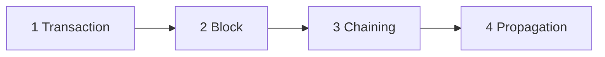

<!-- PDF page: 019 -->

### 03 정보보안 신기술 용어

#### 가) 블록체인(block chain)

암호화폐인 비트코인 시스템과 네트워크에서 발생하는 모든 거래는 하나의 공개 장부에 기록되고, 분산되어 저장되는 단
일장부를 말한다. 블록체인은 분산장부(Distributed Ledger)로서 네트워크 참여자들이 데이터를 저장하고 검증하기 위한 구
조로 설계 되어 있다. 거래가 발생하게 되면 거래된 정보의 검증을 위해 일정시간(10분) 동안 발생한 거래를 모아서 블록
(block)을 생성하고, 이러한 블록들을 순차적으로 연결하여 체인(chain) 형태를 구성하게 되기 때문에 블록체인이라고 부
르는 것이다.
거래 원장의 복사본이 각 네트워크 구성원에게 분산되어(distributed) 새로운 거래가 발생할 때마다 구성원들의 동의를 통
해 해당 거래를 인증하게 되는데, 기존 중앙 집중화된 시스템에 의존하지 않고 개인 대 개인 간(P2P) 네트워크 방식을 이
용함으로써, 거래 중개자의 개입이 불필요하게 된다. 따라서 거래의 효율성과 투명성은 높아지고 적은 비용으로 보다 빠
르고 안전한 거래가 가능하게 되는 것이다. 또한, 블록체인에 기반한 거래 정보의 위변조가 불가능하기 때문에 거래의 신
뢰성이 높아지고 거래정보의 추적이 용이하게 되기도 한다.

| 단계 | 그림 내부 내용 |
| --- | --- |
| Transaction | INPUTS: 홍길동 100,000 / OUTPUTS: 홍길서 70,000, 홍길동 30,000 |
| Block | Block #15: Header, Transaction #123, …, Transaction #216 / 2015년 10월 28일 14시 20분. Block #16: Header, Transaction #217, …, Transaction #300 / 2015년 10월 28일 14시 30분 |
| Chaining | Block #16, Block #15, Block #14, … / Block 내 Header정보를 기준으로, 블록들이 사슬(Chain)처럼 연결되어 Ledger 구성 |
| Propagation | 분산저장을 통한 비용 절감 / 분산되어 저장된 장부 기록 위·변조 불가 |

<!-- 생략: 그림 2의 블록 입체 표현과 Node 원형 네트워크 배치 -->

[그림 2] 블록체인의 개념도

#### 나) FIDO(Fast IDentity Online Alliance)

온라인 환경에서 바이오 인식기술을 활용한 인증방식에 대한 기술표준(De Facto)을 정하기 위해 2012년 7월 설립된 기관
으로 FIDO 규격에서는 이용자 단말에서의 사용자 로컬 인증과 서비스 제공 기관의 서버에서 수행하는 원격인증을 분리하
였다.

① FIDO 1.0

FIDO 1.0은 기존의 생체인증과 유사하지만 사용자의 개인정보를 서버에 저장하지 않는 UAF(Universal Authentication
Framework) 프로토콜과 이중인증을 통해 보안성을 향상시키는 U2F(Universal 2nd Factor)프로토콜의 두 가지 인증방법을
제공한다.
