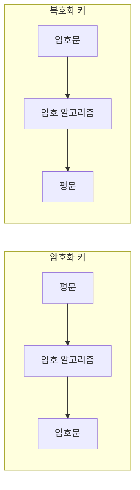

<!-- PDF page: 024 -->

### 01 암호 기술

#### 가) 암호의 개념

누구나 볼 수 있는 형태의 평문(Plaintext)을 해석하기 불가능한 형태의 암호문(Ciphertext)으로 변형하는 과정을 암호화
(Encryption)라 하며, 암호문을 평문으로 다시 바꾸어 해독 가능한 형태로 만드는 과정을 복호화(Decryption)라 하는데, 이
들을 암호학(Cryptography)이라 부른다. 이 두 변환 과정에서 사용되는 수학적 기능을 암호 알고리즘이라고 하며 암호 알
고리즘은 암호화와 복호화를 수행하기 위해 키(Key)를 사용하게 된다. 한마디로 정보보안의 3대 목표 중의 하나인 기밀성
을 얻기 위한 중요한 수단이 암호화이다.

#### 나) 암호화(Encryption)와 복호화(Decryption)

암호화란 평문(Plain text)을 인가받지 않은 제 3자가 인식할 수 없는 형태로(암호문) 변환하는 과정을 말하며, 복호화란 암
호화 과정의 역과정으로 변환된 암호문을 다시 평문으로 복원하는 과정을 말한다.

<!-- 생략: 그림 3의 열쇠 아이콘 -->

[그림 3] 암호화와 복호화

암호화는 처음에 주로 군사적인 목적으로 사용되었지만, 현재는 정보통신과 인터넷 기술이 발달함에 따라 다양한 중요 정
보를 보호하기 위한 방안으로 암호화를 활용하고 있다.

#### 다) 암호기술의 분류

암호 기술은 [그림 4] 에서와 같이 크게 암호화 기술과 암호 프로토콜 기술로 분류된다.

① 암호화 기술

암호화 키와 복호화 키가 같은지의 여부에 따라, 암호화 키와 복호화 키가 같은 대칭 키 암호 방식과 암호화 키와 복호화
키가 서로 다른 공개키 암호 방식으로 분류할 수 있다.

② 암호 프로토콜

암호 기술을 사용하는 프로토콜을 의미한다. 프로토콜은 어떤 목적을 달성하기 위해 2명 이상이 참여하는 유한한 일련의
