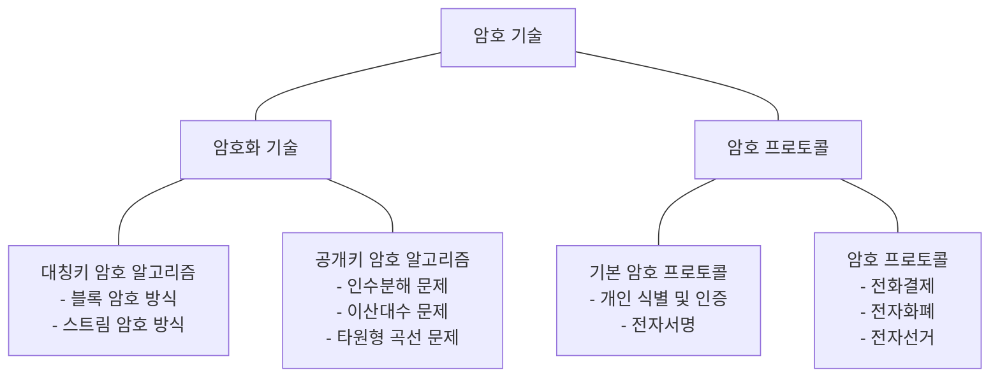
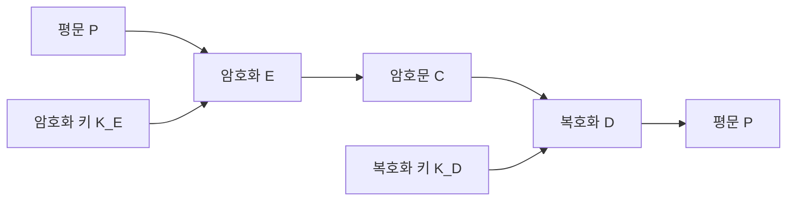

<!-- PDF page: 025 -->

단계를 의미하므로 암호 프로토콜은 프로토콜의 각 메시지의 의미를 보장함은 물론 해당 암호 프로토콜의 특정 목적(인
증, 기밀성, 무결성과 부인방지 등)을 보장하기 위하여 참여자 또는 제3자가 부정을 하지 못하도록 방지해야 한다.

[그림 4] 암호기술의 분류

#### 라) 암호 알고리즘과 암호 시스템

① 암호 알고리즘

암호 키를 이용한 암호 알고리즘 기술은 [그림 5]와 같이 표현할 수 있다. 이 그림에서 P는 평문, E는 암호화 함수, K(KE,
KD)는 키 값이다. 공개키 방식에서와 같이 암호화 키와 복호화 키가 다를 수 있는데 이때는 각각 KE와 KD로 표현한다. 통
상 암호문이 전달되는 통로는 안전하지 않은 통신회선 또는 네트워크이므로, 송수신자의 입장에서 평문을 암호화시킨 결
과를 전달하는 것이 기밀성을 확보하는 방법이 된다.

C = E(KE, P) / P = D(KE, C)

<!-- 원문의 복호화 식에 적힌 K_E 표기를 유지 -->

[그림 5] 암호 알고리즘

수신자는 누구나가 볼 수 있는 평문 P를 상대편에게 안전하게 전달하려고 한다. 송신자는 평문 P를 암호화 키 KE와 암호
화 알고리즘 E를 이용하여 암호문 C를 생성하여 수신자에게 전달한다. 암호문 C는 일반적으로 복호화 키를 모르는 상태
에서는 그 내용을 알 수 없는데 이를 계산적 불가라 부른다. 여기서 계산적 불가란 무한 시간을 투입하는 경우 복호화 키
를 모르더라도 평문 내용을 알아낼 수 있다는 의미이다. 공격자는 다양한 방법으로 평문의 내용을 얻으려 시도한다. 정당
한 수신자는 송신자가 전송한 암호문 C를 수신하여 복호화 키 KD와 복호화 알고리즘 D를 이용하여 송신자가 원래 전송
하려던 평문 P를 얻게 된다.
