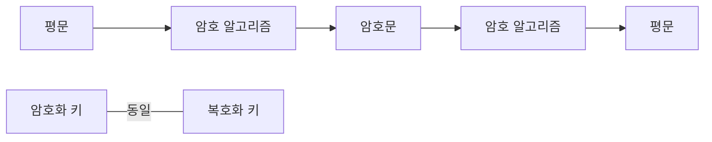

<!-- PDF page: 026 -->

② 암호 시스템

암호화하고 복호화하는 일련의 과정에 필요한 요소들을 모두 합쳐 암호 시스템이라 부르는데, 일반적으로 암호 시스템이
갖추어야 할 요건은 다음과 같다.

• 암호화 키에 의하여 암호화 및 복호화가 효과적으로 이루어져야 한다.

• 암호 시스템의 사용이 용이하여야 한다.

• 암호화 알고리즘보다는 암호 키에 의한 보안이 이루어져야 한다.

#### 마) 비밀키 암호와 공개키 암호 알고리즘

① 비밀키 암호 알고리즘

비밀키 암호 알고리즘은 암호화에 사용하는 암호화 키와 복호화에 사용하는 복호화 키가 동일하며, 키의 길이가 짧아도
되고 암호화와 복호화 연산의 속도가 빠르다는 장점이 있다.

<!-- 생략: 그림 6의 열쇠 아이콘 -->

[그림 6] 비밀키 암호 알고리즘

그러나 송신자와 수신자 사이의 거리가 먼 경우 키를 공유하는 방법에 어려움이 있고, 암호화 통신을 필요로 하는 상대가
많을 경우 서로 다른 키를 생성하고 유지하는데 많은 부담이 따른다. 키를 비밀리에 보관하고 관리해야 한다는 측면에서
비밀키 암호 방식, 통상적으로 사용한다는 의미에서 관용 암호 방식이라고도 한다.
비밀키 암호 방식은 암호 알고리즘이 치환과 전치의 조합으로 구성되어 있어 연산 속도가 빠르다는 특성으로 키 공유의
어려움에도 불구하고 아직도 많이 애용되고 있다. 또한 이 방식은 평문 데이터를 처리하는 방식에 따라 〈표 2〉에서와 같이
블록 암호(Block Cipher)와 스트림 암호(Stream Cipher)로 구분된다.

〈표 2〉 블록 암호와 스트림 암호의 비교

<table>
<tr><td>구분</td><td>블록 암호화</td><td>스트림 암호화</td></tr>
<tr><td>동작 방식</td><td>평문을 블록이라고 부르는 고정길이의 입력으로 나누어 블록 단위로 암호화 수행</td><td>평문을 비트 단위로 암호화 수행</td></tr>
<tr><td>장점</td><td>구현이 용이</td><td>오류 확산의 위험이 낮음 이동통신 환경에서 구현 용이</td></tr>
<tr><td>단점</td><td>오류 확산 위험이 높음 초기값 설정 필요</td><td>느린 수행 시간 악의적 공격자에 의해 쉽게 내용 변경이 가능</td></tr>
</table>

• 블록 암호 알고리즘
블록 암호 알고리즘은 비밀키를 이용하여 고정된 크기의 입력 블록을 고정된 크기의 출력 블록으로 변형하는 암호
알고리즘에 의해 암호화와 복호화 과정이 수행된다. 블록 암호 알고리즘에는 Feistel Network, DES(Data Encryption
Standard), AES(Advanced Encryption Standard), IDEA(International(Data Encryption Algorithm), SEED, ARIA 등이 있다.
