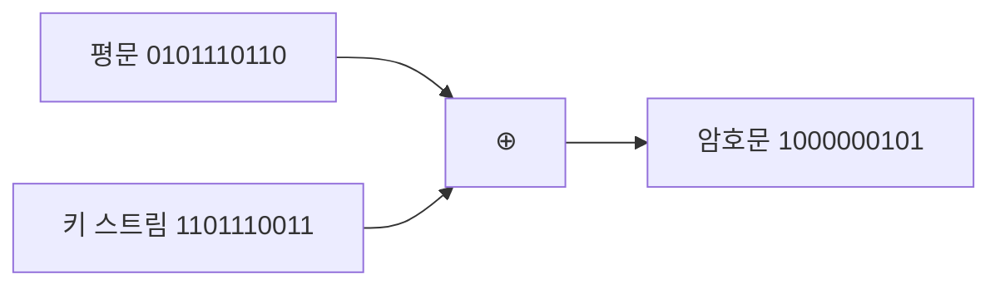
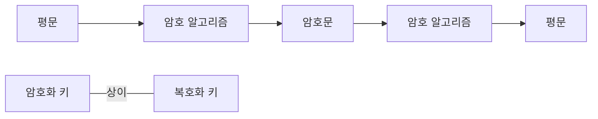

<!-- PDF page: 027 -->

블록 암호 방식에 대한 주요 공격 기법들은 〈표 3〉과 같다.

〈표 3〉블록 암호 공격 기법

<table>
<tr><td>공격 기법</td><td>내용</td></tr>
<tr><td>차분 공격</td><td>선택 평문 공격 방법으로, 두 개의 평문 블록들의 비트의 차이에 대하여 대응되는 암호문 블록들의 비트 차이를 이용하여 암호화에 사용된 키를 찾아내는 공격 기법</td></tr>
<tr><td>선형 공격</td><td>평문 공격 방법으로, 암호 알고리즘 내부의 비선형 구조를 적절하게 선형화시켜 암호화 키를 찾아내는 공격 기법</td></tr>
<tr><td>전수 공격</td><td>암호화에 사용한 키의 모든 경우에 대하여 평문과 암호문을 대비하는 방법으로 암호화 키를 알아내는 공격 기법</td></tr>
<tr><td>통계적 분석</td><td>암호문에 대한 평문의 각 단어의 빈도에 관한 통계 자료를 포함하여 알려진 모든 통계적 자료를 이용하여 해독하는 공격 기법</td></tr>
<tr><td>수학적 분석</td><td>통계적 방법을 포함하며 수학적 이론을 이용하여 해독하는 공격 기법</td></tr>
</table>

• 스트림 암호 알고리즘
스트림 암호는 유럽을 중심으로 발달한 방식으로, 블록 단위로 암호화와 복호화를 수행하는 블록 암호와 달리 [그림 7]
에서와 같이 평문의 비트열과 키의 비트열의 비트 단위 XOR 연산으로 암호문을 생성하는 방식이다. 스트림 암호로는
RC4가 대표적이며, A5/1, A5/2 등의 알고리즘도 있다.

[그림 7] 스트림 암호 알고리즘

② 공개키 암호 알고리즘

공개키 암호 알고리즘은 1976년 디페와 헬만에 의해 공개키 암호의 개념이 도입되고 1978년 RSA라는 실용적인 공개키
암호 알고리즘이 개발된 이후 공개키 암호는 현대 암호를 이루는 중요한 요소가 되었다.

[그림 8] 공개키 암호 알고리즘

공개키 암호는 [그림 8]에서와 같이 비밀키 암호와 달리 송신자와 수신자가 서로 다른 키를 사용하여 비밀 통신을 수행하
게 된다. 송신자는 수신자의 공개키를 사용하여 데이터를 암호화한 결과를 네트워크를 통해 전송한다. 수신자는 자신의
공개키에 대응하는 개인키를 이용하여 암호화된 데이터를 복호화하여 평문을 복원한다.
