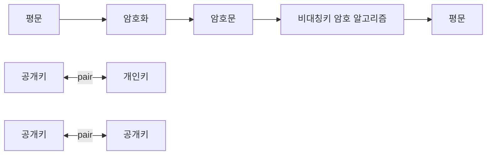

<!-- PDF page: 028 -->

<!-- 원문 하단의 두 '공개키' 표기를 유지. 열쇠 아이콘 생략 -->

[그림 9] 공개키 암호 알고리즘의 키 메커니즘

공개키 암호 방식은 다른 사용자들과 키를 공유하지 않더라도 암호 알고리즘을 통한 안전한 통신을 할 수 있다는 장점을
가진다. 각 사용자는 자신에게 송신하기 위해 사용될 키(공개키라 부름)를 공개하고, 자신의 공개키로 암호화된 정보를 복
호화할 수 있는 키(개인키라 부름)를 비밀로 보유하고 있음으로써 누구나 암호화할 수 있지만 공개키에 대응되는 개인키
(Private Key)를 가진 당사자만 복호화할 수 있는 특징을 가진다. 예를 들어, n명의 사용자로 구성된 네트워크 환경에서 각
사용자는 공개키와 개인키 두 개를 보유하고 있으므로 네트워크 전체적으로 2n개의 키가 필요하며, 각 사용자는 자신의
개인키와 공개키 즉, 2개의 키만 보유하면 된다.
공개키 암호의 경우 모두가 확인할 수 있는 공개키에 대응되는 개인키가 각 사용자만 알고 있는 정보이기 때문에 다양한
인증 기능 및 안전한 키 교환 등에 활용될 수 있는 장점을 가진다. 대표적인 공개키 암호 알고리즘에는 RSA(Rivest, Shamir
and Adleman), 엘가말(ElGamal), ECC(Elliptic Curve Cryptosystem, 타원 곡선 암호 시스템) 등이 있다.

• RSA

RSA는 공개키 암호 시스템으로 암호화와 인증에 사용된다. 이 방식은 큰 정수의 인수분해의 어려움에 안전성을 두고 있
다. RSA에서는 암호화 과정에서 난수를 사용하지 않기 때문에 같은 메시지에 대한 암호문은 항상 같다는 특징이 있다.
RSA 방식의 안전성은 소수 p와 q에 의존하므로, 소수의 선택 조건이 중요하다.

• 엘가말
이산대수 문제의 어려움에 기반을 둔 최초의 공개키 암호 알고리즘인 엘가말은 1984년 스탠퍼드 대학의 암호 학자 T. 엘
가말(ElGamal)에 의해 제안되었다. 엘가말로 암호화하면 메시지의 길이가 두 배로 늘어나는 특징이 있다. 하지만 암호화
할 때 난수를 이용하므로 같은 메시지에 대해 암호화하여도 암호화할 때마다 서로 다른 암호문을 얻게 되는데, 이것이
정보보안 측면에서 큰 장점이 된다.

• ECC

타원 곡선(Elliptic Curves) 암호 방식은 타원곡선 상의 이산대수 문제에 기반한 것으로 안전성이 높고 속도가 빨라서 새
로운 공개키 암호 방식으로 각광받고 있다. 예를 들어 RSA의 1024비트의 키와 타원곡선 암호의 160비트의 키는 같은 수
준의 안전도를 갖는 것으로 알려져 있다. 또한, ECC는 전원의 양이 한정된 휴대폰 등과 같은 이동 통신 기기의 암호화에
적합한 방식이다.
