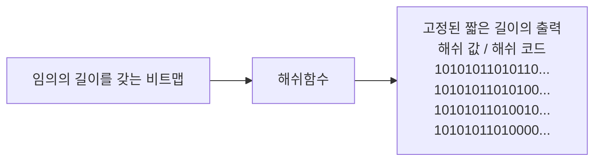

<!-- PDF page: 029 -->

③ 비밀키 암호 알고리즘과 공개키 암호 알고리즘의 비교

〈표 4〉는 비밀키 암호 방식과 공개키 암호 방식을 비교한 결과이다.

〈표 4〉 비밀키 암호와 공개키 암호의 비교

<table>
<tr><td>구분</td><td>비밀 암호</td><td>공개키 암호</td></tr>
<tr><td>키의 관계</td><td>암호화 키 = 복호화 키</td><td>암호화 키 ≠ 복호화 키</td></tr>
<tr><td>암호화 키</td><td>비공개</td><td>공개</td></tr>
<tr><td>복호화 키</td><td>비공개</td><td>비공개</td></tr>
<tr><td>알고리즘</td><td>공개</td><td>공개</td></tr>
<tr><td>키의 수</td><td>n(n−1)/2</td><td>2n</td></tr>
<tr><td>1인당 관리해야 할 키</td><td>n−1</td><td>1</td></tr>
<tr><td>암호화 속도</td><td>고속</td><td>저속</td></tr>
<tr><td>인증(전자서명)</td><td>복잡</td><td>간단</td></tr>
<tr><td>장점</td><td>빠른 암호화/복호화 시간 키 길이가 짧음</td><td>키 분배 용이 관리해야 할 키의 수 적음 인증 등 다양한 분야에 활용</td></tr>
<tr><td>단점</td><td>사용자 수의 증가에 따라 관리해야 할 키의 수가 증가 키 변화의 빈도가 높음</td><td>느린 암호화/복호화 시간 키 길이가 김 키 변화 빈도가 낮음</td></tr>
</table>

#### 바) 해쉬 함수(Hash Function)

① 해쉬 함수의 개념

해쉬 함수 또는 해쉬 알고리즘(Hash Algorithm)은 [그림 10]과 같이 다양한 크기를 갖는 임의의 데이터로부터 고정된 길이
의 짧은 해쉬 값(해쉬 코드)을 출력하는 수학적 함수이다. 다시 말해서 해쉬 함수는 임의의 길이를 갖는 입력 비트열을 고
정된 짧은 길이로 함축하는 기능이라고 볼 수 있다. 예를 들어 HAS-160(Hash Algorithm Standard 160), SHA-1의 경우 160
비트의 결과를 출력한다.

<!-- 생략: 그림 10의 영상·음악·그림·사진 및 기계·도장 아이콘 -->

[그림 10] 해쉬 함수

암호 알고리즘에는 키가 사용되지만 해쉬 함수는 키를 사용하지 않으므로 같은 입력에 대해서는 항상 같은 출력이 나오게
된다.이러한 특성을 갖는 해쉬 함수를 사용하는 목적은 입력 메시지에 대한 변경할 수 없는 증거값을 추출하여 메시지의
오류나 변조를 탐지할 수 있는 무결성을 검증하는 데 있다.
