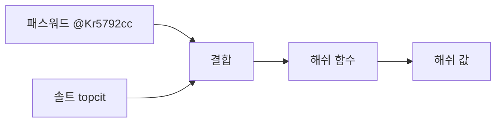

<!-- PDF page: 031 -->

[그림 11] 해쉬함수와 솔트(Salt)

솔팅 방법을 사용하면, 공격자가 패스워드 “@Kr5792cc”의 해쉬 값을 알아내더라도 솔팅된 해쉬 값을 대상으로 패스워드 일
치 여부를 확인하기 어렵다. 또한 사용자별로 다른 솔트를 사용한다면 동일한 패스워드를 사용하는 사용자의 해쉬 값이 서로
다르게 생성되어 인식 가능성 문제가 크게 개선된다.
솔트와 패스워드의 해쉬 값을 서버의 데이터베이스에 저장해 놓고, 사용자가 로그인할 때 입력한 패스워드를 해쉬 처리하여
일치 여부를 확인할 수 있다. 이 방법을 사용할 때에는 모든 패스워드가 고유의 솔트를 가져야 하고, 솔트의 길이는 32바이트
이상이 되어야 솔트와 다이제스트를 추측하기 어렵다고 알려져 있다.

⑤ 해쉬 함수의 활용

• 무결성 검증 방식
서버나 네트워크 보안에서 무결성 검증 방식은 〈표 6〉에서와 같이 데이터 전송 중 발생하는 오류를 검출하는 방식
과 임의의 변경을 방지하는 방식으로 구분된다. 데이터 전송 중 발생하는 오류로 인한 무결성 검사 방식에는 체크섬
(Checksum)과 순환중복검사(CRC: Cyclic Redundancy Check) 등이 있는데, 체크섬은 중복검사의 한 형태로 추가적인
데이터를 더하여 체크섬 값을 얻은 후 이를 일정한 비트 값으로 변환하여 메시지에 추가하고 이를 근거로 무결성을 검
사하는 방식이다.
순환중복검사는 주로 인터넷 등의 통신 시스템에서 전송 데이터 오류검증 방법으로 사용하는데, 오류 검출과 정정에 용
이한 다항식을 기반으로 송신 쪽에서 체크섬을 계산하여 헤더에 추가하여 보내면 수신 쪽에서 다시 동일한 다항식을 기
반으로 계산하고 보내진 체크섬과 비교하는 방식으로 무결성을 검증한다.

〈표 6〉 무결성 검증 방식

<table>
<tr><th>변경 원인</th><th>해결 방안</th></tr>
<tr><td>데이터전송 오류</td><td>• 체크섬 • 순환중복검사 ✓ 데이터 검증 시 사용 ✓ 고정 길이의 숫자 값 생성</td></tr>
<tr><td>임의 변경</td><td>• 해쉬 함수 ✓ MD5 - 순환중복검사의 확장 - MD2~4의 보완 - 128비트 해쉬 함수 - SHA-1 사용 추천 ✓ SHA-1 - MD5 대체 및 확장 - 보안 프로토콜, 프로그램에서 사용 ✓ SHA-2 - SHA265~512를 통칭 - SHA1에 대한 공격법 존재</td></tr>

</table>
