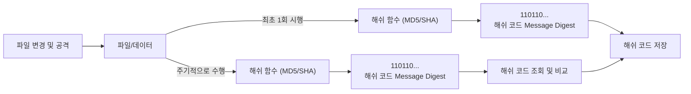

<!-- PDF page: 032 -->

• 파일의 무결성
김 대리는 무결성 보장을 위해 인터넷 상에서 파일을 전송하거나 홈페이지에 올릴 경우 해쉬 함수를 이용하여 계산한
해쉬 값을 함께 전송해서 변조된 파일이 아님을 확인할 수 있는 방법을 확보하였다. 또한 김 대리가 서버에 관리하던 중
요한 소스 파일 역시 파일의 목록을 만든 다음에 각 파일에 대한 해쉬 값을 저장해 두고, 일정시간 간격으로 파일 목록
에 대한 해쉬 값을 가져와서 처음 만들어 놓은 해쉬 값과 비교하는 형태로 변조 여부를 [그림 12]에서와 같이 관리하기로
하였다.

[그림 12] 서버 파일 무결성 검사

그러나, 이러한 주기적인 무결성 검사로는 검사 주기 사이에 발생한 보안사고는 찾아낼 수 없다. 무결성 검사 주기가 짧으
면 짧을수록 좋겠지만 파일의 개수가 많아지면 파일마다 해쉬 값을 만들고 비교하는 것이 서버의 부하를 증가시키기 때문
에 효과적인 방법은 아니다.
주기적인 무결성 검사 방법을 대체하는 방법은 커널 수준에서 실시간 탐지가 가능한 무결성 기법의 도입이다. 즉 무결성
검사는 최초 1회에만 수행하고 이후 해당 파일이 실행되거나 메모리에 적재될 때마다 검사하여 실시간으로 파일 변조 여
부를 검사하는 방식이 효과적이다. 이로써 지속적인 CPU 부하가 발생하지 않으며 변조된 실행 파일이 메모리에 적재되는
것을 차단할 수 있다.

• 전송 과정에서의 무결성
네트워크에서 전송되는 메시지에 대한 무결성 또한 중요한 보안 사항이다. [그림 13]에서처럼 해커는 전달되는 메시지를
가로채 변조할 수 있다. 전송된 메시지에 대한 무결성 검사를 위해 송신자는 메시지에 대한 해쉬 값을 생성하고 이를 메
시지와 함께 전송하며, 수신자는 메시지 수신 즉시 메시지의 무결성 검사를 수행하고 만약 변조 되었다면 해당 메시지를
무시하면 된다.
송신자의 신분에 대한 인증이 필요없고 데이터가 전송 중 변조되지 않았다는 무결성만 필요한 경우에는 해쉬 함수를 메
시지인증코드(MAC: Message Authentication Code)라는 형태로 사용할 수 있다. 송신자가 메시지를 입력하여 해쉬 값을
계산하면 메시지인증 코드가 된다. 메시지와 함께 이 메시지인증코드를 함께 보내면 수신자는 메시지가 통신 도중 변조
되지 않았다는 확신을 가질 수 있다.
