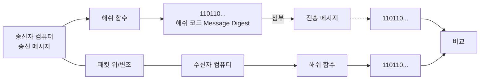

<!-- PDF page: 033 -->

<!-- 생략: 그림 13의 컴퓨터·문서·공격·저울 아이콘 -->

[그림 13] 전송 파일의 무결성 검사

• 패스워드를 기초로 한 암호화
해쉬 함수와 암호화는 모두 패스워드를 효과적으로 숨기는 기술이나, 암호화 알고리즘이 암호화되지 않은 평문을 암호
화한 뒤에 이를 다시 복호화할 수 있는 반면, 해쉬 함수는 결과값을 이용한 원래값을 찾는 것이 불가능하다는 차이점이
있다.
해쉬 함수는 패스워드를 기초로 한 암호화(PBE: Password Based Encryption)에 사용될 수 있다. PBE에서는 패스워드와
솔트(의사난수 생성기를 이용하여 생성한 난수)를 결합한 결과를 해쉬 함수에 입력하여 얻은 해쉬 값을 암호화 키로 사
용한다. 이 방법을 이용하여 패스워드에 대한 공격을 막을 수 있다.

• 전자 서명
해쉬 함수는 전자서명에 사용될 수 있다. 서명자가 특정 문서에 자신의 개인키를 이용하여 해쉬 연산을 함으로써 데이
터의 무결성과 서명자의 인증성을 함께 제공하는 방식이다. 메시지 전체에 대해 직접 서명하는 것은 공개키 연산을 모든
메시지 블록마다 반복해야 하기 때문에 매우 비효율적이며 따라서 메시지에 대한 해쉬 값을 계산한 후 이것에 대해 서
명함으로써 매우 효율적으로 전자서명을 생성할 수 있다. 서명자는 메시지 자체가 아니라 해쉬 값에 대해 서명을 하였지
만 같은 해쉬 값을 가지는 다른 메시지를 찾아내는 것이 어렵기 때문에 이 서명은 메시지에 대한 서명이라고 인정된다.

### 02 인증 기술

#### 가) 인증(Authentication)의 개념

인증이란 정보의 주체가 되는 송신자와 수신자 간에 교류되는 정보의 내용이 변조 또는 삭제되지 않았는지, 그리고 주체
가 되는 송, 수신자가 정당한지를 확인하는 방법을 말한다. 즉, 인증은 메시지 인증과 사용자 인증으로 나눌 수 있다.
