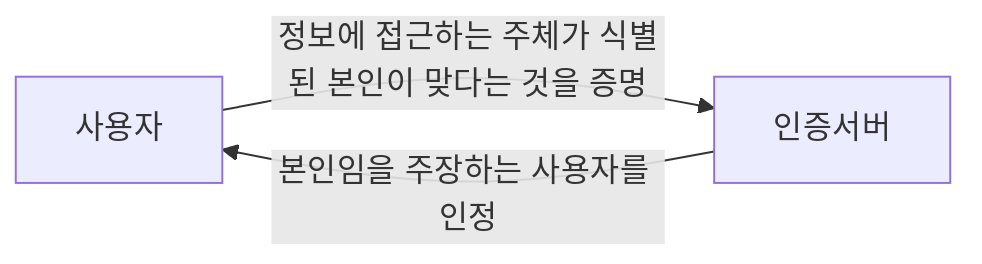

<!-- PDF page: 034 -->

① 사용자 인증(User Authentication)

[그림 14]에서와 같이 네트워크상에서 사용자가 자신이 진정한 사용자라는 것을 상대방에게 증명할 수 있도록 하는 기능
을 말한다. 반면 제3자가 위장을 통해 사용자 행세를 하는 것이 불가능해야 한다.

<!-- 그림 14의 사용자 아이콘을 사용자 노드로 표시 -->

[그림 14] 사용자 인증

사용자 인증은 신원확인(Identification)이라고도 하는데 서버에 로그인하는 경우 등 사용자의 신분을 확인하고 정보서비스
를 이용할 수 있는 권한을 부여해주기 위해 사용된다. 일단 사용자 인증을 통과하면 원격 접속자가 해당 사용자로서의 모
든 권한을 수행할 수 있기 때문에 중요한 서비스를 제공하는 서버의 입장에서는 원격 접속자에게 엄격한 인증절차를 거치
도록 요구해야 한다.

② 메시지 인증(Message Authentication)

전송되는 메시지의 내용이 변경이나 수정되지 않고 본래의 정보를 그대로 가지고 있다는 것을 확인하는 것을 말한다. 전
송되는 메시지에 대해 메시지가 변경되지 않았다는 사실과 누가 보낸다는 사실을 함께 증명하는 것은 전자서명을 통해 달
성할 수 있다.

#### 나) 인증방식의 유형

사용자가 가지고 있는 지식을 이용하는 방법, 사용자가 가진 물건을 이용하는 방법, 사용자 자신의 신체적인 특징을 이용
하는 방법 등이 있다.

• 지식 기반 인증
사용자가 알고 있는 정보(What you know)에 기반한 방법으로 PIN(Personal Identification Number), 패스워드, 계좌번호
등의 수단을 사용하는 인증 방식이다.

• 소유기반 인증
사용자가 소유하고 있는 도구(What you have)에 기반한 방법으로 OTP(One Time Password), 스마트카드, 카드 키(Key)
등의 수단을 사용하는 인증 방식이다.

• 존재기반 인증
사용자의 신체나 신체의 특징에 기반(What you are)한 방법으로 홍채인식, 지문인식, 음성인식, 얼굴인식 등의 수단을 사
용하는 인증 방식이다.

#### 다) 인증기술의 종류

① 패스워드 인증

• 패스워드 인증의 개요
사용자가 미리 패스워드를 설정한 후, 인증 시 입력된 패스워드와 설정된 패스워드를 비교하여 사용자를 인증하는 방식
