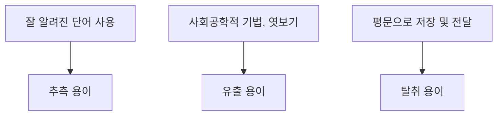

<!-- PDF page: 035 -->

으로, 가장 널리 사용되는 인증 기술이지만 [그림 15]에서와 같이 가장 안전하지 않은 인증기술이기 때문에 사용시 세심
한 주의가 필요하다.

[그림 15] 패스워드 인증방식의 취약성

• 패스워드 정책
패스워드의 생성은 대문자, 소문자, 숫자, 특수문자를 조합하여 적어도 8자리 이상으로 생성하며, 사용자는 쉽게 기억할
수 있고 공격자는 추측이 어려워야 한다.
패스워드를 평문 상태로 패스워드를 저장하거나, 양방향 암호 알고리즘이 아닌 해쉬 함수를 사용하여 저장해야 하며, 인
증 시스템은 실패한 로그인 시도 횟수를 제한해야 한다.

• 패스워드에 대한 공격 기법
패스워드에 대한 공격 기법: 패스워드에 대한 공격은 무차별공격(Brute Force Attack), 사전공격(Dictionary Attack), 트로
이목마, 패스워드 파일에 대한 직접접근 및 사회공학적 기법 등이 있음

• 패스워드 공격에 대한 대응 방안
패스워드 발생기 사용, 로그인 실패 횟수 제한, 주기적 패스워드 변경, 사전공격 및 무차별 공격탐지를 위한 침입탐지시
스템(IDS) 사용, 보안인식교육, OTP 사용 등과 같은 다양한 대응 방안을 구현하여 활용

② OTP(One Time Password)) 인증

• OTP의 개념
OTP란 인증 시스템에서 사용자 인증을 위하여 사용하는 방법 중 하나로 매 세션마다 일회용 패스워드를 생성하여 입력
하는 일회용 패스워드 생성기를 사용하는 인증기술

• OTP의 종류
OTP의 종류는 〈표 7〉과 같이 크게 동기식과 비동기식으로 구분

〈표 7〉 OTP의 종류

<table>
<tr><th></th><th>구분</th><th>내용</th></tr>
<tr><td>동기식 (Sync)</td><td>시도-응답 (Challenge-Response)</td><td>인증서버에서 난수를 생성하여 클라이언트에 전송하고, 난수를 입력값으로 하여 일회용 비밀번호를 생성</td></tr>
<tr><td rowspan="2">비동기식 (Async)</td><td>시간 동기화 (Time-Synchronous)</td><td>인증서버와 클라이언트 간 시간을 동기화하고, 시간을 입력값으로 하여 일회용 비밀번호를 생성</td></tr>
<tr><td>이벤트 동기화 (Event-Synchronous)</td><td>인증서버와 인증 횟수(Counter) 기록을 공유하고, 인증 횟수를 입력값으로 하여 일회용 비밀번호를 생성</td></tr>

</table>
