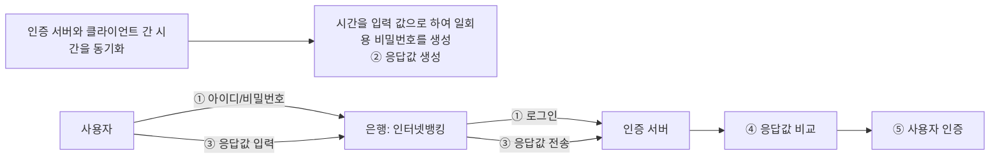

<!-- PDF page: 036 -->

시간 동기화 방식의 OTP의 동작절차는 [그림 16]에서와 같다.

[그림 16] 시간 동기화 방식의 동작 절차

③ 생체(Biometric) 인증

• 생체인증의 개념
사람의 측정 가능한 신체적 또는 행동적 특성을 자동화된 장치인 센서로 추출하여 인증수단으로 활용하기 위한 인증기술

• 생체인증의 특성
보편성: 누구나 갖고 있는 생체적 특성
유일성: 개개인을 구분할 수 있는 고유한 특성
획득성: 센서로부터 측정되어 정량화될 수 있는 특성
영속성: 변하지 않고 변경이 되지 않는 특성
정확성: 환경변화와 무관한 인증 정밀도를 요구하는 특성
수용성: 생체정보 추출/사용 과정에 대한 거부감이 없어야 하는 특성

• 생체인증의 종류
생체인증의 종류는 〈표 8〉과 같이 크게 신체 정보를 이용한 방식과 행동 특성을 이용한 방식으로 구분

〈표 8〉 생체 인증의 종류

<table>
<tr><th>구분</th><th>종류</th><th>설명</th></tr>
<tr><td rowspan="5">신체</td><td>지문</td><td>반도체, 광학, 혼합 방식이 있으며, 시장 점유율이 가장 높음</td></tr>
<tr><td>홍채</td><td>매우 정확하고 신속하나 고가의 생체인식 시스템이 필요함</td></tr>
<tr><td>얼굴</td><td>얼굴은 인식정보를 담고 있고 전달해주는 가장 자연스러운 인증 방법</td></tr>
<tr><td>정맥</td><td>정맥의 형태를 인식하여 파악하는 패턴인식</td></tr>
<tr><td>DNA</td><td>가장 정확한 인증 방법</td></tr>
<tr><td rowspan="2">행동</td><td>서명</td><td>일정한 패턴을 지니고 있으므로 최종 서명 형태뿐만 아니라, 손의 움직임에 대한 일종의 궤도에 의해서 식별 가능</td></tr>
<tr><td>음성</td><td>주로 물리적 접근 제어 애플리케이션에서 많이 사용함</td></tr>
</table>
