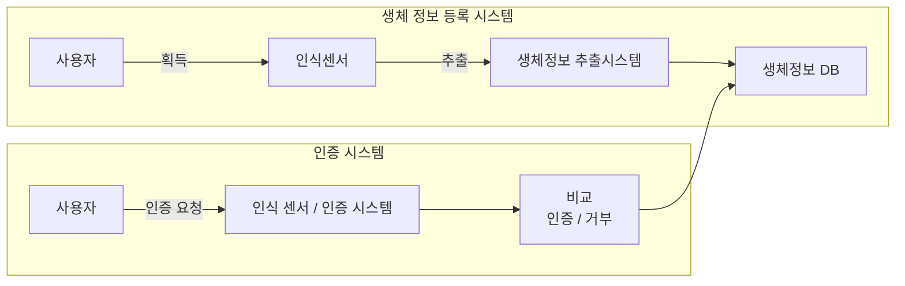
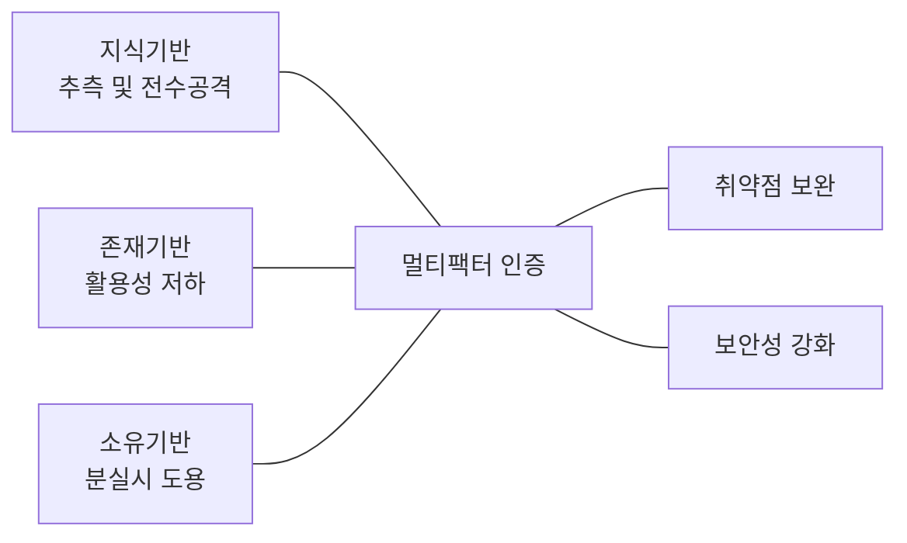

<!-- PDF page: 037 -->

• 생체인증의 처리과정
생체인증 시스템은 [그림 17]에서와 같이 '생체정보 등록 시스템'과 '생체인증 시스템'으로 구성되며, 사전에 사용자의 생
체정보를 생체정보 DB에 저장한 후, 인증 시 저장된 생체정보 DB와 사용자로부터 추출된 생체인증 정보를 비교하여 인
증 수행

<!-- 생략: 그림 17의 인증/거부 순환 화살표의 공간 배치 -->

[그림 17] 생체 인증의 과정

④ 멀티팩터(multi factor) 인증

[그림 18]에서 보는 바와 같이 멀티팩터 인증이란 단일 인증방식의 취약점을 보완하기 위하여 복수 개의 인증 기술을 조합
하여 인증의 보안성을 향상시킨 방식으로

[그림 18] 멀티팩터 인증의 개념

보다 강력한 멀티팩터 인증 시스템을 구현하기 위하여 OTP + 지문인식 등의 사례와 같이 지식, 소유, 존재기반의 인증기
술들을 다양하게 혼합하여 사용하는 것이 바람직한 인증 시스템의 구현이라고 볼 수 있다.

#### 라) 전자서명

① 전자서명의 개념

암호기술의 인증기능을 이용해 전자문서에 서명이 가능하게 하는 기술이 [그림 19]에서 보이는 전자서명이다. 공개키 암호
기술이 가지는 인증기능을 이용해 서명자의 신분을 인증하고 서명대상인 전자문서의 인증을 동시에 수행하도록 하여 전
자서명 효과를 얻을 수 있다.
공개키 암호 방식의 기본 가정은 공개키에 대해 쌍이 되는 개인키(비밀키)는 사용자(소유자)가 안전하고 비밀스럽게 보관
한다는 것이다. 이러한 환경에서 개인키를 이용하여 어떤 서명 연산을 한다면 이것은 개인키를 가지고 있는 해당 사용자
만이 가능한 작업이며 이 결과는 그 사용자의 서명으로 인정할 수 있는 것이다.
공개키 암호 기술을 이용하여 송신자는 전달하고자 하는 메시지와 메시지의 해쉬 값인 메시지 다이제스트(Message
