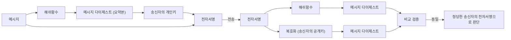

<!-- PDF page: 038 -->

Digest)를 개인키로 암호화한 결과인 전자서명을 함께 전달하고, 수신자는 수신한 전자서명을 송신자의 공개키로 복호화
한 결과와 수신한 메시지를 이용하여 계산한 메시지 다이제스트 값을 비교하여 송신자의 인증, 부인방지 및 메시지 무결
성 등을 확인한다.

<!-- 그림 19의 전송 묶음에 적힌 '전자서명' 표기를 유지 -->

[그림 19] 전자서명의 개념

② 안전한 전자서명 알고리즘의 요건

• 위조 방지: 정당한 서명자 이외의 타인은 서명을 위조할 수 없어야 함

• 사용자 인증: 전자서명으로부터 서명자가 누구인지 확인할 수 있어야 함

• 부인 방지: 서명자는 문서에 서명한 사실을 부인할 수 없어야 함

• 변조 방지: 한번 서명한 문서의 내용을 변경할 수 없어야 함

• 재사용 방지: 하나의 서명은 다른 문서의 서명으로 재사용 할 수 없음

③ 전자서명의 동작

전자서명의 동작은 〈표 9〉에서와 같이 크게 6단계 절차로 이루어진다.

〈표 9〉 전자서명의 동작 절차

<table>
<tr><td>순서</td><td>설명</td></tr>
<tr><td>1단계</td><td>송신자는 송신할 메시지에 대해 해쉬 알고리즘을 적용하여 고정길이 문자열인 메시지 다이제스트를 생성</td></tr>
<tr><td>2단계</td><td>송신자는 생성된 메시지 다이제스트를 자신의 개인키를 이용하여 암호화하여 전자서명을 생성</td></tr>
<tr><td>3단계</td><td>송신자는 송신 메시지와 전자서명을 수신자에게 전송</td></tr>
<tr><td>4단계</td><td>수신자는 수신한 전자서명을 송신자의 공개키를 이용하여 복호화함으로써 송신자가 생성한 메시지 다이제스트를 추출</td></tr>
<tr><td>5단계</td><td>수신자는 수신한 메시지에 송신자와 동일한 해쉬 알고리즘을 적용하여 새로운 메시지 다이제스트를 생성</td></tr>
<tr><td>6단계</td><td>수신자는 송신자에게 받은 메시지 다이제스트와 자신이 생성한 메시지 다이제스트를 비교하여, 동일한 경우 정당한 송신자의 전자서명으로 판단</td></tr>
</table>
