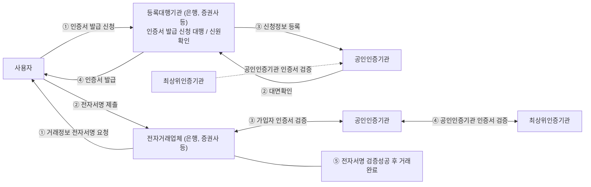

<!-- PDF page: 039 -->

#### 마) PKI(Public Key Infrastructure)

① PKI 정의

PKI는 안전한 거래를 위해 필요한 암호화, 인증 등에 필수 요소라 할 수 있는 공개키 관리를 위한 기반 구조로서 정보보안
서비스를 제공해 주는 암호화 및 복호화 키와 인증서(Certificate)를 안전하게 분배하기 위한 기반 구조이다. PKI는 정보시
스템 보안, 전자상거래 등 안전한 통신을 원하는 여러 응용 분야에서 인증서의 사용 및 암호화 통신을 용이하도록 하는 정
책, 수단, 도구 등을 수립하고 제공하는 객체들의 네트워크 구조이다.

② PKI 구성 요소

공개키 기반 구조는 〈표 10〉에서 보는 것처럼 정책승인기관(PAA), 정책인증기관(PCA) 인증기관(CA), 등록기관(RA) 및 공인
인증서(Certificate) 등으로 구성된다.

〈표 10〉 공개키 기반 구조의 구성 요소

<table>
<tr><td>구성</td><td>세부내용</td></tr>
<tr><td>정책 승인 기관(PAA)</td><td>PKI 전반에 사용되는 정책과 절차를 생성하여 수립(행정안전부)</td></tr>
<tr><td>정책 인증 기관(PCA)</td><td>정책승인기관에서 승인된 정책에 대한 세부정책 수립(한국인터넷진흥원)</td></tr>
<tr><td>인증기관(CA)</td><td>사용자의 공개키 인증서 발행, 인증서 폐기 목록 관리 (한국정보인증, 코스콤, 금융결제원, 한국전자인증, 한국무역정보통신)</td></tr>
<tr><td>등록기관(RA)</td><td>인증기관의 업무 대행, 공인인증서 등록 신청서 접수(은행, 증권사)</td></tr>
<tr><td>인증서 소유자</td><td>인증서를 발급받고, 전자문서에 서명하고 암호화를 하는 공개키 인증서의 소유자</td></tr>
<tr><td>사용자</td><td>인증기관의 공개키를 이용하여 인증경로 및 전자서명을 검증하는 사용자</td></tr>
<tr><td>공개키 인증서(Certificate)와 CRL 저장소</td><td>X. 509 v3 표준을 준수하는 인증서 표준을 사용 전자서명 검증 키와 소유자 관계를 증명해 주는 전자적 파일 폐기된 인증서들의 목록을 관리하기 위한 CRL 저장소</td></tr>
</table>

③ PKI의 운영

사용자가 등록기관(RA)의 지점에서 가입신청 및 신원확인 완료 후 등록기관(RA)에 인증서 발급요청을 하면 등록기관(RA)
은 인증기관(CA)에 발급등록 요청 정보를 송신한다. 인증기관(CA)은 인증기관(CA)의 개인키로 서명한 인증서를 발행하여
디렉터리 서버에 게시하고 등록기관(RA)을 통하여 사용자에게 전달한다. 사용자는 발급 받은 인증서를 PC의 하드디스크
나 이동식 디스크에 저장하여 금융거래 및 전자 상거래 등에서 사용하게 되는데, 이때 금융기관에서는 공인인증기관을 통
하여 인증서 검증을 수행한다. 공개키 기반 구조의 참가자들과 이들간의 업무 흐름은 [그림 20]과 같다.

<!-- 생략: 그림 20 중앙 인증서 프로그램 화면과 사용자 삽화 -->

[그림 20] PKI의 참가 요소들과 업무 흐름
