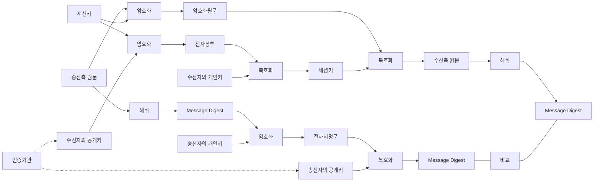

<!-- PDF page: 040 -->

④ PKI에서의 전자서명과 암호화

PKI 환경 즉, 송신자와 수신자 모두가 공인인증서 암호체계를 운용하고 있을 때, 사용자 인증과 메시지 기밀성을 목적으
로 활용하는 과정은 [그림 20]에, 송신 측과 수신 측의 주요 동작 단계에 대한 설명은 〈표 11〉에 있다. [그림 21]에서 세션키
(Session Key)란 메시지에 대해 비밀키 방식을 적용하기 위해 송신자가 생성한 일회용 비밀키로, 이 키를 안전하게 전송하
기 위해 수신자의 공개키를 이용하여 암호화시켜 전달한다. 이 암호화시킨 세션키를 전자봉투라 한다.

[그림 21] 공개키 기반 구조에서의 전자서명 및 암호화 처리 절차

〈표 11〉 송신 측과 수신 측의 동작 단계

<table>
<tr><th>구분</th><th>순서</th><th>설명</th></tr>
<tr><td rowspan="4">송신 측</td><td>1단계</td><td>메시지 원문에 해쉬 알고리즘을 적용하여 메시지 다이제스트 생성</td></tr>
<tr><td>2단계</td><td>생성된 메시지 다이제스트에 공개키 암호화 알고리즘을 적용하여 송신자의 개인키로 암호화 (전자서명 생성)</td></tr>
<tr><td>3단계</td><td>메시지 원문에 비밀키 암호화 알고리즘을 적용하여 세션키로 암호화</td></tr>
<tr><td>4단계</td><td>암호화에 사용된 세션키를 수신자의 공개키로 암호화(전자봉투)</td></tr>
<tr><td rowspan="5">수신 측</td><td>1단계</td><td>전자서명문을 송신자의 공개키로 복호화하여 메시지 다이제스트 생성</td></tr>
<tr><td>2단계</td><td>암호화된 세션키를 수신자의 개인키로 복호화하여 세션키 추출</td></tr>
<tr><td>3단계</td><td>추출된 세션키를 이용하여 암호화된 원문의 복호화</td></tr>
<tr><td>4단계</td><td>복호화된 원문에 해쉬 알고리즘을 적용하여 메시지 다이제스트 생성</td></tr>
<tr><td>5단계</td><td>생성된 두 메시지 다이제스트의 비교</td></tr>
</table>
