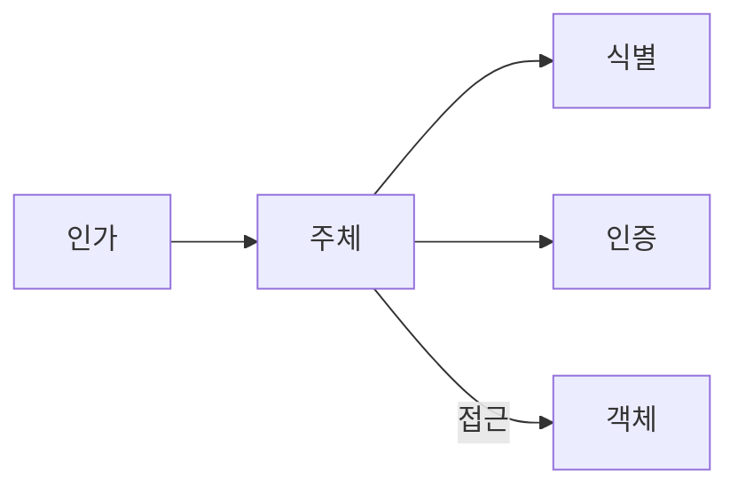

<!-- PDF page: 042 -->

• 식별(Identification)
주체의 고유한 증표를 이용하여 시스템에 신원을 밝히는 과정으로, 주체가 누구인지를 시스템이 식별하는 과정(예: ID,
사원카드, 생체인식)

• 인증(Authentication)
주체가 식별된 본인이 맞다는 것을 시스템에 증명해 보이는 과정으로, 시스템이 본인임을 주장하는 사용자를 인정하는
과정(예: 비밀번호(지식 기반), 인증서(소유 기반), OTP(소유 기반), 생체인식(존재 기반))

• 인가(Authorization)
시스템이 인증된 사용자로 하여금 어떤 일을 할 수 있고, 어떤 객체에 접근할 수 있는가를 제어하는 과정(예: 강제적 접
근통제, 임의적 접근통제, 역할 기반 접근통제)

② 접근통제 수행 절차

접근통제는 식별 및 인증 후 인가 과정을 통하여 객체에 접근할 수 있는 권한을 획득하여 비로소 객체에 접근하게 된다.

[그림 22] 접근통제 수행 절차

#### 나) 접근통제 정책

시스템의 보안정책은 접근통제 시스템의 설계 및 관리를 다루기 위한 상위 지침들이다. 일반적으로, 대상 시스템 자원들
을 보호하기 위해서 조직이 희망하는 기본적인 원칙들의 표현이다. 즉, 정책은 어떤 주체(who)가 언제(when), 어떤 위치
에서(where), 어떤 객체(what)에 대하여, 어떠한 행위(how)를 하도록 허용(또는 거부)할 것인지 접근통제의 원칙을 정의한
다. 접근할 수 있는 범위를 제한하는 접근통제 원칙은 다음의 2가지 기본정책으로 구분할 수 있다.

① 최소권한정책(Minimum Privilege Policy)

이 정책은 "need—to—know” 정책이라고 부르며, 시스템 주체들은 그들의 활동을 위하여 필요한 최소분량의 정보를 사용
해야 한다. 이것은 객체접근에 대하여 강력한 통제를 부여하는 효과가 있으며, 때때로 정당한 주체에게 소용없는 초과적
제한을 부과하는 단점이 있을 수 있다.
